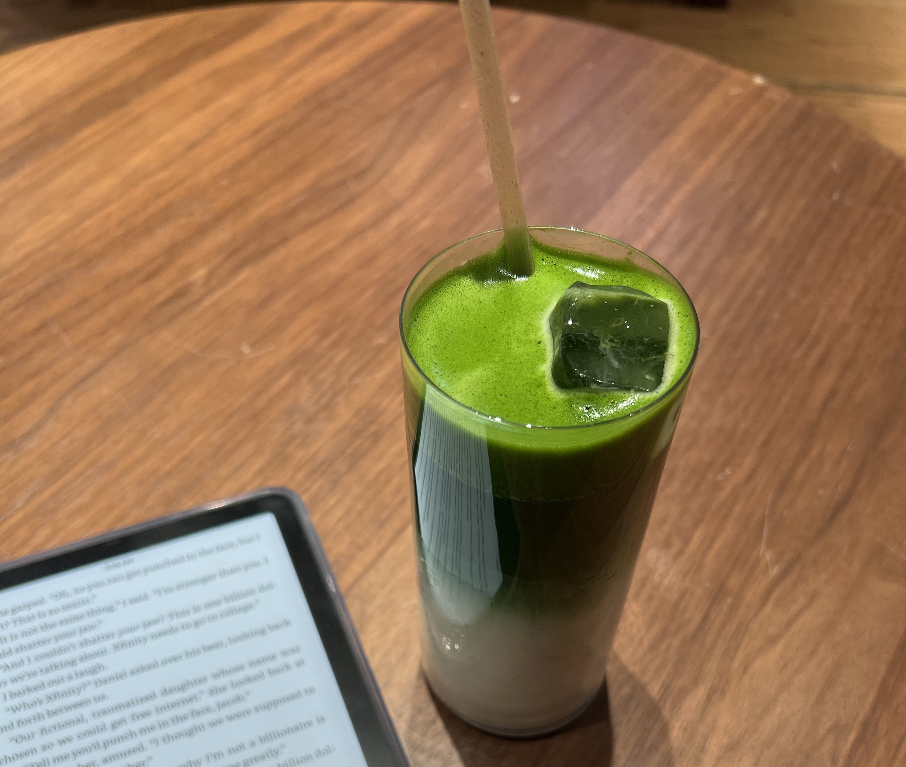

This is going to be a short post but I just felt the need to call out my love for the relatively new matcha shop that has been making waves in NYC in the past year or so.

It is NOT pure hype! To be fair, I'm not sure if I would advocate for waiting 2 hours in line for it on a hot day, but if you can manage to go on a weekday morning before work, the wait is maximum 30 minutes, and the matcha is absolutely groundbreaking. I will go as far to say I didn't truly understand the hype about matcha in general until I went to 12 matcha and realized what good, thick matcha actually tastes like. Ever since I visited for the first time last October, I've been totally converted (and recently went to Japan and gathered 5 matcha tins - more on that later).

    
    <small>Iced matcha latte at 12 matcha</small>

Their lightly sweetened option is the perfect amount of sweetness - just a touch so that it enhances the flavor of the matcha without taking the attention away from the rich umaminess. It's also so reasonably priced considering the number of heaping scoops of matcha they give you. None of the other "popular" matcha shops I've been to come even close (I won't name them here) to the quality here.

Anyways - they finally started selling their matcha powder tins recently. I haven't bought one yet since I still have to blow through my current stash, but you can bet I'll be grabbing one soon!

_tags: location/nyc, food recommendations_
