First time in Kyushu 九州！ We road-tripped from Fukuoka to Yufuin to Aso, passed through Kumamoto to Nagasaki, and then finally looped back to Fukuoka. Here are all the things we ate in chronological order:

### 1. Naminooto ★★★★☆

First stop in Fukuoka! We landed in the airport around noon-ish, went through customs and baggage claim, got on a shuttle to pick up our rental car, and by then it was around 2PM and we were absolutely famished. A lot of the popular ramen spots in Fukuoka seemed to be on their afternoon break, so we just picked a place that was close by to the car rental, open all afternoon, and had decent ratings on Tabelog.

Menya Naminooto (麺屋 波のおと 本店) is tucked away on a narrow alleyway with an unassuming storefront and a mini-parking lot in front. It's cash-only, and you place your order via a ticket vending machine which has only Japanese text (luckily, there are also photos).

  

    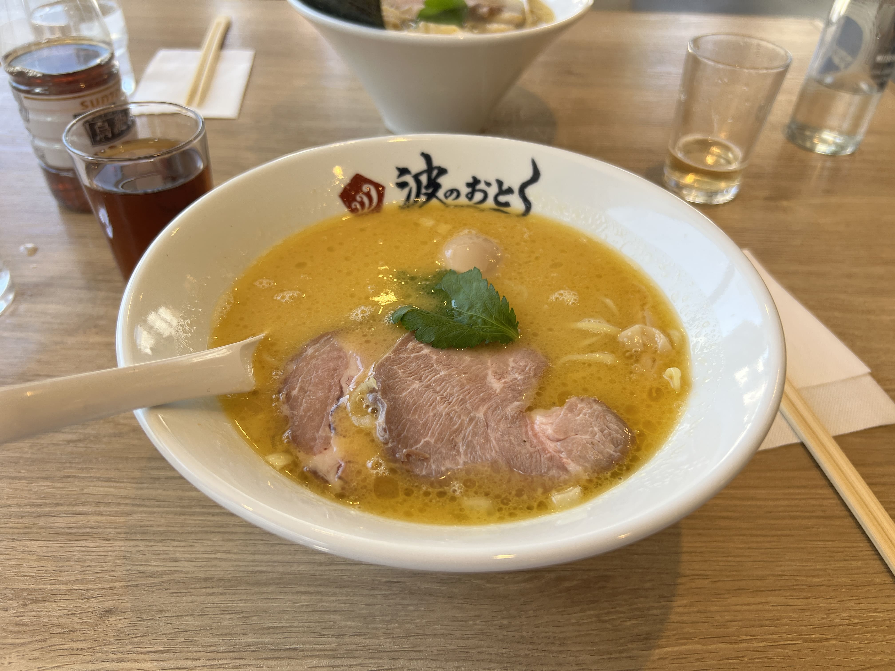
    <small style="display: block;">Tori-paitan</small>
  

  

    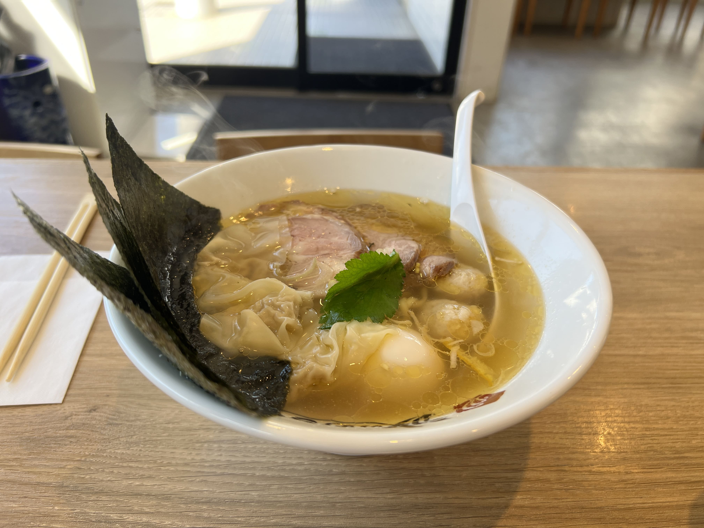
    <small style="display: block;">Deluxe shio</small>
  

I was pleasantly impressed by my tori-paitan ramen - the aromatic chicken bone broth was flavorful but not heavy and the noodles were unconventionally thick but delightfully QQ. My partner ordered a lighter shio broth ramen, which is what the place seems to specialize in, but he thought it was just okay.

### 2. Yufuin Ryokan Gettouan ★★★★★

Right after Fukuoka, we drove to Yufuin for our first ryokan stay. The booking came with dinner on the first night and breakfast the next morning, which were both multi-course meals.

  

    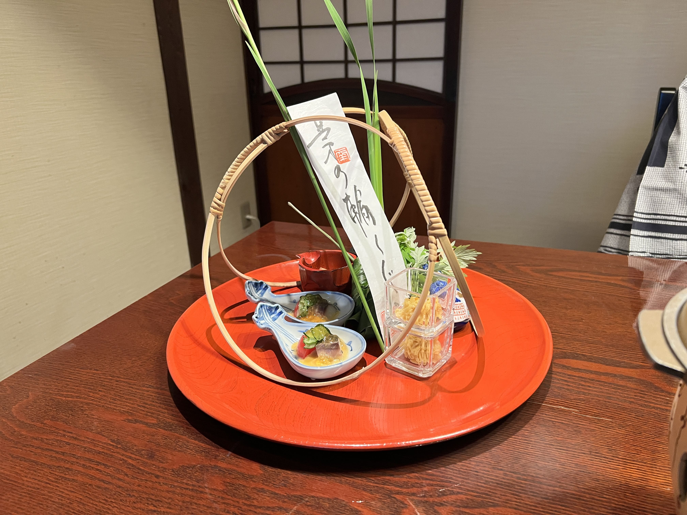
    <small style="display: block;">A variety of small dishes</small>
  

  

    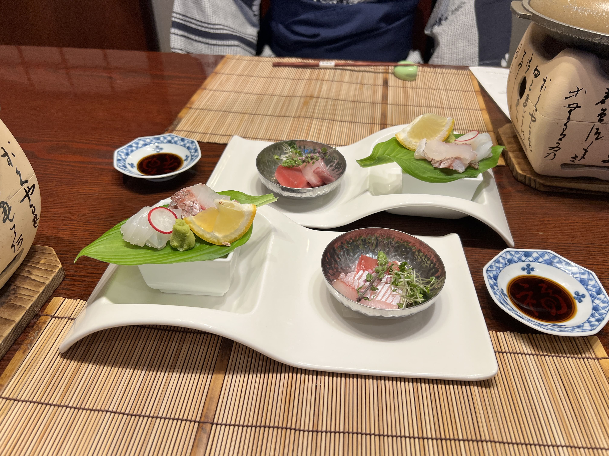
    <small style="display: block;">Sashimi</small>
  

  

    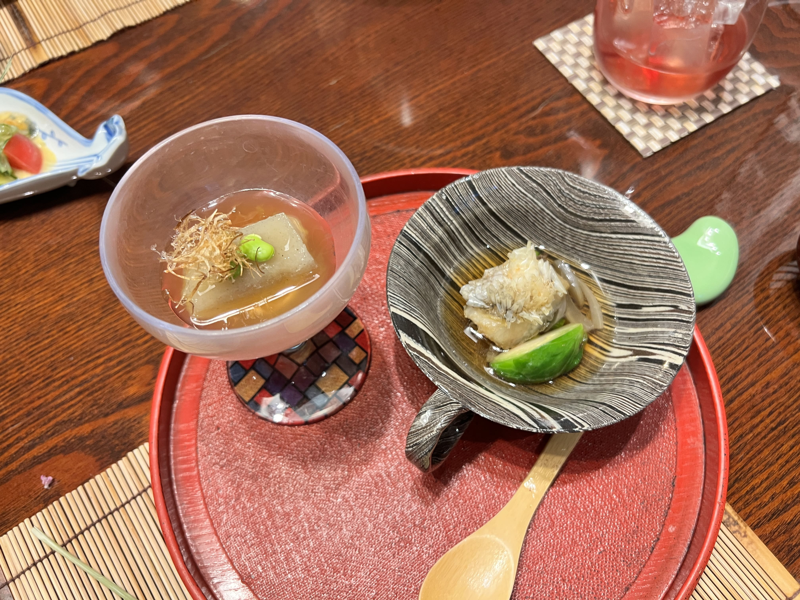
    <small style="display: block;">Burdock root tofu and sea bream</small>
  

  

    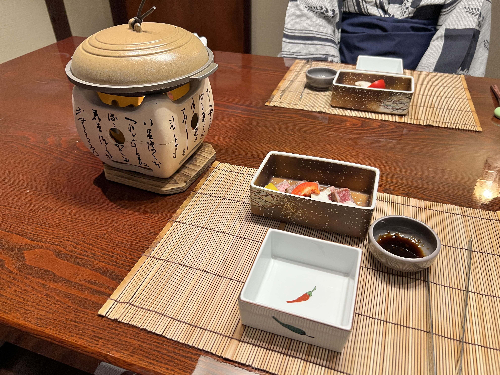
    <small style="display: block;">Bungo beef</small>
  

Dinner consisted of multiple kinds of sashimi and other small dishes with (cooked) fish and delicately crafted vegetables. The main course was DIY yakiniku with high-quality marbled "bungo" beef, a specialty of the Oita Prefecture, followed by a light and nutritious fish-vegetable stew and finally, dessert. My two favorite courses were the sashimi and the beef - the raw fish was all very fresh and delicious, and the DIY yakiniku experience on the little ceramic grill was unique and fun. It was a very pleasant experience from start to end!

The next morning, breakfast was served with an assortment of small plates, salad, yogurt, and also a slice of warm fish.

    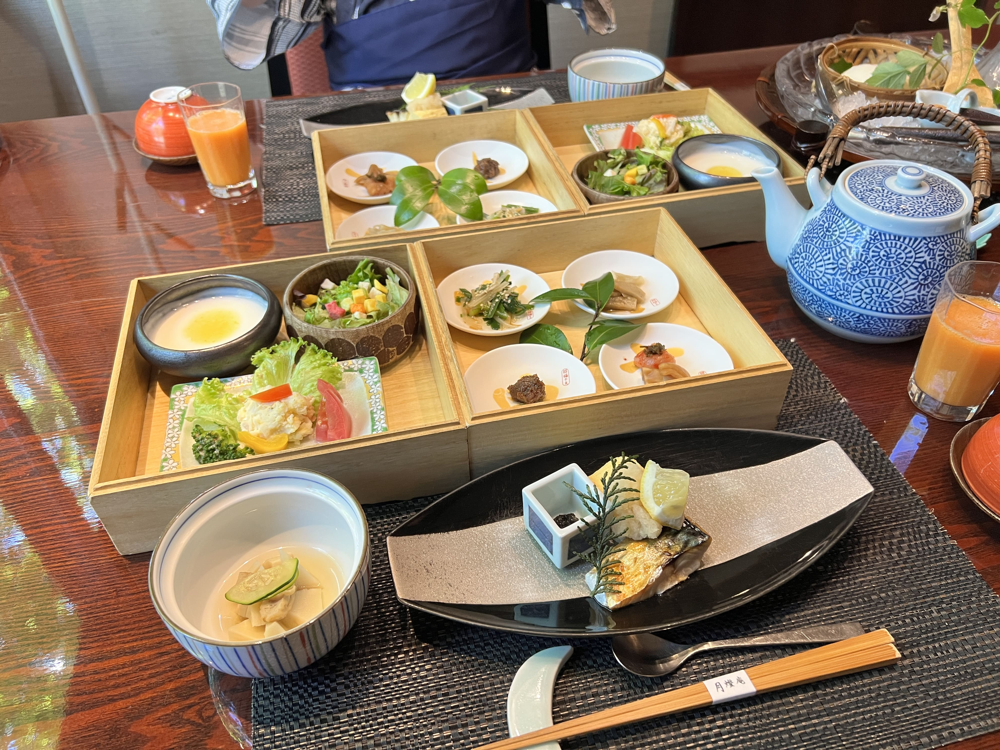
    <small style="display: block;">Breakfast at Gettouan</small>
  

Along with the overall experience of the ryokan itself, I really enjoyed everything and would wholly recommend if you're planning to stay in the area. The building does feel a bit old, but everything feels very home-y and the staff are all super friendly. It also manages to be quite tourist-friendly (which was helpful that the menu and many of the other instructions came in English) without losing its charm and serenity. The best thing - they have free unlimited ice cream in the gift shop for guests!

After breakfast, we spent the day in Yufuin Floral Village, which was one of the most delightful places I've ever visited. If you're into any of Moomin, Miffy, Sanrio, Peanuts, Harry Potter, Studio Ghibli, Heidi of the Alps, and probably way more other fandoms I missed, they have SO much merch there, it almost felt like a major amusement park gift store. We also managed to snag two tins of Yame matcha (native to the Fukuoka Prefecture) at 5toku after trying their iced matcha latte which was deliciously umami and rich.

### 3. Oyado Kafugetsu ★★★★☆

In the evening, we drove to the Kurokawa Onsen region for our second ryokan stay at Oyado Kafugetsu, and it was time for dinner!

  

    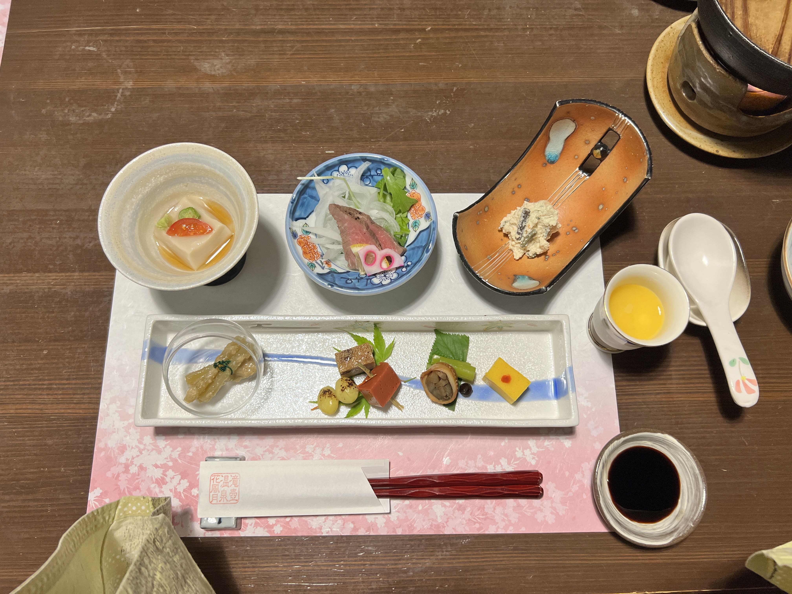
    <small style="display: block;">Sashimi</small>
  

  

    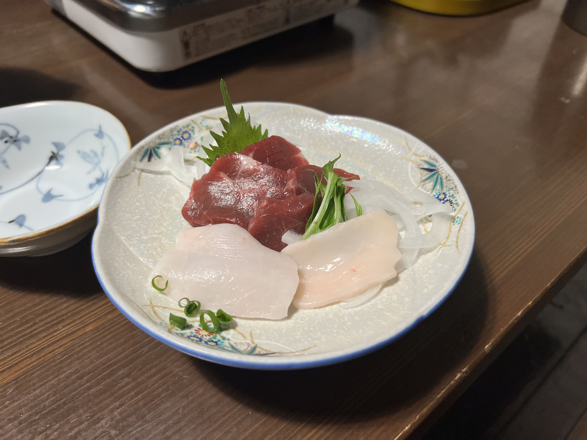
    <small style="display: block;">Horse sashimi</small>
  

  

    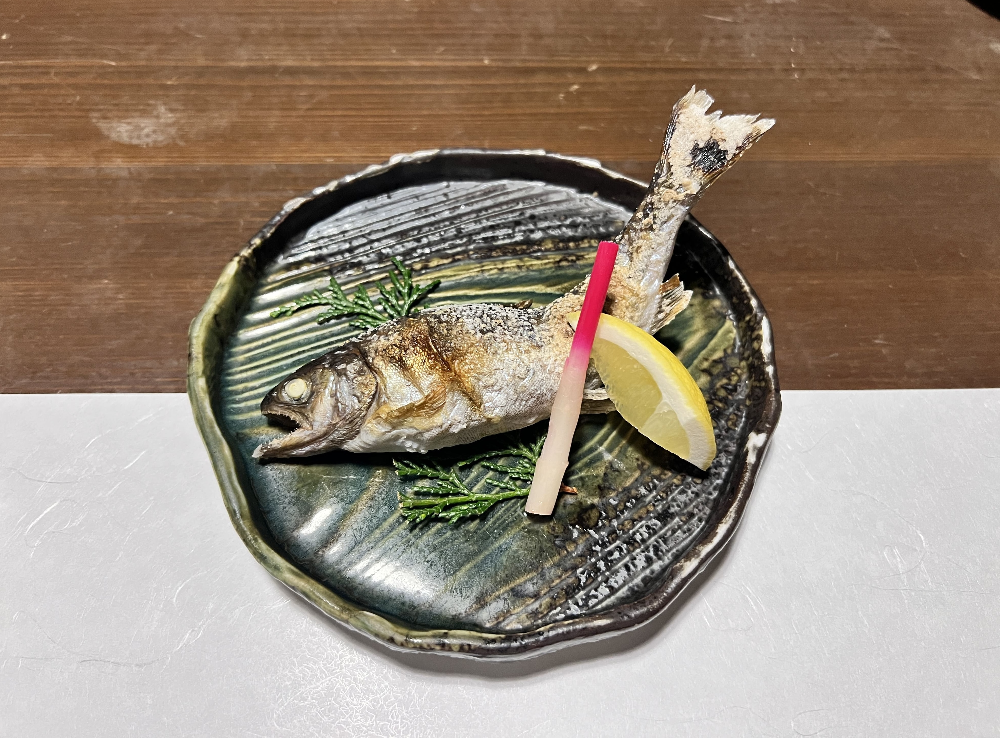
    <small style="display: block;">Fried fish</small>
  

  

    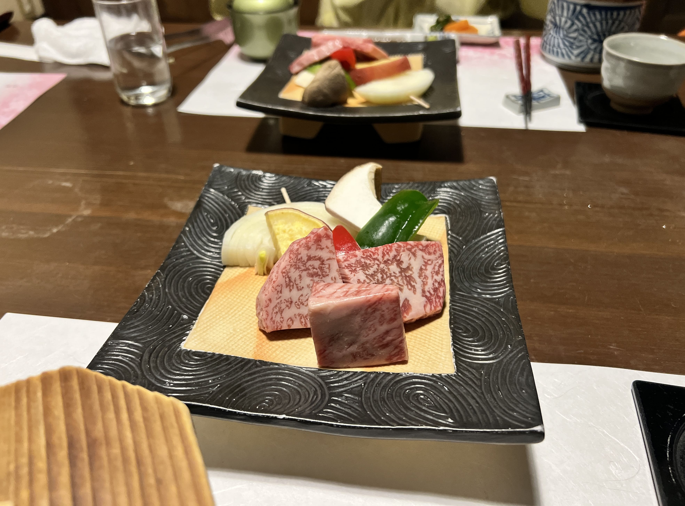
    <small style="display: block;">Black beef</small>
  

The menu here was significantly more regional - horse sashimi ("basashi") is a specialty of the Kumamoto region, as is the river fish. I actually enjoyed the horse sashimi more than I thought it was - it tasted a bit like tuna, but didn't have the fishy aftertaste. The texture was surprisingly tender and smooth.

The black beef seemed very high quality and the marbling was impressive, but the grill setup was a bit different from what we were used to - it was a wire mesh grill over a pot of boiling water, so the meat was partially steamed rather than dry-grilled. After doing some research it seemed that this was preferable sometimes when grilling extra high-quality fatty meat to preserve the meat better and prevent burning easily. I suppose it did emphasize the natural flavor of the beef, but I personally like the Maillard reaction char and so I didn't enjoy it as much.

Breakfast the next morning was beautifully presented and very vegetable-forward. I didn't know what most of the dishes were, but they were yummy!

    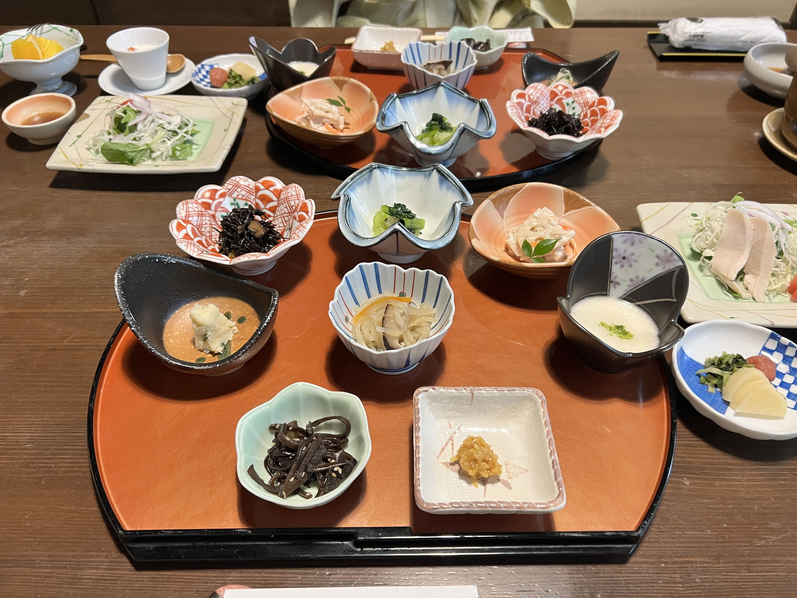
    <small style="display: block;">Breakfast</small>
  

Overall this ryokan was quite lovely and the space inside was a bit bigger and newer-feeling as well. It felt much more locals-coded - none of the staff spoke any English, and I had to make do with my very elementary Japanese proficiency. If you want a truly authentic experience, this is probably the closest you'll get. In terms of personal preference, I admittedly enjoyed the slightly-Westernized experience from the day before a bit better!

### 4. Ippuku Ramen ★★★★☆

The day was spent exploring the Aso and Kusasenri areas, and then we embarked on the long drive to Nagasaki (~3 hours).

    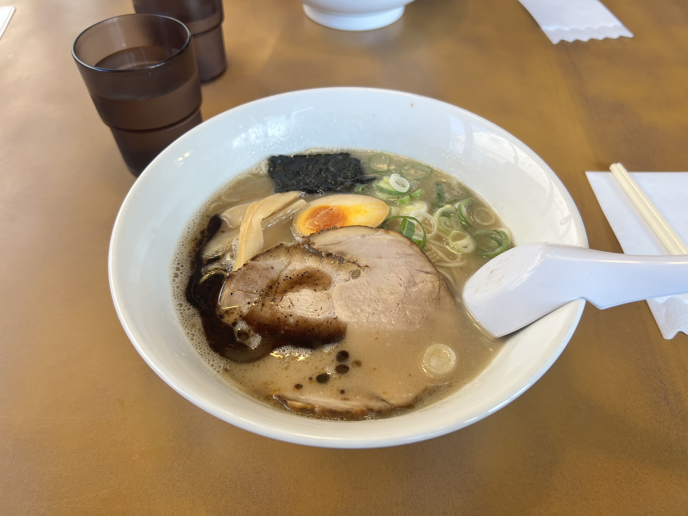
    <small style="display: block;">Ippuku Ramen</small>
  

On the way, we stopped in Kumamoto for a late lunch of, you guessed it, ramen. Ippuku Ramen had a retro-style diner vibe with red cushioned booths, and luckily there were many seats available at 3PM in the afternoon. We were both hungry and devoured our Kumamoto-style black garlic ramen in minutes. It was tasty and everything you'd expect - tonkotsu broth topped with fragrant black garlic oil, and thin Hakata-style noodles. I wouldn't call it particularly memorable, but I wouldn't mind going there again!

### 5. Auntei ★★★★★

When we finally got to Nagasaki, found parking (it cost an exorbitant amount), checked into the hotel, and got settled, it was quite late (almost 8PM). I found a nearby izakaya via Google Maps called あうん亭(Auntei), and we headed there in search of sustenance, not expecting anything more than a typical izakaya.

Now let me tell you - this was the most magical dining experience of my lifetime!

Let me context set - we arrived on a Tuesday night around 8pm. The whole bar was full except for two seats at the very right hand side.

As an introvert myself, I’ve rarely conversed with store/restaurant owners, both during traveling and in my home country, besides the bare minimum of what I want to order and buy. I have never had a conversation with other people in the same restaurant either - even when I want to (which is rare), it feels too intimidating and I don’t know what to say.

So it feels crazy to me that my partner and I spent 3 whole hours here on a weekday night, chatting with the owner and the other locals sitting at the bar. The atmosphere the owner created was warm and inviting - with my broken Japanese I heard him encourage the locals to ask us random questions during awkward silences. I even did a little language exchange with the person sitting next to us - he practiced his English, and I practiced my Japanese, and we talked about work, school, daily life, Pokemon, Studio Ghibli, and everything under the sun. Everyone else was super friendly as well - even though they were hesitant to try using English, the earnestness and genuineness was truly felt.

(Obviously the food was good too although it was pretty much your standard izakaya food. The owner's signature dish, the beef Titanic, was really delicious.)

  

    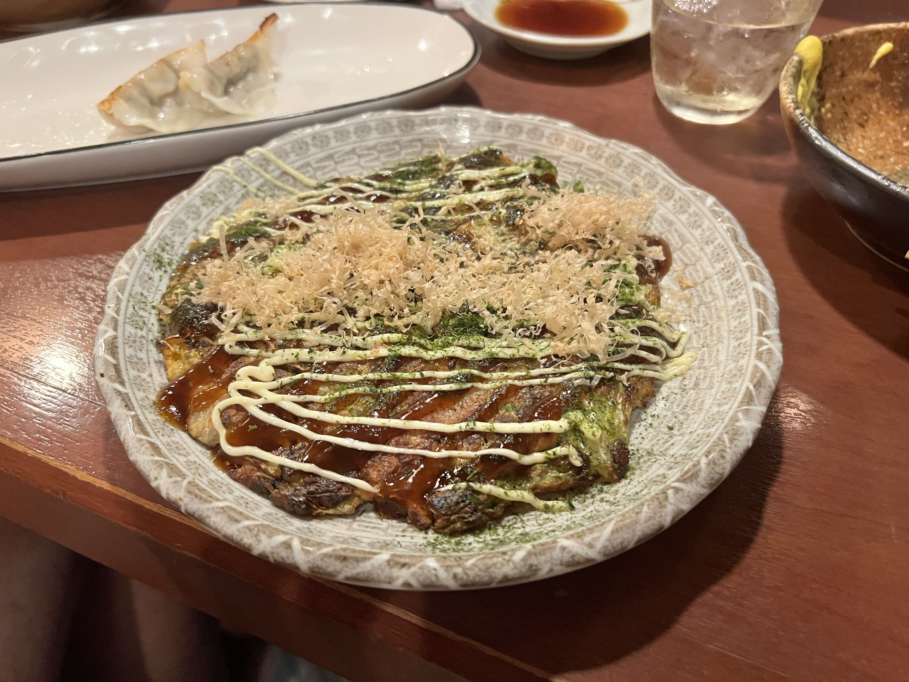
    <small style="display: block;">Okonomiyaki</small>
  

  

    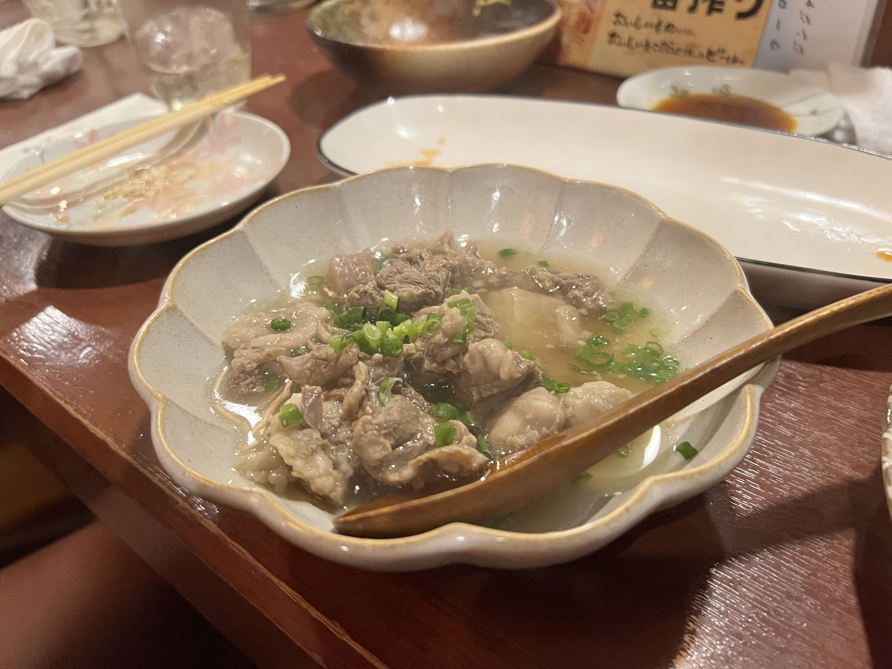
    <small style="display: block;">Titanic Beef</small>
  

It was such a warm and lovely experience and it makes me sad that it’ll be a long time before I can visit again. Nevertheless I’m so glad I stumbled upon this izakaya on my first trip to Nagasaki, and I’d recommend this place to anyone looking for the most memorable meal of their lifetime.

### 6. Chanpon Soshurin ★★★★★

Chanpon Soshurin is a chain with multiple locations throughout Nagasaki. On the last night before leaving, we managed to make it to the Nagasaki Station location 30 minutes before closing.

From photos I was skeptical how good these relatively colorless noodles could taste, but they pleasantly exceeded expectations. The sara udon was really good - I liked how the thick sauce clung to the crispy noodles, and it reminded me of the Cantonese-style crispy noodles I'd eaten at a local restaurant growing up.

  

    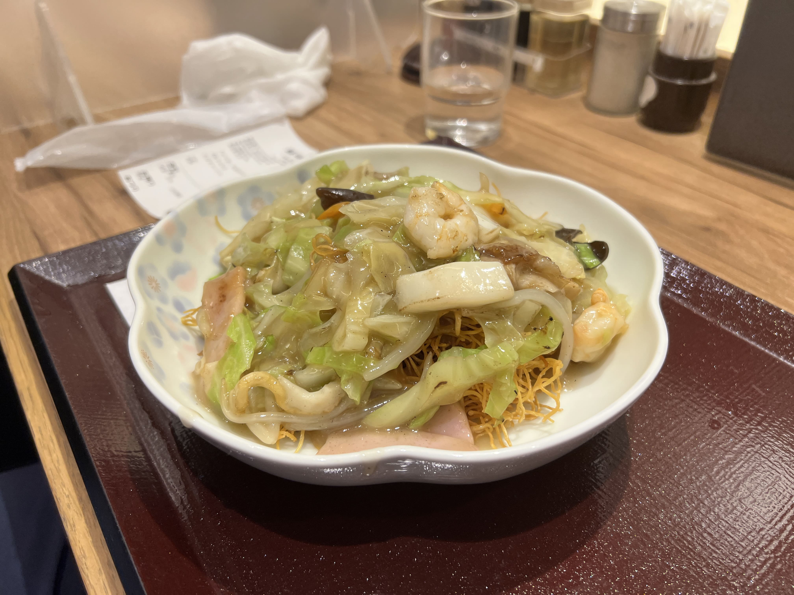
    <small style="display: block;">Sara Udon</small>
  

  

    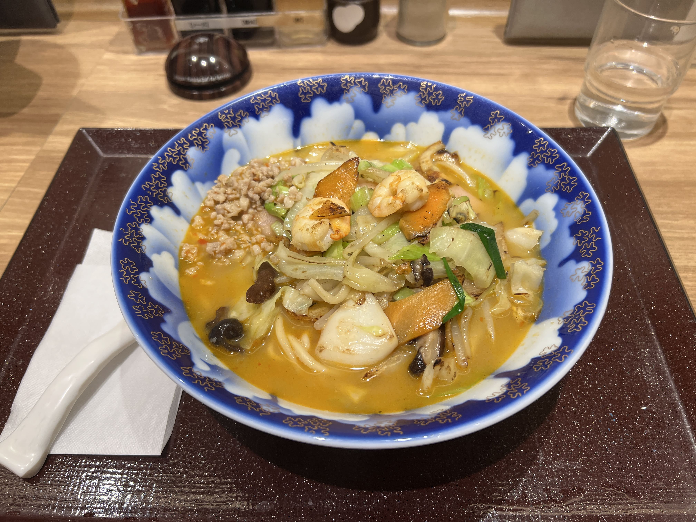
    <small style="display: block;">Spicy Chanpon</small>
  

I think I made mistake ordering the spicy chanpon - the spice and the heat in the beginning made everything taste kind of flavorless. But as the soup cooled down, the rich flavor of the broth started coming through, and it started growing a lot on me actually. I understood then what people meant by chanpon tasting comforting and like a home-cooked meal.

### 7. Shin Shin ★★★★★

The legendary Shin Shin, commonly hailed as the best ramen in Fukuoka!

    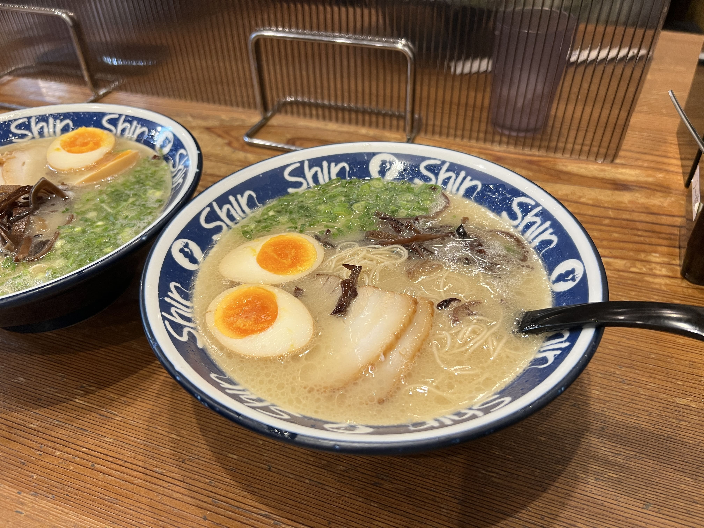
    <small style="display: block;">Tonkotsu Ramen</small>
  

Waited 30 min in the rain but it was worth it. Quite solidly the best ramen I've ever had in my life. It's also one of those places where you order, the food comes in 5 minutes, you eat within 10, and then you hop out to keep the line moving. Efficient, yummy, and totally worth the trip.

### 8. GYUKATSU Kyoto Katsugyu Tenjin Nishi-dori ★★☆☆☆

I've never had gyukatsu before so I thought it was fine. Nothing crazy but it was cool that I got to cook the gyukatsu myself on a hot stone grill, and I thought the original gyukatsu tasted like what I'd expect. However my partner ordered the aged gyukatsu and said it was the worst that he's ever had...

    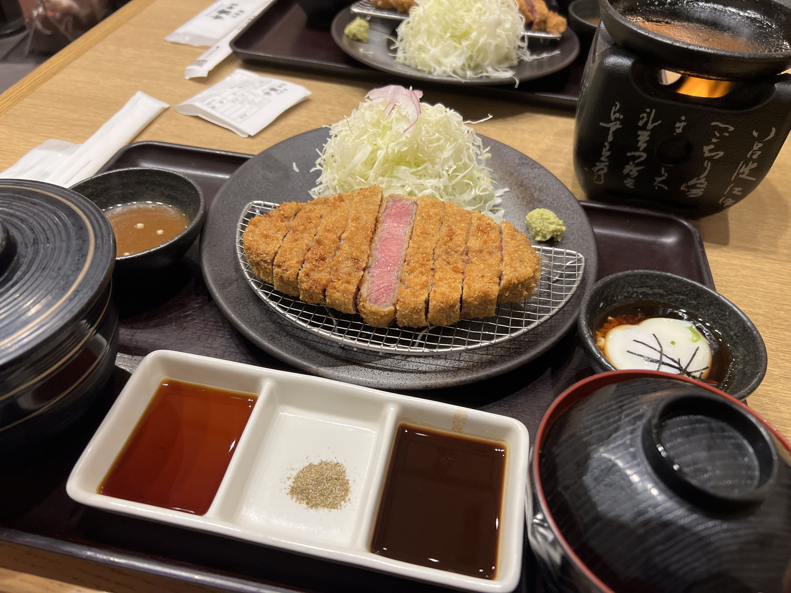
    <small style="display: block;">Gyukatsu</small>
  

### 9. Sushi Ryori Ichitaka ★★★★★

This was my second real omakase experience (the first being Sushi Tokyo Ten). It was for lunch so the course was shorter but I really enjoyed it! My favorites were the toro, the shrimp, and the smoked bonito fish. They also served interesting courses like sea snail (chambara), horse mackerel, and kibinago (herring). The chef was friendly and also spoke quite good English (!) since he studied abroad in Canada for a while, so we had good conversation and he also explained each of the courses in a very detailed manner. Would recommend to anyone in Fukuoka looking for a high quality lunch omakase!

  

    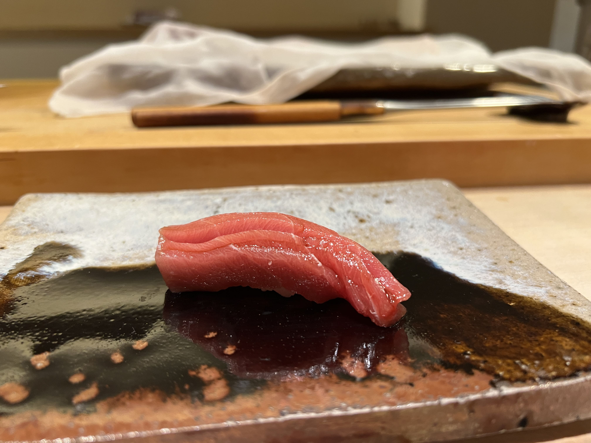
    <small style="display: block;">Chuutoro</small>
  

  

    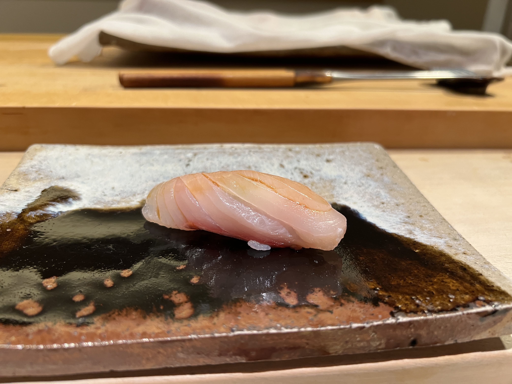
    <small style="display: block;">Kingfish</small>
  

  

    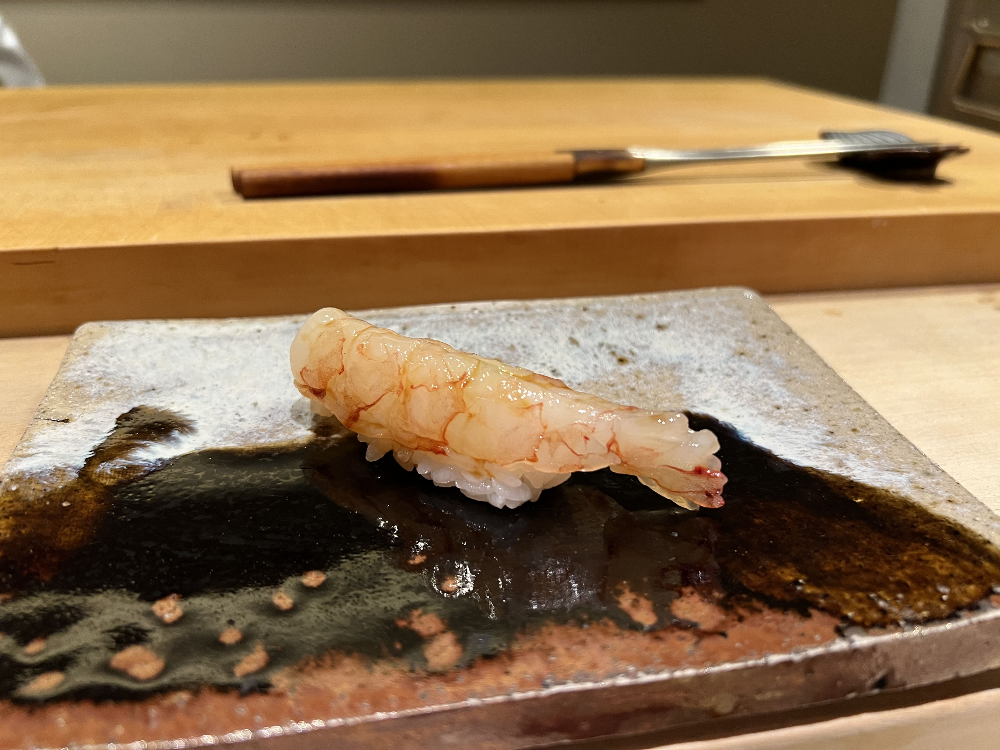
    <small style="display: block;">Shrimp</small>
  

  

    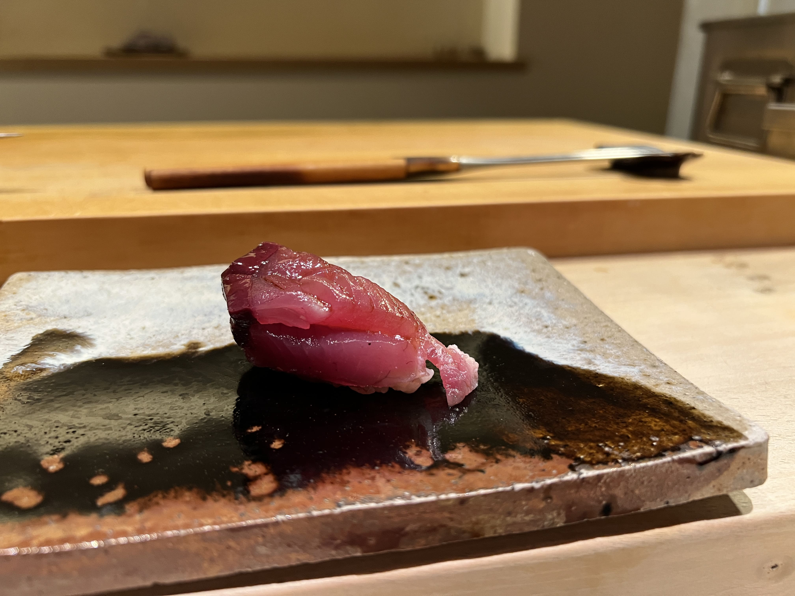
    <small style="display: block;">Smoked bonito fish</small>
  

### 10. Quil Fait Bon ★★★☆☆

This place is pretty viral for their fruit tarts, with multiple locations throughout Japan. They are indeed quite delicious and not too sweet, and the fruits are high quality, but definitely very expensive nonetheless. Unless you're a huge dessert foodie, probably no need to drop by here.

    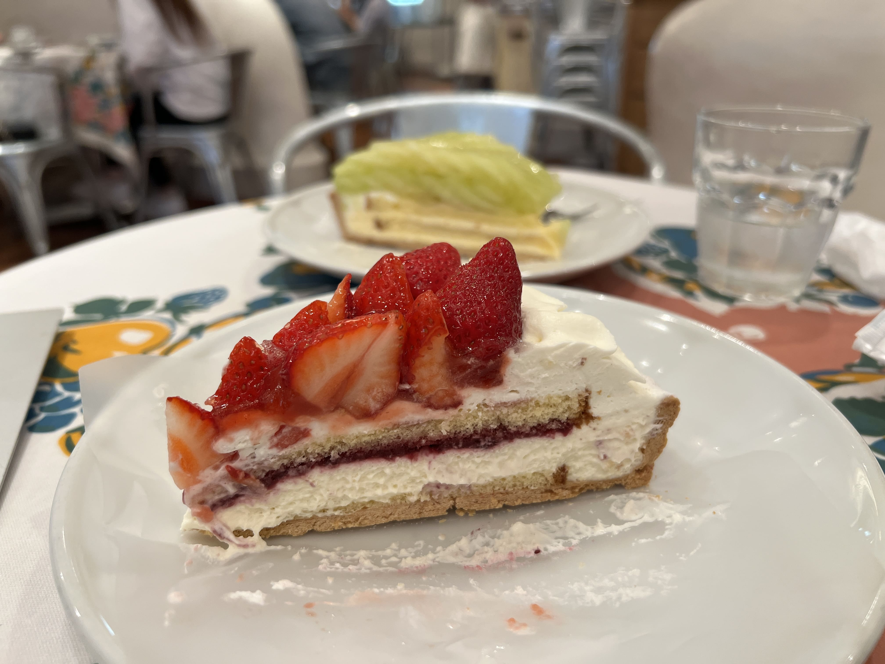
    <small style="display: block;">Quil fait bon</small>
  

### 11. Motsunabe Ichifuji Tenjin ★★★☆☆

The rating above reflects mostly personal preference rather than the quality of the food. This place is quite popular so I'm sure they do motsunabe quite well, but I think offal pot is just not really our cup of tea. The broth is very rich and heavy to the point where I felt like my cholesterol was increasing by the spoonful (lol). We also didn't order any side dishes so maybe that part was on us, but the pot itself felt quite uninteresting to eat alone. But it was a good experience nonetheless! Service was good, I liked the little sectioned-off tables so that you're in your own little booth, and they had some interesting beverages. I can definitely see it as a late-night get-together kind of food. In the end, we ended up burying a gigantic piece of offal under the ladle since neither of us wanted to eat it.

    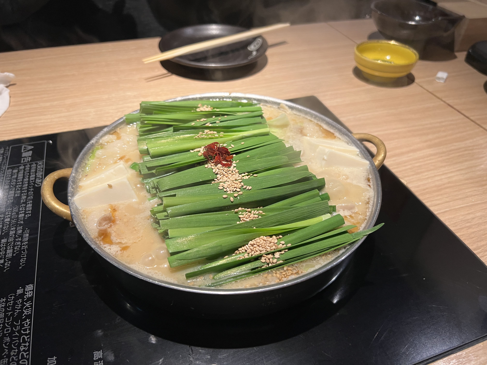
    <small style="display: block;">Motsunabe</small>
  

### 12. Sushiro ★★★★★

Second dinner of the night - post-motsunabe we were both a little dissatisfied so we decided to top off our final night in Fukuoka with something we knew we would like. At 9pm we expected the wait at Sushiro to be short, but we actually waited in line for about an hour (took a little detour to Don Quijote in the meantime) before we got our number called. Despite it being way past dinnertime, it somehow made the meal more enjoyable and fun.

  

    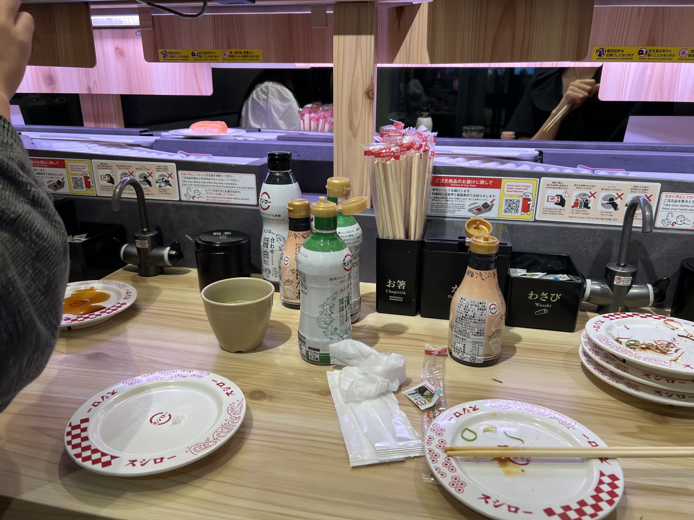
  

  

    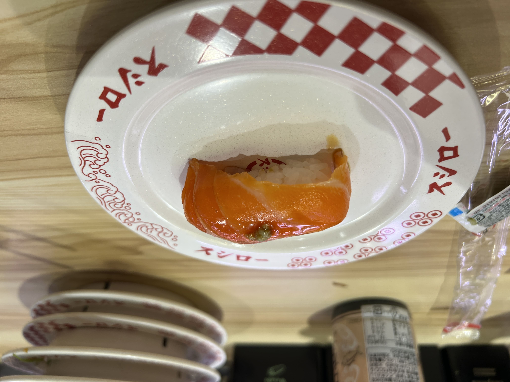
  

 

•••

Overall this trip to Kyushu was filled with many new experiences, food and otherwise. I got to taste some truly authentic dishes, and they were definitely hit or miss for me. Horse sashimi? Would try again! Motsunabe? Probably not.

What are you curious to try in Kyushu?

_tags: location/japan, travelog, road trip, omakase, onsen, fukuoka, ramen_
