This was not only my first time in Shanghai, but my first time in Mainland China! I went in equal parts excited and slightly intimidated — mostly because I knew I’d have to figure out the whole WeChat + Alipay ecosystem on the fly. We arrived late on Wednesday after flying in from Taipei and immediately ran into the first “oh, we’re not in Taiwan anymore” moment: most restaurants near us were already closed by 8 or 8:30.

Thankfully, a close-by Maotou Laodie 毛头老爹饭店 was still open. There were a surprising number of foreigners inside which made me nervous at first (that the food might be meh), but once the dishes came out all was forgotten and everything was honestly really good. Portions were HUGE, prices were low, and we weren't even close to finishing everything we ordered.

  

    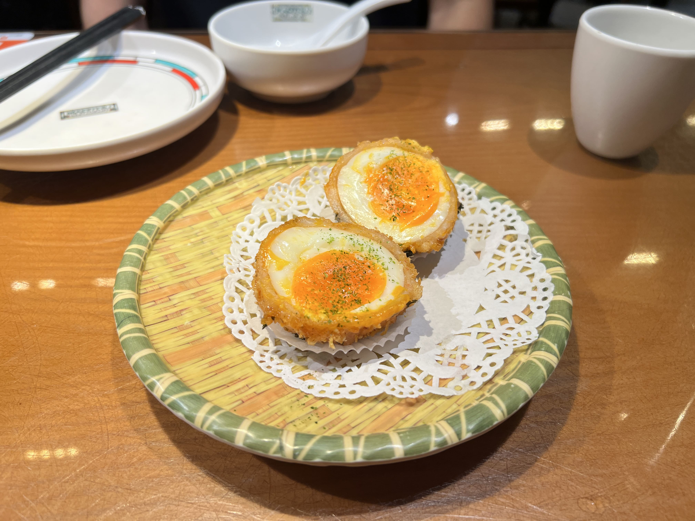
    <small style="display: block;">Fried egg appetizer</small>
  

  

    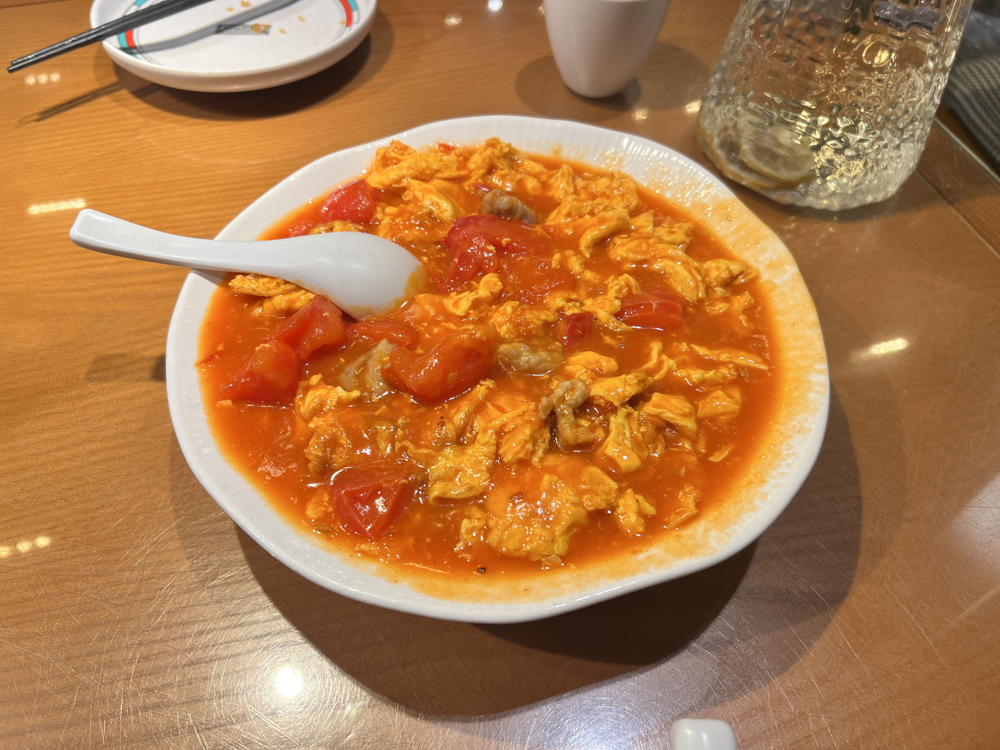
    <small style="display: block;">Tomato & egg stir-fry</small>
  

  

    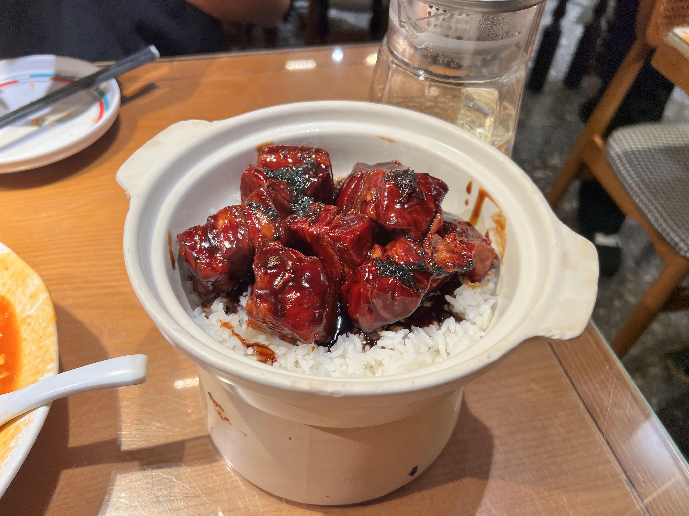
    <small style="display: block;">Braised pork</small>
  

  

    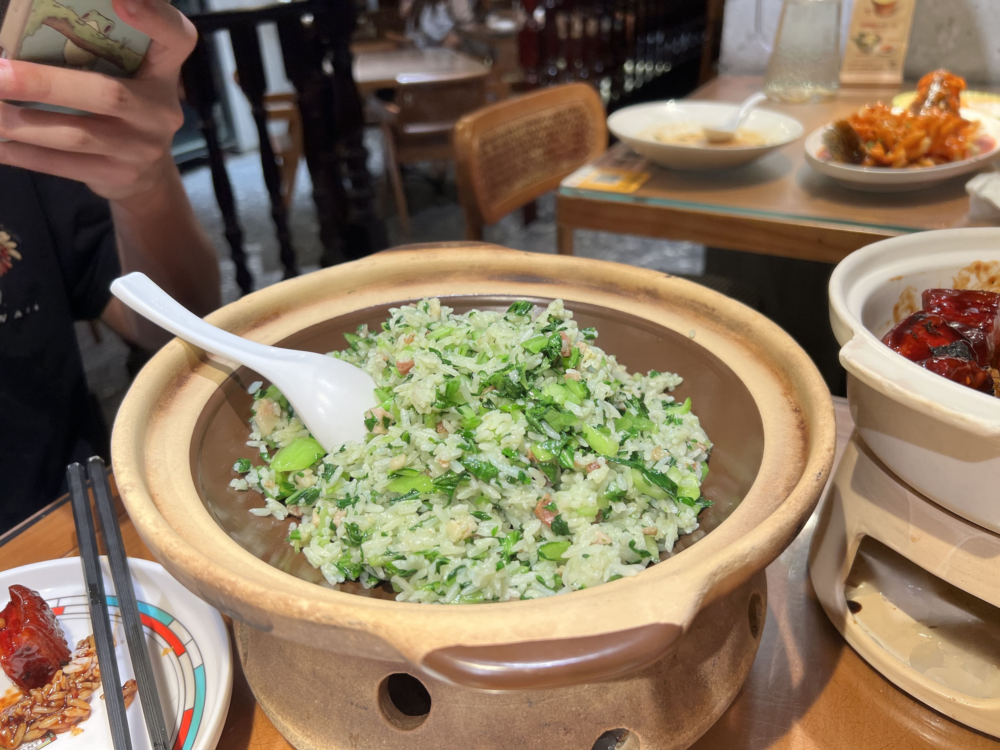
    <small style="display: block;">Fried rice</small>
  

Afterwards, we also made it to Chagee at 1788 Plaza before they closed for the night, making for a very pleasant first evening.

Thursday was a classic first-timer itinerary: Yu Garden & the Bund. Upon arriving, it was almost noon, so we tried looking for something to eat first. Unfortunately the area around Yu Garden felt _extremely_ touristy (as one would expect) and most food options looked unappetizing. We ended up trying Bistro10 (a hotel restaurant off the Bund), and it was a mixed bag: the xiaolongbao was actually really good and flavorful, but the crab roe noodles were super bland and definitely not worth the price.

    

        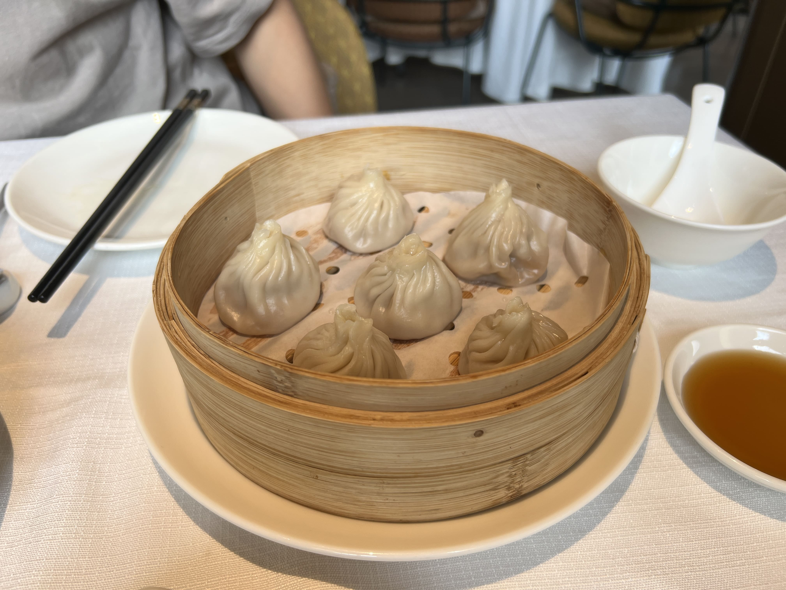
        <small>Xiaolongbao</small>
    

    

        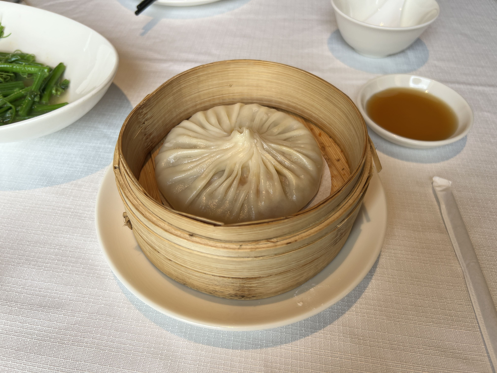
        <small>Large soup dumpling</small>
    

    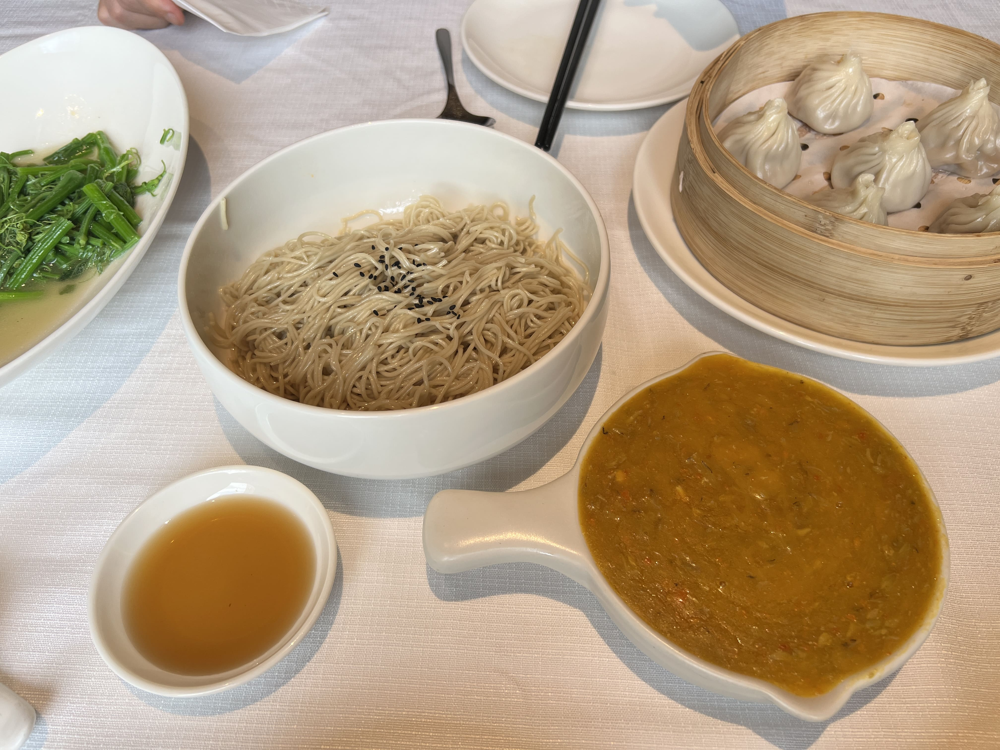
    <small>Crab roe noodles</small>

What's funny was that since it was our first time having crab roe noodles, we kinda assumed that maybe that's just how it was, so we weren't even that disappointed after the meal. Afterwards, we headed to Yu Garden, which was breathtakingly beautiful and surprisingly serene without the weekend crowd rush. Eventually, we emerged to grab an afternoon refresher, and I found the famed Amo Shouzuo tucked away amidst the tourist shops. The wait was around 20 minutes, which I learned later is basically lightning-fast by Amo standards... and the mochi drink was seriously no joke - strong contender for one of the best drinks I've had in my lifetime.

Late afternoon was spent strolling along a foggy Bund and weaving through crowds on Nanjing Road. Overcome by a sudden craving for spicy food, we found good ratings on Dianping for a place called Shu Tan Ji 蜀谭记 and headed over with high hopes. The first sign that it was good was that there was quite a long wait outside from locals, and it was about 7:30PM at that point, which apparently is quite late for a dinner in Shanghai! The second sign that it was good was that when the Sichuan boiling fish 沸騰魚 came out, the bowl was wider than the width of my body.

    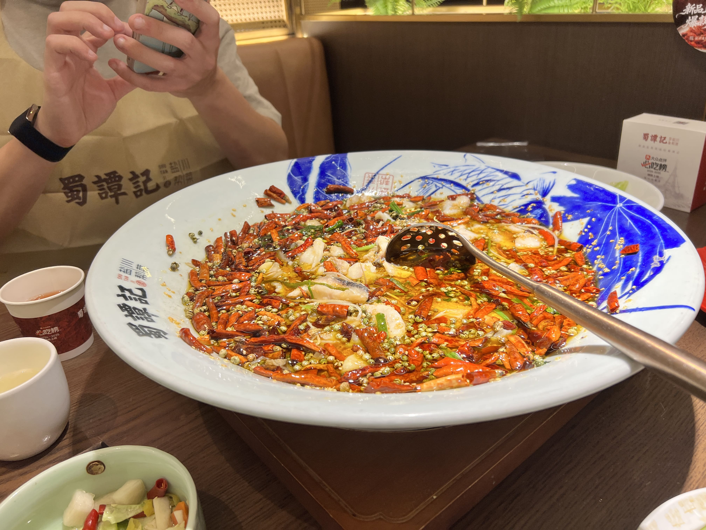
    <small>Spicy boiling fish at Shu Tan Ji</small>

Upon having my first bite, it felt like heaven on earth. The flavors were _so_ bold and fragrant, I couldn't believe my taste buds. They were also very generous on the portion of fish - most of the time you order boiling fish 水煮魚 (which I recognize is not quite the same) in the U.S., you end up getting heaping spoonfuls of beansprouts and stray vegetables, but here, every time the ladle went in and out, more pieces of fish were discovered. It was honestly one of the best meals I've ever had.

The Bund at night afterwards ended up being one of my favorite Shanghai moments: good vibes, not crowded, super scenic, although way windier than expected (bring a light outer layer!).

Friday was a food and shopping day. In the morning, we stopped by a mall on Huaihai Street for Yang’s Dumpling shengjianbao, and afterwards tried an unfamiliar tea place called Shangshan Teahouse, which ended up being quite good.

    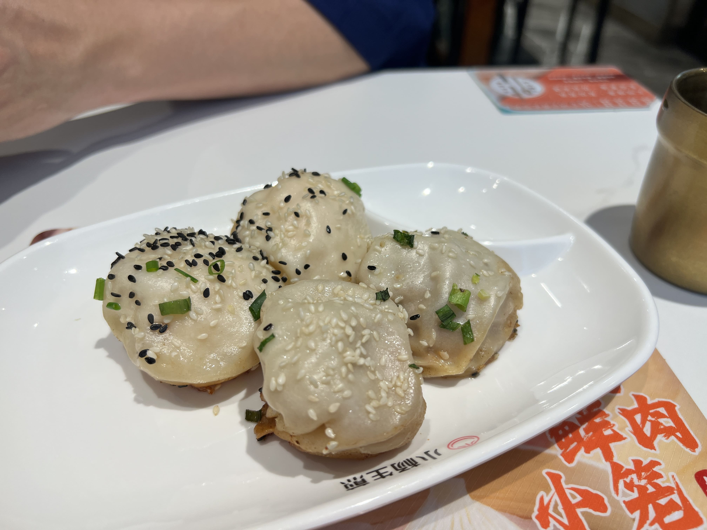
    <small>Shengjianbao at Yang Dumpling on Huaihai</small>

Later, we visited the Songmont flagship store (the day before, I had stopped by the Rockbund store, but the inventory was extremely limited and disappointing). Staff were super helpful here, and they mentioned that there was a limited-time 15% discount. I also liked that it wasn’t too crowded but it might've been since we went at opening-ish time. After much deliberation, I walked out with two bags - one for me and one for my mom. With the local pricing, the additional discount and no tax, the price of those two combined ended up being pretty much equivalent to that of a single bag online on the international site, so I was extremely pleased.

    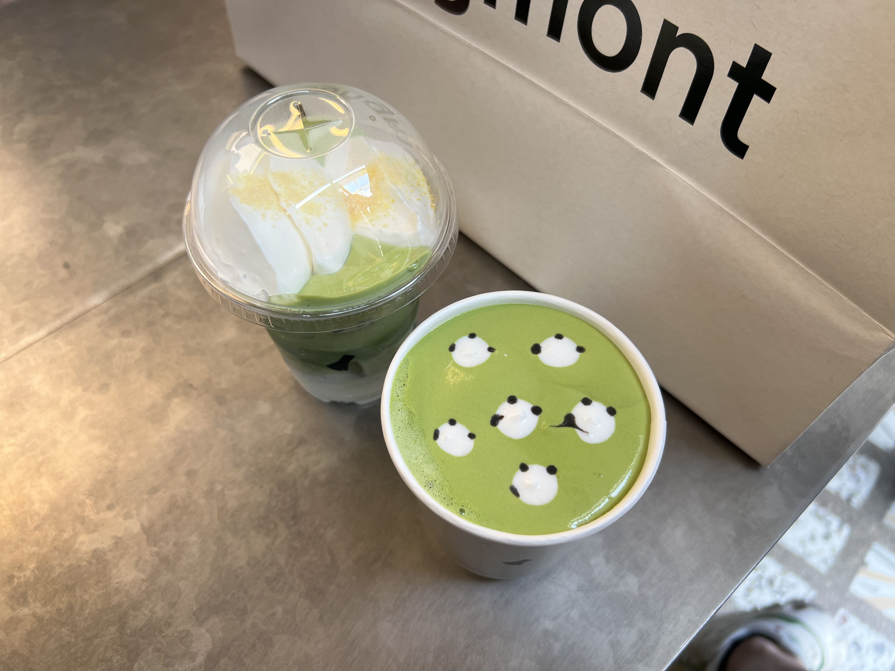
    <small>Matcha Wang</small>

The next stop was Matcha Wang for the obligatory sheep matcha. It was mostly foreigners and the drink was just alright, but watching them make the sheep was fun and the wait wasn’t too bad on a weekday. The rest of the afternoon was spent strolling around the historic French Concession - Julu Road into Anfu Road. The vibes were extremely serene and it ended up being one of my favorite parts of Shanghai: cute boutique shops along tree-lined streets, aesthetic cafés, and overall a good time. Unfortunately, everything was also expensive, so we just window-shopped. We stopped in a store called Monday Sleeping Club which we were both intrigued by (and seemed very popular with the locals), but eventually decided against paying $30 USD for a generic-looking graphic tee.

_One random practical learning from being out all day: Meituan (yellow) charging banks don’t work without a China phone number, so we had to hunt down the Energy Monster (blue) ones instead._

For dinner, Lailai Xiaolong at the Jing’an location was another culinary highlight. There wasn't a wait and the area was quite spacious (I've heard that the OG Huangpu location is opposite on both accounts), and the crab roe rice was genuinely so much better than the crab roe noodles from Bistro10 (redemption!). Their pork chop was surprisingly delicious too - different from the Taiwanese-style Din Tai Fung style I'm used to, but crunchy and flavorful and yummy all the same. The XLB were decent although not particularly standout, and the wonton was just okay and a bit small. Overall the meal was super value and quite memorable, and I understood why it was such a popular food spot amongst tourist recommendations.

  

    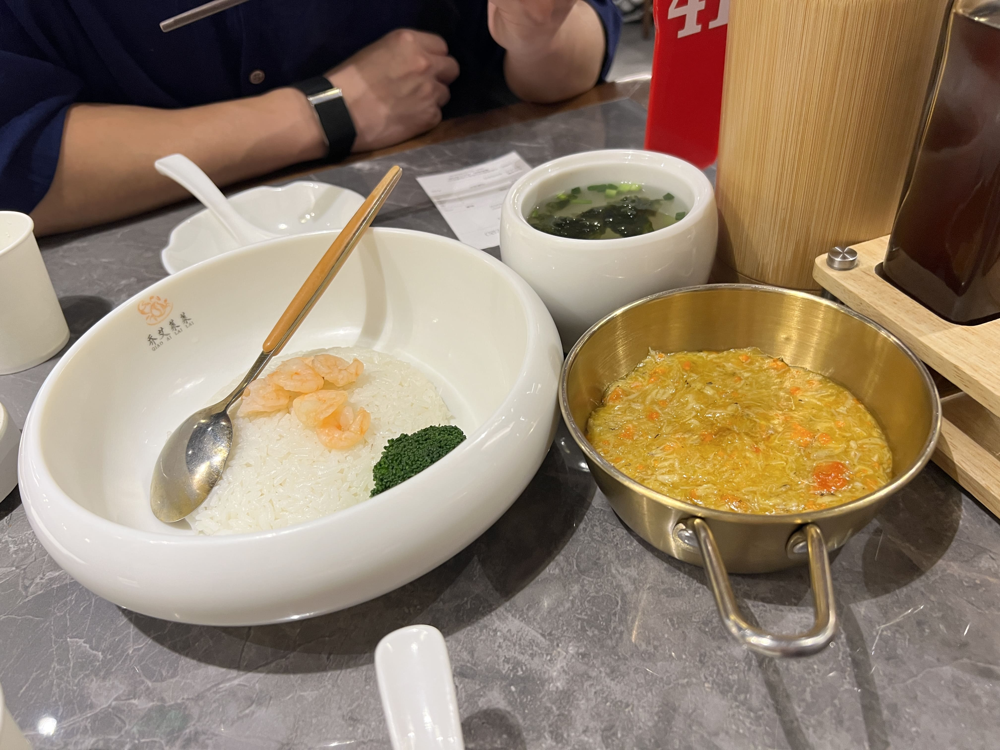
    <small style="display: block;">Crab roe rice</small>
  

  

    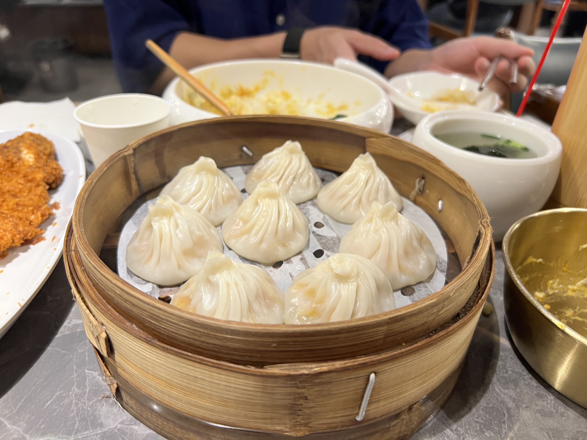
    <small style="display: block;">Xiao long bao</small>
  

  

    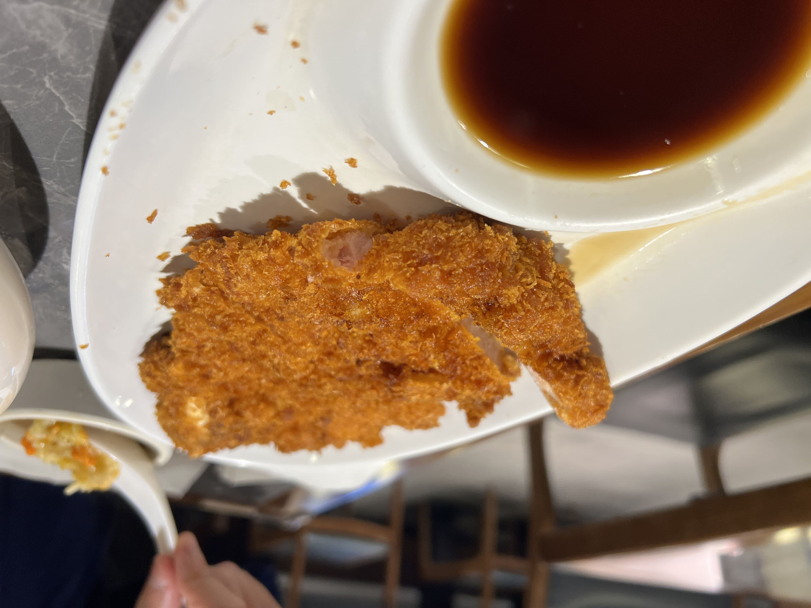
    <small style="display: block;">Pork chop</small>
  

  

    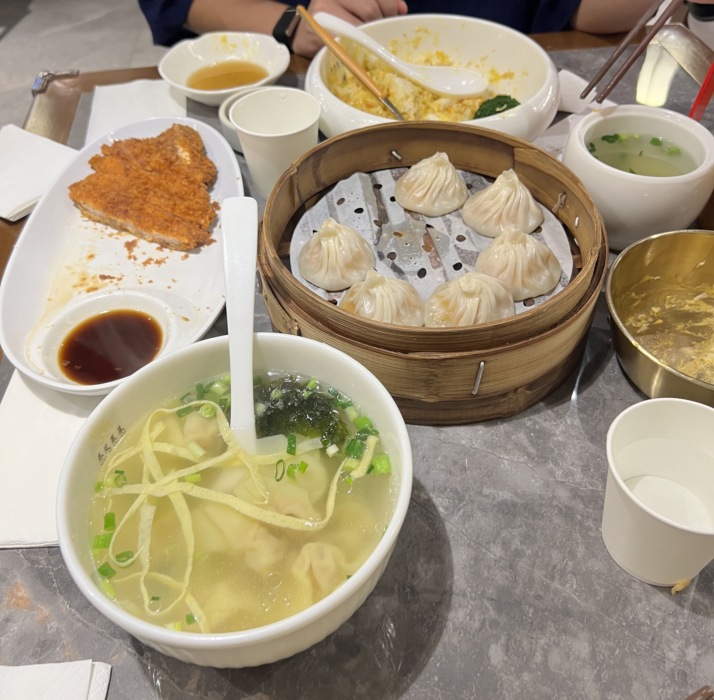
    <small style="display: block;">Wonton soup</small>
  

Saturday was supposed to be a Zhujiajiao Water Town day trip, but in the morning, we last-minute pivoted to Suzhou instead after reading some Reddit threads recommendations. Unfortunately, due to not planning ahead, most of the HSR tickets were sold out, and the earliest option was about 1.5 hours later. The wait wasn’t too bad though: we had early lunch in the station (surprisingly good xiaolongbao, _super_ cheap) and Chagee, and then it was pretty much time for boarding.

    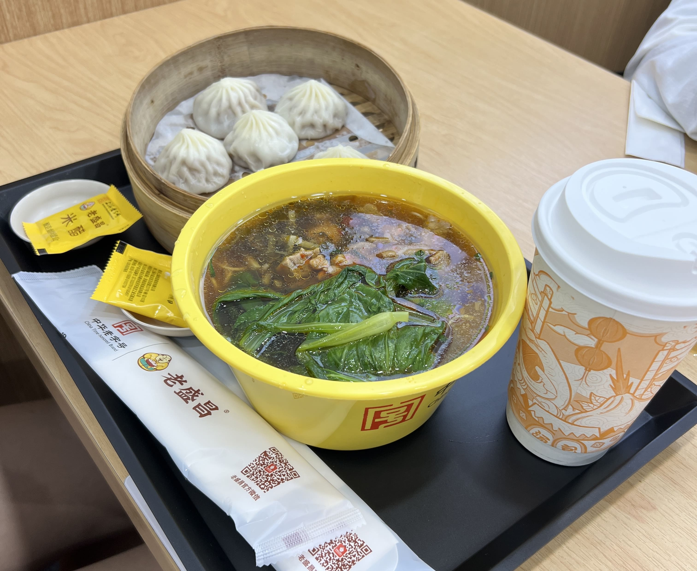
    <small>Lao Sheng Chang at Shanghai Railway Station</small>

_Also: if you’re a non-resident ID holder, you need to go through the “manual entry” line for passport checks before boarding. Same idea when exiting, and you also have to go through security before you can even enter the boarding area._

The train to Suzhou was fast (25 minutes). The Didi to Humble Administrator’s Garden was not (30+ minutes because of traffic). Lesson learned: take the metro in crowded areas. The garden was pretty, but it was a sunny Saturday afternoon, extremely crowded, and absolutely sweltering — people everywhere, influencers taking photos, and it was chaotic enough that we left after about an hour. Perhaps it would’ve been more serene on a weekday, but the experience was a bit hellish (and I really wished they had some vending machines inside for a cold drink).

Pingjiang Road was also insanely crowded, and we basically moved as part of a collective monstrous mass that slowly inched its way down the long street. The shops lining the side might've been interesting to me if I hadn't already been to places like Jiufen in Taiwan about a million times, but alas... Eventually we were able to break from the crowds and wandered onto a quieter side street, where we were finally able to enjoy our surroundings. We ordered Amo Shouzuo again and waited almost an hour this time (pain), but it was still good.

On the way back from Amo Shouzuo, still in those (more serene) side alleys, we came across a cute Taiwanese cafe selling street snacks. We ended up sitting there for over an hour just chatting with the owners, and it was much quieter and more relaxed than everything else that had happened that day. The funniest thing was that when we told them we had initially planned to go to Zhujiajiao instead, they (locals) had never heard of the place at all.

We strolled around a bit more, enjoying the peacefulness of the non-crowd-infested areas, and finally metro’d back to the railway station, HSR’d to Shanghai, and immediately went back to Anfu Lu for Monday Sleeping Club. In 24 hours my brain went from "overpriced $30 graphic tee" to "hype local brand... i must get," so Daniel and I each got a t-shirt, and I got a hat as well.

To end the day, we grabbed hotpot in the Xintiandi area at a place called Jinshan Koufu, which was very solid. It wasn’t super cheap (ended up being around ~$32 per person), but the meat quality was really good. We tried to get boba after and failed because it was 9:40, and apparently some places that “close at 10” stop taking orders at 9:30. We walked around Xintiandi afterwards and it felt very upscale Europe-outdoor-dining-street vibes (and also a little like Las Vegas), almost like a theme park.

Overall, Shanghai was really fun and there’s a _lot_ to do, so three days felt way too short. There were places we didn’t get to (Tianzifang, People’s Square, Jing’an Temple), and it also would’ve been cool to stay longer in Suzhou or even go to Zhouzhuang (introduced to me by Chloe Gong's books) if we had more time!

It is a little intimidating having to use WeChat and Alipay everywhere, and some services just don’t work without a Chinese phone number (can’t order delivery on Meituan, can’t buy HSR tickets in advance on your phone). Things also close earlier than Taiwan, and there aren’t really night markets or street food stalls in the same way. But I’d definitely go back and visit again!

Favorite things:

- the Bund on a weekday night
- 沸騰魚 at Shu Tan Ji
- Songmont flagship
- Monday Sleeping Club
- Amo Shouzuo

Least favorite things:

- crowds at Humble Administrator’s Garden and Pingjiang Road
- crab roe noodles at Bistro10
- waiting one hour for Amo Shouzuo
- Didi drivers accepting the ride and then never coming

_tags: location/china, food recommendations, shanghai travels_
