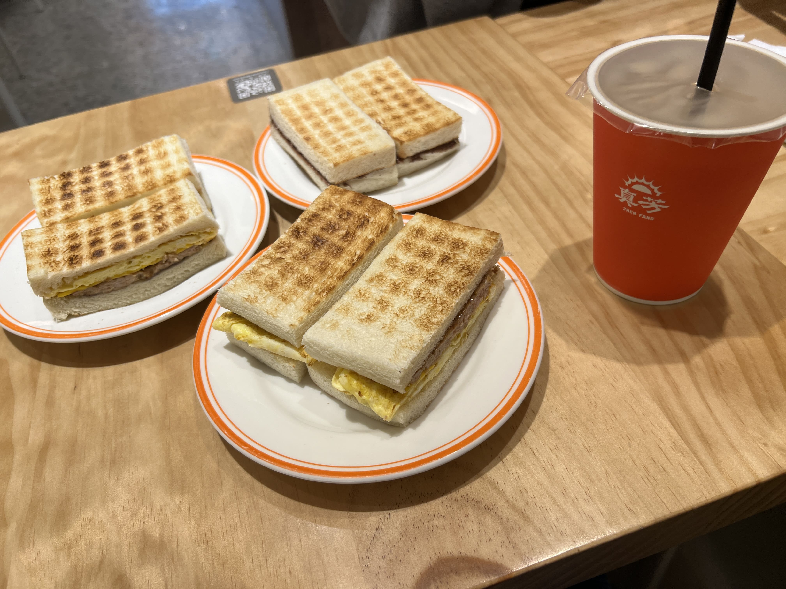
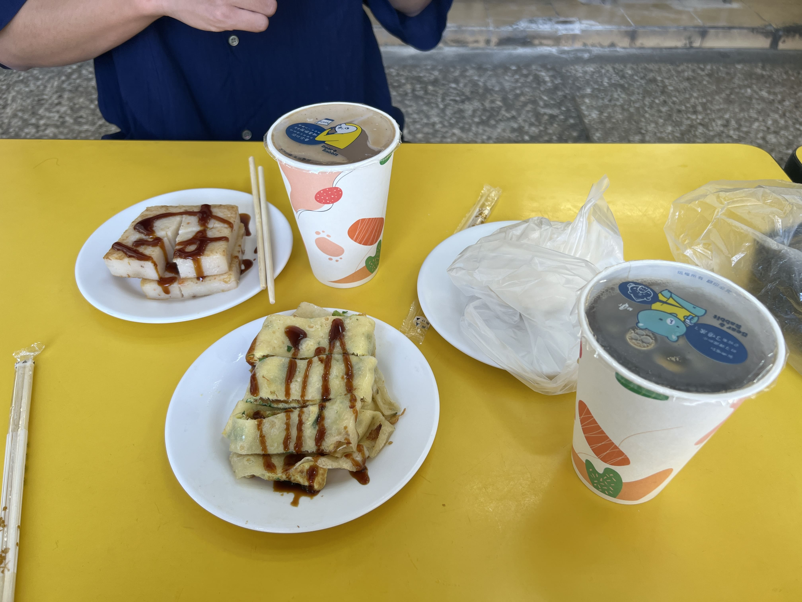
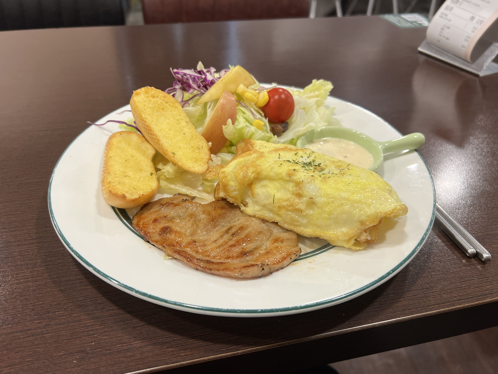
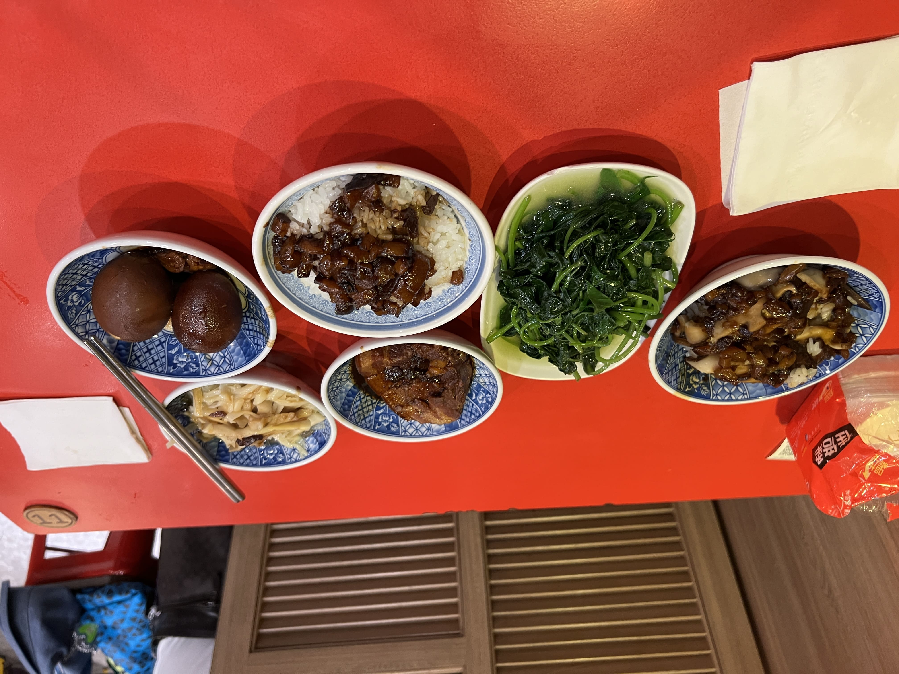
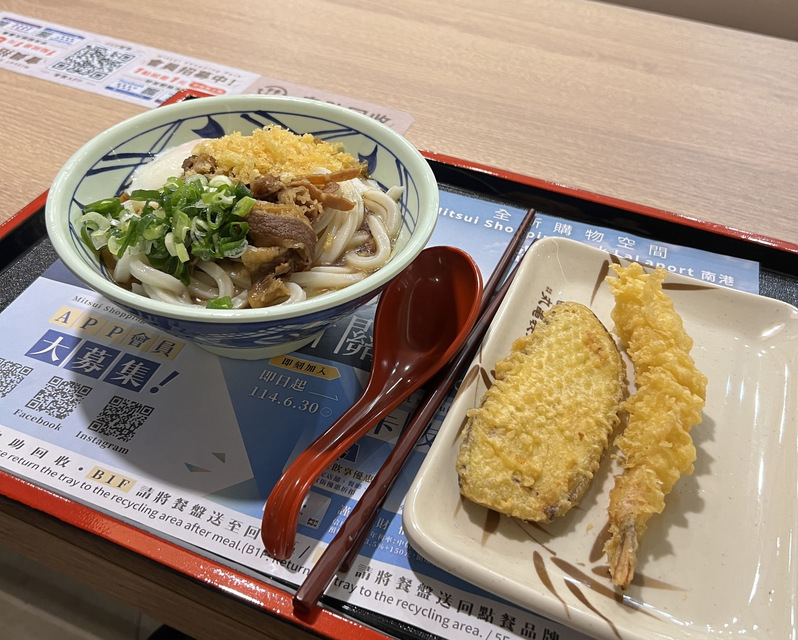
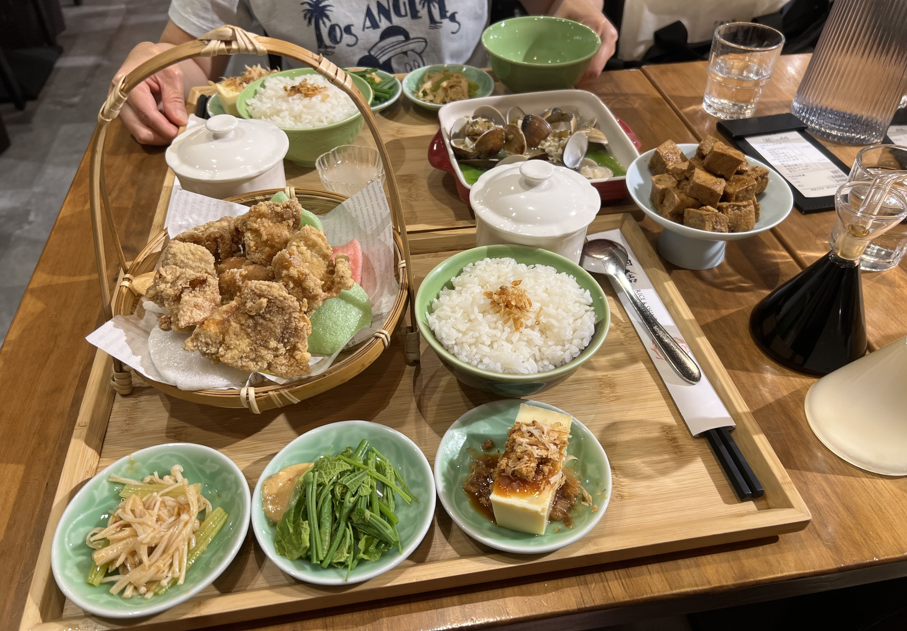
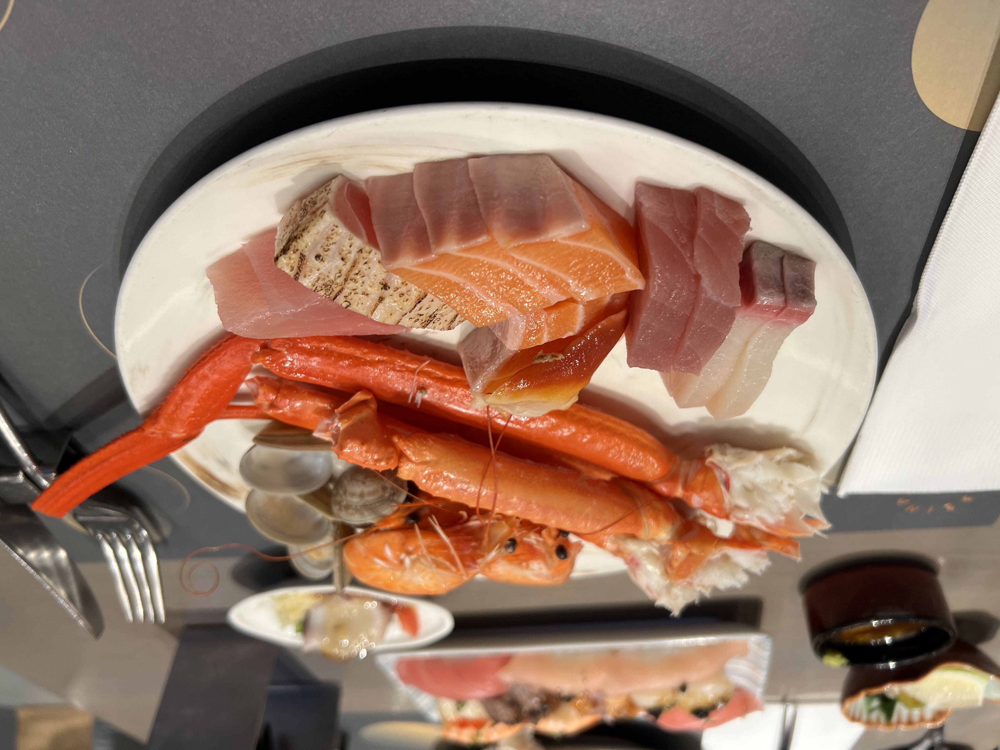
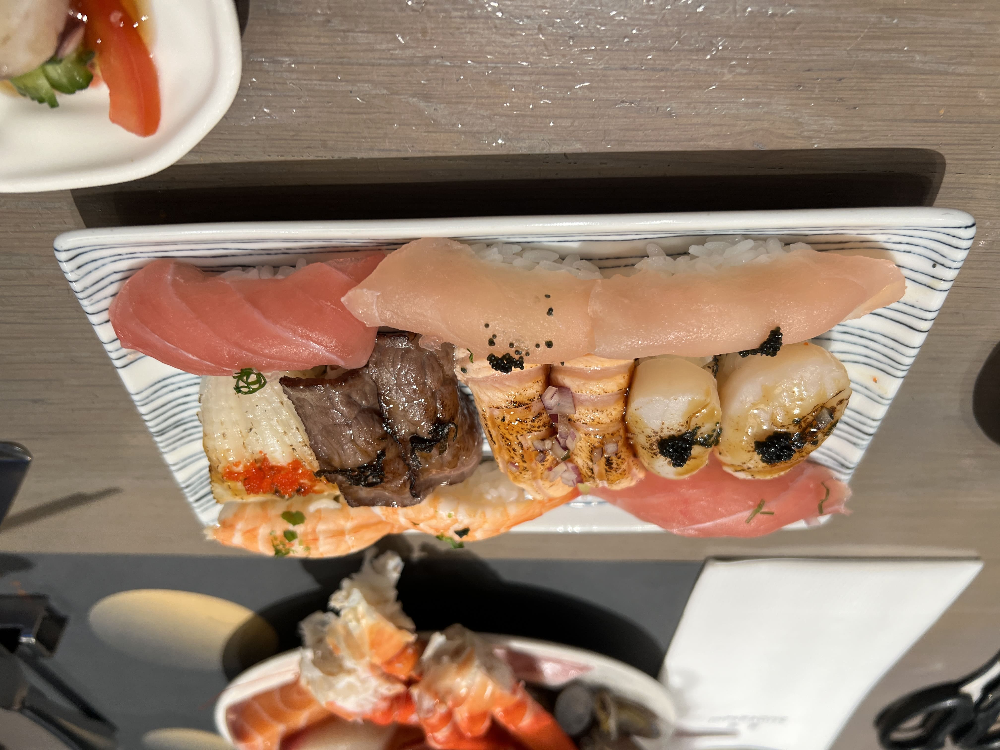
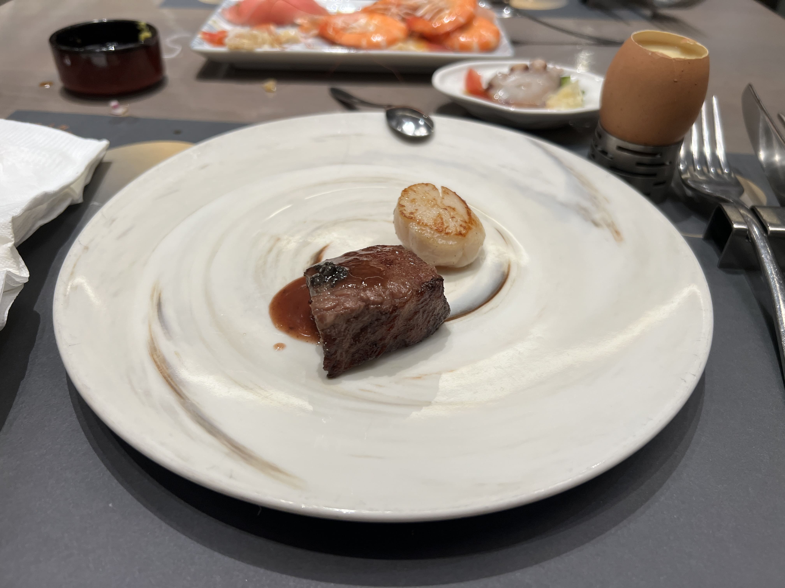
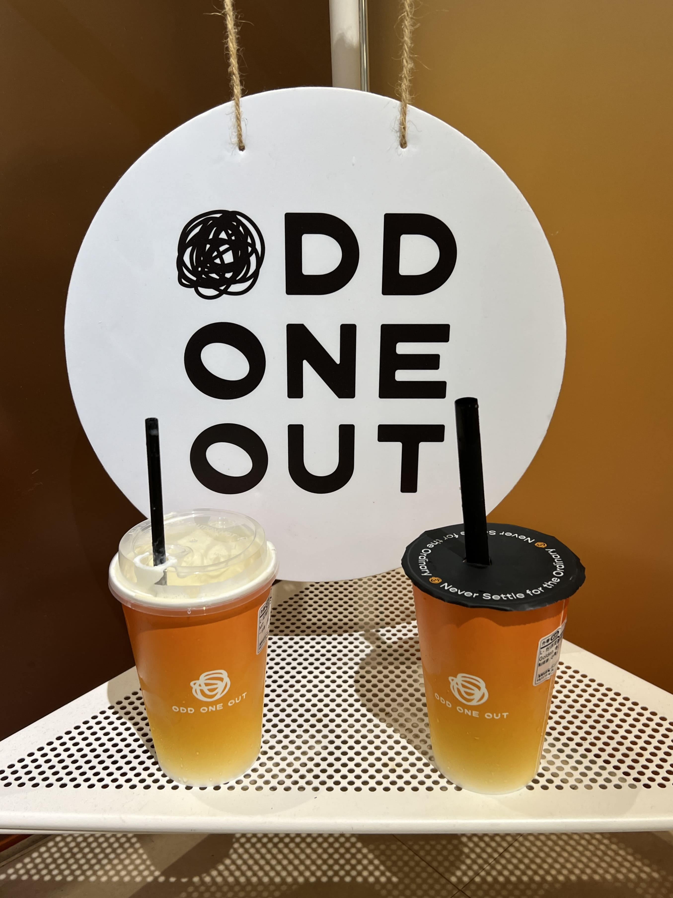

Keeping the trend of posting half a year to a year late, I realized I'll be going to Taiwan again soon and that I should make a post about my PREVIOUS trip to Taiwan before I increase the backlog again. So here goes!

Taiwan, to me, is like my second home, and in seeking comfort, I like seeking out my comfort places as well. Unfortunately that sometimes means that I end up visiting the same places over and over again, and that isn't very interesting for a food blog, so this past trip, I ventured a bit out of my comfort zone to try a few new places.

Here are some of the highlights!

<h2>早餐 Breakfast</h2>

If you've ever asked me for Taipei recs, you know I'm a _huge_ fan of **Zhen Fang Breakfast Sandwiches 真芳碳烤吐司** (see old <a href="/taiwanfavorites">post</a> for details), and that hasn't changed! Even on this trip, Zhen Fang was the very first thing I ate upon arrival. Yup, Taoyuan Airport straight to Zhen Fang (not even an exaggeration). The pork cheese egg toast truly never gets old.

    
    <small>three Zhen Fang sandwiches (two pork, one chocolate) at the Neihu location</small>

If you're looking for a more traditional Taiwanese breakfast though (_dànbǐng_? _luóbogāo_?), Zhen Fang probably won't cut it. They do offer some of those, but their focus is on the toast, so the other items aren't anything to write home about.

So... where to find the classic Taiwanese breakfast? Well, you've probably heard of the world-famous Fuhang Soy Milk, and funny thing is, I've personally never been! As someone who hates waiting in lines and despises waking up early even more, I've never felt the urge to pile onto the tourist hype. I'm sure the food is great, but there are honestly so many classic breakfast places around the city that are extremely solid with no wait at all.

One of these is **Yong He Soy Milk 永和豆漿**, which has locations all over Taipei and sells everything from _dànbǐng_ (savory egg crepe) to pork/vegetable _bāozi_, to _shāobǐng_ and _yóutíao_ and obviously soymilk.

    
    <small>蛋餅，蘿蔔糕，肉包，冰紅茶 at Yong He Soy Milk in Xinyi</small>

This chain is _extremely_ no frills. They'll probably have a menu on the wall all in Chinese, but half the items might be sold out by 9am, so you might as well just ask them what they have left. It'll be good to bring cash, and if you have food-ordering anxiety, practice your script _before_ you enter the store.

If you're thinking at this point, hmm, I roll out of bed at 10 AM every day. Will I still get a chance at breakfast? YES! Find your closest **MyWarmDay (MWD) 麥味登**, and they are _guaranteed_ to be still open and still serving (probably) everything on the menu. I will caveat that their theme is Western brunch, so they'll have a bunch of burgers, hash browns, garlic bread, etc. if you're into that. My personal favorite is the LOHAS meal, which is some fusion between Taiwanese food (black pepper pork chop) and American (salad, egg-wrapped hash browns). It may look a little strange, but honestly it's quite tasty. And don't worry - they still have some Taiwanese breakfast items if you look really hard at the menu.

    
    <small>LOHAS meal at MyWarmDay</small>

<h2>午餐 Lunch</h2>
The sun is high in the sky, sweat is pouring your back, and your stomach is rumbling. What to eat for lunch?

If you're craving _lüròufàn_ (braised pork rice), try dropping by **Wang's Broth 小王煮瓜** in Wanhua District. It is a little bit out of the way, but I promise that once the food is in your mouth, you'll know it's worth it. The place went viral a few years ago, and it also has a Michelin Bib Gourmand. Surprisingly, there was no wait on a weekday around noon, but it was crowded for sure, and we had to share a table with others.

    
    <small>Braised pork rice and other items at Wang's Broth</small>

You order on a piece of paper, and the food comes out quite fast. I don't really remember much about the other items we ordered, but the _lüròufàn_ was HEAVENLY. The pork melted in my mouth, and each bite mixed with rice was bursting with rich flavor. It was truly the best _lüròufàn_ I've ever had, I could've eaten two bowls on my own.

Not a pork fan? In dire need of AC-blasting and not in the mood to be walking the streets with the sun beating down your back? Here I present to you... the department store 美食街 (indoor food court)!

Now, you might be thinking, mall food courts SUCK in the U.S. And, yes, yes, they do. But in Taiwan, the food courts in the department stores are actually not bad. In fact, sometimes they are quite good. For what it's worth, you can find Chun Shui Tang (the place that invented boba) in many different department stores food courts around Taipei. One of the most popular Din Tai Fung locations exists on the bottom floor of Shin Kong Mitsukoshi, a large department store near Taipei 101.

**Marugame Udon 丸亀製麵** is a pretty popular chain around the world for Japanese udon, and they're sprinkled across many food courts in Taipei as well.

    
    <small>Marugame Udon at Lalaport Nangang</small>

I will concede it's not a particularly "special" meal (nor Taiwanese), but nothing really beats cold udon in an air-conditioned department store when it's 100 degrees outside. Plus, I'd say that Japanese food is honestly quite solid in Taiwan, also considering the history...

**Rice and Shine 稻舍食館** is another great option, especially if you're looking for something more Taiwanese. At this time of writing, they have three locations in Taipei - one near Dihua Street in a more traditional restaurant setting, and two in the big Xinyi malls (one in Breeze Center and one in Uni-President).

    
    <small>Rice and Shine at Uni-President Department Store</small>

Their original location at Dihua Street is insanely popular (you either need to arrive at opening or make a reservation), so I was especially excited to see that they had started opening more locations recently. Also, their braised pork is absolutely _delicious_.

<h2>晚餐 Dinner</h2>

A day of sightseeing and shopping concludes, your feet are tired, and you are desperately in need of a fulfilling meal to close the day. Then you remember - your past self had the foresight to plan ahead and make a reservation at INPARADISE at Breeze Center.

_Note: at this time of writing, making reservations to many upscale buffets in Taiwan, including INPARADISE, is geolocked to Taiwan. The restaurant group partners with Klook to allow foreigners to book, pre-paid, in advance, but at a slightly higher price (~$10-15 USD more). (And no, VPN won't let you get around it, since you also need to confirm a Taiwanese phone number.) I'd say it's still worth it, but if you're unsure, keep reading and decide after!_

This buffet is probably the most luxurious buffet I've ever been to - it's definitely on equal footing to the world-famous ones in Las Vegas. There's everything from crab legs to lobster to a generous variety of different sashimi options, and the only thing stopping you from taking 10 giant chunks of salmon sashimi is the servers' restocking speed and the wrath of the guests in line behind you.

    
    <small>Seafood offerings at INPARADISE</small>

For me personally, the most spectacular part of this buffet was that they had an in-house sushi chef making omakase-quality sushi to order! They had more "common" sushi sitting out on plates like the sashimi, but for the fancy ones, they take your order while you're in line, and once you get to the front, they torch what needs to be torched, wrap what needs to be wrapped, and brush what needs to be brushed, right before handing it to you.

    
    <small>Sushi offerings at INPARADISE</small>

In the photo above, the four pairs of nigiri in the middle are from the made-to-order set, while the horizontal ones on the top and bottom edges of the plate are the en masse nigiris that you can grab anytime. Everything was so delicious that I debated getting a second plate, but decided I needed to save my stomach for everything else.

    
    <small>Steak and scallop at INPARADISE</small>

No buffet is complete without a steak offering, and INPARADISE was no exception. The meat was high quality, and I appreciated that the portion size was small enough that I could either go back and get seconds or try other things.

I could go on and on about the buffet, but I shouldn't spoil too much of the excitement here. There's way more sections than what I just listed, such as a dimsum section, a soup and stir-fry section, a skewer section, and much more. I will say that the dessert selection is _endless_, so if you have a sweet tooth, you'll definitely want to check it out.

<h2>奶茶 Milk Tea</h2>

If you still have stomach space after dinner, my newest milk tea recommendation in Taipei is Odd One Out, an unassuming shop at the heart of the Zhongxiao Dunhua shopping district.

    
    <small>Odd One Out in Taipei</small>

They brew each order from scratch, and you can really taste the difference. It's a bit more expensive than the average milk tea in Taiwan, but for the best milk tea in Taipei, could you really ask for more?

_tags: location/taiwan, food recommendations_
