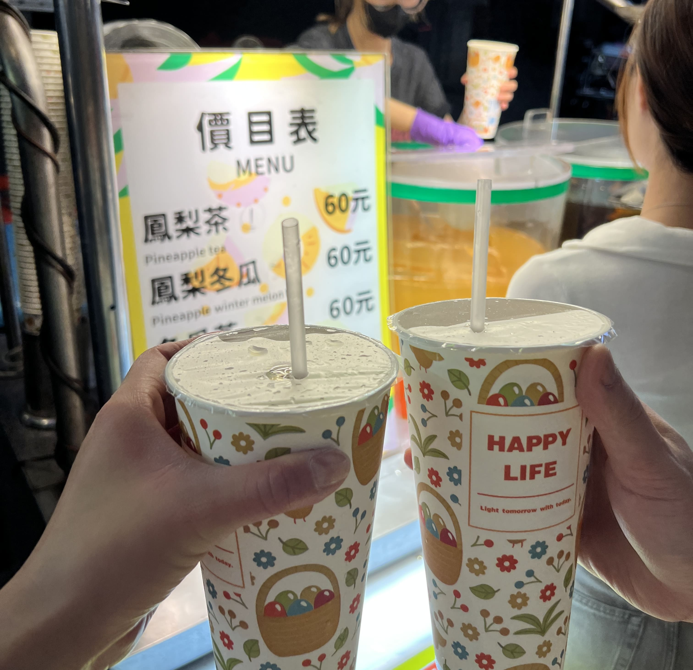
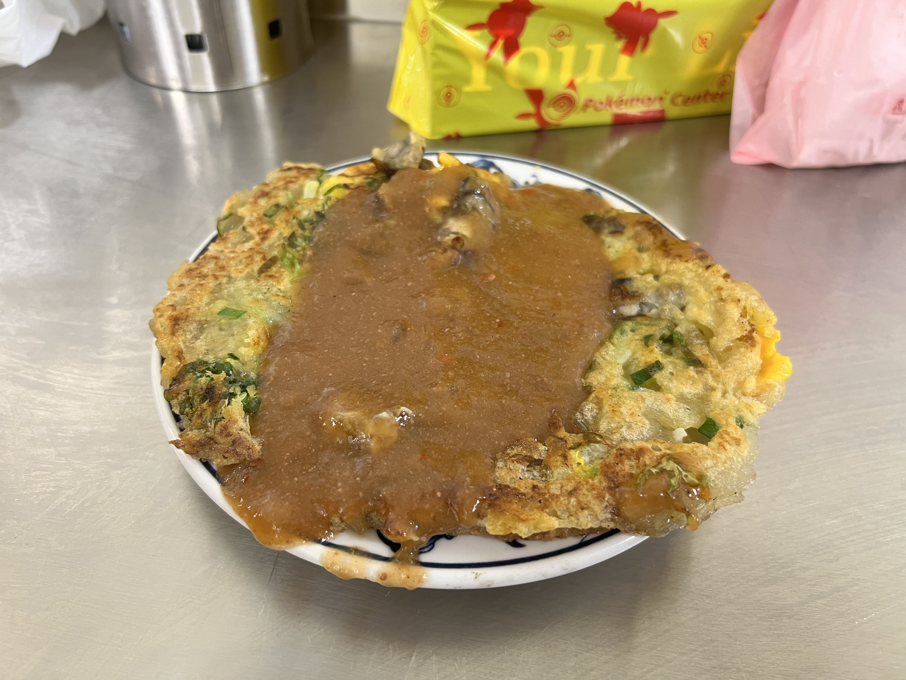
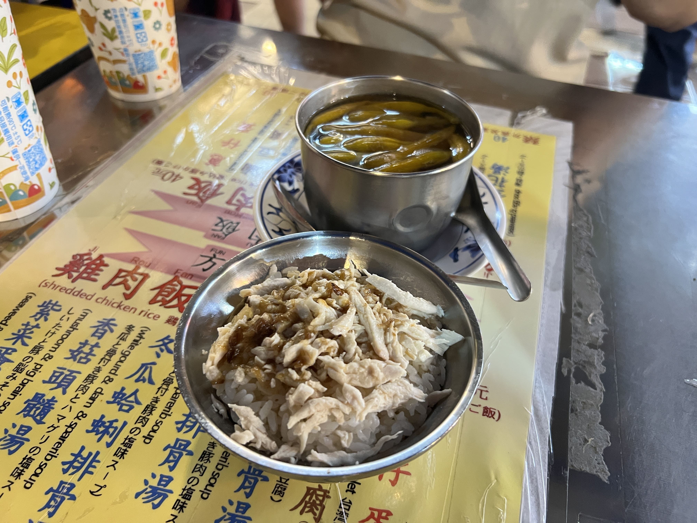
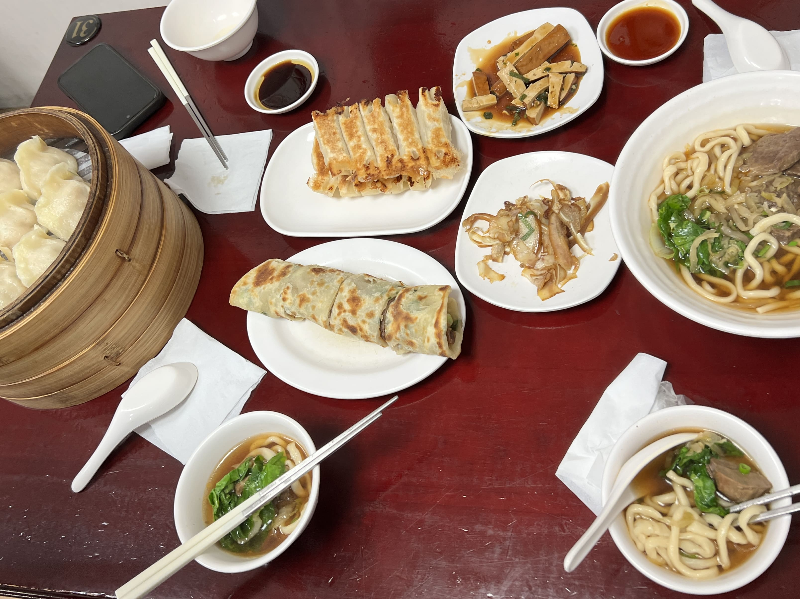
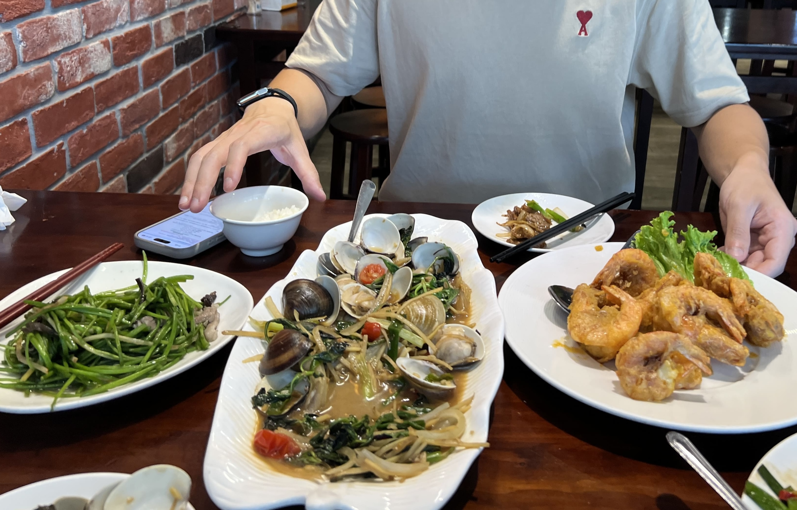

This was my Nth time (where N > 15) in Taipei, and I usually think of it as visiting my second home rather than a true vacation. Enjoyable, predictable, comfortable.

Yet this trip felt different, in many ways. In the first couple days post-arrival, I did what I always did upon arriving in Taiwan - go to familiar shopping areas, eat at my favorite restaurants, visit my favorite boba places. But while they used to bring me comfort, this time, they felt oddly disappointing. My favorite shopping areas now felt underwhelming and uninteresting, and the boba place I’d been waiting a whole year to go back to didn’t feel like it tasted as good as before. At first, I thought that those places and experiences had changed. It took some honest reflection to admit that perhaps I am the one that is changing. _It’s me, hi, I’m the problem it’s me._

In some ways maybe it was also the world telling me that my endless state of nostalgia, and the tendency I have to try to relive the same old experiences over and over again, won’t help me grow. After all, how do I move forward when I’m always looking back?

After coming to this realization, I decided to reject the old and accept the new (or rather, less-traveled). We stopped by Yongkang Street, which I’ve only been twice in the past decade. We also decided to visit Dadaocheng (but first stop by Zhongshan to pick up boba), and unintentionally discovered some side alleys in Zhongshan that had some _insanely_ good thrift stores (that we’d never come across before, or they might’ve also been new). Long story short, we never ended up making it to Dadaocheng.

We tried a few new boba places. Some of them were pretty mid, but one was actually really good (called 青山 Peak Tea at Yongkang).

We also went to Ningxia Night Market, which I’ve actually never been to (I know, crazy). I’d always heard it was small and thought it wouldn’t be worth it compared to Raohe or Shilin. But after visiting this time, I found that I actually _really_ liked it. It didn’t feel as crowded and suffocating as Raohe started becoming in recent years. There’s a stall there that sells pineapple wintermelon iced tea 鳳梨冬瓜茶 (which I know sounds weird but is somehow shockingly delicious) and an oyster omelet place right outside the entrance (賴雞蛋蚵仔煎) that has the freshest oyster omelets I’ve ever tasted.

    
    <small>Pineapple wintermelon tea 鳳梨冬瓜茶</small>

 

    
    <small>Lai Ji Oyster Omelet 賴雞蛋蚵仔煎</small>

We had such a great time that we came back the very next day to get the pineapple wintermelon iced tea _again_. And we also got to eat the famous chicken rice at 方家雞肉飯, which was closed the day before. It was my first time trying it and I'll have to say... one bowl was not enough!

    
    <small>Chicken rice 方家雞肉飯</small>

Night markets aside, another culinary highlight from this trip was the famous basement dumpling house Ding Hao Zi Lin 頂好紫琳蒸餃館. They're known for their steamed dumplings, but I actually liked the beef noodle soup the most - the noodles were reeallly QQ and the broth was fragrant without being greasy. I also loved the beef rolls 牛肉捲餅 - I ate them all the time as a kid but not as much in recent years, so it was very nostalgic (and tasty).

    
    <small>Lunch at Ding Hao Zi Lin</small>

We only spent about 5 days in Taiwan this time before heading to Shanghai and Fukuoka (will write posts about those soon!) but we returned briefly at the end of the trip for a couple days before flying out.

On our very last day in Taiwan, after having already spent 3 days in Shanghai and almost a full week in southern Japan, all we wanted was a taste of home. We found a random 熱炒 place in Xinyi District (so we could do some final shopping afterwards) that met the sole criteria I had that day - they needed to have 水蓮菜 white water snowflake on the menu.

Upon arriving, we realized it wasn't just simply a stir-fry restaurant - in fact, they were primarily a seafood restaurant. So we ordered the best of both worlds - stir-fried clams, stir-fried shrimp, 水蓮菜 (obviously), and a beef-onion stir-fry.

    
    <small>Lunch at Da Wan Ma Tou 大灣碼頭</small>

The last one we definitely could've gone without, and the beef was a little tough. (In hindsight, why order beef at a seafood restaurant?) But let me tell you, those clams were really something - HUGE, juicy, and bursting with flavor - unlike any stir-fried clams I've ever had. And the stir-fried shrimp was amazing as well - we got it with salted egg yolk, the shells were fried so thin and crispy that I could just put the whole thing in my mouth and savor the saltiness of the yolk mixing with the fresh ocean taste of the shrimp. The white water snowflake was what I'd expect - crunchy and refreshing, but the two seafood dishes really stole the show.

(I'll also note here that both the stir-fried clams and stir-fried shrimp were not on the menu for some reason, but we asked about them and they said we could still order it. FYI if you end up going!)

I’m trying to be more okay with trying new things and more okay with letting go of old things. Change is not easy, but chasing nostalgia will never get me anywhere. Instead of attempting to recreate old memories, I need to focus on creating new ones. _After all, life is short, tteokkbokki is long._

_tags: location/taiwan, food recommendations_
