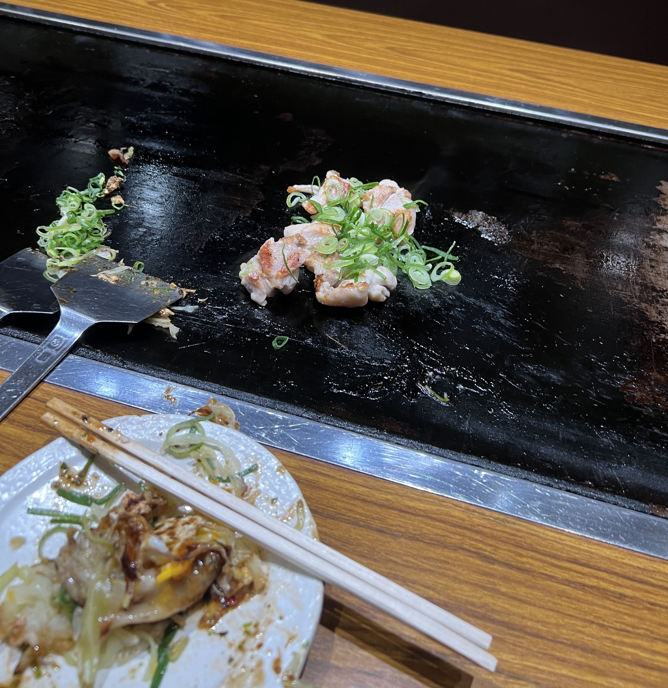

So it appears that I have a bad habit of posting these trip recaps over half a year late (and backdating the post timestamp) but I've decided to become more honest going forward. Better late than never, so here we are!

I trekked through Japan back in April of this year, through Tokyo, Kyoto, Nagoya, and Nara, the latter three cities of which I explored completely by myself (my first solo trip!). It wasn't my first time in the country, but previous times had always been with my family, so this time I had the freedom to eat whatever I wanted, whenever I wanted. Without further ado, here are my Japan food reviews in non-chronological order, from worst to best, judged not solely on taste, but also on vibes.

(Disclaimer: "Worst" in Japan is by no means _bad_... as you know me, I only select for places that look reasonable with good reviews, and Japanese food is for the most part quite _good_, so even the last few places in this list are quite decent by regular standards!)

<h2>12. Gion SoBar, Kyoto</h2>

    

Tucked away on the basement floor of a small building on a side alley off of Shijo-dori, this unassuming soba place was the only restaurant in the area my friend and I could find that was still open at 3pm for a late lunch, after a morning of battling through the crowds at Kiyomizudera temple. Upon walking in, we were met by slight chaos - a singular waitress appeared to be scrambling around, struggling to tend to all the customers while also washing plates and bowls because there weren't enough, refilling water and taking orders. As such it took a while for water to reach our parched throats and for our orders to be taken.

I got a standard zaru soba with tempura. Everything was reasonable and fine, but nothing stood out in particular to me. If I was stuck in Gion at 3pm again looking for lunch, I might go here again, but at an earlier hour I would probably elect to try something different.

<h2>11. Arashiyama Rilakkuma Tea House, Kyoto</h2>

    

I was a huge fan of Rilakkuma in middle school, resulting in a vintage(?) collection of about twenty various-sized plushies sitting in storage back in my childhood home. Thus I found myself loitering around the Rilakkuma Tea House after a morning in Arashiyama Bamboo Forest and the Monkey Park, waiting for the cafe doors to open for lunch.

I got the Korilakkuma omelette rice. The rice korilakkuma was placed immaculately on the omelette pillow, swimming in a tangy tomato-based sauce. By all means, the visual execution was perfect. Very cute, very instagram-worthy. Taste-wise, it wasn't something that I'd particularly like to try again, is all I'd say.

    

Also, eating the rilakkuma brought me a kind of subtle sadness that I cannot quite put into words.

<h2>10. Saboten Skytree, Tokyo</h2>

    

So I've never been a huge lover of tonkatsu - as such, take this review with a grain of salt. I like it paired with other things (like in curry), but katsu by itself always feels a bit plain to me, even with katsu sauce. Saboten is a pretty reliable, relatively inexpensive choice for decent katsu, and there are branches all over the city. If you're craving a good tonkatsu set and don't know where to go, it's a safe bet. If you're looking for something special that you can't get outside of Japan, I'd suggest you look for something more local.

This meal felt similar to other katsu meals I've had in Taiwan and NYC. The meat was tender, and the side dishes were pretty good. Nothing mindblowing, but nothing about it was bad either.

<h2>9. Spaghetti no Pancho, Tokyo Shibuya</h2>

After watching First Love on Netflix in the beginning of 2023, I had been craving a good Napolitan pasta. I've attempted making it myself a couple times, but I was dying to try it for real in Japan.

I hunted down Spaghetti no Pancho, a no-frills kenbaiki chain popular with office workers for a quick lunch spot. They had napolitan for about 800 yen, served on a big heaping metal plate. My friend got two portions (one napolitan, one omurice) in fear of not having enough food - the fears were unwarranted, and the decision was quickly regretted (too much food).

    

It was very saucy, moreso than I imagined (the ones I made at home were more dry), and I wished they had added a little bit more ingredients in the mix, since after a while the one-dimensional flavor felt a bit overpowering. Nonetheless I was glad I got to experience the First Love dish in authentic form, and the vibes of the restaurant were very peculiar and refreshing (almost American diner style, with self-serve parmesan and hot sauce and red-white checkered tabletops). The food was good value and everything was prepared as described, and there were many different menu items to choose from.

<h2>8. Yakiniku Bungo, Kyoto Saiin</h2>

    

I spent a dinner at the end of a long touristy Kyoto day at Yakiniku Bungo, a yakiniku branch tucked away on a side alley near Saiin Station. The place seemed pretty popular with the locals but I would never have found by myself if not for my friend (a local). The interior was sleek and clean while still maintaining a traditional Japanese aura. The restaurant is famous for their _horumon_, which is essentially organ meats (intestines, stomach, liver, heart). Unfortunately I don't particularly enjoy eating any of those, so I stuck with the basics - beef ribs, beef tongue, etc. There wasn't a very wide selection of non-horumon meats, which makes a lot of sense, but I felt I would have enjoyed the restaurant a bit more if I liked eating those things.

Nonetheless the things we _did_ order were quite good, and I could tell the meat was high quality. Service was great, and the atmosphere was quiet enough to have lively conversation, but not too empty either.

<h2>7. Maruya Honten, Nagoya Station</h2>

Nagoya generally isn't at the top of a foreign tourist's itinerary, so why was I there, may you ask? Well, I am not the average tourist. I am, however, a gigantic Studio Ghibli fan, and Ghibli Park happens to be in Aichi, and the only way to get to Aichi from basically anywhere else in Japan is to take a bus or train from Nagoya Station.

So in a very roundabout way, I found myself in Nagoya at 6pm on a Thursday night, after a very exciting (but tiring) day at Ghibli Park. I had heard that the city was famous for its automobile industry as well as its hitsumabushi (grilled eel rice), so I found myself trying out the latter at Maruya Honten, a famous hitsumabushi chain.

There are two Maruyas in Nagoya Station, by the way, one in the JR station and one in the train station. I wasn't that hungry so I dilly-dallied around the area for a bit, and when I was finally ready to eat, I headed into the JR one, asked for a table for one, and opened the menu. To my confusion, there was no eel to be found. No hitsumabushi. At Maruya, the famous hitsumabushi chain? I closed the menu, looked closer at the restaurant name, and realized I _wasn't in Maruya_. I was in _Maruha_. My tired eyes had seen the まる and I'd walked straight in without even finishing reading the whole sign.

After a solid five minutes of panicking on how to extract myself from this situation politely (because I was _not_ going to leave Nagoya without trying my hitsumabushi), I hurriedly got up, blabbered something in broken Japanese to the waitress about how I forgot something somewhere and had to go find it, and ran out of the restaurant.

At that point I was about equidistant from the real JR Maruya and the non-JR Maruya, so I headed to the non-JR one instead, hoping I'd have better luck. The moment I saw the long line of customers sitting outside the restaurant, I knew I had made a mistake dilly-dallying so long outside. I waited approximately another hour before finally getting seated.

    

Upon serving me the hitsumabushi, the waitress explained that I should first eat the eel and rice alone, then with the toppings (green onion, wasabi, and shiso leaves), and then with the dashi broth. The dashi broth version was probably my favorite, but the natural flavor of the eel rice definitely spoke for itself. I was also pleasantly surprised by the shiso flavor with the eel.

Two takeaways from this experience - read the whole name of the restaurant -- and go early.

<h2>6. Washoku Ichijo Higashimuki, Nara</h2>

My day in Nara was probably the only time in Japan I had to stretch my two years of Japanese language training to the absolute limit. All the restaurants I'd been to in Tokyo and Kyoto had semi-English-speaking staff, English menus, or at the very least, cellular signal so I could translate on my phone. Washoku Ichijo Higashimuki had none of these, and the menu was one of those handwritten, barely-readable ones scrawled on paper and covered in a laminated folder.

I could read approximately three things on the menu, and one of them was ステーキ (steak), which I had been wanting to try anyways (the Japanese version, not in general), so I ordered it.

    

This was probably the highest value-cost ratio meal I had in Japan. I was super hungry after a morning of feeding deer and exploring the town, so I devoured everything pretty quickly. The marination on the steak was perfect and the tofu side dish was pleasantly refreshing. The steak could've been more tender (a few pieces were too tough to chew) but for 990 yen (~$6.59 USD) I wasn't about to complain. It was also one of the few restaurants that wasn't a big chain, so I liked the local and authentic feel.

<h2>5. Ichiran, Kyoto Kawaramachi</h2>

You can never really go wrong with Ichiran. I've had it in Tokyo, Taipei, and NYC (although the American version is not as great), and on my last day in Kyoto, I decided to have it there too. There was a small wait at dinnertime but I got seated pretty quickly in around 20 minutes.

    

The noodles were perfectly chewy, the broth-topping-noodle ratio was immaculate, and the marination on the ajitama was absolutely lovely.

    

And if you've never tried their matcha almond pudding, you _have_ to!

<h2>4. Hanamaru Udon, Tokyo Meguro</h2>

This one's another classic. The last time I had Hanamaru Udon was in Harajuku in 2019, and I remember being blown away by the sheer amount of options, the low prices, and the cute little self-serve tempura bar. Definitely one of those student-budget-friendly counter-serves that never really get old.

    

This time I got a cold niku udon and a heaping plate of tempura (that I couldn't end up finishing). There's something really comforting about a great bowl of udon after a tired day, and it's frustratingly hard to find really authentic, well-made udon in the states (what's with all the weird fusion? all the limp, soggy noodles that disintegrate in the broth?), so I was especially relieved that Hanamaru was exactly the same as I recalled.

<h2>3. Teppan-izakaya Ittetsu, Kyoto</h2>

I found this unassuming teppanyaki place near Kyoto Main Station on my second to last night in the city because I was about to lose my mind if I didn't have teppanyaki at least once during this trip. Upon walking in, the waitress noted my fashion choices and immediately started speaking to me in perfect English (lol).

I will say, this is not really a restaurant for solo travelers - all the tables are _really_ big, and I felt bad taking up an entire six-person-looking table just for myself.

Nonetheless, the food blew me out of the water. The beef and chicken were so good, I had to order another round (even though it wasn't cheap). I can't even explain why it was so mindblowing; the marinade? The natural taste of the meat? The cuts? All of the above, probably. The okonomiyaki was also impressive - I usually don't enjoy it that much, but this one was probably the best one that I've had.

    

It was intriguing to me that even though the sizzling plate is in front of you, the chef actually cooks it in this little exposed nook next to the bar before the wait staff brings it to you.

I would definitely want to visit again with more people next time.

<h2>2. Mare, Kyoto</h2>

Mare was a friend's recommendation, and I visited it on my first night in Kyoto. The restaurant was pretty empty save for one tourist couple, and they initially sat me at a table, but I mustered up the courage to be moved to the bar (where I could see them assembling the dishes).

I didn't really know what it was other than the fact that my friend said it was very good, and that they served wagyu. After trying out hitsumabushi a few days later in Nagoya and noting the similarities, I retroactively realized that this was essentially a fancy beef version of hitsumabushi, which they sometimes call _wagyu hitsumabushi_ or _gyu hitsumabushi_.

    

The beef was probably the best wagyu I've ever had. Each bite was mesmerizing - tender and flavorful and fatty but not too fatty, and by the time I finished and was full I still wished there was more. The little piece of raw wagyu confused me at first, but from inferring from the waitress's rapid-fire Japanese, I understood that I was supposed to "cook" it in the hot dashi broth for a little mini-sukiyaki. Let me tell you - that stuff was _amazing_.

<h2>1. Sushi Tokyo Ten, Tokyo Shibuya Stream</h2>

I hate to be mainstream, but Sushi Tokyo Ten definitely took the top spot in this list. First of all, I had to make a reservation months in advance. Second of all, Shibuya Stream is just such a beautiful place to be, both visually and aurally. Third of all, each piece they served was simply so fresh, the timing in-between courses was perfect, the atmosphere was lovely, and the overall experience was just pleasant and delicious.

    

Here are just a few of the delicacies I was served that day. They also had baby squid, uni, ikura rice, smoked cod, and various other cooked and uncooked dishes. My favorite was probably the toro, but everything was actually just fantastic.

---

So this concludes my food-centered Japan trip recap. If you made it this far, I'm glad that this piece was entertaining enough to keep you. You might've also noticed that this blog post differs a bit from my previous posts, both in sheer length and also in content.

I think I often struggle with leaving "negative" reviews on things, so in the past I would just omit them. There's not a single post on this blog where I say "do not go here, it was terrible, I hated it, blah". But I realized at some point that a food review blog is useless if there is no differentiation between what is better and what is worse.

This post was my attempt at a fuller, more honest review on how I truly felt about each of these dining experiences. I still hold my stance that unnecessary negativity is, well, unnecessary, but in comparing different restaurants and dishes, I should be able to say which one was more or less delicious and why.

So that being said, did any of these restaurants catch your eye? Any additions to the must-try list, or no-try list for that matter?
