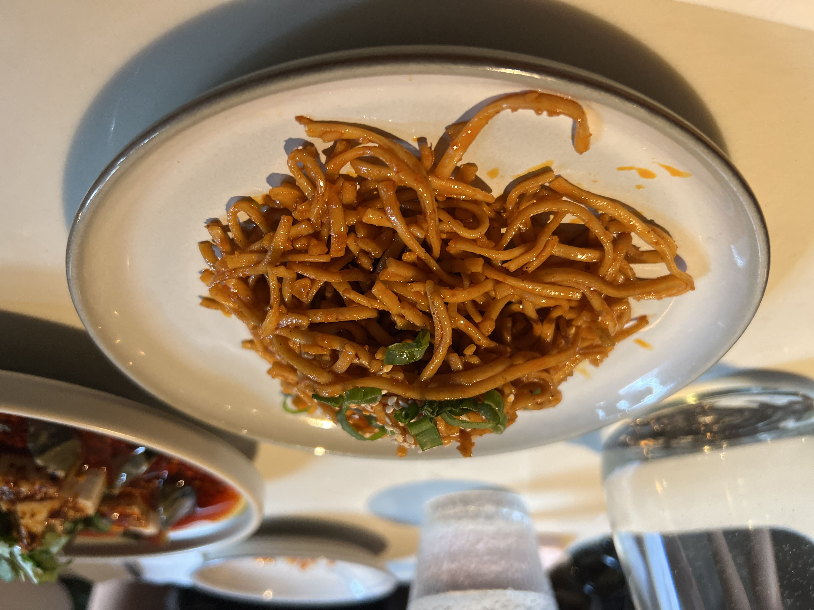
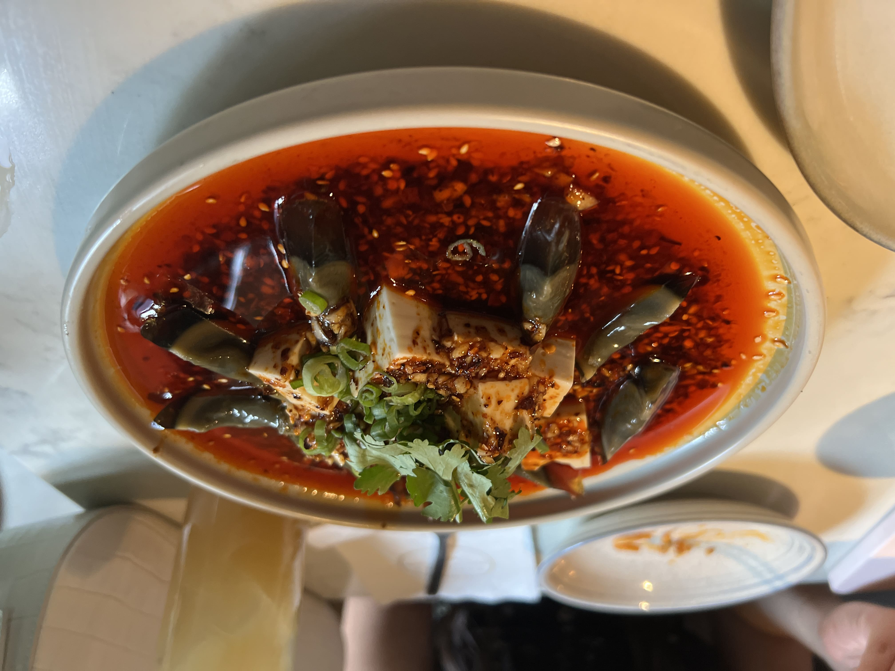
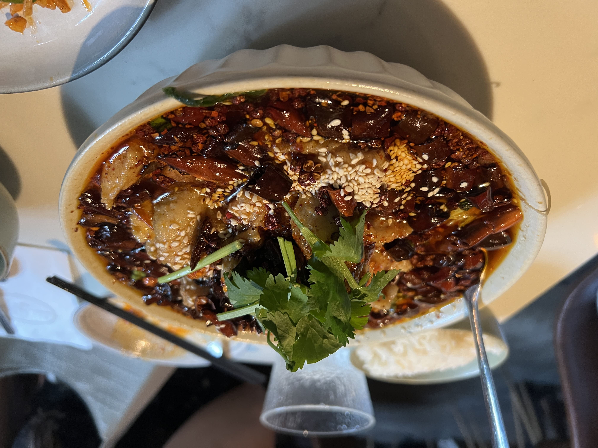
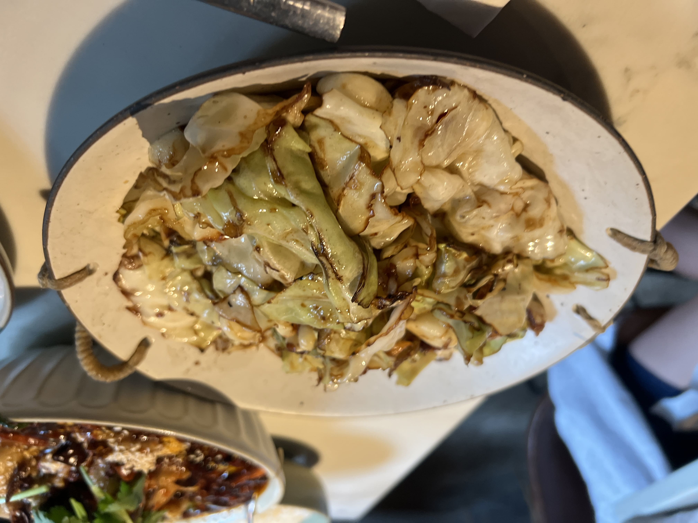

Last summer, I went to Antidote in Williamsburg for the first time. I'd heard about it a couple times before, and I figured I'd make the trek down to Brooklyn since summers in New York are for exploring.

I had seen its glowing reviews on Google, but I was _really_ not prepared for how absolutely delicious everything was. We ordered four dishes and not a single one of them was disappointing. From the get-go, the sesame noodles had such a wonderful umami flavor (despite looking a little plain) and I couldn't get enough of it.

    

The preserved egg with tofu was probably my favorite of the night, but it was honestly really hard to pick favorites. In the past I've never been a huge fan of century eggs, but this dish was actually one of the best things I've ever had. The silky, soft cold tofu balanced out the chewiness of the century eggs, and the chili oil sauce was just the right amount of spicy and savory. The whole dish was a perfect mix of hot and cold. 

    

Next was the fish in chili oil. This is usually one of my favorite Sichuan dishes, and you really can't go wrong with it. My favorite thus far had been the one at Szechuan Mountain House (which is pretty damn good), so I was excited to try this one, but not expecting _too_ much. Surprisingly, Antidote had a very different take on this very traditional dish. I was pleasantly blown away by the different flavor profile - a slight tanginess, which contrasted nicely with the spiciness and oiliness. The more I ate the more I realized that this was a really strong contender for my favorite version - I'll have to try it again to make sure, but Mountain House's first place position is looking a little shaky!

    

The last dish to land on the table was the cabbage. Simple yet executed well, it was a nice bit of crunch and balance to the other heavier, spicier dishes. 

    

Honestly, this place just blew me away from how good every single dish was. Williamsburg might be a bit of a trek for me, but I'm definitely going back!

_tags: location/nyc, antidote, williamsburg, brooklyn_

