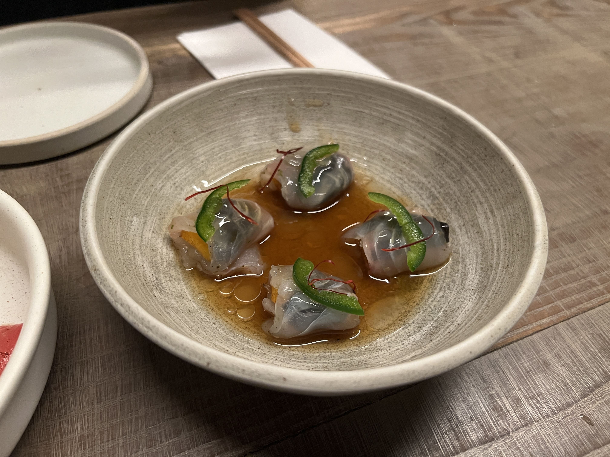
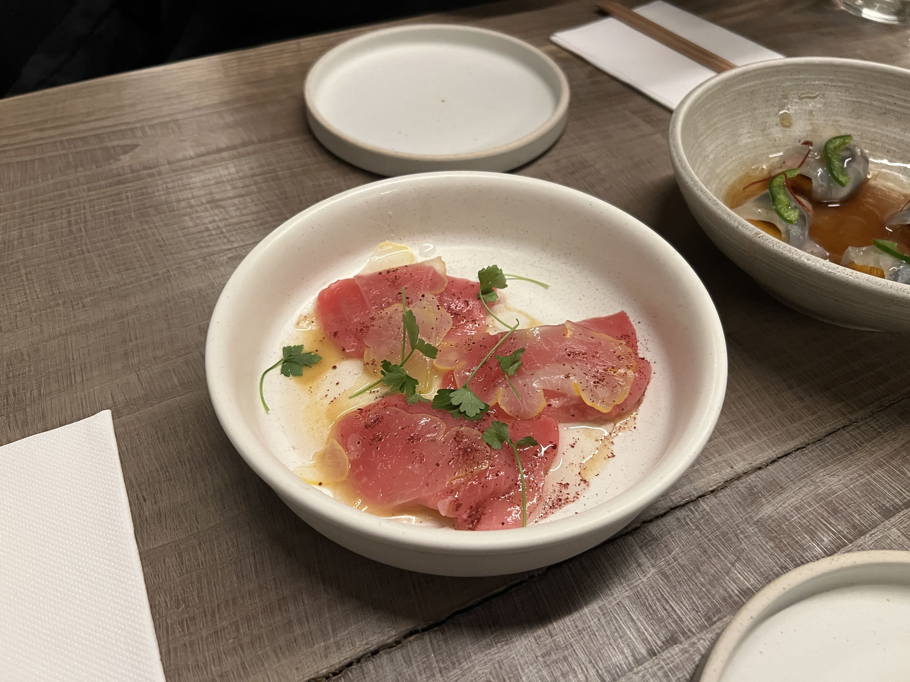
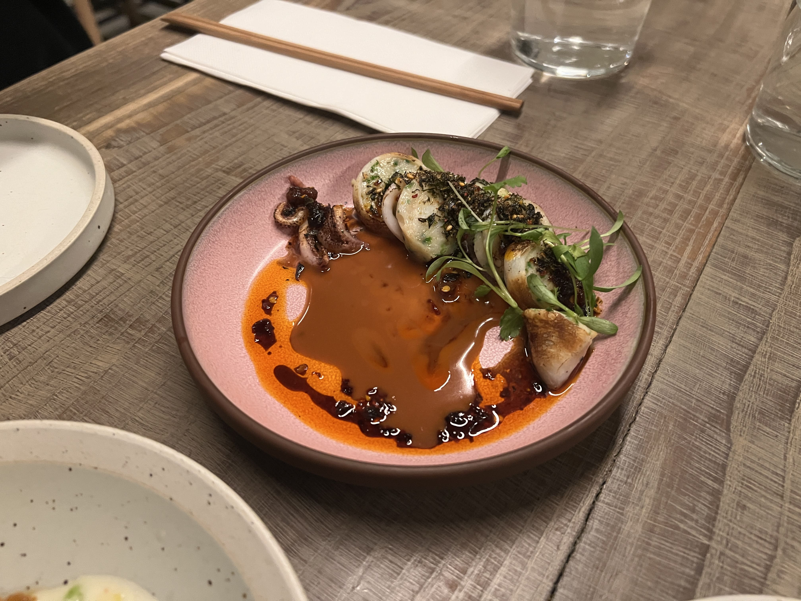
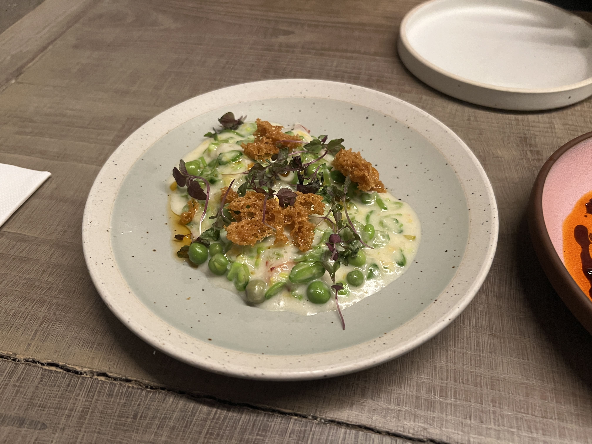
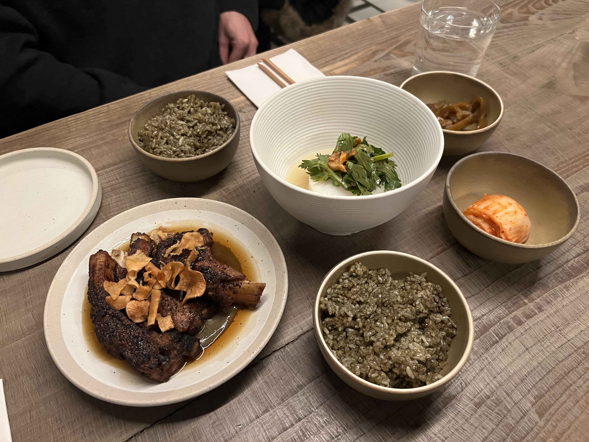

For Valentine's Day this year, my partner and I went to Atoboy, the sister (read: more affordable) restaurant to Atomix, which has two Michelin stars. Atoboy itself doesn't have Michelin stars, but is a Bib Gourmand restaurant as well, and has a prix fixe menu of $75 per person, as opposed to Atomix's ~$300 pp.

For a Friday night that also doubled as V-Day night, the restaurant had a good amount of diners. We were seated close to the back on these bench-looking tables. The menu seemed to have some staple items as well as some seasonal, and although it was prix fixe, you could pick an item from each section, and certain premium items would have an additional surcharge.

For the first course, there was only one item in the section, so we both got the sea urchin (not pictured here). It was a tiny appetizer-like dish which was refreshing despite the richness and umami of the uni layered on top.

The second course was a cold dish, and we got the bluefin tuna as well as the fluke. In this section, the tuna was the "premium" item with a surcharge of $4, but ironically we both liked the fluke way more.

    

It was juicy, tart, and had a nice kick to it. The marinade had fully penetrated the fish without being overly salty, and the sweet persimmon wrapped inside was a wonderful touch.

    

The tuna was also not bad, but felt considerably outshone by the fluke. Whilst the fluke was soaked in a flavorful marinade, this bluefin tuna dish relied more on the natural flavor of the fish. It was obviously very fresh, but after having the extremely umami fluke, this one tasted a bit bland.

Next up was a warm dish course - we got the squid and the sweet shrimp.

    

The squid was prepared to look like soondae (blood sausage), in the way the rings of squid were stuffed with shrimp filling. This was a heavier, spicier dish, and it brought nice contrast to the lightness of the previous courses. It felt almost street-food-esque, like something I could buy in a paper tray in the streets of Myeongdong.

    

The shrimp dish (pictured above) was rather an enigma at first - where was the shrimp? This looked like pea soup! Strangely, this dish was actually my personal favorite. Bathed in a French-inspired butter sauce so thick it resembled a stew, the comforting, multi-textured bites felt like an elevated clam chowder - you can't really tell what's inside, but it tastes phenomenal.

Finally, it was time for the heartier "main" courses.

    

We got the pork galbi and the cod, and it also came with gim rice and kimchi. The pork galbi was tender, fall-off-the bone delicious, with a smoky flavor that filled your mouth with each bite. The gim rice was unironically an experience in itself - the seaweed made it seem like you were tasting the ocean.

The cod was, to be frank, a bit disappointing. We had high hopes given this was one of their top-rated dishes, but it was quite bland compared to everything else we had (maybe our palates are not refined enough?) I will say that the presentation of the cod was lovely - it was plated like a round cross-section of radish, like a work of art.

Last but not least, it was time for dessert. This was not part of the prix fixe, but given the raving reviews online, we felt that the goguma ice cream was worth a try.

    

It was certainly an interesting dessert! The three ingredients listed - chestnut, date, and black tea - could all be differentiated clearly in the flavors, and they melded together in a very harmonious way (despite me not particularly liking dates at all). Although it was a pricey item (an extra $20 just for one "scoop"), I would definitely recommend trying it if you like cold desserts.

Overall, our experience at Atoboy was positive. Some of the dishes were phenomenal (the shrimp, the fluke), some were above-average good (the squid, the galbi, the ice cream), and a few we could've gone without (the tuna, the cod). Some day, perhaps we'll be willing to shell out more to try Atomix!

_tags: location/nyc, fine dining, korean fusion_
