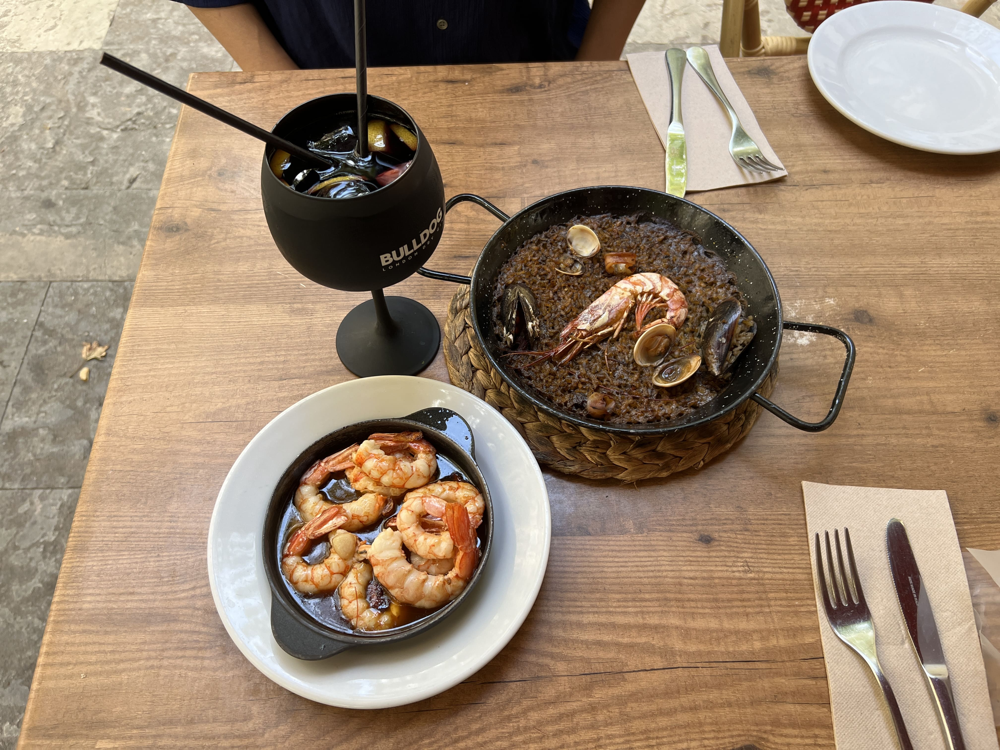
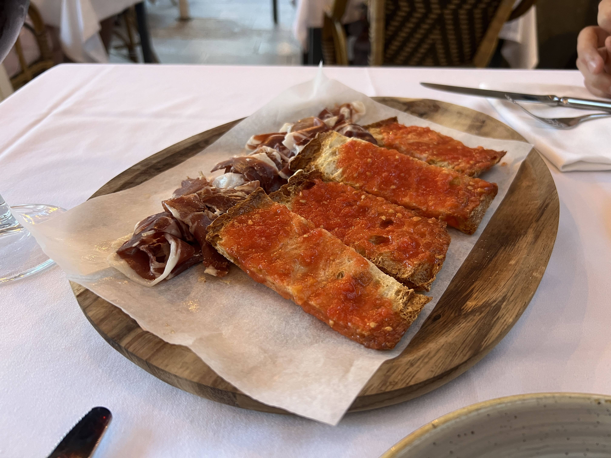
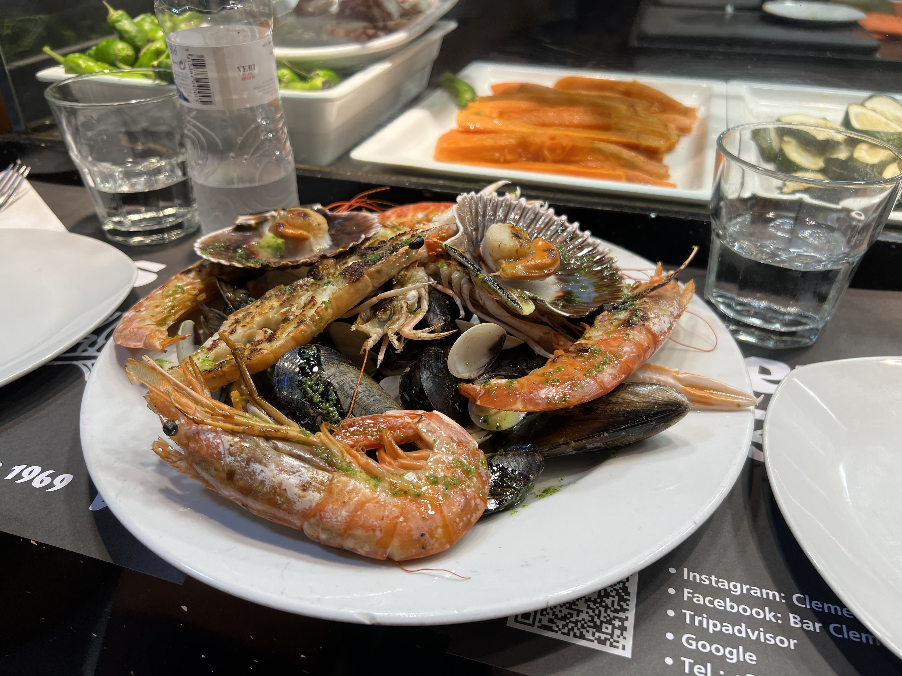
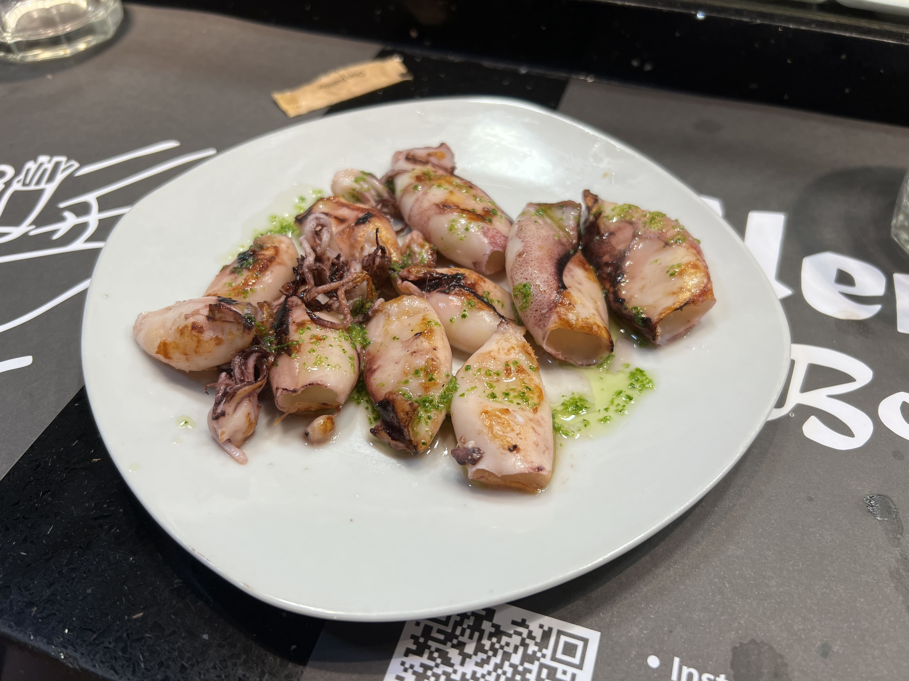
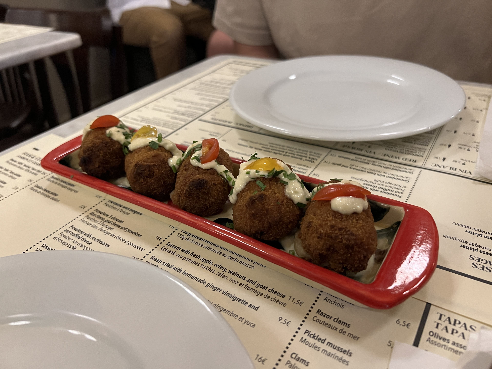
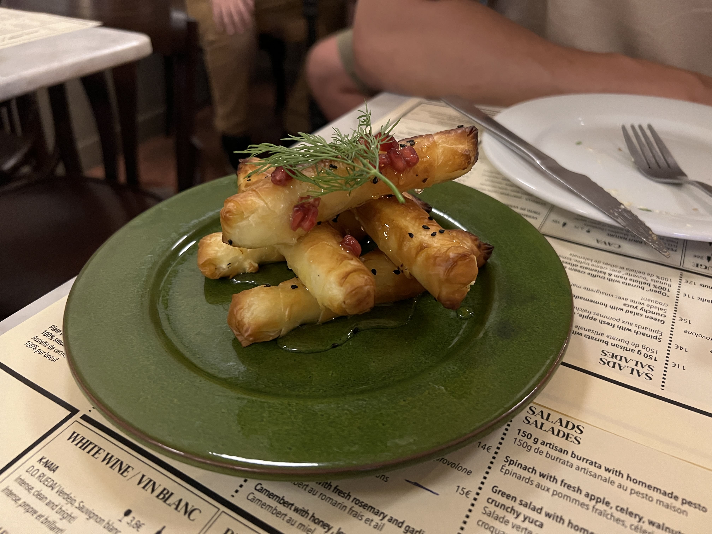
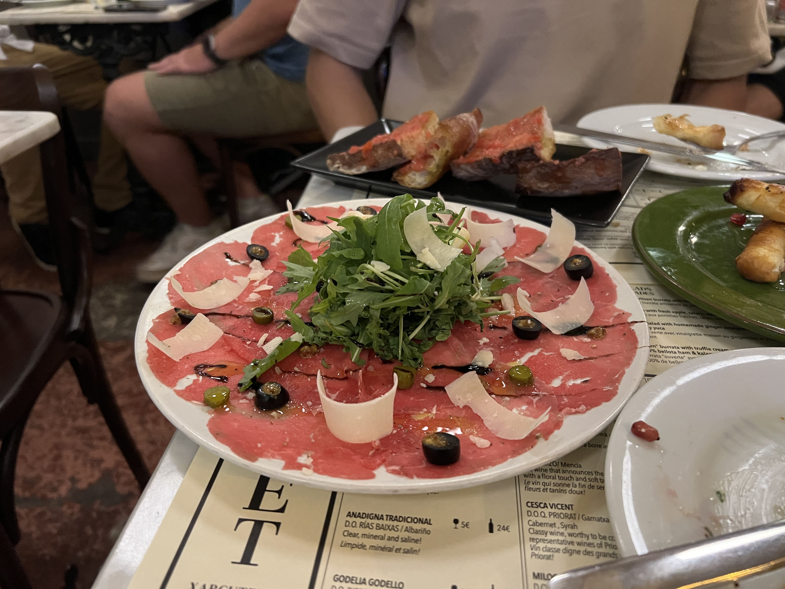
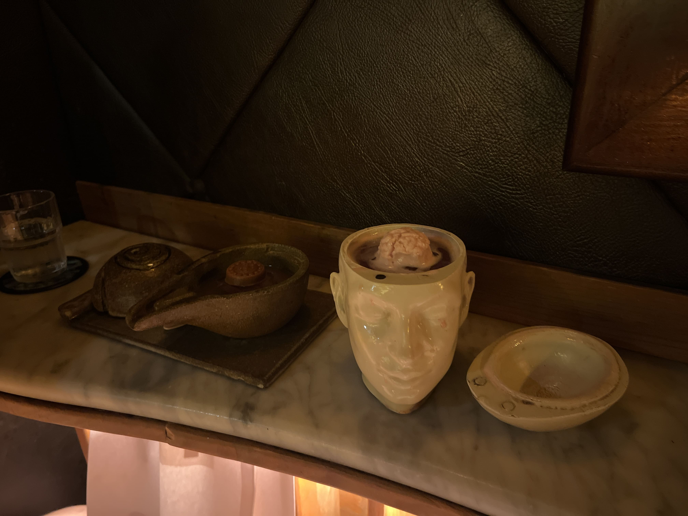
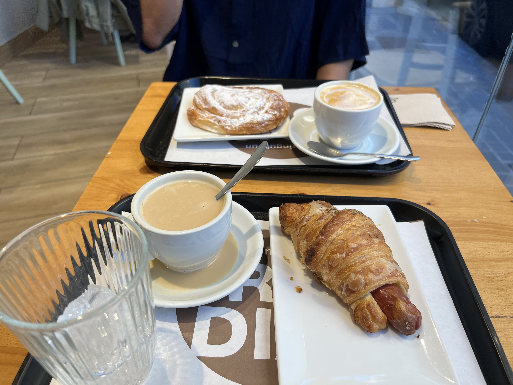

The very first time I traveled to Europe was in 2023, where I visited Amsterdam, Paris, and Geneva. To be honest, the vibes and company (large group of friends) were great, but the food wasn't particularly memorable with the exception of Kodawari Ramen in Paris, which I <a href="/kodawari">wrote about</a> back then. We didn't plan far enough ahead to book anything fancy for Paris, and Amsterdam and Geneva aren't particularly known for their cuisine (no offense).

Last summer, I visited Lucerne/Grindelwald in Switzerland, Barcelona, and Paris with my partner. I will not be writing about Switzerland this time (no offense, again, the views are lovely) but Barcelona, oh Barcelona, was a culinary experience that surpassed my expectations at least five times over.

On the first day, we went to see the Sagrada Familia, and afterwards, stopped by a random tapas place called "Sagradas Tapas" for lunch. We didn't even check Google - the menu looked pretty decent, and the weather was nice and they had outdoor seating, so we sat down. I didn't have particularly high expectations, but I've also never _really_ had true Spanish food before. I've seen paella in photos and it always looked rather strange to me, and the contorted shrimps would freak me out a little. Nonetheless, we were in Spain so I decided to try paella anyways, and we also got a small plate of shrimp and a sangria. We weren't super hungry because we had gotten a little snack before, so we decided to keep it small.

    

The food was GREAT. The shrimp was juicy and tender, and the paella was flavorful and way more appetizing than its looks. The sangria was also good, but a little stronger than I had expected (we shared one and could barely finish it). Most of all, the prices were much lower than anywhere else I've been in Europe, which was a pleasant surprise.

The afternoon was spent exploring Park Guell, and for dinner we decided to eat in the Gothic Quarter, inside the Plaza Real (Plaça Reial). After "window shopping" all the restaurants in the square to see which ones were the most popular, we settled on Les Quinze Nits, a place with an extensive menu and the most aesthetic (and bustling) outdoor seating area.

    

We ordered Iberian ham, tuna tataki, entrecote, and a sangria to share. It was my first time trying Iberian ham and I started to understand the hype somewhat - the texture is almost like cheese, and it is very flavorful without being overly salty. The tuna was also quite good, and the entrecote was okay but a little tough. The sangria was _very_ strong, so we didn't end up finishing it. At the end of the meal, our conclusion was that the restaurant's attractiveness was mostly from its vibes - there were string lights, the outdoor seating layout was lively but still spacious enough, and it provided us a prime viewing spot to watch dusk settle throughout the square. The food wasn't out-of-this-world, but it was fine, and overall a positive experience.

    

 

•••

The next day for lunch, we went to explore the Mercat de la Boqueria, a large public market known for great street food and produce. As such, it was inundated with tourists (like ourselves) and we had a hard time deciding where to actually eat. After a while, we found ourselves at the back of the market, when suddenly a tall Australian man walked up to us and started rambling about how amazing the seafood was at the stall behind him. "This is the best seafood I've ever had" - he exclaimed passionately, sweat dripping down his brows (it was a hot day) as he urged us to eat there. My partner and I looked at each other, wondering if he was a paid actor, but he seemed so genuine that we decided to give the stall, Clemen's Boqueria, a chance.

We ended up ordering a big seafood plate to share, which consisted of shrimp, scallops, baby squid, clams, mussels, and langoustine (tiny lobster-like animal). From our seats we could see the chefs preparing the fresh seafood, grilling them one by one and finishing off with a drizzle of green sauce.

    

Long story short - the Australian man was right. This _was_ the best seafood I've ever had. I half-expected it to taste bland given the light seasoning, but the freshness of the seafood enhanced by the simple garlicky sauce made for an extremely flavorful, delicious meal.

At the end of the meal, we realized they had left out the baby squid, so we asked (rather timidly) but we were so full and happy that we honestly weren't even mad about it. Nonetheless the chef apologized and grilled a separate plate of squid for us.

    

To this day (almost one year later) I still have not had seafood that was better than this. I would totally recommend anyone going to Barcelona to try Clemen's Boqueria (and I am not a paid actor)!

Dinner was spent at el SET, a modern-looking small tapas place near Ciutadella Park. We showed up right around 5PM, which was a good idea because most of the restaurant had been booked out by reservations, and we happened to snag one of the 2-3 tables that were open for walk-ins.

    

Here, we ordered croquettes, cheese rolls (??), tomato bread, carpaccio, and a simpler version of sangria called tinto de verano.

    

The cheese rolls, although confusing in name, was one of their most popular tapas, and for very good reason. They're savory in nature but drizzled with honey, and the combination makes for such a rich, satisfying flavor that I've never had anywehre else. The croquettes, a Spanish tapas classic, were also very good, and I couldn't have enough of them.

    

The carpaccio and tomato bread, although good, felt less "unique" as we'd already had tomato bread and iberico at Les Quinze Nits, and this didn't feel too different. The carpaccio was impressively thinly sliced, but it was almost a little too thin - I could barely taste the flavor of the meat when layered on top of the tangy tomato bread.

Overall - would totally recommend getting the cheese rolls and croquettes, and maybe pass on the carpaccio.

Afterwards, we went to Paradiso, named the "World's Best Bar" in 2022. It was raining outside and we were pretty early (around 7pm) so we were able to get in after a 10-minute wait. Inside, the vibes were very date-spot and "exclusive"-feeling. It was quite dark, so dark that we had to use our phone flashlights to read the menu (lol). Their drinks were definitely innovative, and they veered on the path of being more alcohol-heavy rather than the light, fruity drinks that we're more used to. I basically ended up ordering what I thought would look the coolest for a photo-op, which in hindsight may have been a mistake because it was really too dark for nice photos anyways, but here was my attempt below.

    

My cocktail was the Enigma, which has a fruity paste in the center that slowly melts into the drink. It was creative for sure, but the brain appearance ended up freaking me out more than I thought it would and I had trouble finishing the drink (I take full responsibility for this outcome).

My partner got the Nazca, which came in a container in the shape of a snail (with a "shell" that you would remove to drink). The waiter then poured a fluorescent liquid on top of the shell which would fill the spiral (very cool) and drain into the drink. This one was less freaky and more cool.

After the first round we were pretty tired so we headed out. We had experienced the best bar in the world, and although it was indeed impressive, neither of us were enough of alcohol enthusiasts to appreciate it fully for what it is.

•••

On our last day before our flight, we ate breakfast (for the second time) at a local bakery called Panet Numancia. I'm not sure why it has mediocre reviews on Google (maybe our standards are not high enough?!) but we both loved this bakery for its low prices, variety of pastry items, and abundant seating. It also felt way more local than any of the other places we visited.

    

 

•••

Most of the places I've been to Europe have wowed me with their architecture and views, but left me craving Asian food at home. Barcelona was the first exception - I dreamed about that plate of seafood for weeks afterwards. Even seemingly "random" restaurants in touristy areas had food that impressed me, or at the very least, did not disappoint. I would totally love to visit Spain again, maybe Madrid or Porto next - so send any recommendations my way please!

_tags: spain, barcelona, spanish food, paella, jamon iberico, travel_
