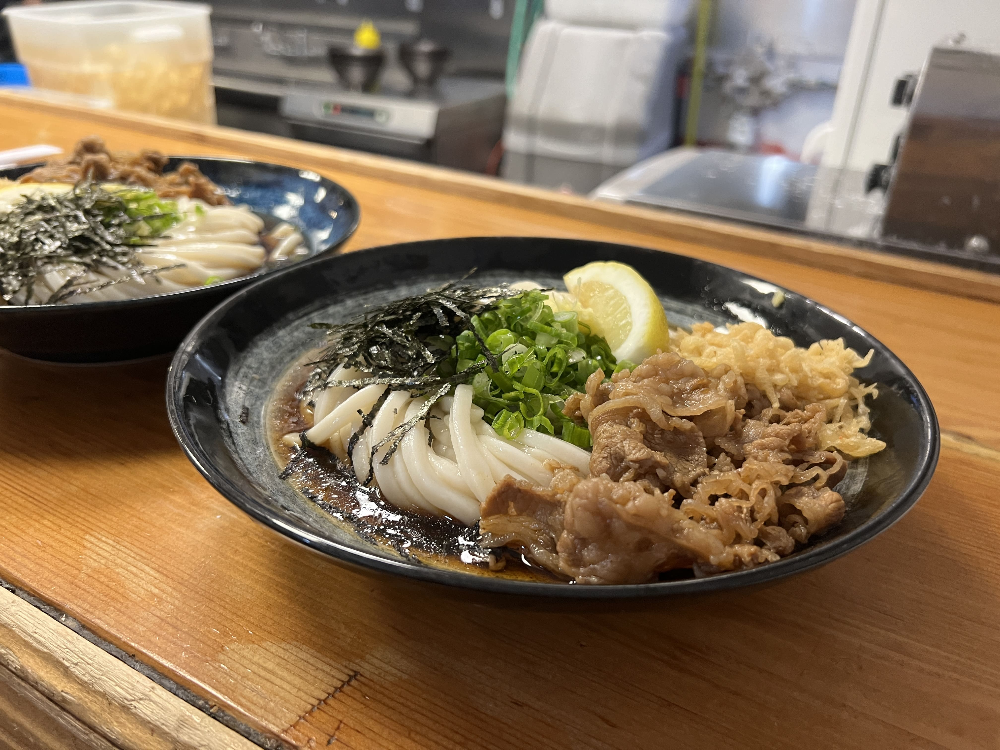
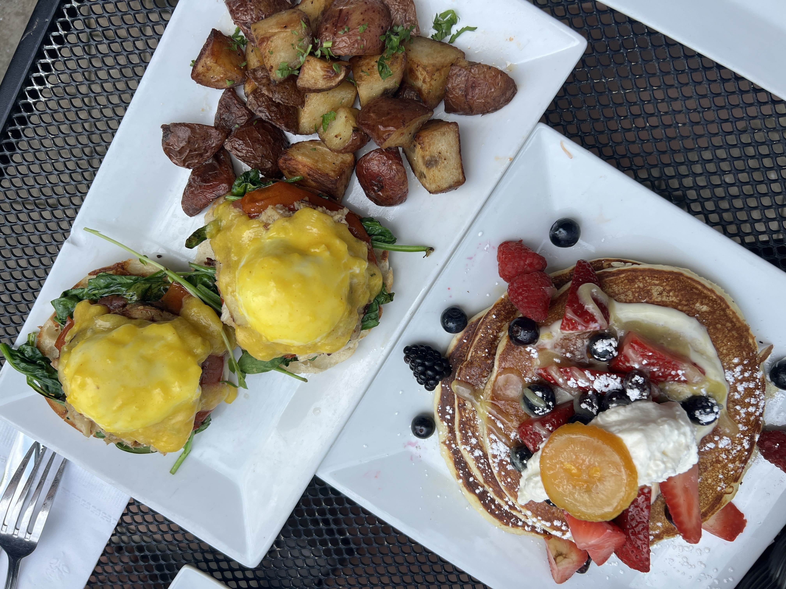
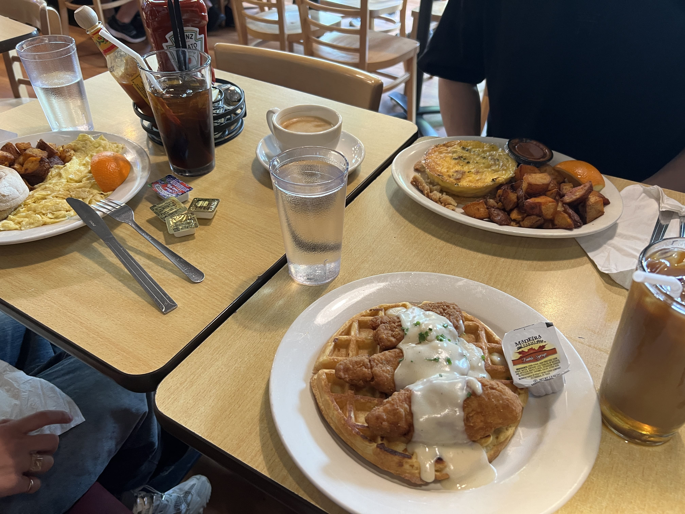

I was recently scrolling through old photos and came across my trip to Boston last May. The city is where I spent my college years, so although it isn't my "home" in the strictest sense, these days I am often nostalgic of the carefree, laughter-filled in-between years where you're not quite adult yet but seem to have all the freedom in the world. Waking up late on a Saturday morning and scrambling to make it to brunch on Newbury, trekking up to Porter Square for the best udon in town - I still remember these memories clear as day.

One of the most legendary restaurants to visit back then was Yume Ga Arukara, an udon place nestled up in Porter Square inside a Lesley University campus building. How good can a university food court restaurant be, you may ask? Well let me tell you - there's a very good reason why students from BU and MIT and Harvard would trek so deep into the suburbs and even wait hours in line for Yume. To this day, it's still the best udon I've ever had in my life. Their cold niku udon hits all the right spots - a slight tanginess in the refreshing umami of the cold broth seeping into the bouncy, al dente noodles. I heard the owners changed in 2022, but when I visited last year, they were still as good as I remembered.

    

If you finish every single thing in your bowl (including the lemon slice), the staff publicly bellows a "Perfect!" in celebration of your feat. Most people get a "Good job!" (like me), when you finish your noodles and meat but leave a couple sips of broth and perhaps a few stray green onions in the bowl.

Due to its wait time and locational remoteness, Yume Ga Arukara was not a spot I visited particularly often, but every time I did, it blew me away.

One of the other legendary restaurants I visited a bit more often was Cafe Luna, a brief walking distance from MIT's campus. This place also had an _insane_ wait time, but luckily they take reservations, so if you plan far enough ahead, you can stride right in past the clusters of impatient tourists waiting around at the entrance.

    

This brunch place is famous for their lemon ricotta pancakes (left) topped with fresh fruit. I've never been one for pancakes, but when I had these for the first time, I understood. They were just the right amount of fluffy, sweet without being sickly, and paired with the mascarpone and fresh berries, it's truly the perfect brunch plate. Nonetheless, I'm still more of a savory brunch kind of person, so I like getting their eggs benedict, which is wonderful as well.

My favorite item to get here is actually the iced London Fog latte - no place I've ever visited has done it like Cafe Luna! Maybe it's the sweetener or something, I really don't know what it is, but every other iced London Fog I've ever ordered in my life has come out watery, barely earl grey, or way too sweet. Cafe Luna's has just the right balance of everything.

Last but not least - not so much of a "legendary" restaurant but iconic all the same - is Trident Booksellers & Cafe. If I'm being honest, this place basically serves diner food. They don't have a special signature item like Yume or Cafe Luna, and I'd argue their food is not particularly memorable either. Why then, you may wonder, does this place have at least 2x as many Google reviews as the previous two "legendary" restaurants?

I have some inklings as to their broad appeal, but let me explain why Trident holds a special place in my heart. For starters, their concept is unique - it's a brunch place nestled inside an indie bookstore. You're literally eating brunch amongst art and culture. How cool is that? They also have tons of options for anything you're craving - eggs benedict? Done. Chicken & waffles (my favorite)? Done. Sausage and scrambled eggs? Quesadilla? French toast? Salad? Omelette? Burger? Sandwich? Tacos? Done and done. It's the perfect morning-after-late-night-partying brunch spot, and quite affordable for the amount of food you get. More importantly, there usually isn't a wait (it's never empty either though), or even if there is, it's not particularly long. If you're starving and just want something decent to eat with your friends, this is the spot to go.

    

After your belly is full, you can peruse the shelves full of fiction and nonfiction and gifts and art prints and knick knacks, or exit onto Newbury Street and shop, get boba, take a walk, enjoy the vibes, etc.

So this is it - my top three most memorable spots in Boston. There are definitely way more places that I visited multiple times and hold dear - Five Spices, Tatte, Futago Udon, SOJUba, Sumiao, Ten One Teahouse - the list goes on, but this post would be way too long if I included all of them (I'd be writing until next year). Let me know if you have any Boston favorites, sentimental or otherwise!

_tags: boston, cambridge, massachusetts, foodie, college town_
