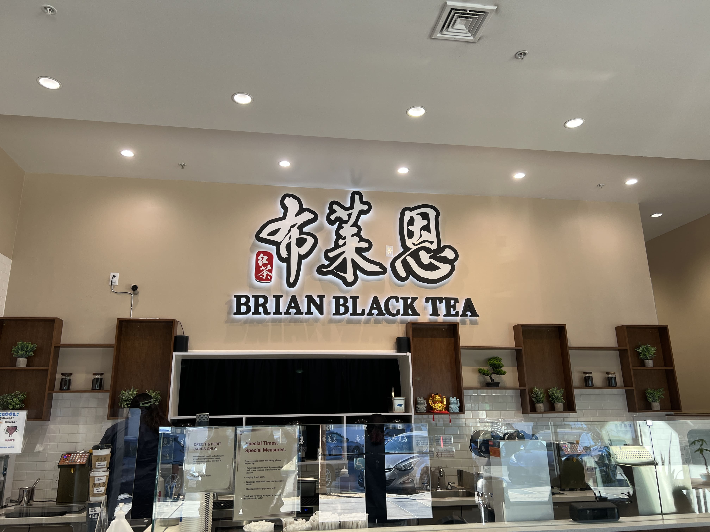
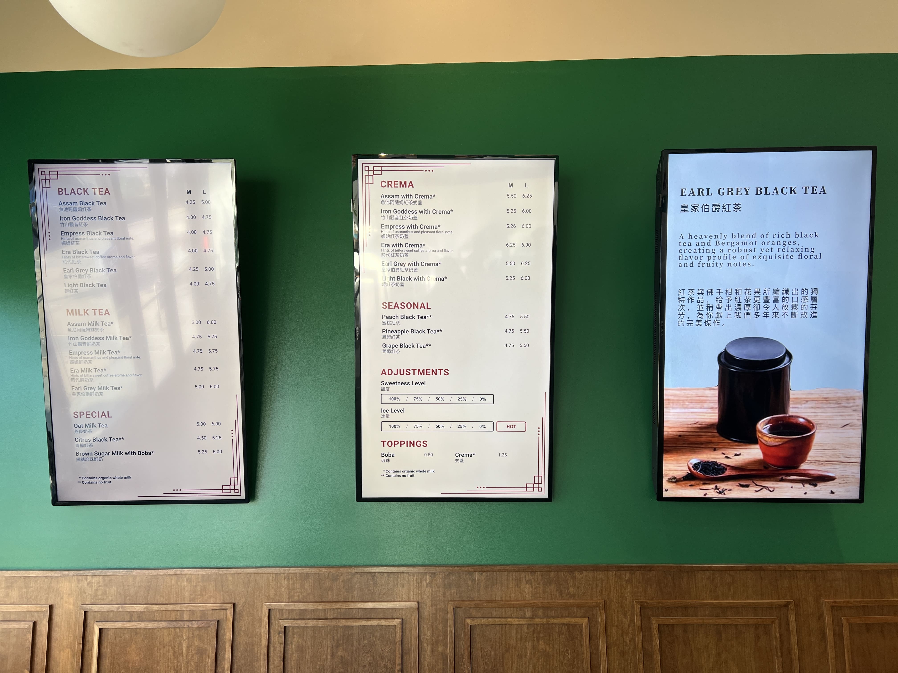
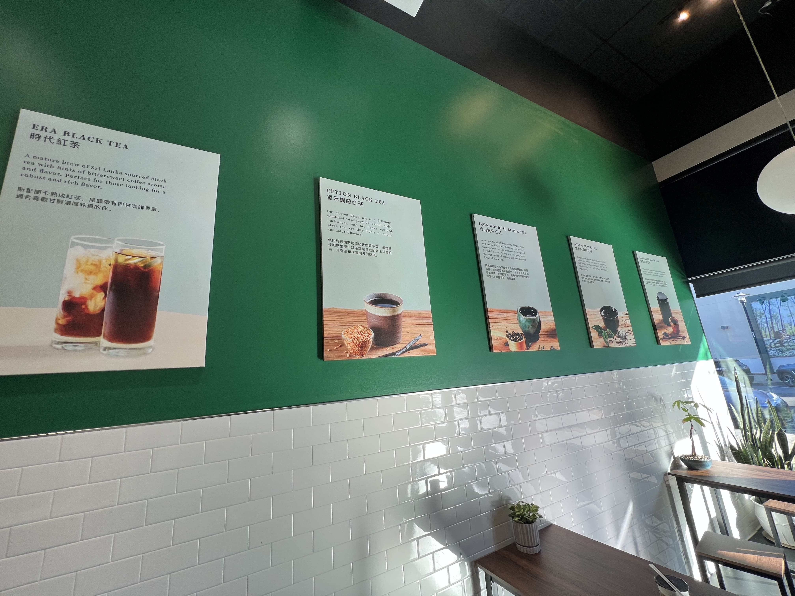
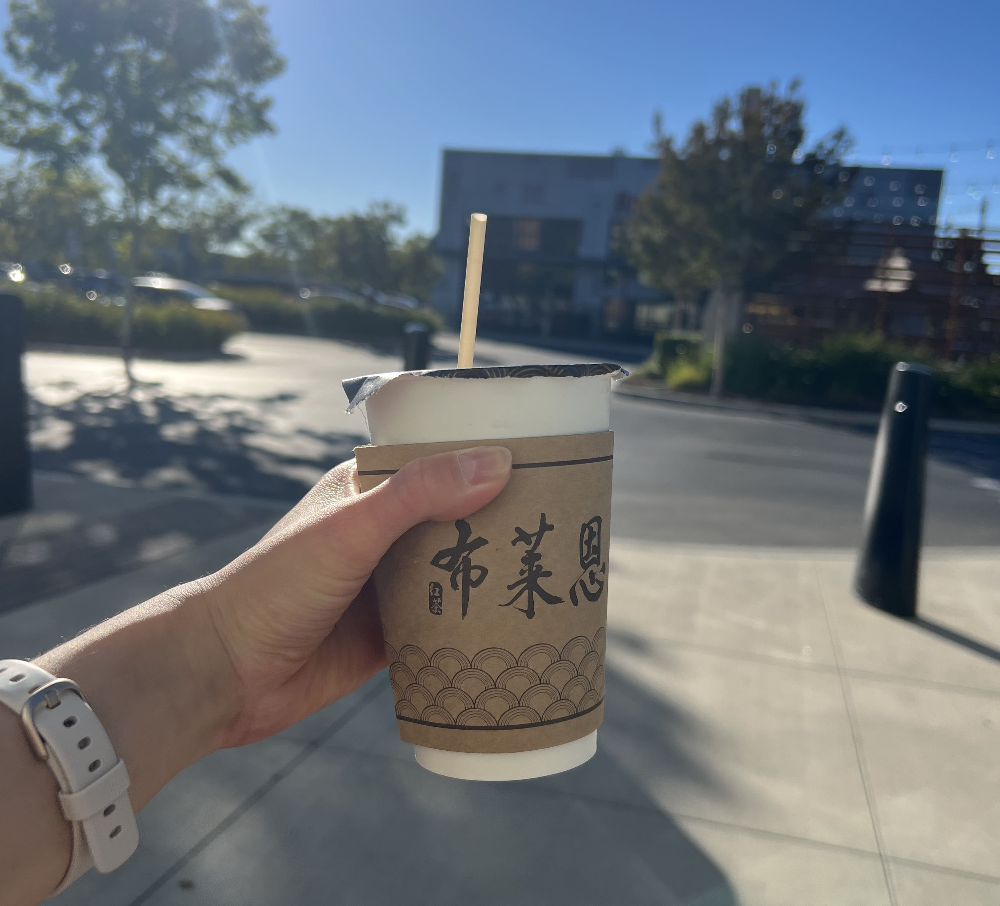

So you may be thinking, what kind of name is "Brian Black Tea?" And you know what? I have no clue. But the tea is really damn good (at least in my opinion).

Brian Black Tea, originating from Taiwan, opened its first U.S. location few months ago in the Pacific Commons Shopping Center in Fremont, in the corner where Koja Kitchen, Blaze Pizza, and Bowl of Heaven are. 

    

Plainly speaking, Brian Black Tea isn't a place where you would go to get some colorful, novelty drink. They don't have passionfruit QQ green tea or mango pomelo sago or anything of that kind. They specialize in black tea specifically, in the assam, tieguanyin, osmanthus, coffee, and earl grey varieties. You can choose plain tea, milk tea, or tea with crema. These are the main options, and there's a few other specials on the menu.

    

That being said, when they say they focus on black tea, they _really_ focus on black tea. This is one of the few boba places that I've been able to clearly differentiate the tastes of the different black teas, even when blended with milk, whereas most places I've been the teas are too watered down to tell. The sweet osmanthus jumps out at me from the Empress Milk Tea, and the rich Assam flavor is strong but not overpowering in the Assam Milk tea. I've also tried the Iron Goddess and the Era - both are lovely as well.

    

If you're curious about the origins of each of the teas, you can read the aesthetic canvas boards they have up on the walls. 

    

I'm a huge fan of this place (if you couldn't tell), but I recognize it may not be for everyone. If you love fruit teas and jelly toppings and specialty drinks, then this tea place is probably not for you. But if you're drawn to the tempting aromas of Tieguanyin and Assam, then I'd say you _definitely_ need to check them out. ☆ 

_tags: location/sfba, brian black tea, fremont, 布萊恩, milk tea, boba, pacific commons_

