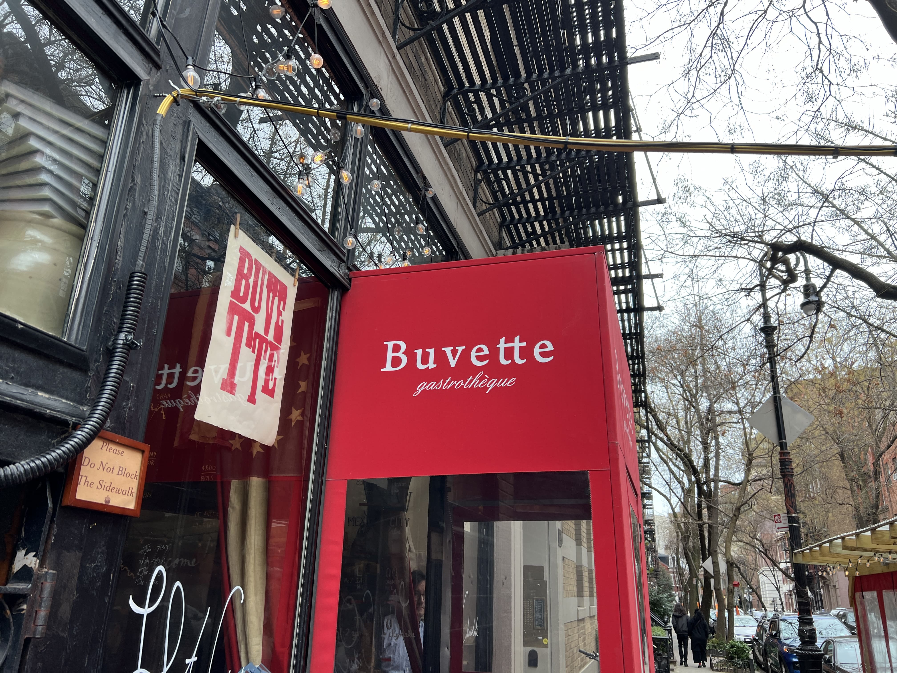
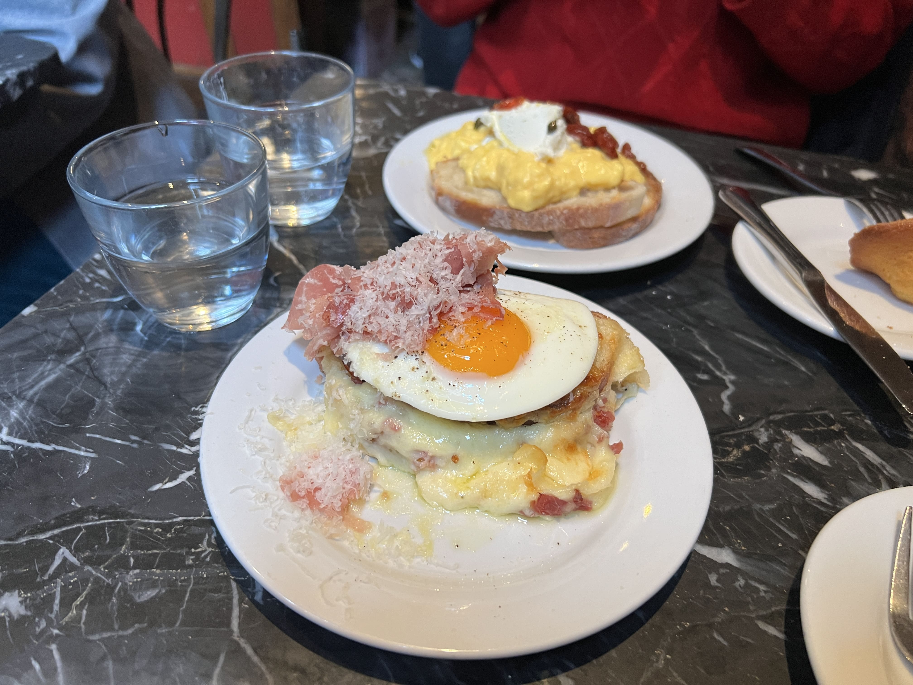
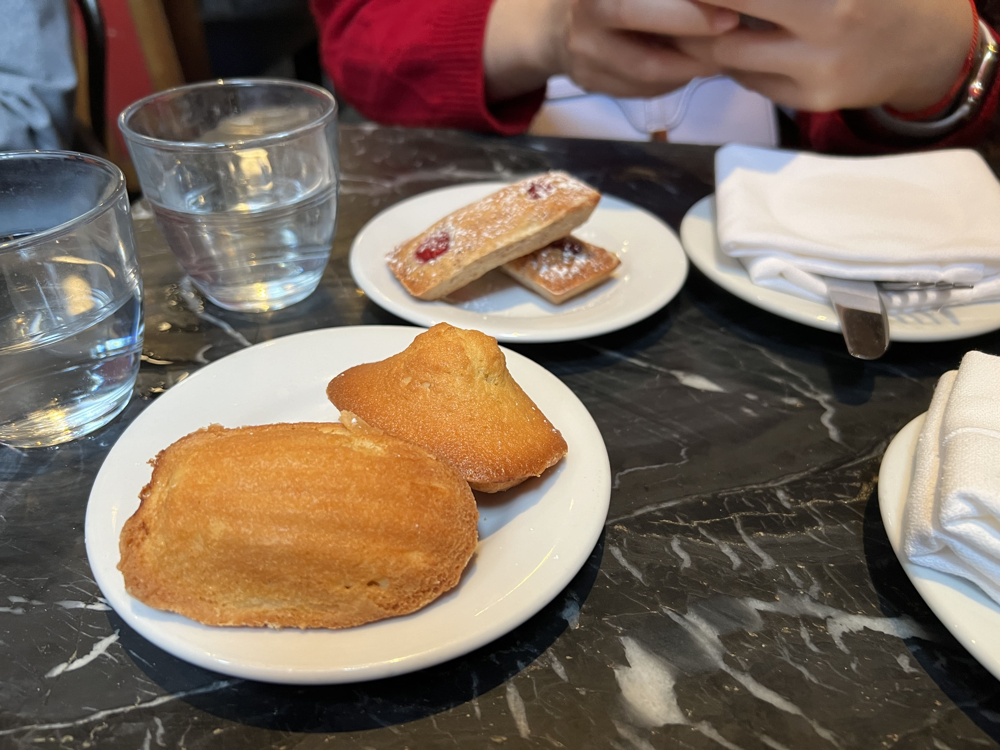

Taking a brief pause from vacation recaps to write a love letter to Buvette, my favorite brunch place in NYC. Given the vast number of brunch spots in the city, this is a pretty bold statement, but I stand firmly by it!

If you haven't heard of it before, let me paint you a picture- Buvette is the kind of place that's referenced in romance novels (it actually shows up in In Five Years by Rebecca Serle) and rom-coms. Perhaps it would've even been featured in Gossip Girl if it had been around back then - I could totally imagine Serena and Blair huddling over their little French pastries, plotting their next big takedown amidst the hustle and bustle. 

I remember passing by Buvette countless times before I actually went, and always being discouraged by the long lines out the door. They don't take reservations, much like many of the popular brunch spots around NYC. However, the wait is actually not terrible if you don't go _too_ late, and if your party is relatively small. If you're lucky enough and the only party of three in the first ~15 people in line, you can probably get a spot within 10 minutes (which is what happened to me on my second visit). 

    

I may be a fake fan in that I haven't tried all of their menu, or even much of it at all - in fact, I always order the same thing - the croque madame. It's just that it's so fantastic that I don't even feel the need to try anything else. (To be fair, I've been so many times and have tried my friends' dishes as well, but I always end up ordering the same thing anyways.)

    

Okay, that may be an exaggeration. I was definitely curious about the pastries, and recently have been obsessed with their financiers - I haven't been able to find any place that does them better! The thick, cake-y texture was just perfect, and the preserves had the right amount of tart and sweetness that wasn't overwhelming at all. Their madeleines are also great, but I'm much more used to the Trader Joe's ones (which I love, but are probably not as authentic), so I was less accustomed to the citrusy flavor. 

    

I've only been to Paris twice, but Buvette definitely holds its own against many of the patisseries there. The only downside is that you have to wait outside, and also inside (it takes a while to get your food). But in my personal opinion - totally worth it. If you haven't been, give it a try and let me know what you think!

_tags: location/nyc, French cuisine, brunch, food_

