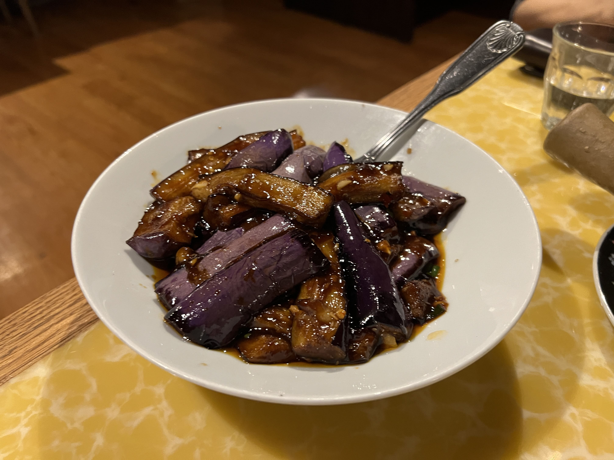
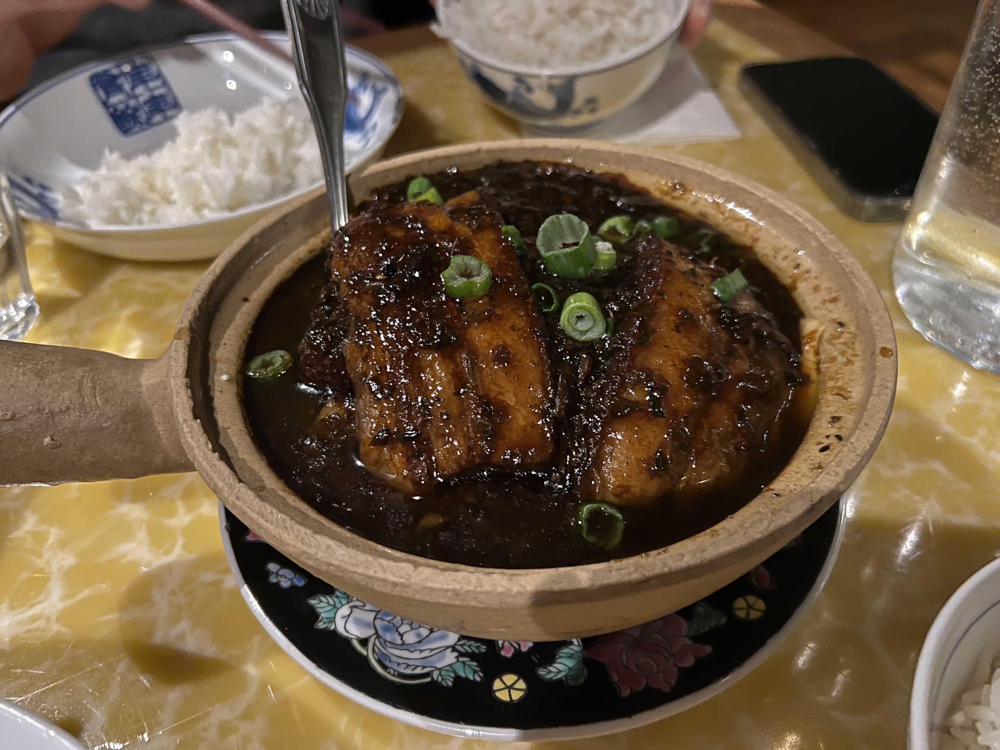
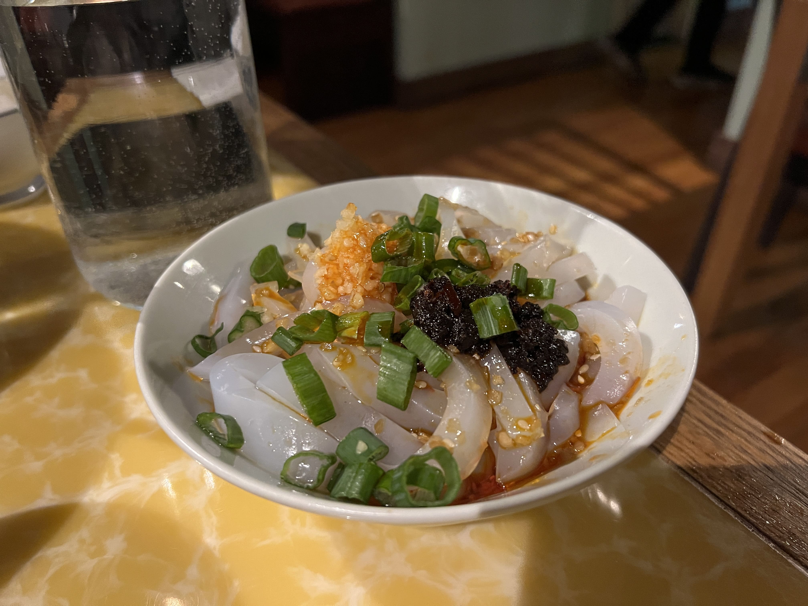
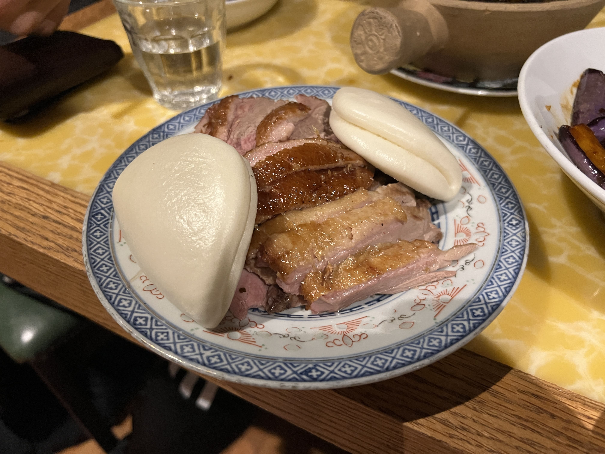

Despite the slightly corny-sounding name, Cafe China is not some hole-in-the-wall, get-a-meal-for-$7 place that you'd accidentally stumble upon in the outskirts of NYC's Chinatown. It's an upscale Sichuan restaurant that places special emphasis on its interior decor - 1930s Shanghai-themed chairs, lamps, and ~ vibe ~. They actually held a Michelin star for most of the past decade, in their old location on E 37th.

I've been here once before a while ago (where are the photos? idk man...) and remember being absolutely blown away by the Fish Blossom. This time we decided to try some different dishes:

Eggplants in Garlic Sauce (鱼香茄子) - a reliable dish, but delicious all the same. It was perfectly aromatic and flavorful. If you like Chinese eggplant dishes, this definitely won't disappoint.

    

Braised Pork Szechuan Style (豆花咸烧白) - honestly this dish had a lot of potential, but I feel like the chef accidentally dumped half a carton of salt into it and totally didn't notice or something. It was way too salty, and I ended up taking it home and adding hot water - and then it tasted way better (LOL). To be fair, the pork was cooked well - the texture was light and tender, but the seasoning was just way off (hopefully just a one-time thing).

    

Mung Bean Jelly (川北凉粉) - so this was my favorite dish of the meal - a very generic Sichuan appetizer, I know, but it was actually SO good. The seasoning, although a bit on the heavier side as well, had the perfect balance of all the different sauces and oils, and each bite was bursting with all the flavors without being overwhelming. I definitely could _not_ eat this every day for the sake of my health (the jelly noodles were quite literally swimming in a pool of oil), but next time I visit, I'm definitely ordering it again.

    

Tea Smoked Duck (樟茶鸭) - I don't eat duck often, so we got this dish just for kicks. It turned out pretty good - the tea flavor definitely permeated through into the meat (much moreso than I expected), and the pieces weren't too fatty nor too tough. My only complaint was that the bun to duck ratio was rather bizarre (two buns and an entire heaping plate of meat)... perhaps we could've asked for more buns? Unclear. But it was good!

    

Cafe China never ceases to disappoint, although I will probably not be ordering the braised pork again, but hey. Mung bean jelly, anyone?

_tags: location/nyc, cafe china, sichuan cuisine_
