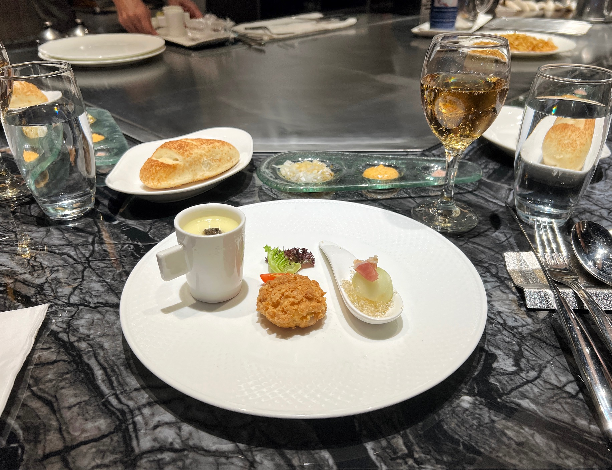
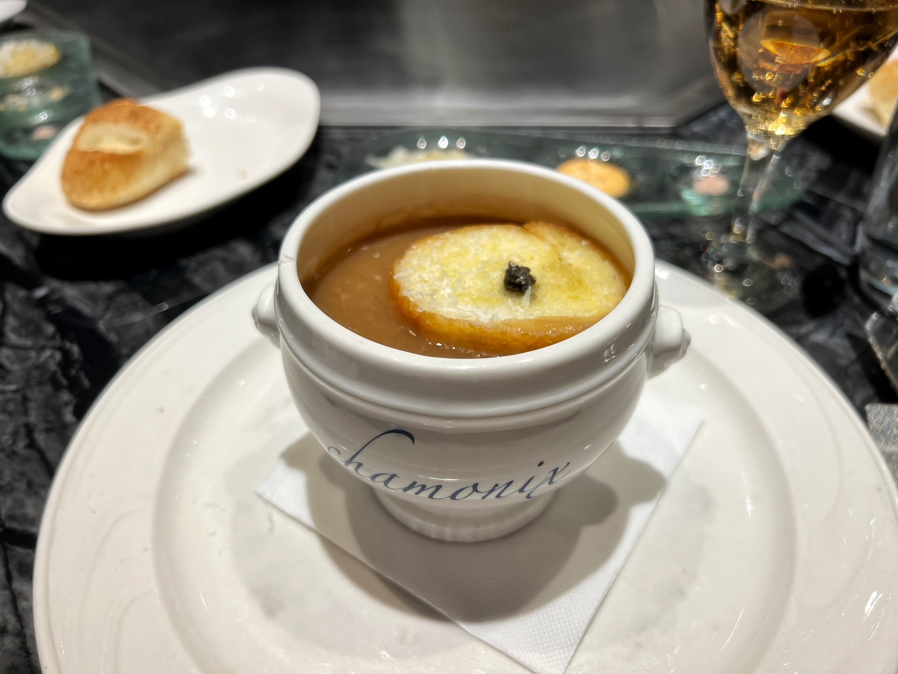
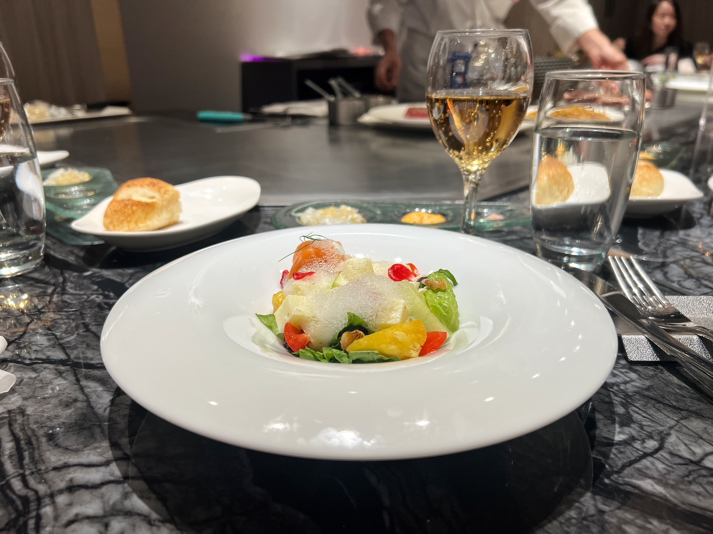
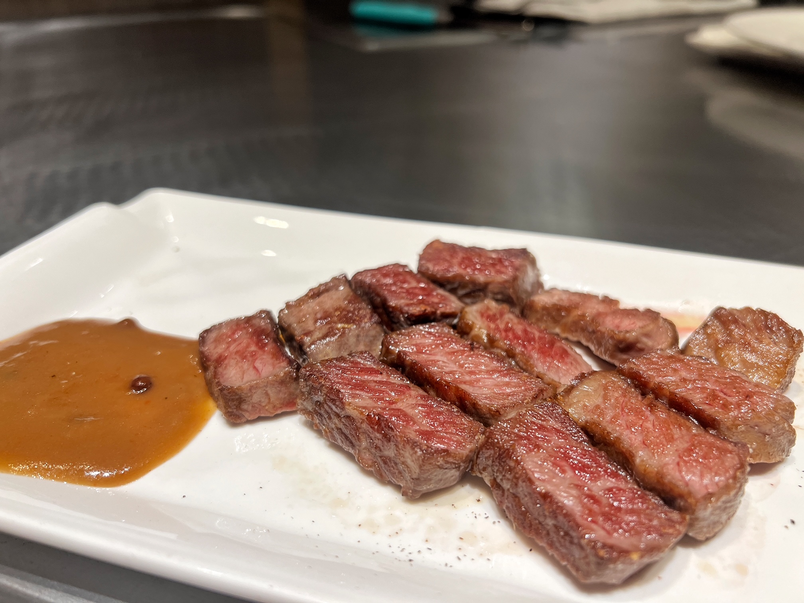
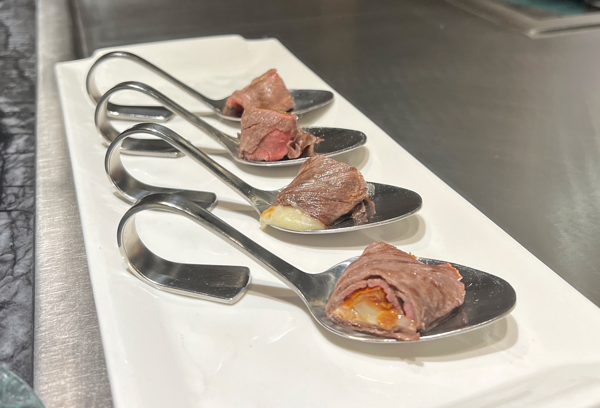
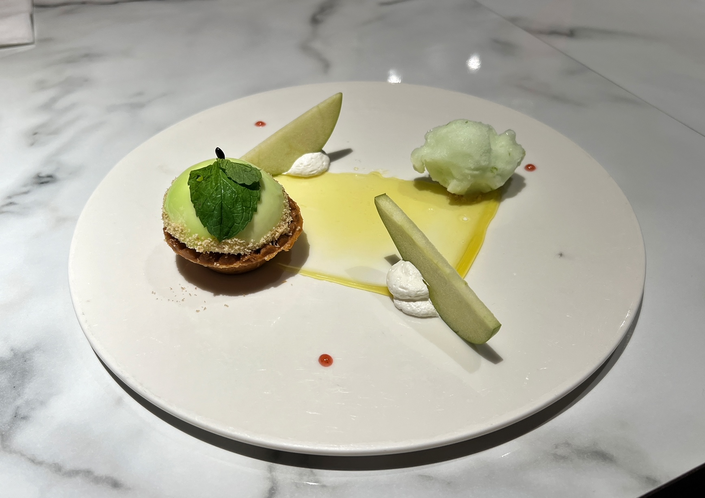
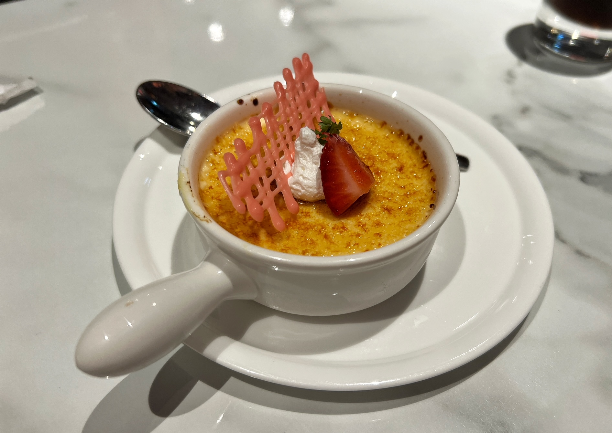

You've had French cuisine, you've had Japanese teppanyaki, but have you had... Japanese-French teppanyaki? 

*Note: This review is for the Taipei Dazhi Jingye branch specifically, next to Miramar.

Chamonix is a French-inspired Japanese teppanyaki restaurant, with branches all over Taiwan. The meal consists of a full seven courses, each part designed with detail and plated with artistry. I went in not knowing what to expect, and I ended up _very_ pleasantly surprised.

We started off with a pre-set warm appetizer. (As with most fancy restaurants I had no idea what I was eating half of the time, but I recognized the chawanmushi on the left topped with truffle, and the middle was some sort of salty cream puff, and on the right was ... honestly no clue. But they were all good!)

    

Next was the soup - you have options for this one, and I selected the French Onion Truffle. It was lighter than the other ones I've had in the States, which I actually prefer. (Felt less guilty too.. just a little bit.) 

    

After the soup was of course, the salad. I had a little trouble debating between the Truffle & Mushroom vs. the Smoked Salmon Waldorf, but ended up ordering the latter. It did not disappoint, and the quality cut of fresh salmon added a nice touch. 

    

Finally, it was time for the main course. Good timing too - if I ate anything else at this point I would probably be _way_ too full. There were an array of different meats to choose from, and I settled for the Grilled Short Ribs with Garlic, although everything else honestly looked great too. Since it was supposed to be elevated cuisine, the teppanyaki part wasn't as loud and crackly as you'd usually imagine teppanyaki to be - there's still a teppanyaki chef a little ways in front of you, bt he kinda just quietly cooks the meat and then puts it in front of you. (It was nice that they give you a little bit first to see if you like the doneness, and then cook the rest for you after you give the OK.)

    

Honestly this main dish blew me away. I don't think I've ever had steak this juicy and tender and flavorful for less than $40 USD, and that was literally the price here - for the ENTIRE seven-course meal. The aroma of the garlic fully penetrated into the beef, and it was the perfect amount of chewy while not being too raw. Simply astounding.

My cousin got the Herb Marinated Steak with Beef Roll Combo, and I had to sneak a picture of the beef rolls.

    

After that main dish came the dessert, and I ordered the Green Apple Tart with Lemon Sorbet. The plating was fantastic, as expected. 

    

My aunt got the creme brulee. 

    

We ended off with drinks, which I could barely finish because I was beyond full. 

Chamonix was an elegant, flavorful, and unique dining experience that I enjoyed from start to end. Definitely on the pricier side of restaurants here, but the quality of the food seriously justified it. I would recommend this to anyone who loves steak, Japanese food, French food, and also just ... literally everyone. ☆

_tags: location/taiwan, chamonix, japanese food, french food, fusion, steak, taipei_
