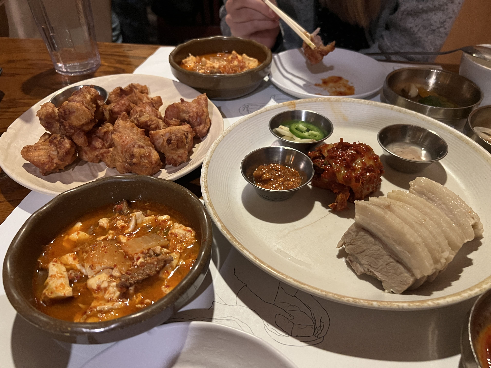
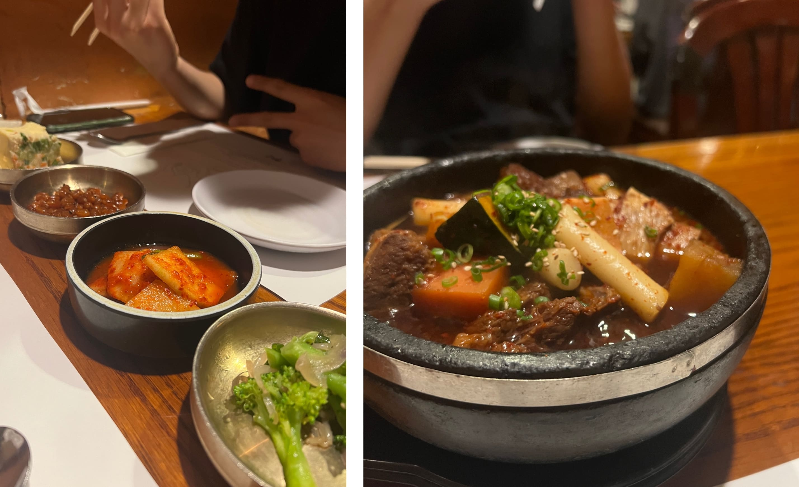
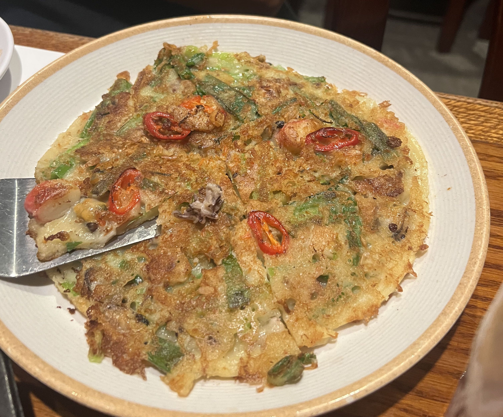

After spending a good chunk of the summer in Asia eating amazing food left and right, upon returning to the States I found it difficult to find Asian restaurants that measured up. 

Cho Dang Gol, however, exceeded expectations. I've been meaning to try it for a while, and although it was obviously more expensive than food in Asia, the quality and authenticity was seriously impressive.

I've actually gone twice already upon arriving in NYC - the first time I ordered the bossam, Korean fried chicken, and beef soondubu.

    

 
I honestly used to not be a huge fan of bossam, but this meal totally changed my mind. I had a hard time picking my favorite out of the three dishes, but if I had to, it might've actually been the bossam. (Which is saying a lot because the fried chicken was REALLY good. And so was the soondubu.)

The refreshing, clean feeling of the tender meat paired with the zest of the kimchi was absolutely phenomenal, and I was savoring every bite of it. The KFC is always a classic, but nonetheless cooked with high standards - juicy, and flavorful, and the perfect appetizer. The beef soondubu, also a classic, set itself apart from the other (less-good) soondubus I've had recently - the soup base was thoroughly seasoned, and the tofu was unbelievably silky and fresh. 

CDG prides itself in its homemade tofu, and they certainly should.

The second time I decided to try the galbi-jjim. An expensive endeavor, but totally worth.

    

The beef chunks were extremely large (I honestly didn't expect to get so much beef for the price) - and braised to perfection. Each bite burst with a million different flavors, and the occasional fatty parts added a nice bit of tenderness to the rest of the lean meat. The broth was actually one of the best broths I've had and I probably would've drank the whole pot if I wasn't so full already (are you even supposed to drink galbijjim broth? I have no idea...).

My friend and I also got a seafood pancake to share:

    

Nothing too special, but it was a nice palate cleanser from the deeply flavored ribs. 

Conclusion: Cho Dang Gol has become one of my top places to eat at in NYC. It is a bit pricey, but not more than the surrounding K-town restaurants, and for the amount of food you get, I think it's rather worth the price. If you haven't checked it out, definitely do and let me know what you think!

_tags: location/nyc, cho dang gol, cdg, korean cuisine_

