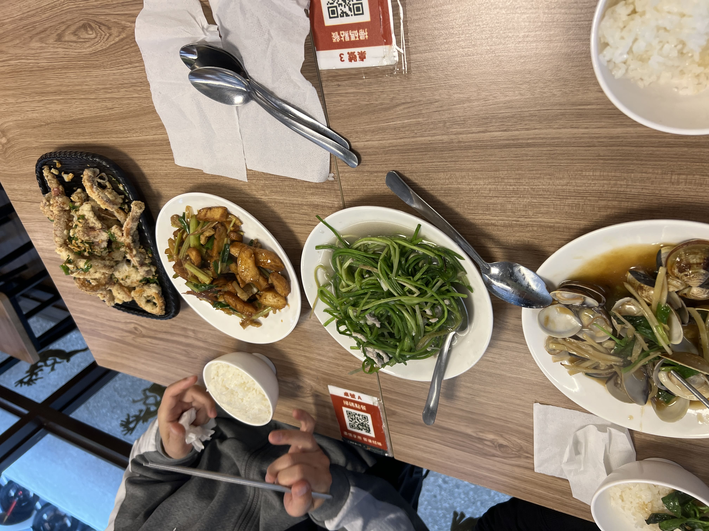
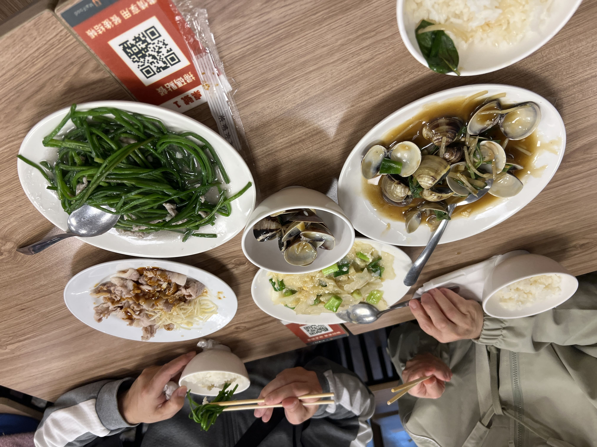

I will say, I went to this place at least 5 times throughout my one-month stay in Neihu District, Taipei. And I think that speaks for itself.

東湖家鄉小吃 Dōnghú Jiāxiāng Xiǎochī, which roughly translates to Donghu Hometown Small Eats, is honestly nothing special - and I say this because, well, that's not what it's trying to be. It's a hole-in-the-wall corner restaurant in the Donghu neighborhood of Neihu district that focuses on traditional Taiwanese home cooking. The menu has a wide variety of items, and all of the dishes are things you can quite easily find elsewhere. But the thing is, they do all of them quite well. If you're craving stir-fried clams, or shuǐlián (Taiwan's local vegetable), or salted egg yolk bitter melon, or Hakka stir-fry, or whatever other common Taiwanese dish, they'll probably have it.

    

I will caveat - if you are quite far from Neihu, I won't tell you to make a trip all the way out there just for this. There's probably some great home cooking place near where you live too. Like I said, I'm not touting this restaurant as some heavenly, life-changing stir-fry must-visit Michelin 1-star whatever. The reason why I like it so much is that it's simple, it's inexpensive, and it's nostalgic. As Taipei gets more and more Westernized and attracts more and more tourists, the top results you get in Google Maps are usually the fancy, full-service restaurants that serve modern or fusion food. I mean, those are great too! But I feel like it's getting harder and harder to find hole-in-the-wall home cooking places if you're not a local, when there are so many shiny new corporate chain restaurants that serve Instagrammable, perfect-presentation dishes and charge service fees for dining in. I was lucky enough to discover this one from my relatives, and every time I go there, it evokes a lot of memories from my grandmother's home cooking when I was young.

    

If it is your first time in Taiwan, or even your second or third or tenth or twentieth, I hope you get to taste some traditional home cooking. Whether it's nostalgic or new, it's definitely an experience worth having.

_tags: location/taiwan, home-style cooking, neihu district_
