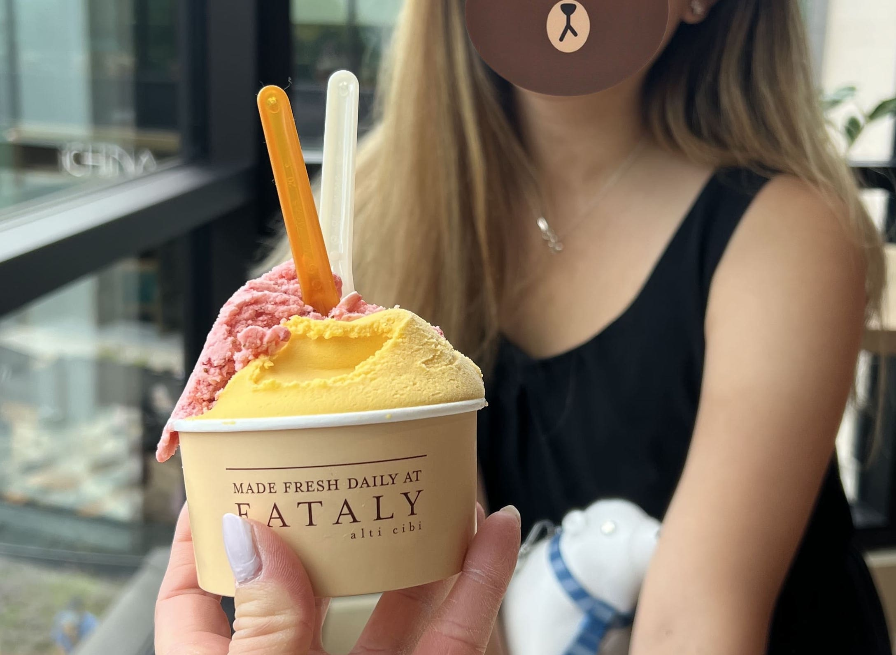
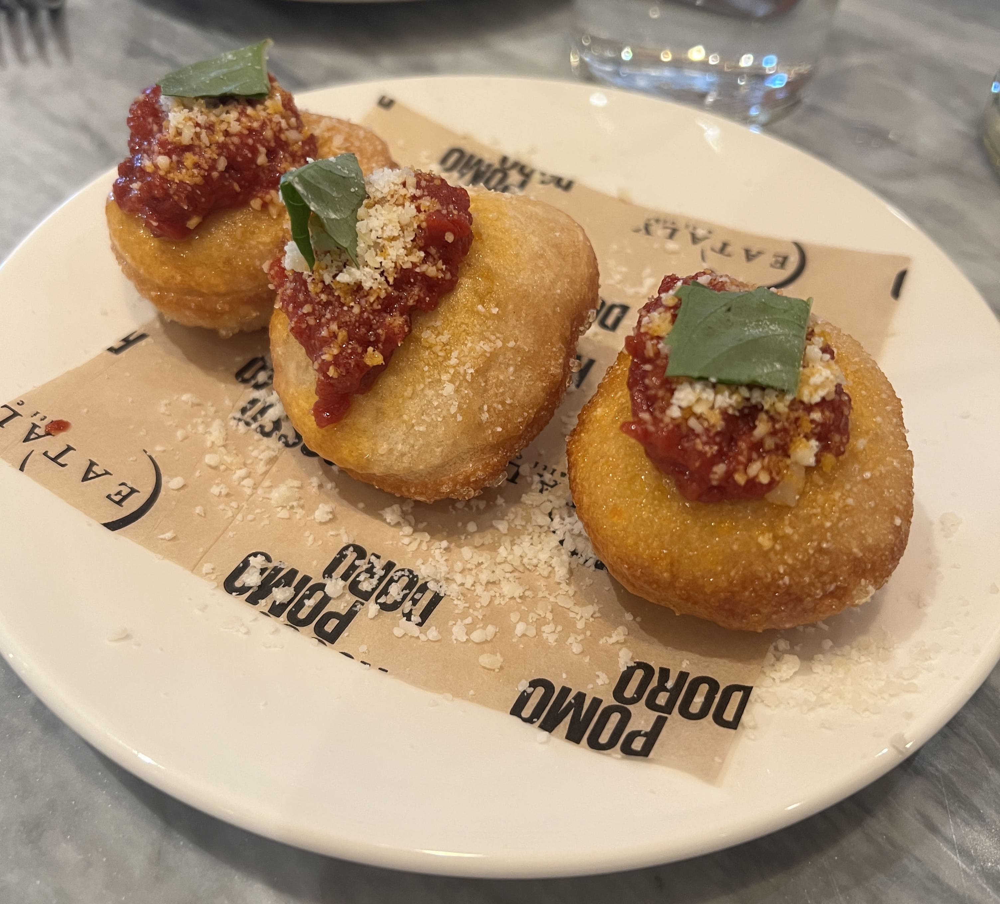
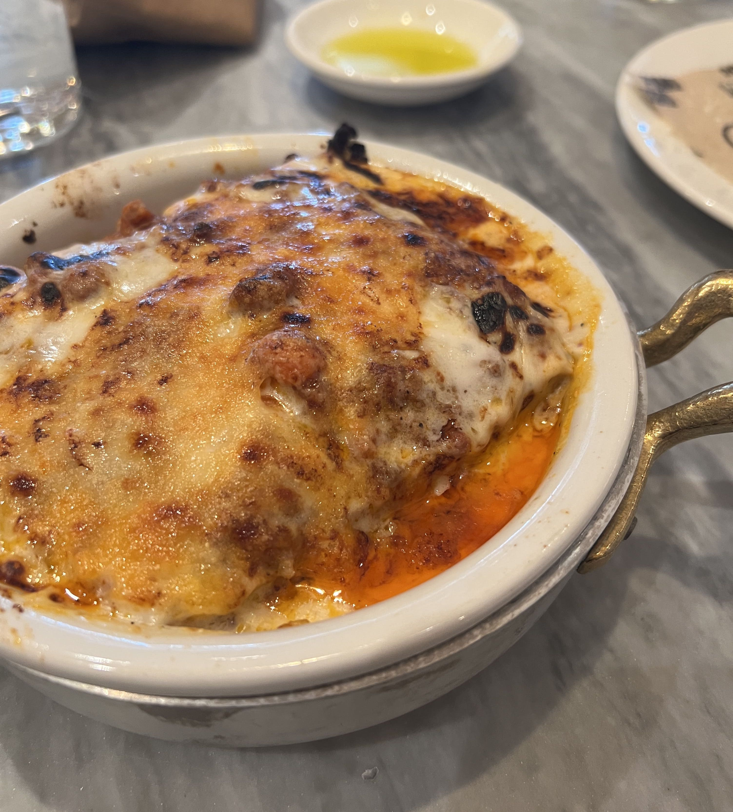
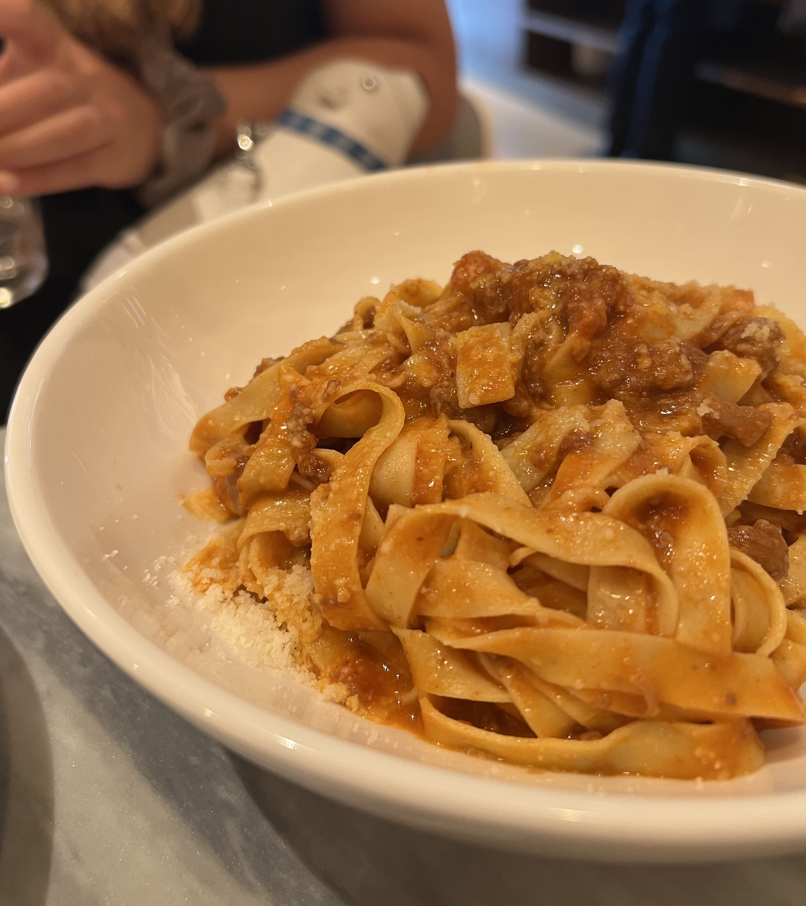

Eataly finally opened in San Jose inside the Westfield Valley Fair shopping mall, and my friend and I went there the day after opening day. The Silicon Valley version is a three-floor establishment, with pastries and a gelato place on the first floor, a wine store on the second floor, and the market and most of the restaurants on the third floor.

We arrived at 11:30 AM, at the start of business hours, which was definitely a mistake. The line for La Pizza & La Pasta already extended probably at least fifty people long, all the way past the front of the restaurant and well into the grocery area. We waited about thirty minutes to get to the front of the line, and then they noted down a contact phone number and said that the wait would probably be another hour. 

So we went and got gelato downstairs, because we were already hungry and, well, dessert before lunch isn't _that_ bad. Right?

    

Gelato: was good. Recommend.

At about 12:50 PM, I finally received a text that our table was ready, so we headed back to the third floor. We were seated in a few minutes, and the waiter took our orders quickly, which was nice. We got one of the location-based specialties, the _Pizza Fritta Montanara_, these little fried pizza-like appetizers. Oh, and they also gave us free bread (not pictured). 

    

It looks a little funky but tasted actually quite good - less greasy and cheesy than normal pizza, but still had the juicy tomato sauce and slightly crunchy texture of crust. Definitely would order again.

For mains, I ordered the _Lasagna Emiliana_, and my friend ordered the _Tagliatelle Alla Bolognese_. 

    

 

    

The lasagna is probably not the best choice for someone who doesn't like heavy foods - it was intensely rich and cheesy and pretty much sitting in a pool of grease. Tasted good for the first few bites, but after about halfway, I couldn't stomach much more. My friend's bolognese was much drier and lighter, a nice refreshing contrast to my own dish. Although I would've personally preferred the sauce to be saucier (was a bit on the lighter side for me), the consistency of the noodles was chewy and the tomato sauce tasted fresh. 

Overall: I'm not much of an Italian food person, so I wouldn't particularly choose to come here again unless someone invited me. The gelato and pizza fritta were good, but the pastas weren't really my thing. Nonetheless, the vibes of the restaurant and market as a whole were pretty on point, as all Eataly's seem to be, and would be a decent choice for an upscale meal (perhaps make a reservation in advance though). ☆ 

_tags: location/sfba, westfield valley fair, eataly silicon valley_

