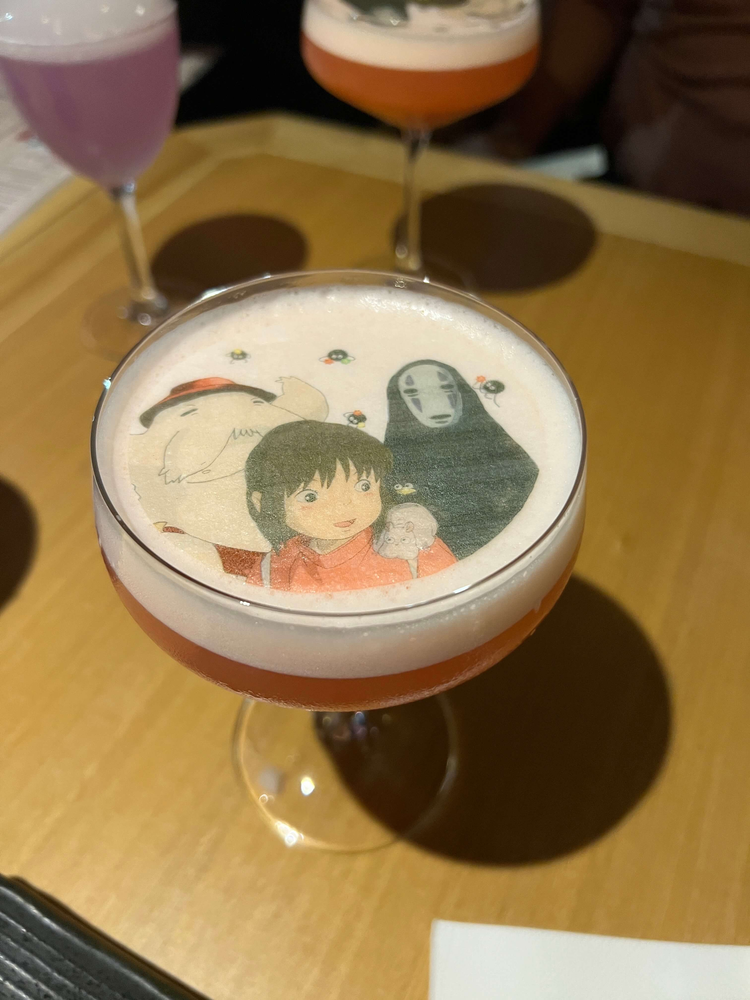
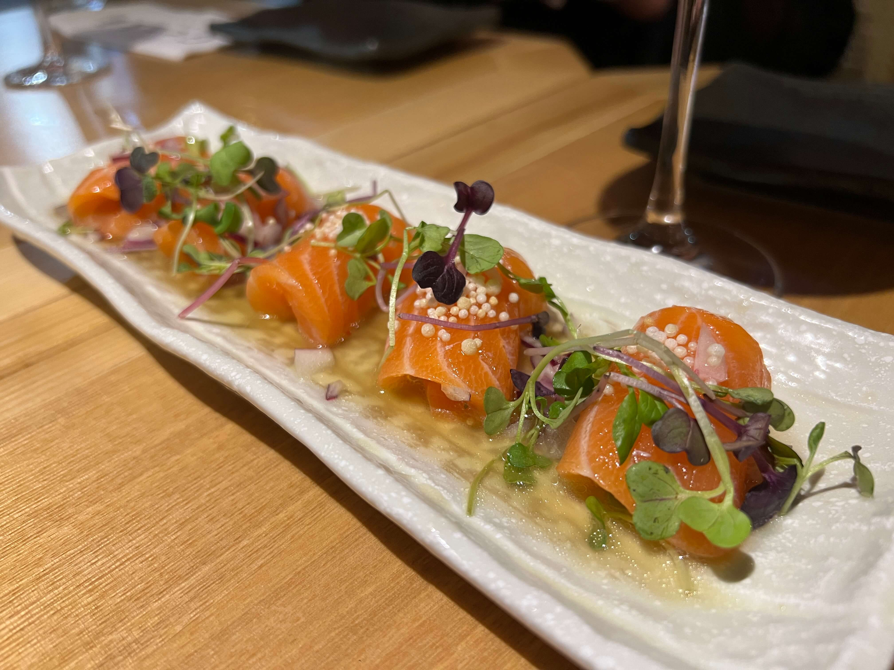
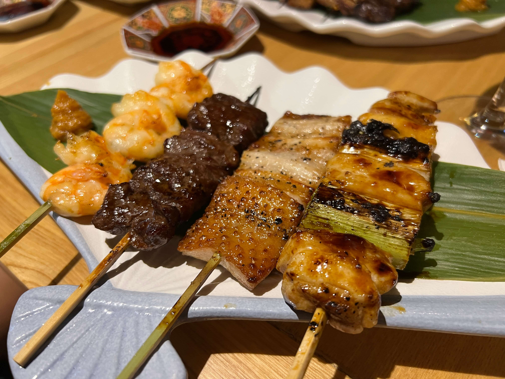
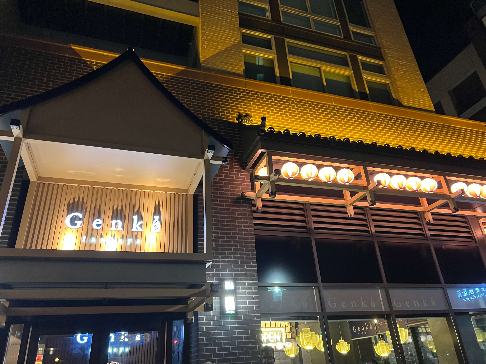

So to be really honest I wasn't expecting much at all from a restaurant called _Genki Izakaya_ (for context Genki 元気 means "well" in Japanese and it's a pretty generic phrase that people throw around a lot, it's also literally the name of the mainstream textbook series that beginners use to learn Japanese, it's like if you named your restaurant ~ Good Restaurant ~ or something of the sort) - but this place, let me tell you, is probably actually the best izakaya I've had in the states, period. (Not that I've been to a lot, but, you know what I mean. I would actually probably place it higher than NYC's Izakaya Mew and NONONO, if that puts things in perspective.)

First of all, the _cocktails_. Holy shit. Look at this and tell me that this isn't the coolest cocktail you've ever seen.

    

A _Spirited Away_ scene printed on thin rice paper and laid across a fruit-infused vodka cocktail? Count me in! (I'll have to say that this cocktail was way stronger than I had anticipated, but I didn't particulalry mind since I had ordered it 100% for the photo-op and 0% for the taste.)

For starters, we got the salmon ceviche (we tried getting the tuna tataki which was sold out and then we tried getting the torched sea fatty salmon which was _also_ sold out so this was our third choice (pro tip: make a res earlier than 8:45 pm if you can)) and it was quite good, essentially yuzu-marinated salmon sashimi in roll form.

    

We also got chicken karaage (not pictured).

For my main I ordered four yakitori: the _negima_ (chicken thigh w leek), the _butabara_ (pork belly), the _gyu-harami_ (beef skirt), and the _ebi_ (shrimp).

    

My favorite by far was the beef skirt - I expected it to be a little tough, but it was surprisingly tender and bursting with flavor. The pork belly was also amazing, not too fatty and caramelized to perfection. The shrimp was okay - I had expected it to be a whole shrimp (shell-on) like the ones they serve in Japan, and they came peeled, beheaded, and prepared in Western fashion, which was a tiny bit disappointing, but I guess we do live in America (lol). The chicken thigh w leek was fantastic - bites of juicy, savory chicken complemented by the fresh, sweet flavor of the leeks.

    

It's been a month since I left DC but I still dream about Genki Izakaya (not even joking). It'll definitely be the first place I hit the next time I visit, and if you're ever in the area, you absolutely have to check it out.

_tags: washington dc, fairfax, virginia, japanese cuisine, izakaya, asian food_
