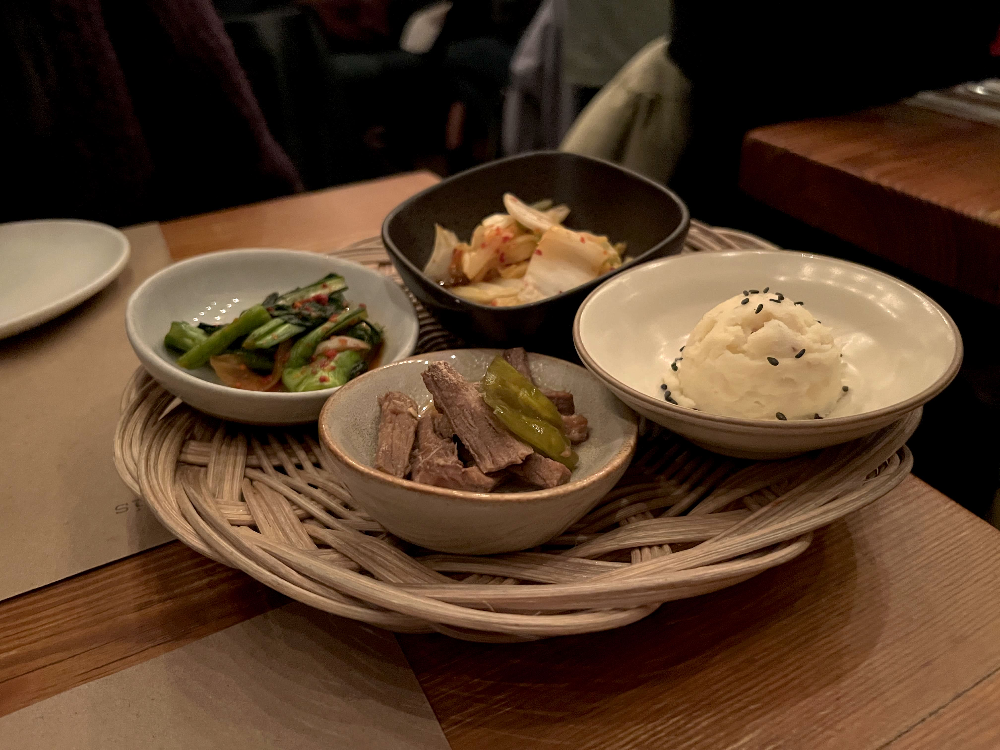
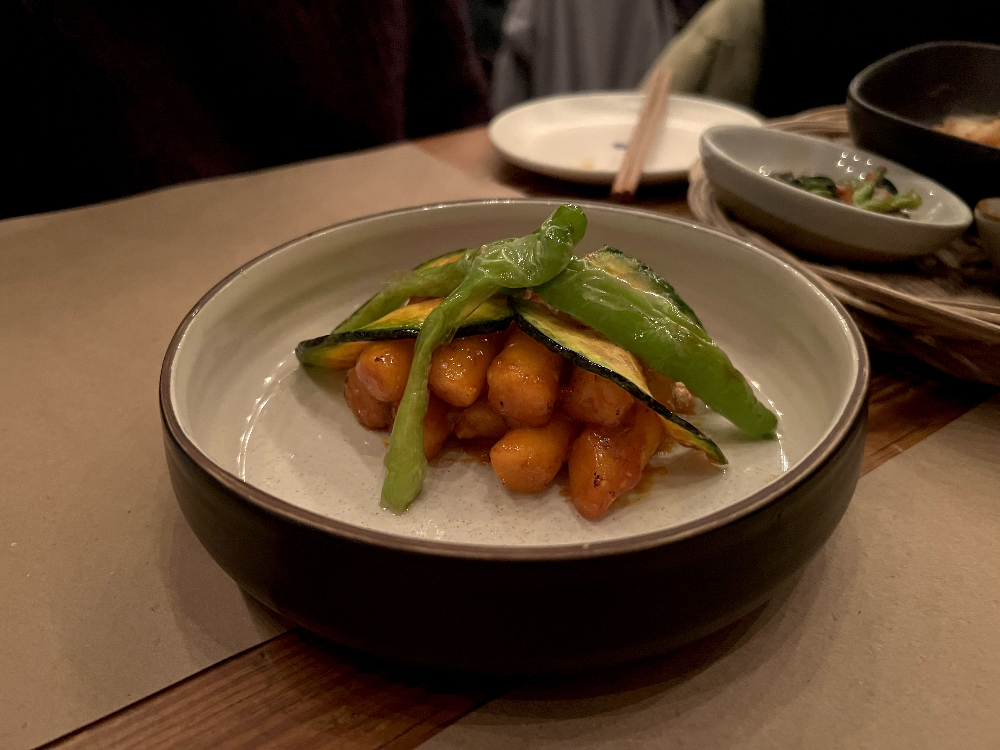
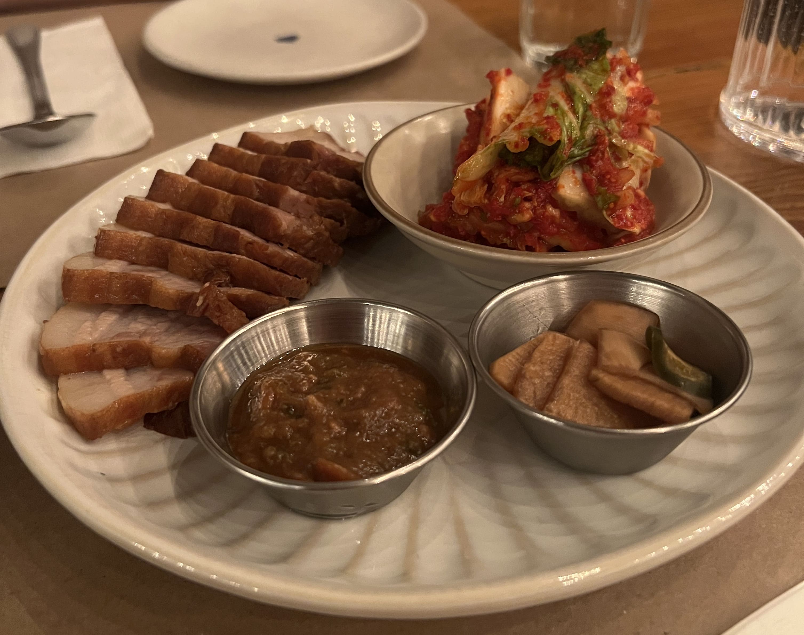
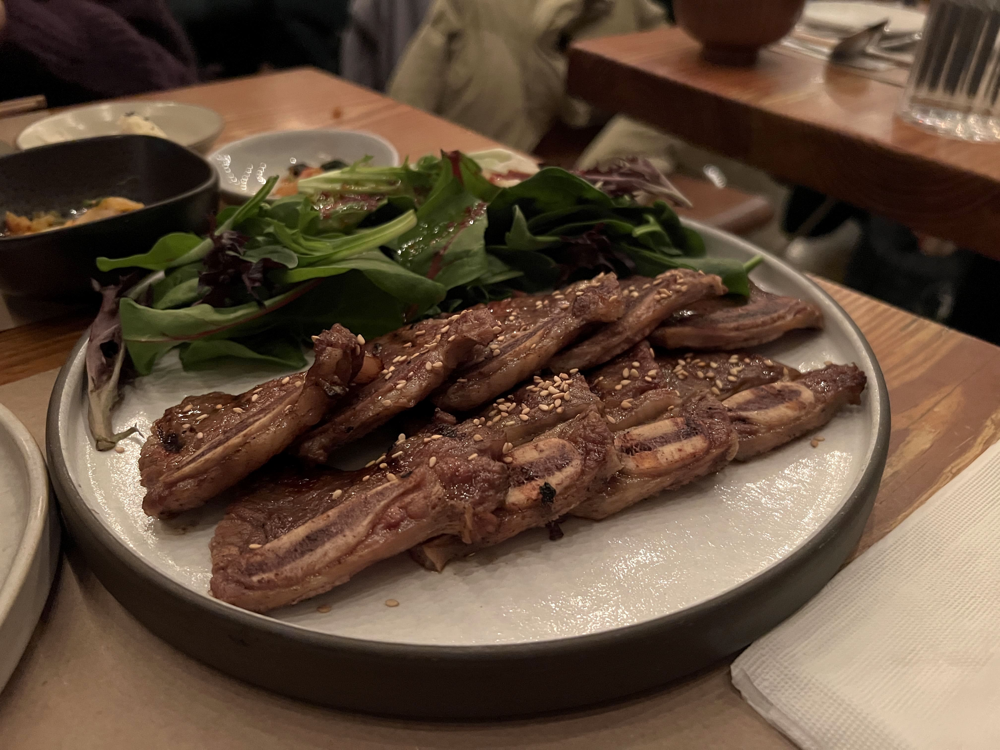
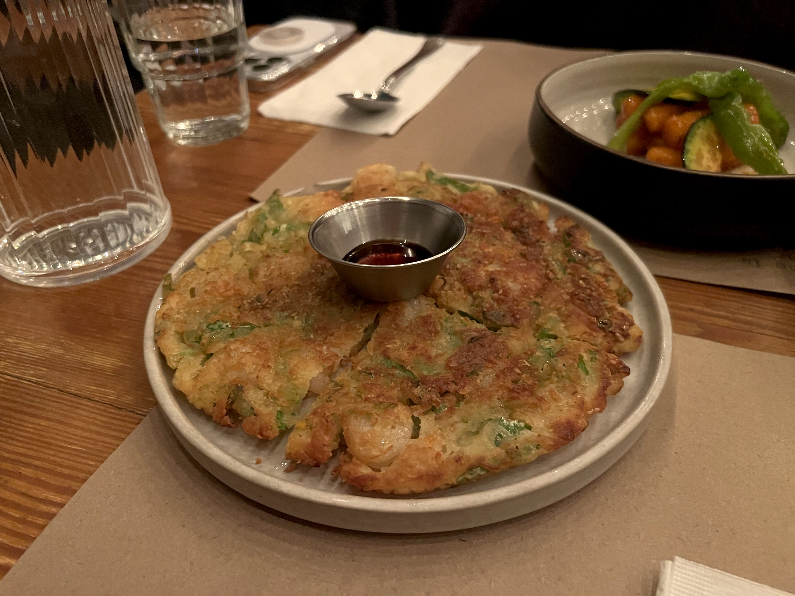
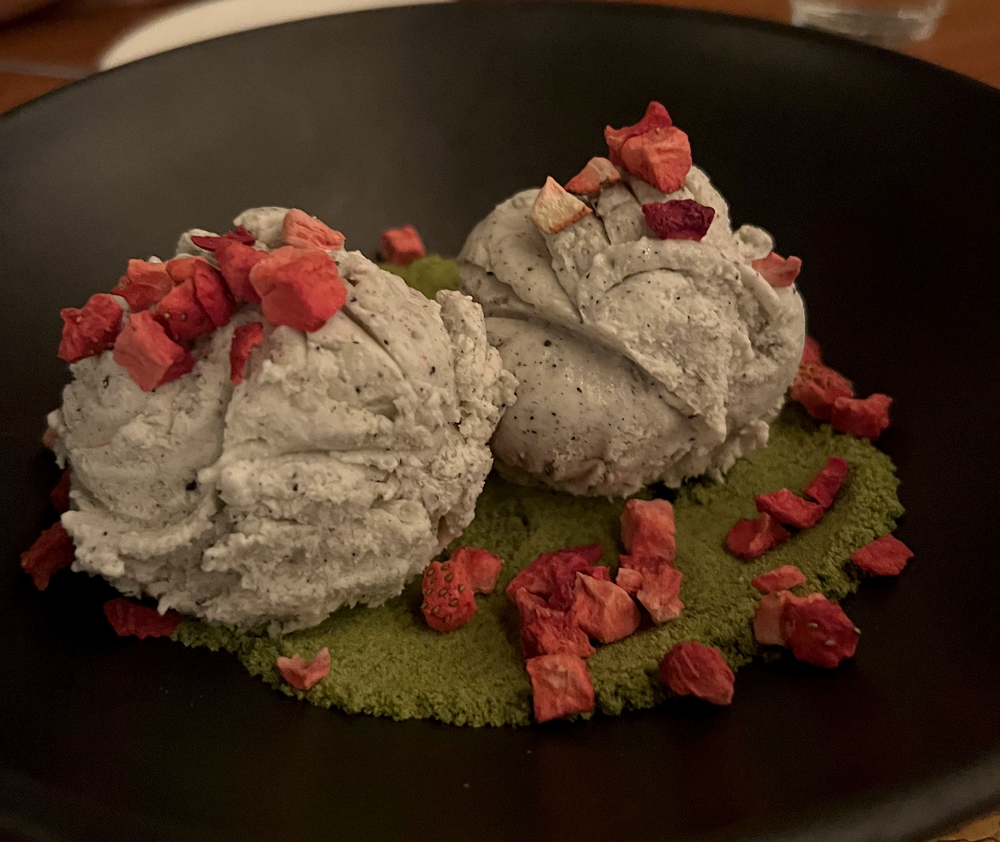

Her name is Han was the first NYC K-town restaurant introduced to me by one of my Korean-American friends, and probably one of the few authentic ones in the area he swears by. The wait gets rather long during peak hours, so if you can cop a reservation that's generally the way to go, or you can show up right at opening time and pray (that worked once for me too). They have a very minimalist interior design with the cutest dinnerware and menus, so bring your Polaroid camera if you have one!

They have pretty unique banchan, and it varies a little each time like most Korean restaurants.

    

 
One of the coolest appetizers they have is the ddeokkbokki - you might think it's basic, but hear me out - it tastes ~ very ~ different from other ddeokkbokkis. They kinda pan-fry(?) it in a way that gives it a crispy outer coating, and instead of making it super spicy and savory like a lot of Korean restaurants, it's actually a little sweet - and then they pair it with shishito peppers for a very interesting taste combination. Honestly the first time I tried it I was kinda taken aback, but the more times I ordered it the more it grew on me. I'd definitely recommend trying it out - although it might not be for everyone, it's truly a unique taste profile. 
  

    

 
They also have really good bossam:
  

    

 
And galbi. (Super tender and not tough at all!)
  

    

 
The seafood jeon was rather small (it was actually only shrimp instead of all the squid and clam varieties like a lot of other places), but I enjoyed it all the same.
  

    

 
And last but definitely not least, their sesame ice cream with matcha crumbles and freeze-dried strawberries was actually one of the most interesting desserts I've ever had. Not too sickly sweet, and just the right amount of dry and wet ingredients for each bite. Totally recommend if you're not too full after your meal!
  

    

 
Her Name is Han is definitely a must-try if you love Korean food - they have a mix of traditional dishes with their own unique twists. Although the food looks pretty upscale I think the price is actually pretty reasonable for the quality and portion size. Let me know what you think!

_tags: location/nyc, korean food, koreatown, ktown_

