Towards the end of the Taiwan trip, we took a little 3-day detour to Hong Kong! It was our first time there, and some of my friends have described Hong Kong as a bit similar to Taiwan, but I honestly felt it was quite different, possibly in part because Taiwan feels so familiar to me whereas in Hong Kong I was very much a tourist.

We did the usual first-timer sightseeing destinations, such as Victoria Peak Tram, Lantau Island & Big Buddha, and Mong Kok. The view at Victoria Peak was truly beautiful - even though it was foggy that day, in a way it made the atmosphere more surreal and picturesque.

    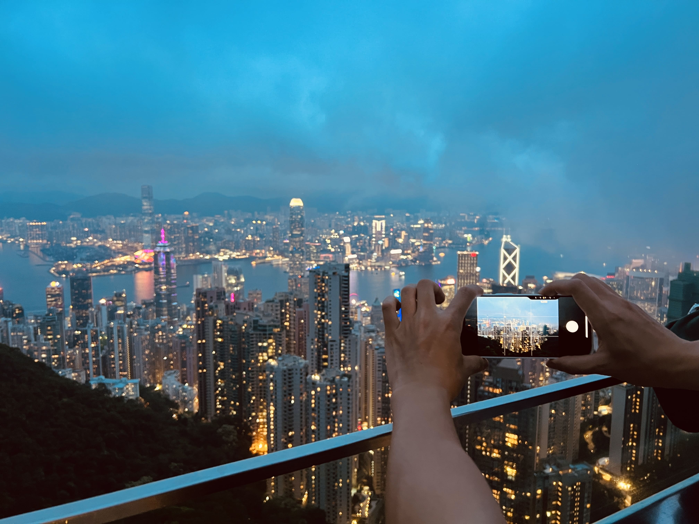
    <small>View at the top of Victoria Peak</small>

The other sightseeing destinations were honestly just okay to me - the Big Buddha was very big, but there wasn't much else interesting to do in Ngong Ping. Mong Kok was a bit chaotic and overwhelming to me, although I could see the novelty if someone had never been to a street market in Asia.

Now, onto the food that we tried, in chronological order:

<h2>1. Bakehouse (Tsim Sha Tsui location)</h2>

    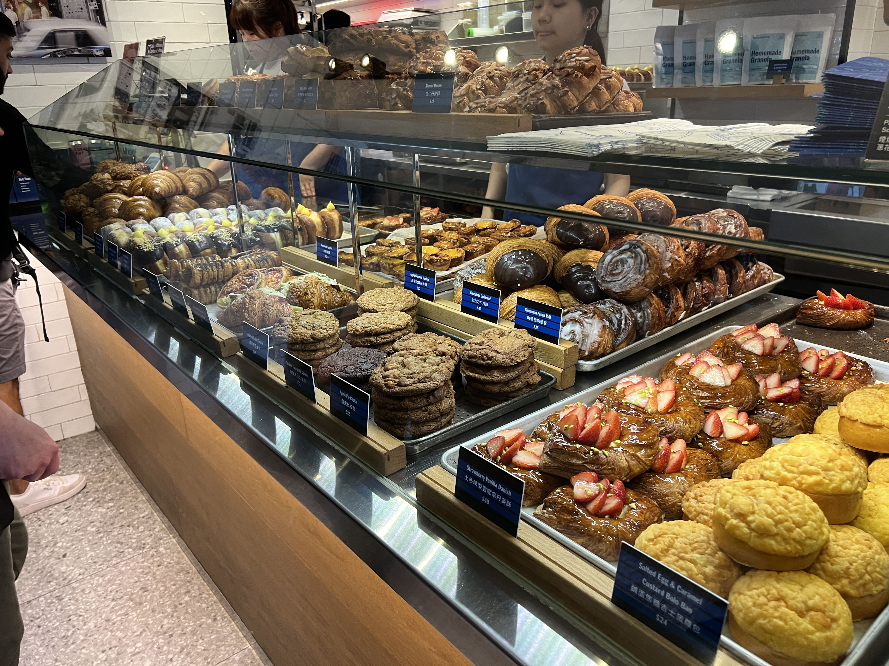
    <small>Bakehouse in TST</small>

I was extremely hungry after the flight, going through customs, and finally checking in to our hotel in TST, so we stopped by the famed Bakehouse first for some egg tarts. Bakehouse fans might kill me for saying this, but I thought the egg tarts were just okay - they didn't make much of an impression on me. I'm also not the biggest sweets / bakery / pastries fan, so that could explain why the appeal just wasn't there for me.

_Worth it_? Soft yes. Given that it takes up minimal stomach real-estate, I'd say that it's still worth a try, especially if you like pastries!

<h2>2. Pepper Lunch (Hysan Place)</h2>

No photos needed for this because Pepper Lunch is everywhere. In hindsight if you have only three days in Hong Kong, maybe try something that's not Japanese fast-casual franchise... but honestly in my defense I was hungry after the Victoria Peak Tram and it was comforting to eat something familiar.

_Worth it_? Soft no. If you have limited time in HK, try something more local.

<h2>3. Tao Heung Restaurant (Tsim Sha Tsui)</h2>

The Google reviews for this place are abysmal but it was near our hotel and we were craving dimsum so here we went. I honestly thought it was not bad? The chang fen was good, and they had these cute character buns.

    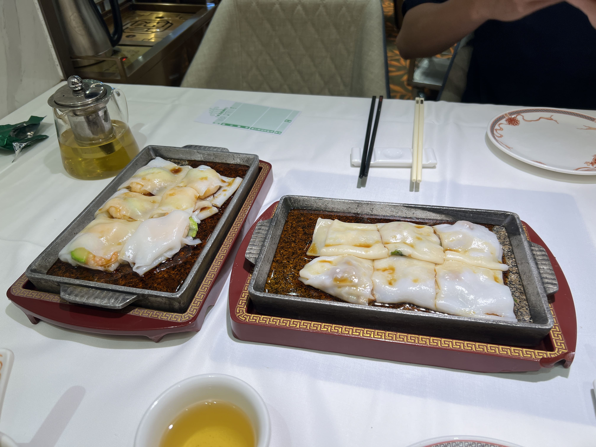

 

    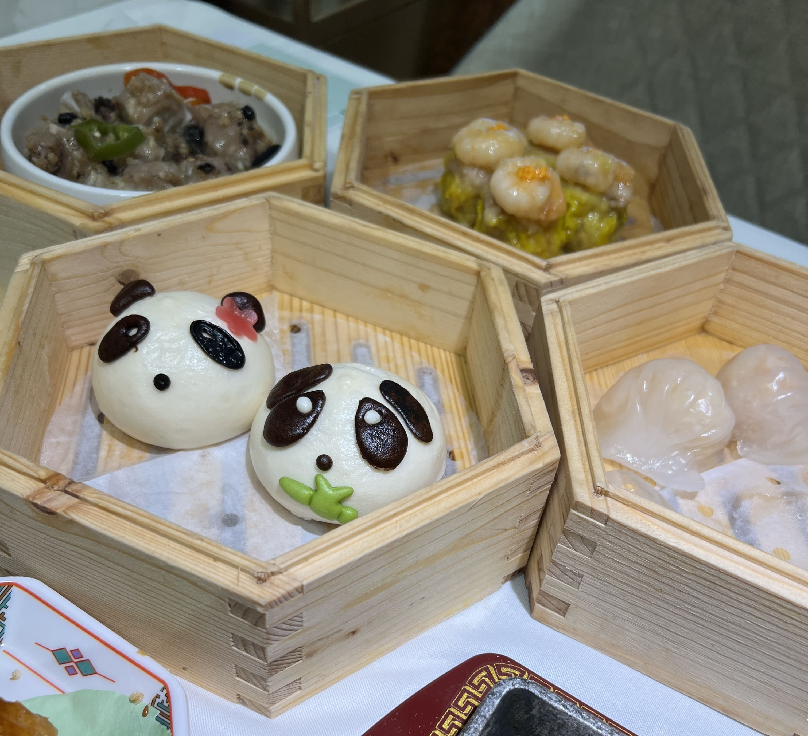
    <small>Tao Heung in TST</small>

This was also the first time I learned that many restaurants in Hong Kong don't provide you napkins for free (it costs money if you want to buy from the restaurant...) so many people carry around tissue packs.

All in all, this place wasn't anything in particular to write home about, but it satisfied our dimsum craving, and everything we ordered was solid.

_Worth it_? Soft yes. If you're nearby and want dimsum, I think it's worth a shot!

<h2>4. Kwan Kee Clay Pot Rice (Sai Ying Pun)</h2>

Run, don't walk for Kwan Kee! We arrived at around 6:30 PM on a weekday and were surprised that there was no wait (although it was definitely bustling inside), given the virality of the restaurant.

    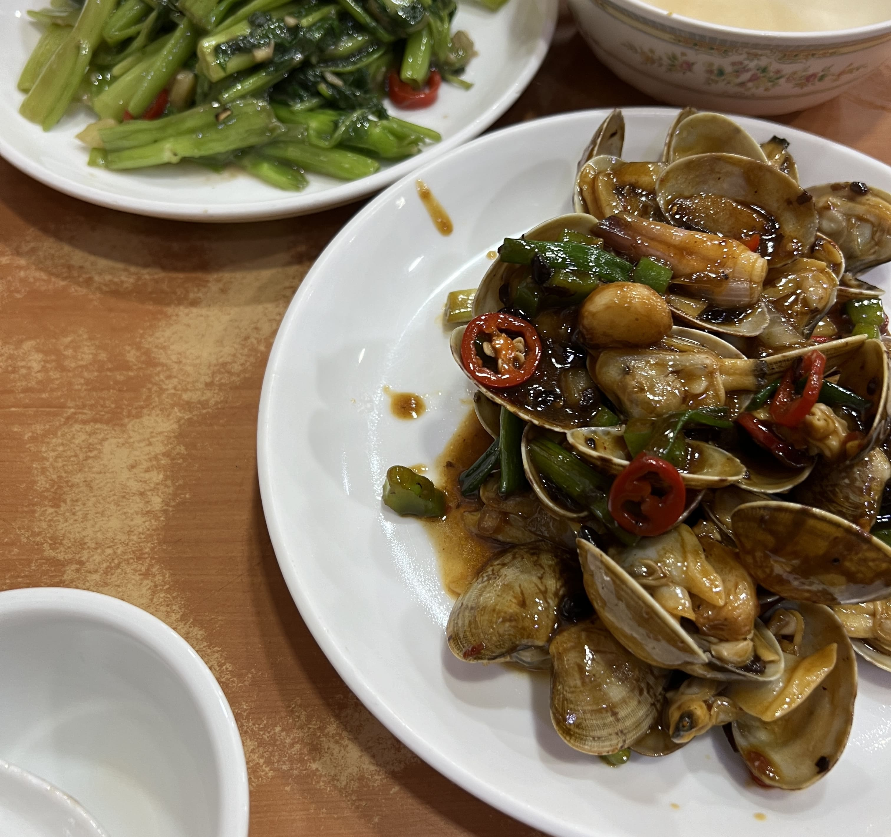
    <small>Stir-fried clams and vegetables at Kwan Kee</small>

The stir-fried dishes came first since clay pot rice takes a while. Both of these dishes, although simple, were astonishingly good, and the portion size of the clams dish was massive - most stir-fried clam dishes leave me wanting more, but I ate to my heart's content with this one.

    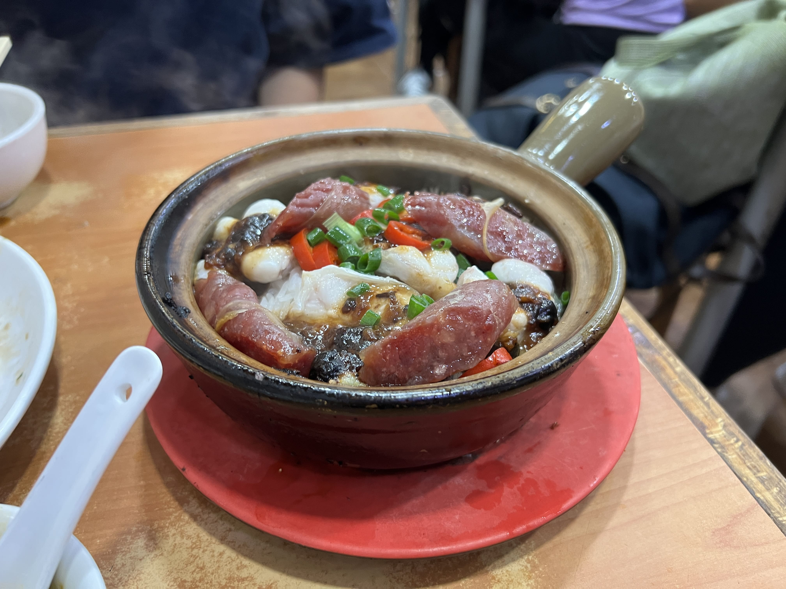
    <small>Sausage and eel clay pot rice at Kwan Kee</small>

For clay pot rice, we ordered the sausage and eel clay pot. It wasn't one of the pre-set options on the menu, but they have a bunch of different toppings and you can honestly mix-and-match whatever you want. And it was SO GOOD! This was genuinely the best clay pot rice I've ever had - perfectly seasoned, perfectly crispy on the edges, and just delicious through and through. I used to never understand the hype about clay pot rice but right then and there I realized it was just that I'd never had good clay pot rice.

_Worth it_? YES!

<h2>5. Waso Cafe (Tsim Sha Tsui)</h2>

Waso Cafe is a popular cha chaan teng chain in Hong Kong, and we dropped by on our second morning for a quick and easy breakfast. Most of the menu items honestly felt a little strange to me (macaroni soup?) but who am I to judge? The bolo bao with butter and ham ended up tasting pretty good, and the other items (preserved pork sandwich, chicken wings) were just alright. The HK milk tea was what you'd expect from a cha chaan teng.

    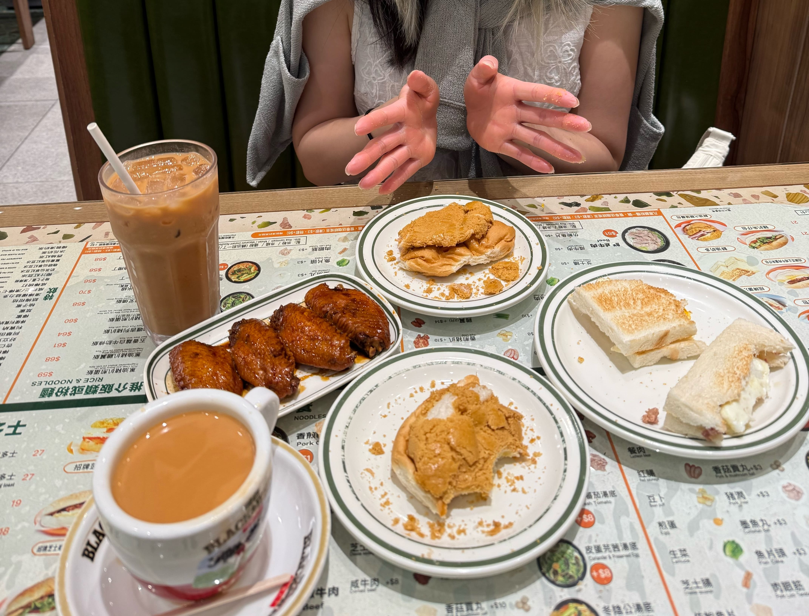
    <small>Waso Cafe in Tsim Sha Tsui</small>

_Worth it_? Neutral - didn't feel particularly special but does the job.

<h2>6. Mak Man Kee (Jordan)</h2>

This place has a Michelin Bib Gourmand, so our expectations were high. We both ordered dry egg noodles - one chashu, one wonton. Unfortunately, the experience fell a little short for us, but it's possible that we didn't order the right things.

    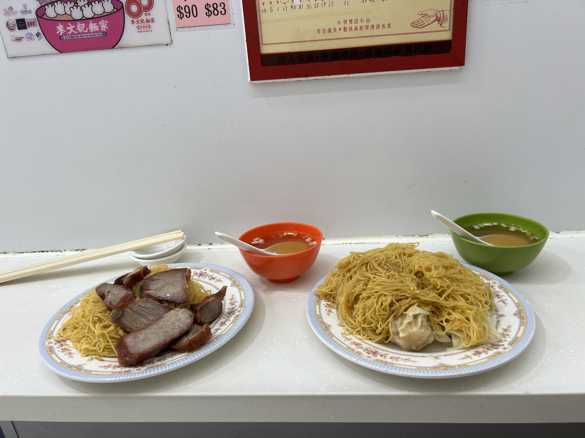
    <small>Mak Man Kee noodles in Jordan</small>

_Worth it_? If I were to go again, I'd probably want to try the soup noodles since that seems like what it's known for. Dry noodles are a pass.

<h2>7. Gwing Kee Roasted (Tsim Sha Tsui)</h2>

For our very last meal in Hong Kong, I wanted cha chaan teng, and my partner wanted siu mei... so we did both!

Gwing Kee Roasted is a no-frills siu mei place with lots of options. We got a plate with all three of the most popular ones: char siu, roast goose, and pork belly. I'm not a big siu mei person but I do appreciate a good chashu, and honestly all three of the meats were quite delicious.

    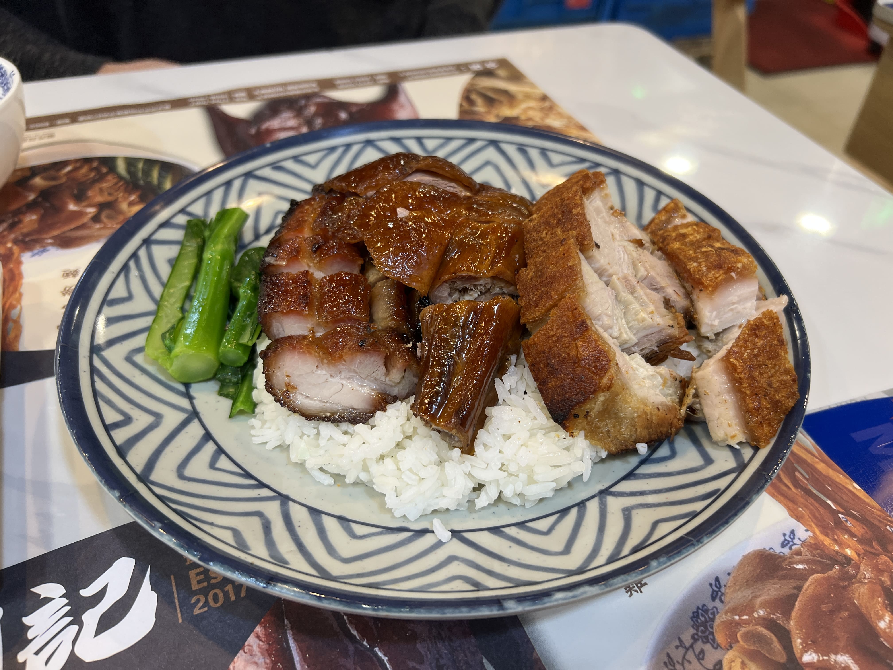
    <small>Siu mei at Gwing Kee TST</small>

_Worth it_? If you're looking for siu mei, totally!

<h2>8. Lan Fong Yuen (Tsim Sha Tsui)</h2>

I'd been hearing left and right about Lan Fong Yuen's famed HK milk tea and was determined to try it before we left Hong Kong. The Tsim Sha Tsui location was hidden on the underground level of a building, and inside was honestly pure chaos. Luckily the wait wasn't long - we were seated pretty much immediately.

We decided to get two iced HK milk teas, french toast, and a buttered bun. The carbs were what you'd expect - comforting but nothing too crazy. The hype for their Hong Kong milk tea was definitely well-deserved though. It was probably the best HK milk tea I've ever had.

    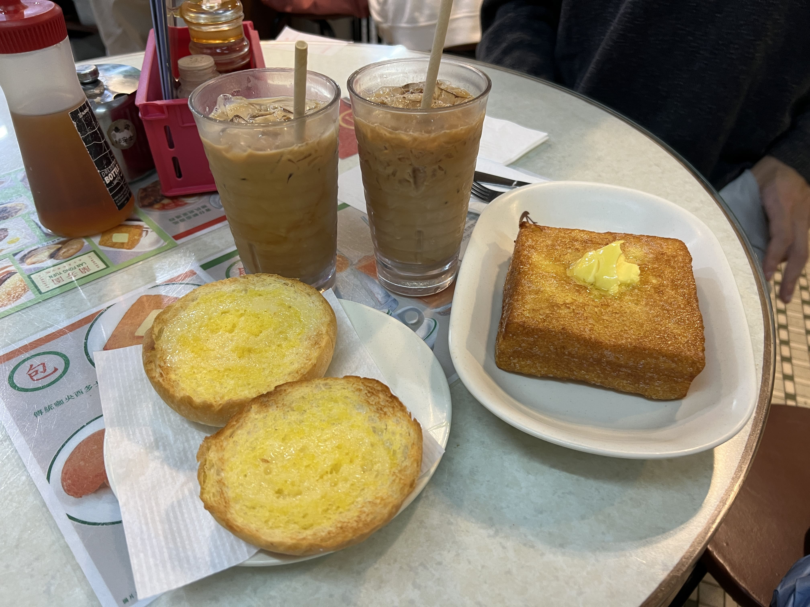
    <small>Lan Fong Yuen TST</small>

_Worth it_? YES!

<h2>9. CHAGEE (K11 ART MALL)</h2>

Although this wasn't our first time getting CHAGEE on this trip, it was sadly our last. I'd never seen CHAGEE before in the US nor in Taiwan so I'd been curious to try it (admittedly also partially because of the insane crowds around it) and it was genuinely very, very good. The tea aroma is very strong, and the floral flavors they infuse the milk tea with come through cleanly and delicately.

    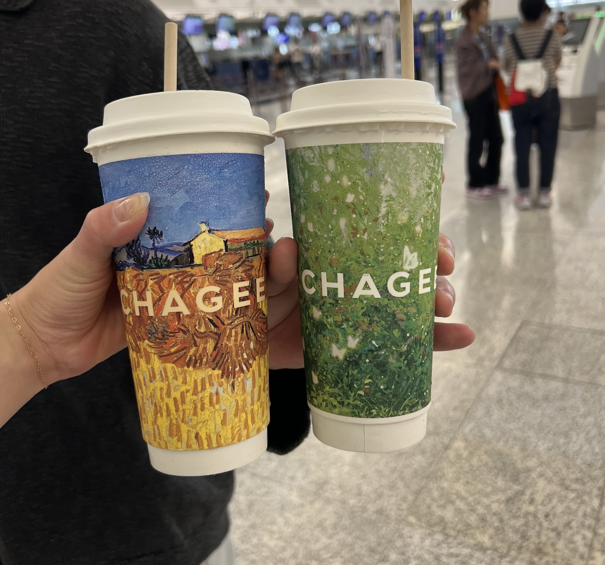
    <small>CHAGEE</small>

_Worth it_? YES, 10x over.

<h2>Overall thoughts</h2>

Admittedly, this trip to Hong Kong made me realize that I'm not a huge fan of Cantonese food - a lot of the flavors lean sweeter and lighter, whereas I love bolder, heavily-spiced foods like Taiwanese popcorn chicken or Sichuan-style mala dry pot. Nonetheless, the clay pot rice really stood out to me as a highlight - if I ever visit again, you can bet you'll find me at Kwan Kee.

_tags: location/hong_kong, travel, food recommendations_
