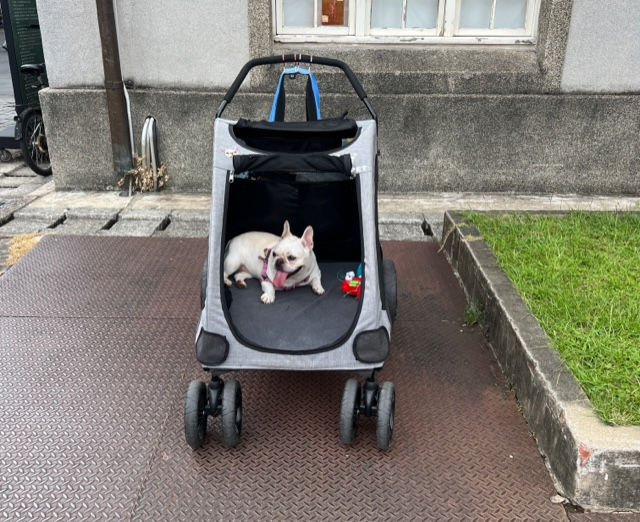

Been wanting to visit Huashan for a while and finally got the chance! It's basically a collection of small artisanal stores and exhibitions along with a street fair (carnival?) and a movie theater. The moment you walk into the area, you're greeted with aesthetic storefronts, buskers, and a plethora of citygoers walking their dogs. It's what you would imagine Etsy-but-in-real-life to be, but with _much_ lower prices.

One of the first stores (markets?) you might encounter is The Gala Asia (未來市). Inside you'll find aisles and aisles of white carts, each filled with artisanal goods made from different independent artists and businesess. There's everything you could possibly imagine, from cuticle oil to woodwork animals to handmade scarves to dried fruit and candy.

    

This market also contains an actual restaurant that sells some sort of mixture of Italian and Taiwanese cuisine. There's limited seating at the bar but you're welcome to sit in the comfy white sofas nearby.

    

I ordered a braised pork rice (luroufan) set as a mid-afternoon snack, and let's just say that the presentation was in line with the vibe of the place.

    

Post-food explorations yielded an adorable stationery/crafts/home goods shop with handmade cloth patterns, ceramic goods, greeting cards and post-it notes, among other things.

    

Also found a cute bookstore tucked away on the second floor:
 

    

And a bulldog chilling in a stroller:

    

There were honestly lots more that I didn't take pictures of, since I think sometimes independent artists and shops aren't really comfortable with people randomly taking photos of their things (some places had no photography signs). There was another market near the stationery/crafts/home goods store with bags and jewelry that I also super recommend - especially a shop called Once Upon a Time (鹿角兔) with the absolutely most gorgeous earrings and perfumes. 

All in all Huashan is a definite go-to if Etsy and popup shops and NYC Union Square Holiday Market stuff is your thing! ☆

_tags: location/taiwan, huashan 1914 creative park, taiwanese food, taipei, artisanal crafts and goods, dog_