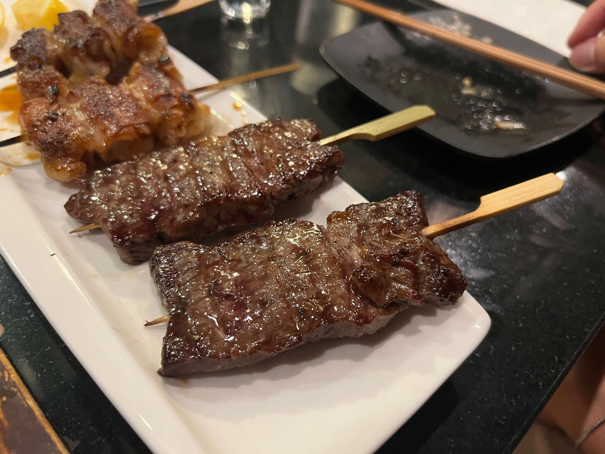

After my mind-blowing experience at Genki Izakaya in D.C. last month, I was on the trek to find the best yakitori in NYC.

Izakaya Toribar is located in the enclave of Japanese businesses in Midtown East, with a dimly lit, rustic interior and an elevated bar seating where you can watch the chefs grilling right in front of you (behind a glass divider, though).

The waiters even give you a little paper slip to mark the yakitori and kushikatsu that you want, and you can choose between sauce vs. shio seasoning. Probably the most authentic of the yakitori places I've been to so far.

First to arrive on the table was the ももネギま (chicken thigh with scallion):

    

Always a safe option, and it was great (and less scallion than the other ones I've had, which is good for me, a self-proclaimed vegetable-hater).

Next was the okonomiyaki お好み焼き - I'm not an expert on what makes good okonomiyaki, but this one was pretty good.

    

Third - asparagus wrapped in pork belly アスパラ豚 - I ordered this in a futile attempt at consuming some veggies at a yakitori place, but it was actually really good. Usually not a fan of asparagus, but somehow wrapping them in pork belly makes them 1000x better.

    

Okay now this upcoming one - mochi wrapped in pork belly 餅豚 - was my absolute favorite. I didn't know what to expect for it, but it was so many flavors and textures at once, and the mochi absorbed the flavor of the sauce and the pork grease and it was so wonderful. (The friend I went with agreed.)

    

Obligatory short rib カルビ order - tender and juicy, this one was also impressively tasty.

    

Finally, last but not least, we got the エビ ebi. If you remember my post about my last ebi experience, you may have remembered that my singular complaint was that the shrimp came peeled and beheaded. Well, I got what I wanted this time - full shrimp, entire shell intact, with its little beady eyes staring right back at me.

    

It was slightly terrifying to eat, (don't think I've ever eaten shrimp shells intentionally) but I managed to eat 75% of mine. Biting through the crunchy, seasoned exterior and feeling my teeth sink into the soft flesh of the shrimp was certainly an experience, and I actually really enjoyed it when I wasn't thinking too hard about the shrimp's beady little eyes centimeters away from my face. I would've put it as my second favorite, right behind the mochi wrapped in pork belly.

Despite the prices being slightly heftier than I expected, Izakaya Toribar is probably one of my new favorite places in the city. Perhaps next time I go, I need to push myself even more out of my comfort zone and try the liver or the heart yakitori, but I'll definitely still be ordering the mochi and the ebi again.

_tags: location/nyc, japanese cuisine, izakaya, yakitori_
