I'm usually pretty skeptical of Sichuan cuisine in Taiwan because the average Taiwanese person's spice tolerance lands somewhere between "a singular fleck of chili pepper powder and my tongue is on fire" and "hot cheetos is the absolute maximum that I can handle." That being said 開飯川食堂 Kaifun Together was a surprisingly lovely experience. Not 100% authentic for sure (they can't lose out on customers of the hot cheetos-fearing population) but they definitely implemented their own Taiwanese twist on traditional Sichuan dishes.

There are multiple locations across Taiwan, and I tried the Kaohsiung location as well as the Yilan location. The quality didn't have any noticeable differences, so this review is specifically for the Kaohsiung location.

We had a party of six, so we ordered the 5-person set (lol). You can also order individual dishes, but the menu is quite long, so for large parties it's probably easier (and maybe cheaper?) to order a set. You are still allowed to choose between 2-3 options for each "category" of the set, so it's pretty flexible.

For our appetizer, we got the marinated cabbage (not pictured) and the century egg tofu with pickled pepper (pictured below). This is a common Sichuan appetizer and their version didn't differ too much from the usual. It was a little spicier than I had expected, to my pleasant surprise.

    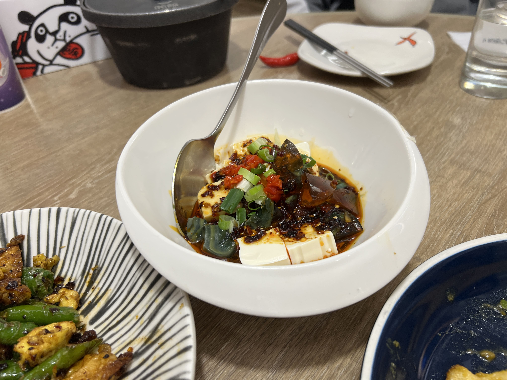

Next up was the cold dish selection, for which we chose the poached pork belly with garlic soy sauce and chili oil. This one is also a common Sichuan dish with varying sorts of visual presentation - I appreciated this one with the floral arrangement of the cucumber slices. This dish was definitely less spicy than the usual fare I'm used to, but the flavoring was nonetheless fantastic.

    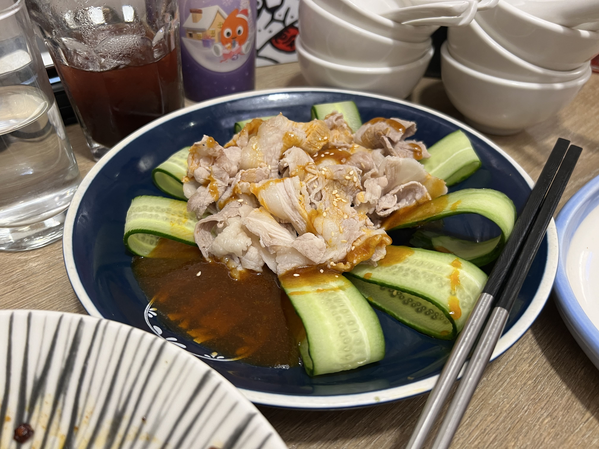

The third item didn't give us a selection: the chicken with sesame paste, chili oil, and peanut (口水雞). This one is also a popular Sichuan dish, but the restaurant definitely adapted it for Taiwanese tastes. It was drowned in sesame and peanut (which Taiwanese people _love_) and it was not spicy at all. The dish was still fine to me, but definitely not one of the standouts in the set.

    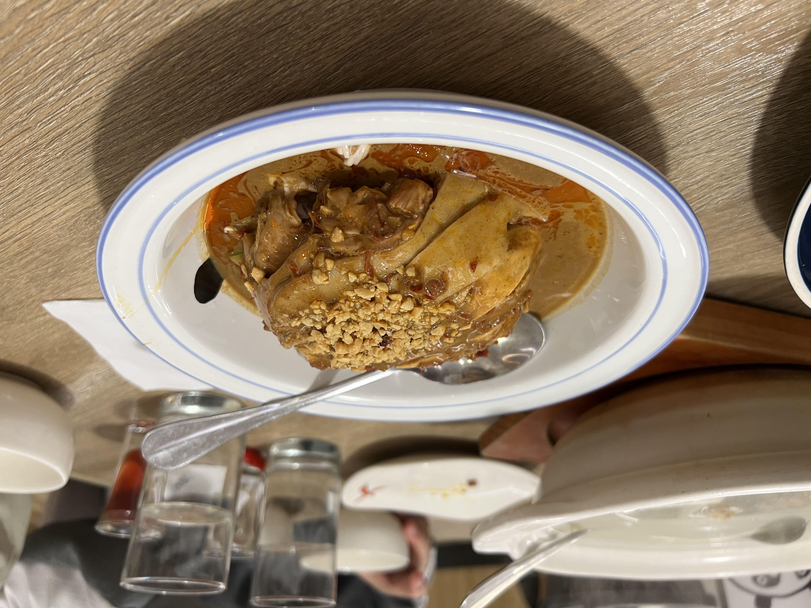

Fourth, for the "dry pot" item, we ordered the braised shrimp, tomato, and wood ear mushroom with rice crust. This was a very interesting dish that I had never seen before, especially the "rice crust" which was basically slabs of rice crackers stuck into the pot. I'm guessing it's probably a dish they created themselves. I also thought this one was a bit mid.

    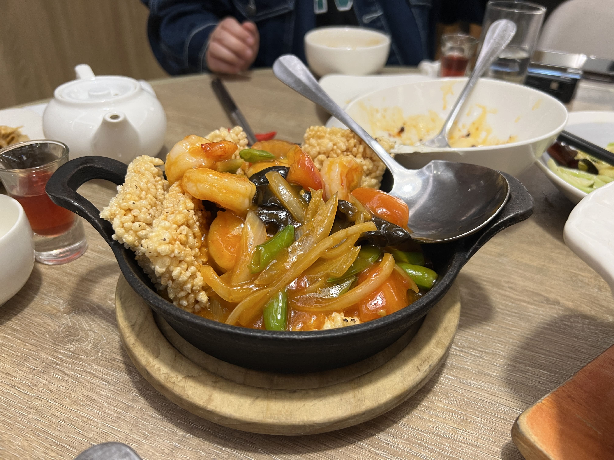

Next, we had the meat dish selection, which we chose the kung pao chicken. Didn't have particularly high hopes for this one as kung pao chicken in Taiwan is always rather disappointing from my personal experience, but this one actually blew me away! I couldn't stop eating this place's kung pao chicken. I probably ate about half the dish. It was also spicier than the others, which I appreciated.

    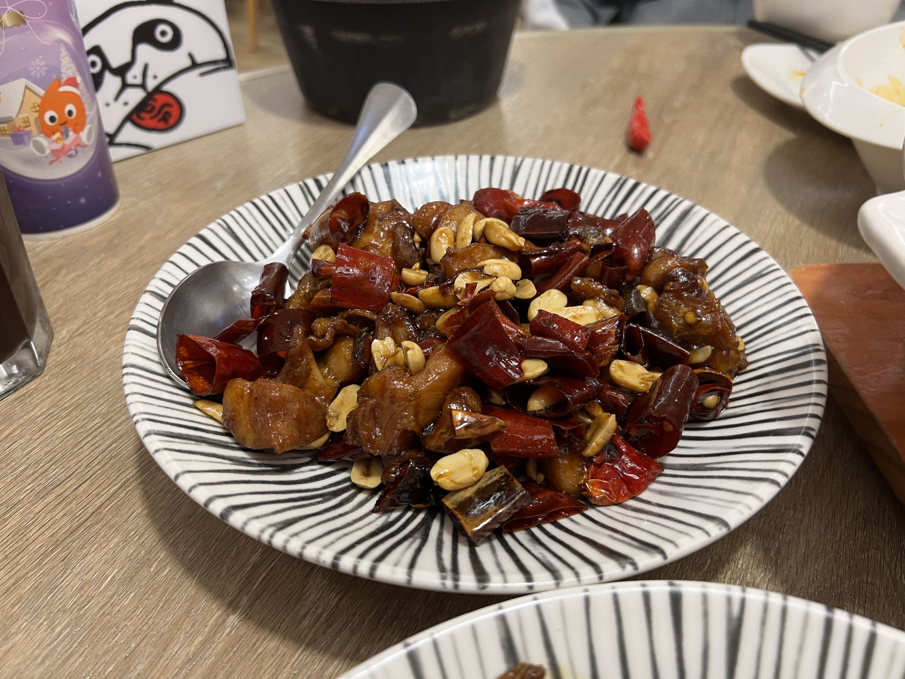

For the seafood dish, we got the steamed halibut with crispy bean. This was one of their signature items on the front page of the menu and it looked really interesting, so we decided to try it. The presentation _was_ interesting, not particularly aesthetic (looked like a pile of dirt), but the taste and texture of the fish was slightly unpleasant in my opinion (no one else in our group liked it either).

    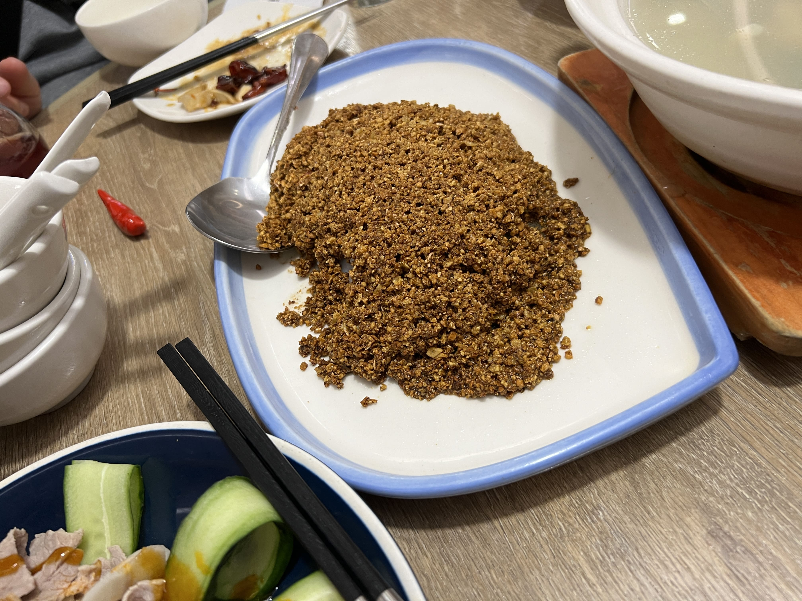

Next up was the vegetable selection, which we chose stir-fried cabbage. You can't ever really go wrong with this dish, and they did it very well. I would've ordered another plate of it if I wasn't so full.

    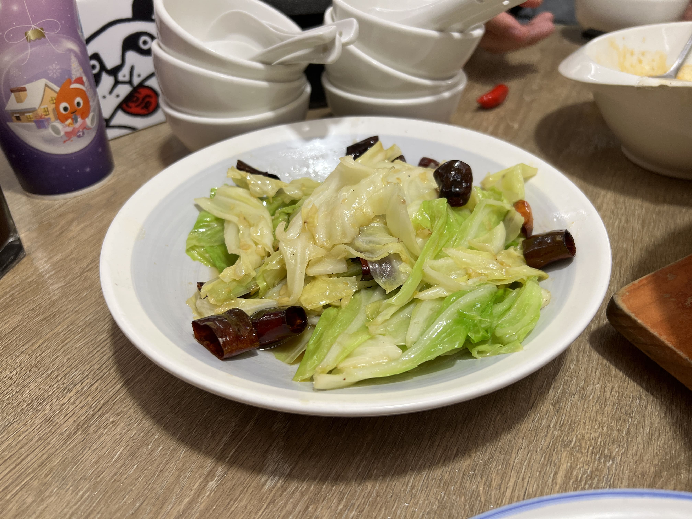

For the egg/tofu selection, we got the stir-fried egg with pepper and fermented black beans. I was very confused at first but the dish was actually phenomenal. This one was also pretty spicy, and the seasoning on the egg and the extra kick from the pepper and fermented black beans blended together in such a beautiful way.

    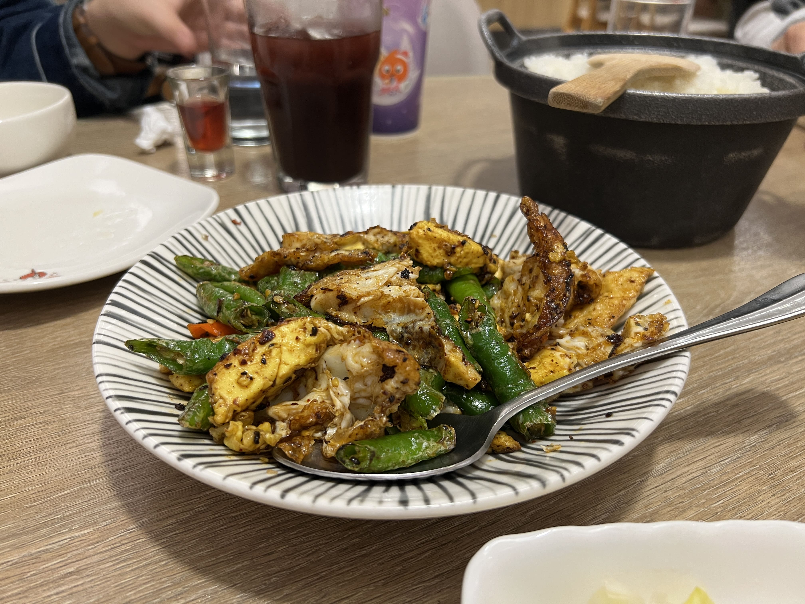

We also ordered something outside of the set menu, but my relatives _really_ recommended it. This was the stir-fried water bamboo with salted egg yolk. It looks unassuming, but this was actually one of my favorites of the entire meal. The refreshing juiciness of the bamboo paired with the crumbly, salty egg yolk was just the perfect combo! You'll understand when you get it.

    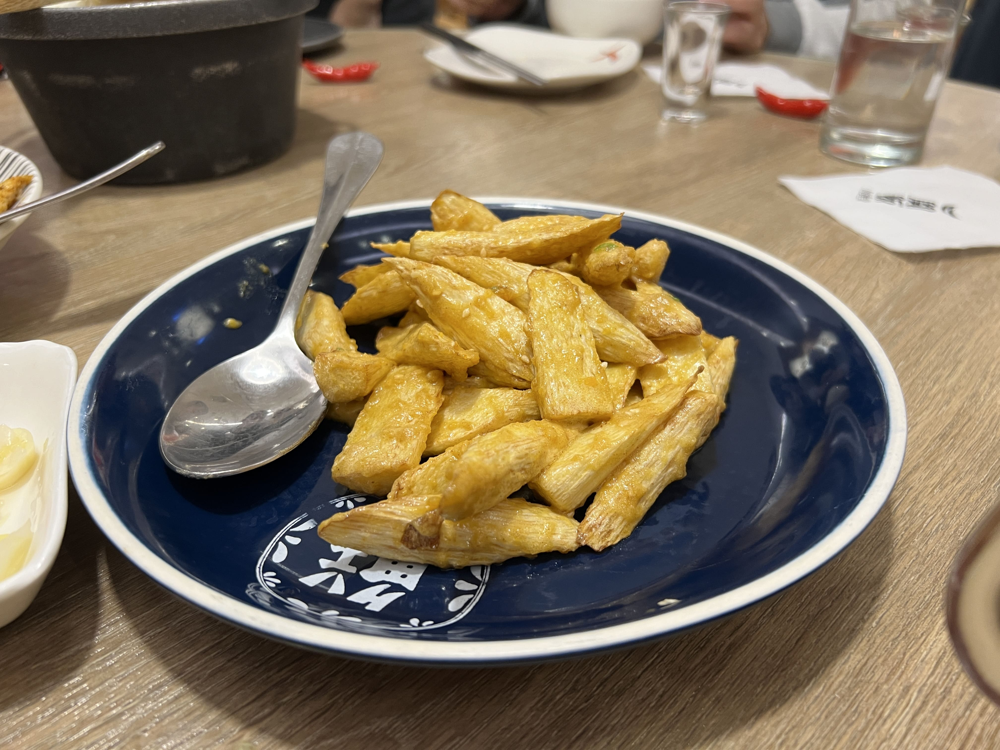

The set menu also includes a soup, which we chose the pork rib, clam, muishroom, and daikon radish soup. I don't remember drinking this one, but it looked... healthy?

    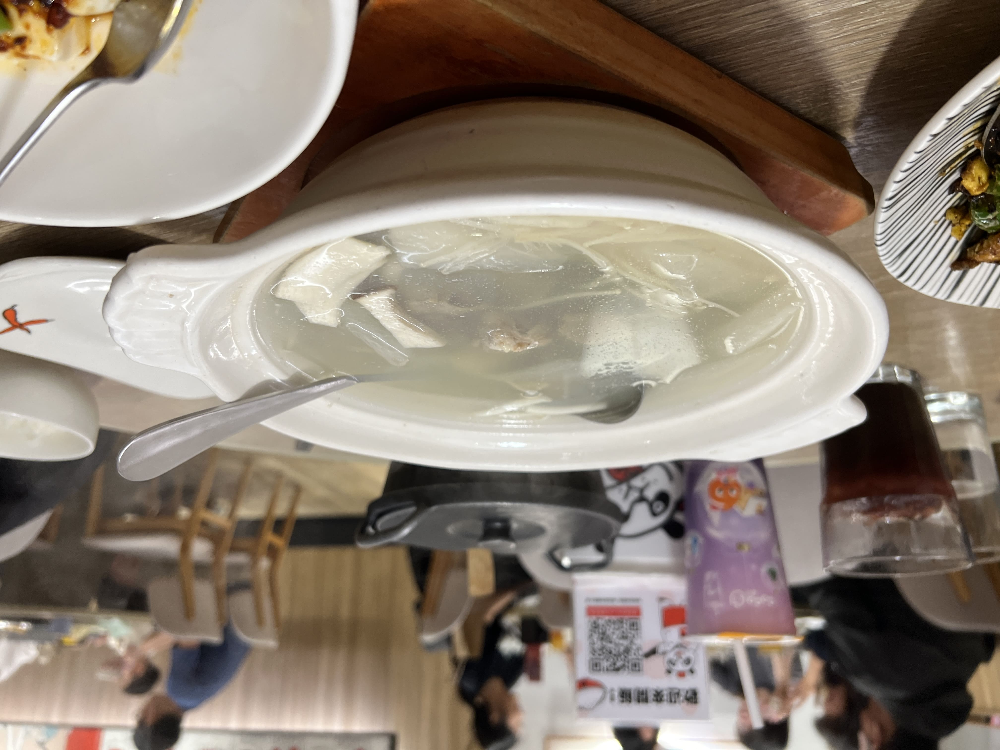

Last but not least, the set includes a tea selection and a dessert selection for each person. I got the Osmanthus Oolong (not pictured), which came in a little teapot and teacup set (so cute)! For dessert, I got the fairy grass jelly with cream, which came in the shape of a panda face.

    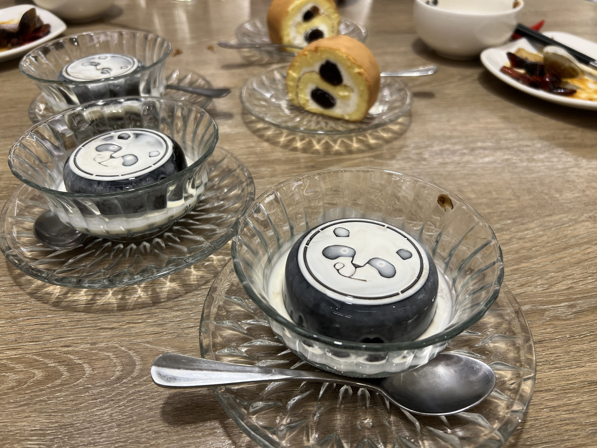

Conclusion - definitely a go-to if you're craving some spicy food in Taiwan. Stay away from the halibut, but go for the kung pao chicken, stir-fried egg, cabbage, and stir-fried water bamboo.

_tags: location/taiwan, sichuan food, taiwan, kaohsiung, yilan_
