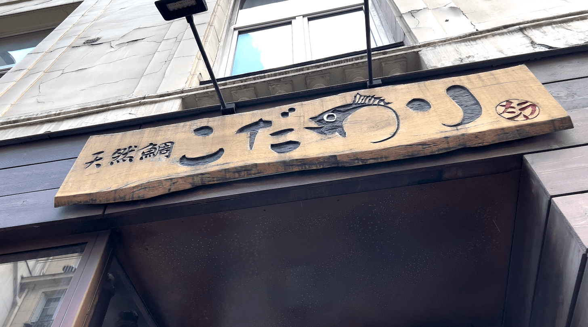
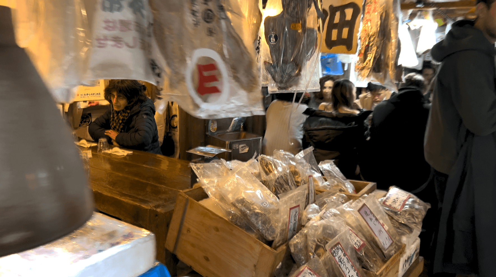
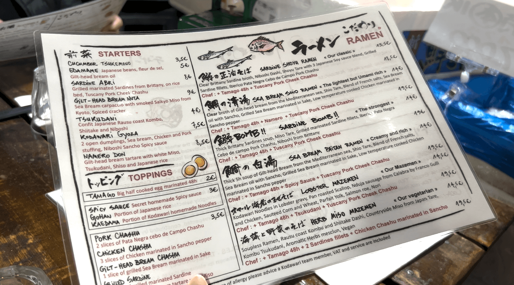
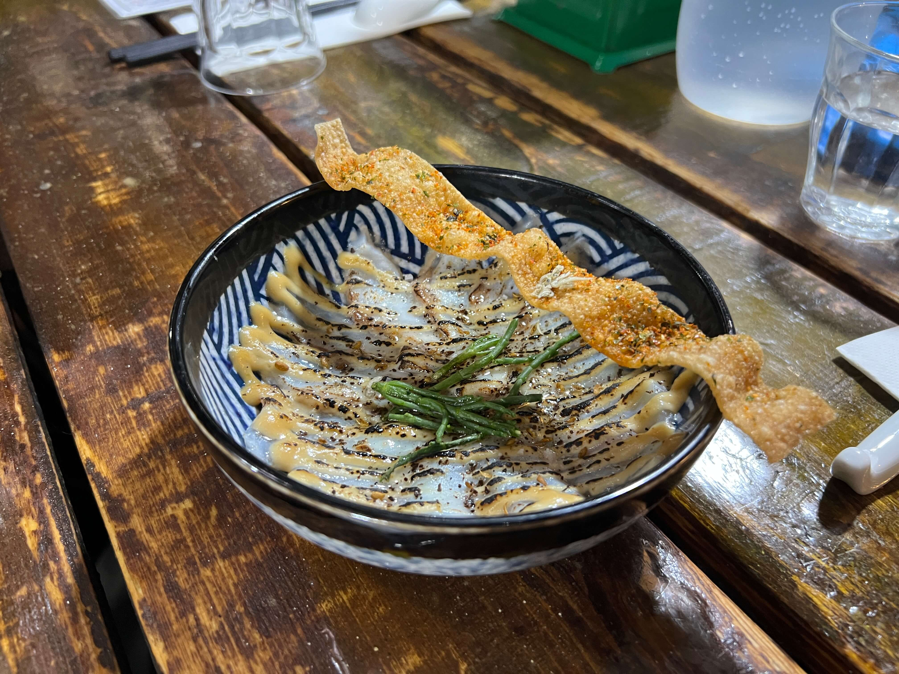
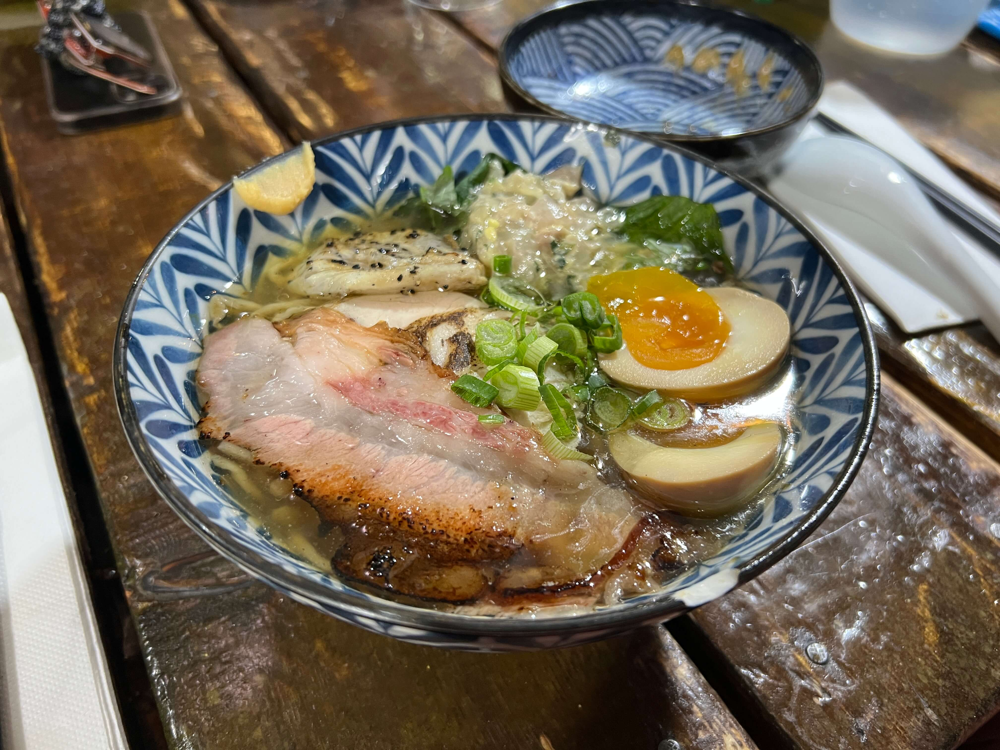
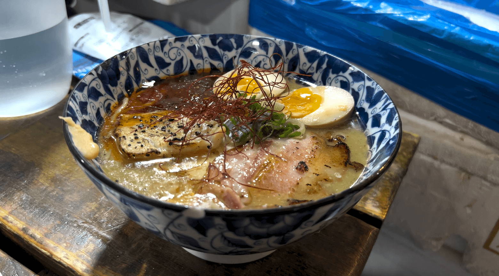

Stumbling through protest-ridden streets of Paris, starving at 3 PM in the afternoon from a multiple-hour excursion at the Louvre, my friend and I happened upon this small hole-in-the-wall-looking Japanese ramen restaurant a couple blocks from the museum.

    

Ok yes... I exaggerated a bit... I searched it up on Google Maps and saw it had good reviews before going. But despite already having somewhat high expectations, this place absolutely blew my mind. Specializing in fish-based broths as opposed to the typical tonkotsu or slightly edgier chicken broths, the interior of こだわり was made to look like a local fish market straight out of Japan. It was almost unsettling, the number of dead fish they had lying around in ice boxes (at least, until my friend informed me they were fake).

    

The menu was short and succinct - a few ramen options and a small selection of appetizers. I liked that they didn't try to specialize in different styles, a promising sign for top-notch quality ramen.

    

My friend and I shared the gilt-head bream nuta, a carpaccio with an umami twist. We both liked it a lot, and we were also starving, so we devoured the whole thing within seconds.

    

I ordered the sea bream shio ramen with additional chef's choice toppings - I usually don't go for shio since I typically like heavier ramen broths, but my interest was piqued by the sea bream. I seriously didn't know what to expect for a fish ramen, but this bowl exceeded whatever expectations I had in my subconscious. The flavor was light but definitely far from bland, and my favorite parts were the namero (a sort of chopped tataki) and by all means the broth. The blend of different ingredients was wonderful and perfect.

    

My friend got the sea bream paitan ramen (thicker broth) with additional chef's choice toppings. He said it was the best bowl of ramen he's ever had, no joke.

    

If you ever go to the Louvre, you _have_ to stop by this restaurant. Period. Trust me, it will not disappoint.

_tags: paris, france, japanese cuisine, ramen_
