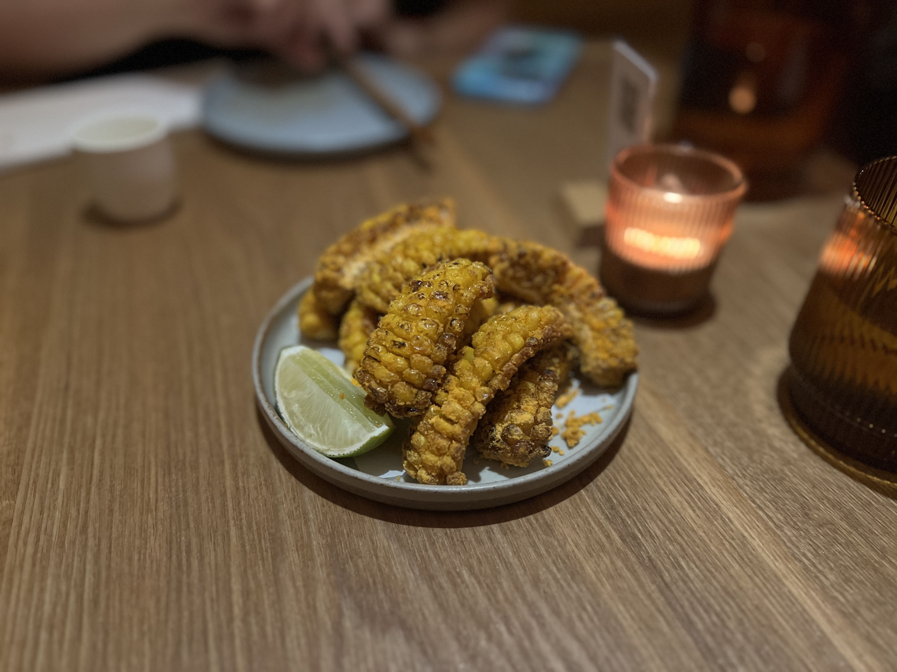
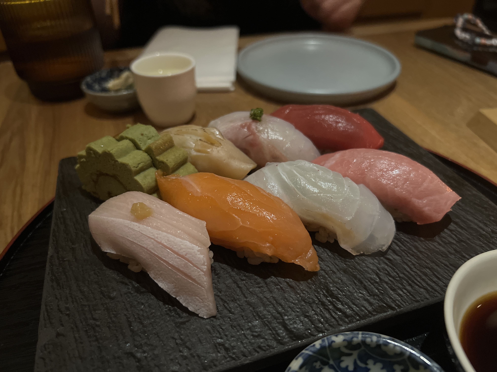
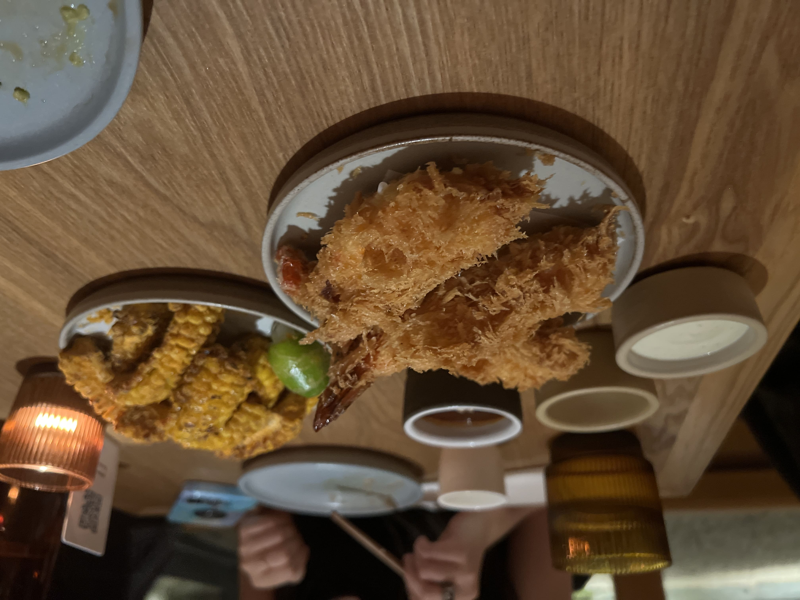
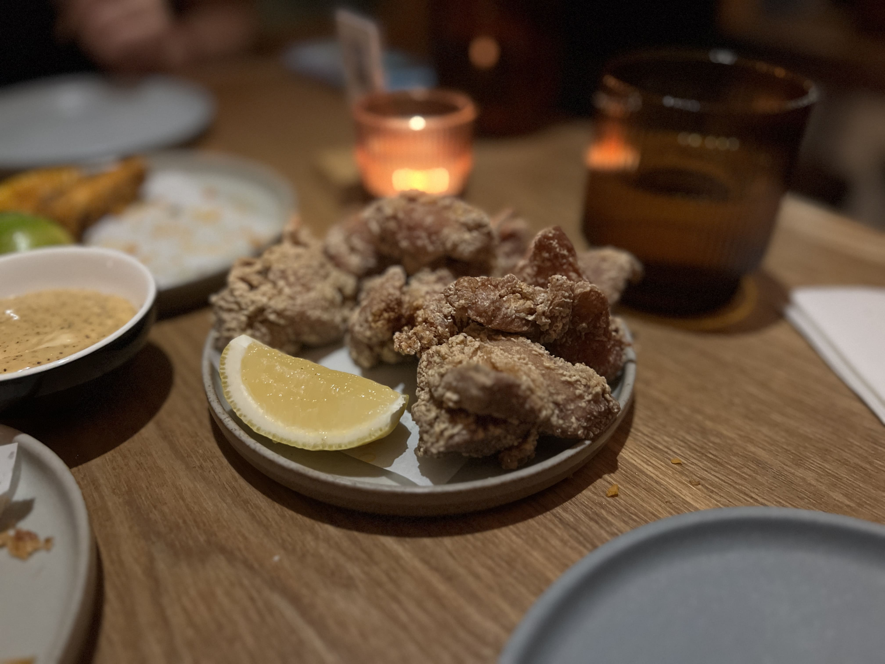

Konban had been on my list for a while but I'd always found a myriad of reasons not to go - reservations too hard to get, non-traditional-looking menu, etc. In the end it was clear my avoidance boiled down to one thing - I live on the East side, and konban is in Chelsea. Why would I take the L to get dinner when there are plenty of good Japanese options in Turtle Bay and St. Marks?

Nonetheless I found myself there on a fall evening with my friend. To start, the interior was beautiful (I missed the chance to take photos, but Google Maps is your friend) and the minimalist vibes were very calming. The space is relatively cramped - not in an uncomfortable way, but in an "oh, there aren't many seats available in general so walk-ins must be hard" way. Luckily we had made a reservation ahead of time.

We ended up getting a few dishes and sharing everything tapas-style.

The first to arrive was the corn ribs. I didn't really know what to expect because I've actually never had corn ribs before, but these were really, really good. They were super crispy and bursting with flavor and I would totally have devoured another plate.

    

Next, we got a sushi set, which consisted of 7 chef's choice nigiri. Our plate included toro, yellowtail, salmon, and a few others. The fish was fresh and thickly cut. Only two of them had garnish on top - the others were essentially the fish as-is, which seemed to prove a point about their fish quality and taste standing on its own. It was pretty enjoyable - and I would be curious to try the sashimi platter next time as well.

    

We also got the ebi katsu, which I expected to be like shrimp tempura. Turns out it wasnt - it was deep-fried shrimp crusted with panko, as opposed to the light, fluffy frying batter that typically characterizes tempura. The shrimp was also much bigger and juicier in this version (king tiger shrimp) - overall a good dish, although I personally found it slightly uninteresting - would probably opt for the menchi katsu next time.

    

Last but not least was the karaage. You usually can't go wrong with this one, and konban's was pretty decent, although nothing too out-of-the-water.

    

Overall the standout dish was definitely the corn ribs, and the sushi was great as well. Next time I would want to try out some of the other appetizers (maybe the yellowtail crudo or the sabazushi), the mazemen, and the corn ice cream (yes you read that right). Of course, I would still order the corn ribs to round out the meal.

_tags: location/nyc, japanese food, chelsea_
