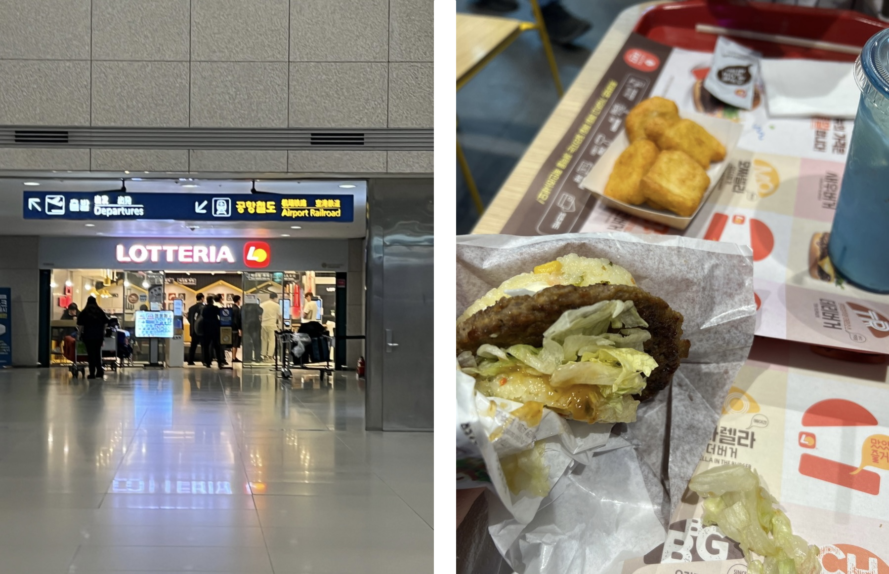
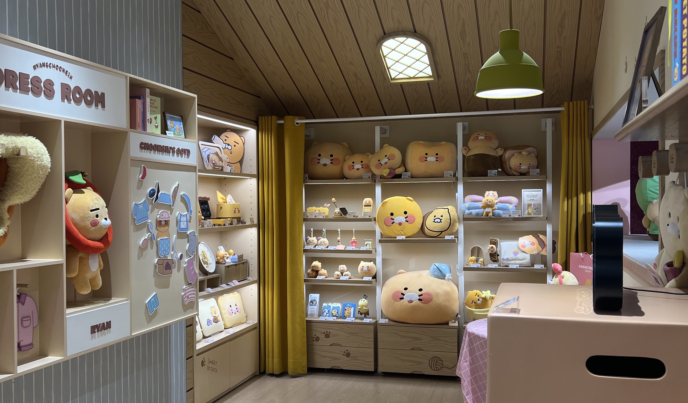
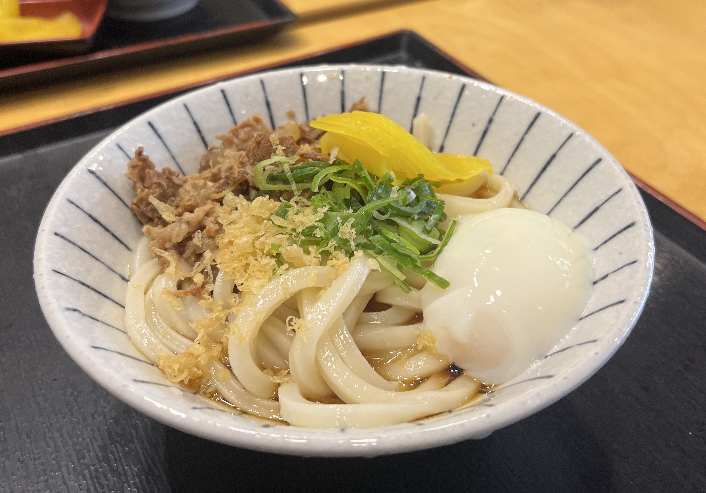
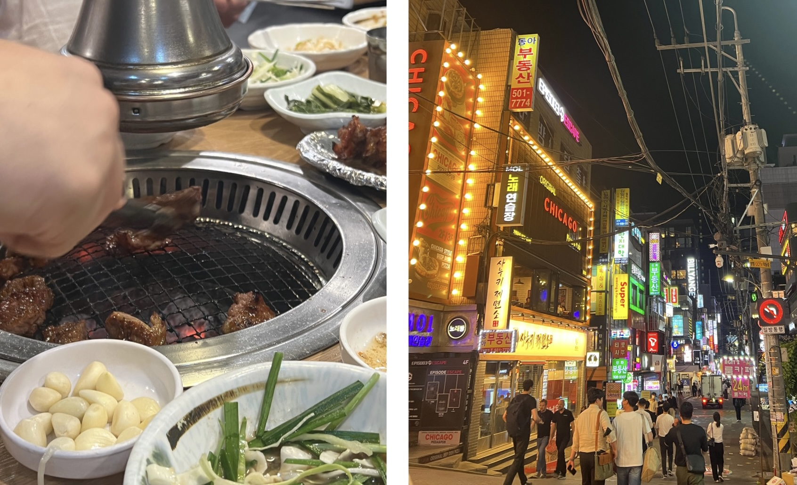

After my plane decided to ungraciously dump me in the middle of a new country a whole 1.5 hours before its scheduled arrival time, I was stuck in the Incheon International Airport 3:30 AM with no friends, no South Korean Won, no running trains, and no Korean language skills. Furthermore, there was barely anything open (as expected), and I spent half an hour wandering around looking for an operating Currency Exchange (thank god for the 24hr Woori Bank). After frantically texting my still-awake West Coast Korean-American chingu about how to load money onto my T-Money card, I finally arrived to Seoul Station around 7 AM to meet with a friend who had arrived the day before, and we decided to get breakfast inside the station at a fast-food place called Lotteria (which I am just finding out now... that Lotteria is a Japanese fast-food chain...)

    

The rice burgers were... INSANE. I got the bulgogi burger and some chicken nuggets as well as some kind of iced latte that just tasted like melted ice cream (in a good way). I'm not kidding when I say that I literally fell in love on the spot. Perhaps it was because I hadn't eaten for 15 hours before that, but I hadn't been back to Asia in a while and had nearly forgotten that Asian fast-food joints are always on a different level compared to the States.

Of course we dropped by a convenience store in Myeongdong and bought the iconic strawberry and banana milk bottles that you see in the kdramas. (In my defense... they were cheap...) Eventually we headed to Gangnam where our hotel (Ocloud) was. Obligatory pit stop at the Kakao Friends store:

    

And then it was time for lunch. By now the rest of my friends had arrived in Seoul, and we walked around for a while before settling on an udon (??!!!?!?!) place called Sanuki Noodle Factory (사누키 제면소). I was a little wary at first since here we were getting Japanese food as our first real meal in Seoul, but hey, it was actually really good, and really affordable too (~$6 for a bowl). 

    

After lunch everyone was tired (except for me, apparently) and napped in the hotel as my ADHD self anxiously fidgeted around before I simply gave up and headed out myself. I discovered that a Kyobo Bookstore was right across from our hotel and wandered in there for a bit, absorbing the vibes. It was pretty massive (2 floors) and had an assortment of mini shops inside selling home goods and stationery and jewelry, as well as a HOTTRACKS that sold shelves and shelves of kpop albums and records and classical CDs.

    

Dinner ended up being KBBQ at Cheongpyeong (청평숯불갈비), our first "real" Korean meal in Korea... at last. It was surprisingly inexpensive considering the quality and the amount of meat that we consumed (probably ended up being less than 15 USD per person?) and the server did all the cooking for us, which was fantastic. Afterwards we spent an hour or two walking up and down the streets of Gangnam absorbing the chaotic and lively city-at-night vibes and munching (licking?) on convenience store ice cream bars.

    

Although the first day wasn't extremely eventful, the food had already blown my mind not just because of how good it was but how cheap it was too. Despite the chaotic morning, this trip to Korea was off to a good start. ☆