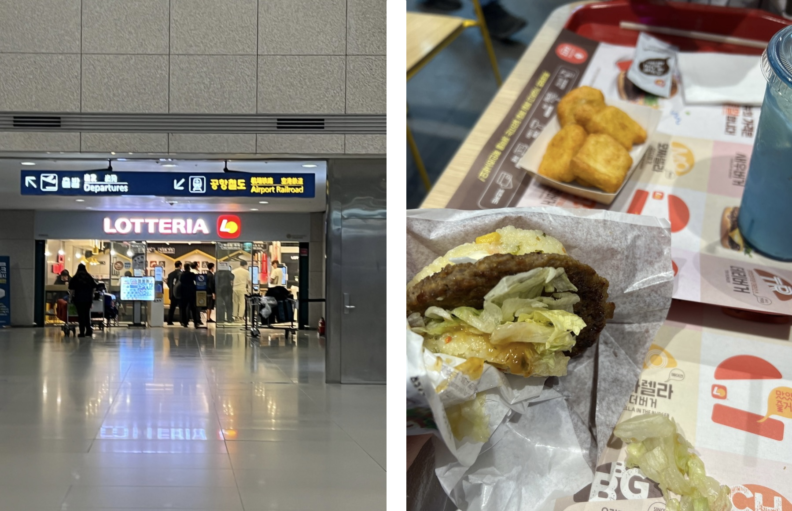
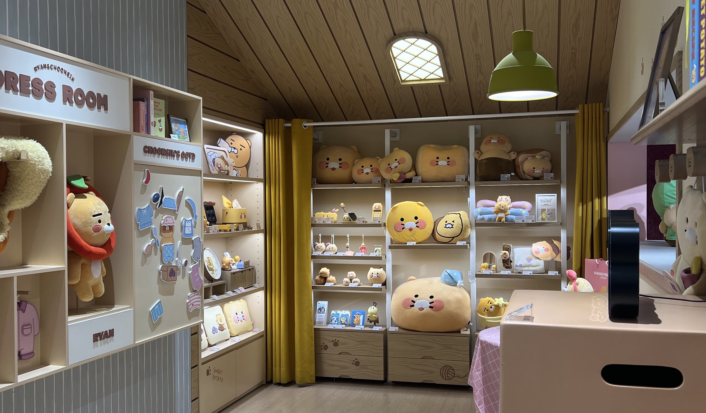
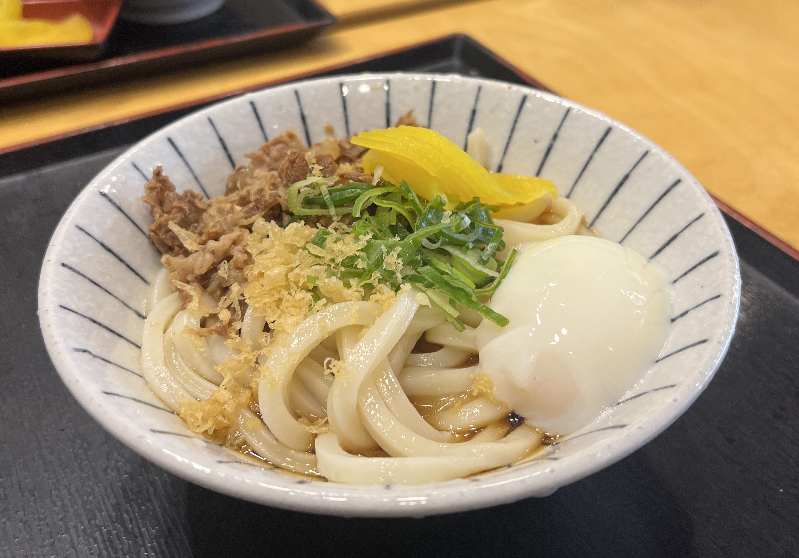
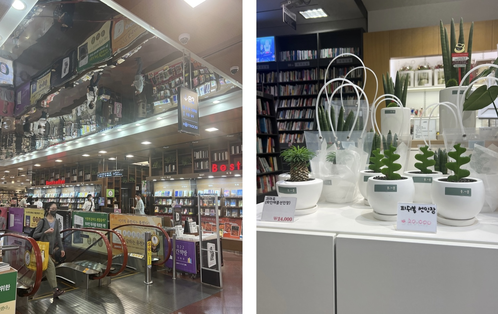
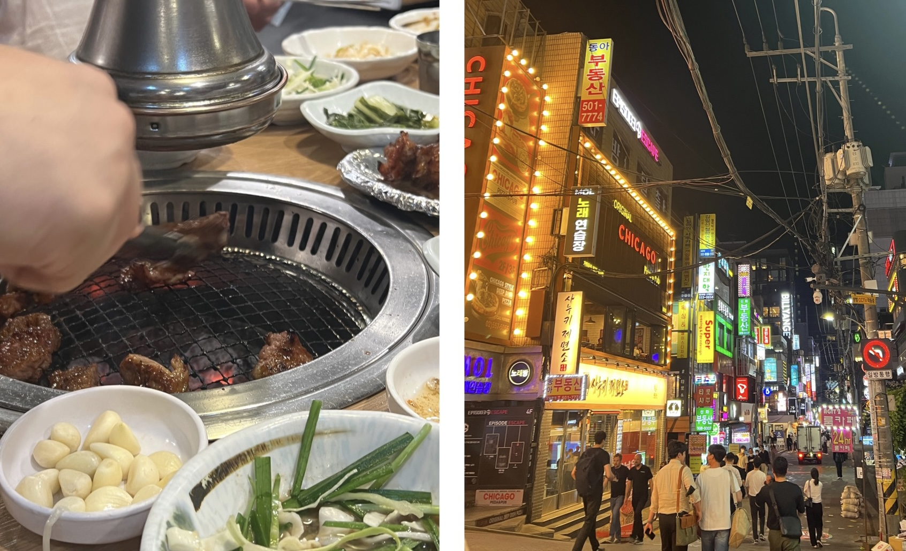

After my plane decided to graciously land at 3:30 AM, a whole 1.5 hours before its scheduled arrival time, there was barely anything open (as expected). I finally headed to Seoul Station around 5 AM to meet with my friend who had arrived the day before, and we decided to get breakfast inside the station at a fast-food place called Lotteria. 

    

The rice burgers were... INSANE. I fell in love on the spot. Perhaps it was because I hadn't eaten for 15 hours before that, but I hadn't been back to Asia in a while and had nearly forgotten that Asian fast-food joints are always on a different level compared to the States.

Of course we dropped by a convenience store and bought the iconic strawberry and banana milk bottles that you see in the kdramas. (In my defense... they were cheap...) Eventually we headed to Gangnam where our hotel (Ocloud) was. Obligatory pit stop at the Kakao Friends store:

    

And then it was time for lunch. By now the rest of my friends had arrived in Seoul, and we walked around for a while before settling on an udon (??!!!?!?!) store. I was a little wary at first since here we were getting Japanese food as our first real meal in Seoul, but hey, it was actually quite decent!

    

After lunch everyone was tired (except for me, apparently) and napped in the hotel as I anxiously sat around waiting before I gave up and just went out by myself. I discovered that a Kyobo Bookstore was right across from our hotel and wandered around for a bit, absorbing the vibes. It was pretty massive (2 floors) and had an assortment of mini shops inside selling home goods and stationery and jewelry, as well as an entire record store that sold shelves and shelves of kpop albums.

    

Dinner ended up being KBBQ, our first "real" Korean meal in Korea I suppose. It was surprisingly inexpensive considering the amount of meat that we consumed (probably ended up being less than 15 USD per person?) and the server did all the cooking for us. Overall I thoroughly enjoyed it and we spent an hour or two walking up and down the streets of Gangnam absorbing the city-at-night vibes and munching on convenience store ice cream.

    

Although the first day wasn't extremely eventful, the food had already blown my mind from not only the taste but the low cost. This trip to Korea was off to a good start! ☆