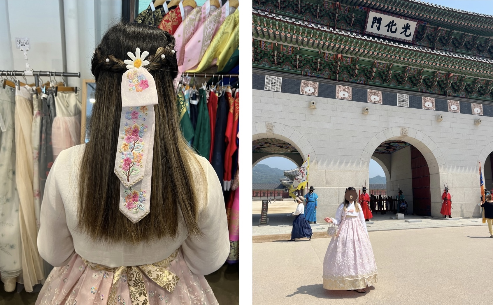
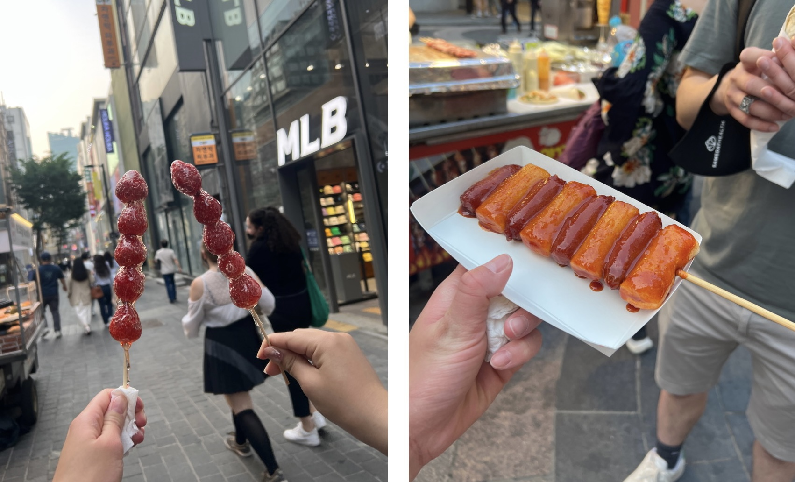

Started the day off with Gyeongbukgung Palace - incredibly basic, yes, I know, but obligatory nonetheless. This part of the trip unironically ended up becoming my favorite part of the Korea trip altogether - I quite literally fell in love with the hanbok that the hanbok rental lady picked for me, and walking around the palace in the 90-something-degree-Fahrenheit weather didn't faze me at all. The hanbok rental place we went to was right around the corner from the palace, one of the first things you see when you head out of Gyeongbukgung Station Exit 4, but there are a bunch of them at varying price points near the palace and you can take your pick. The one we went to ended up totaling ~$14 for my full-day hanbok plus hairdo and a wristlet (insanely underpriced if you ask me).

Note: obviously you don't *have* to rent a hanbok to enter the palace, although I'd highly recommend it for the full tourist-y experience. Also, if you enter wearing a hanbok, the palace waives your entrance fee!

    

The palace was what you would expect of a Joseon palace, with delicately painted red-and-green roofs and an endless maze of doors and gates labeled with hanja characters. It felt like straight out of the historical kdramas that I've watched (well, I've only watched one, but nonetheless...), minus the palace guards and scholars and nobles and servants that would have milled around hundreds of years ago. We spent probably way too much time taking photos, but given the beauty of the palace, it was honestly completely warranted.

    

 

    

 

    

Afterwards we headed along the Cheonggyecheon stream and ended up at a katsu restaurant called Gyeongyang Hall (경양회관), near Jonggak Station. The cheese katsu was fantastic, but surprisingly one of the best parts of the meal was a little unassuming bowl of noodles on the side, that I later found out was called myeolchi guksu, or anchovy noodles. (We all asked for refills.) 

    

The late afternoon and evening was spent in Myeongdong, shopping around and trying various street foods. There was a lady selling tanghulu (candied fruit, or strawberries in this particular case) and my friend and I both bought one each. I've had tanghulu before, but this one was simply *life-changing*. The hardened syrup was just the right amount of crunch to pair with the sweet juiciness of the strawberries that burst in our mouths, and we had to physically restrain ourselves from buying more in fear for our blood sugar levels. I also tried a sotteok sotteok (sausage and rice cake skewer) for the first time (and fell in love). This one was a little too saucy but nonetheless absolutely life-changing. Sausage AND tteokkbokki all in one skewer? Hello?

    

Not long after we got back to the hotel, we headed out again for the canonical noraebang, which was the obvious course of action given it was a Friday night. After getting slightly buzzed on convenience store soju, we found a not-too-expensive one in Gangnam and filed in. Honestly, it was pretty chaotic trying to search the catalog (which was almost all in Korean) and between the six of us there we could collectively achieve at most a limited working proficiency in the language (if even that), but since we were all kind of drunk anyways it ended up being a good time, as noraebangs do. ☆ 

