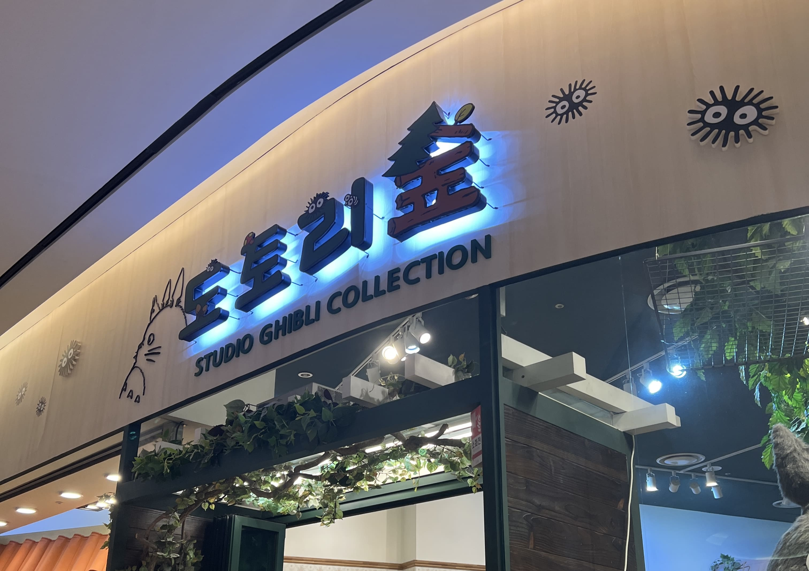
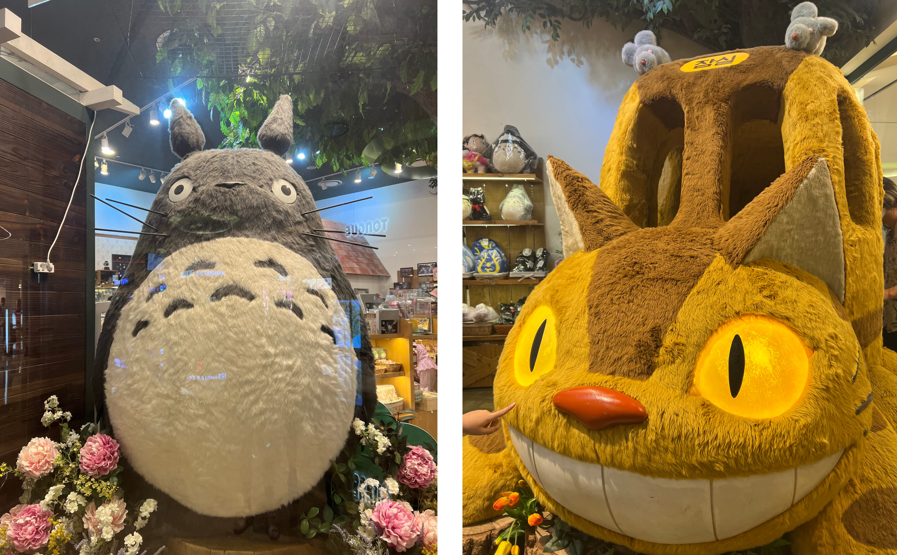
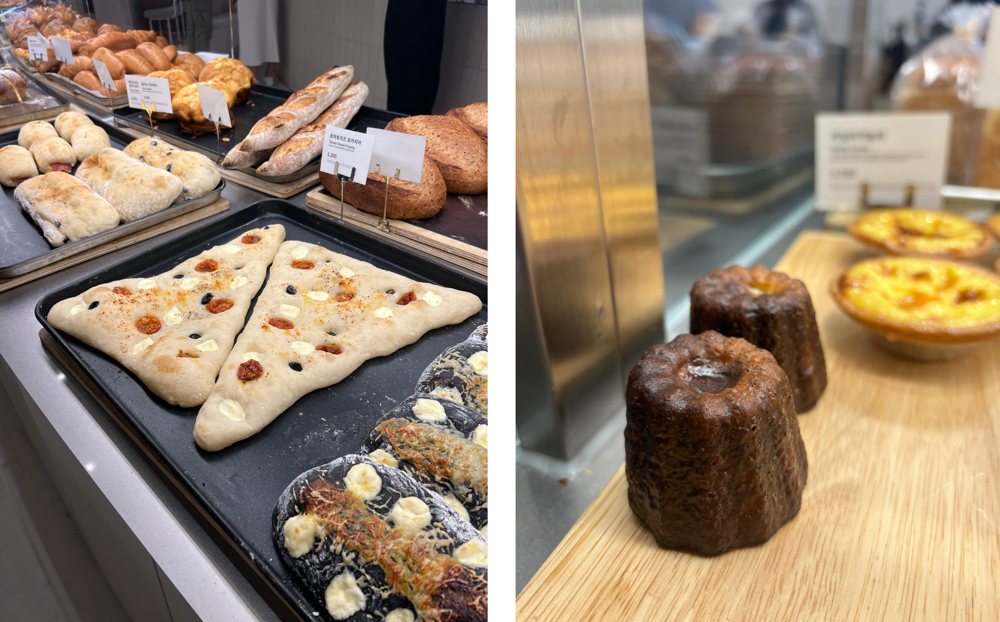
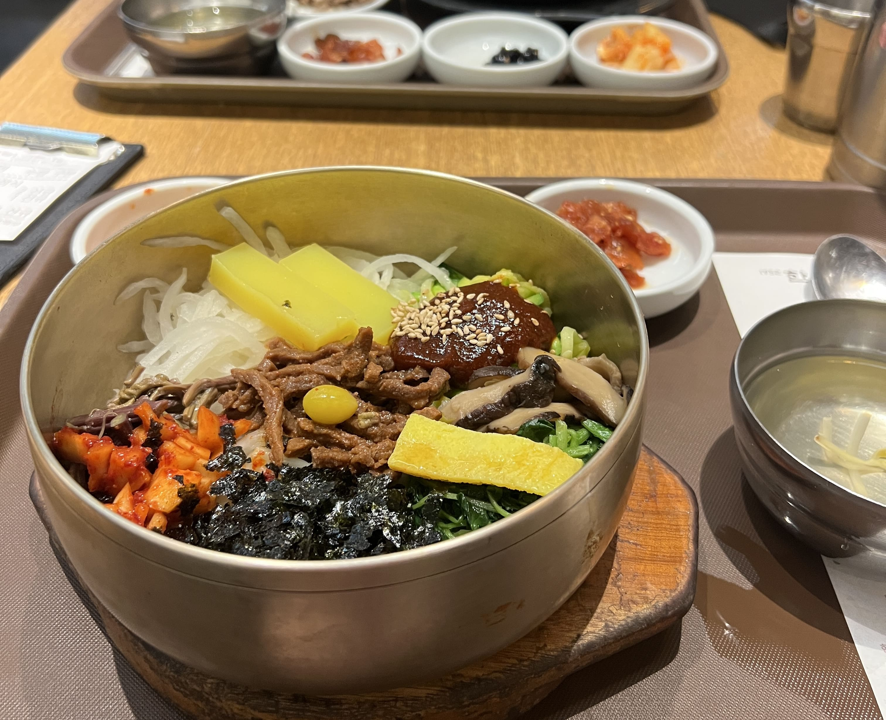
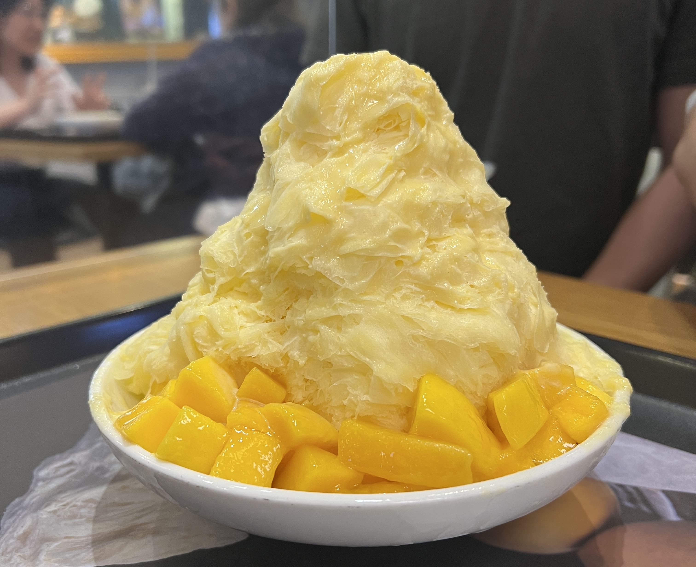
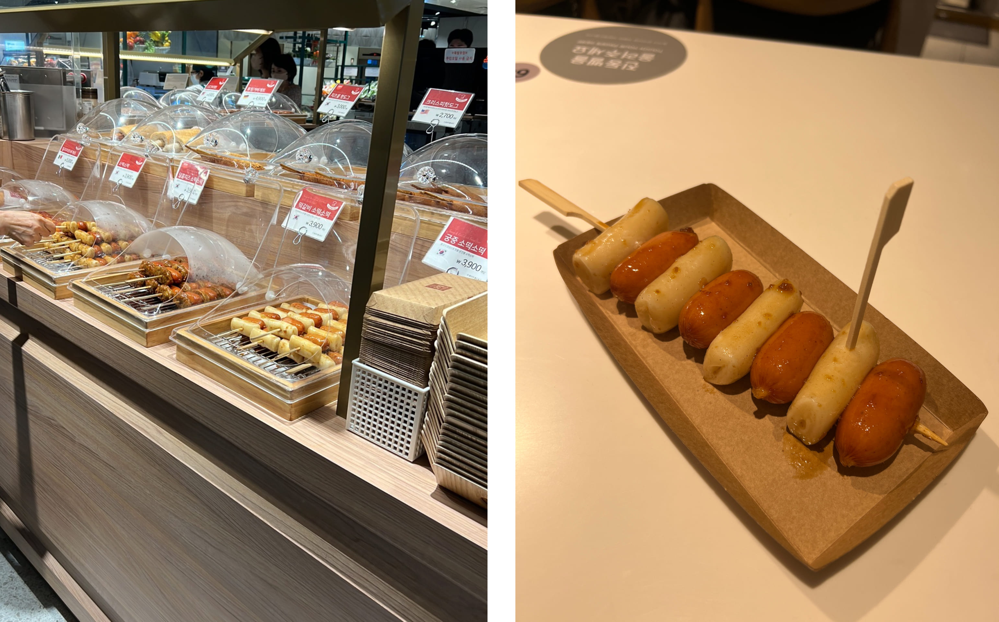
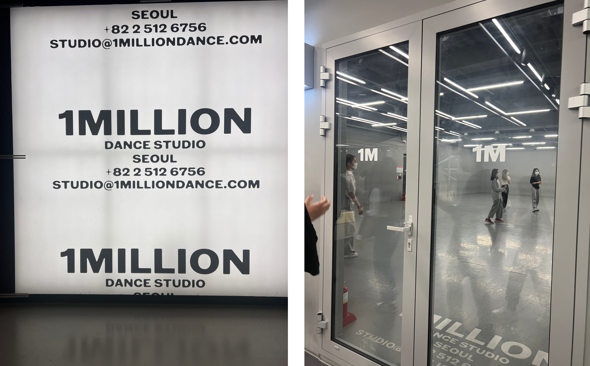
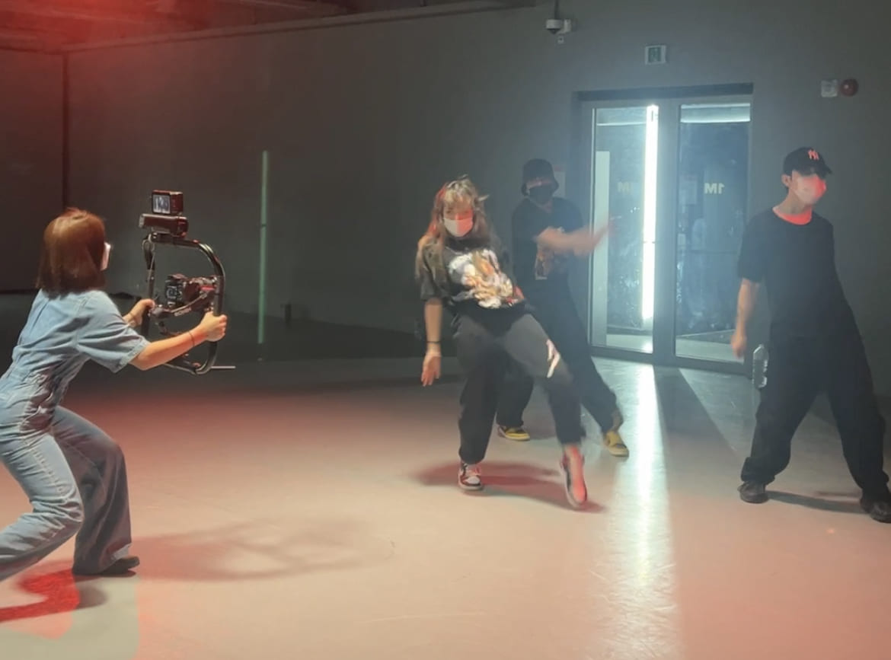
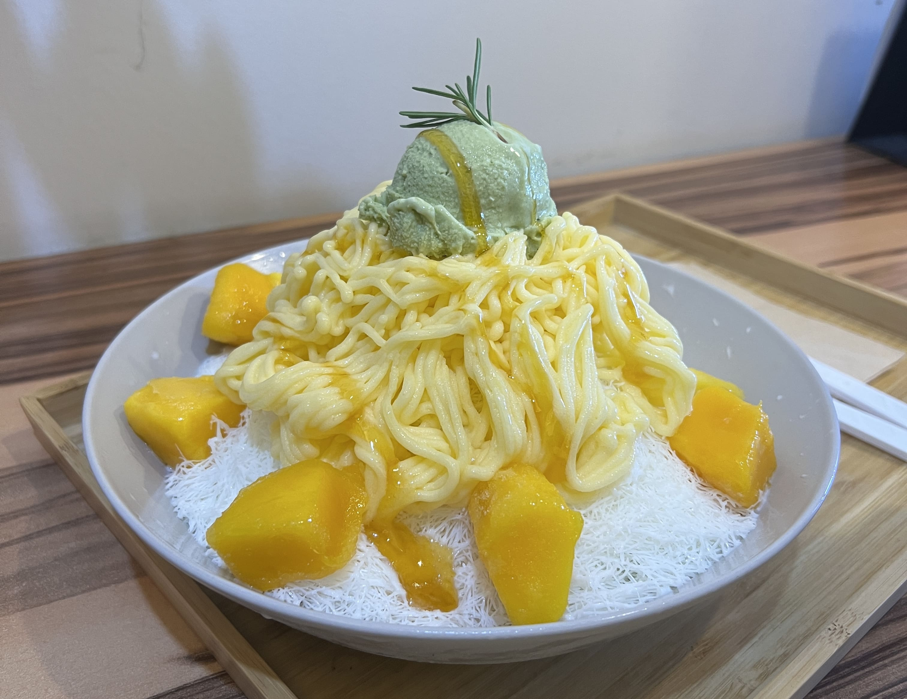

Our third day started out with a trip to the Lotte World Mall, one of the largest shopping malls in South Korea. Before long I discovered - get this - a Studio Ghibli store with tons of official merch?!? Literally a dream come true. There was a life-size cat bus inside as well as a large totoro standing in the window, and they had shelves and shelves of coin purses, printed towels, themed jewelry, plushies, you name it.

    

 

    

  

 Here's an obligatory pic of a bakery we passed by.

    

After passing through numerous more clothing and phone case and jewelry stores, we ended up eating lunch at a bibimbap restaurant called Hankookjib. Although it's probably one of the more popular Korean foods out there in the States, I'll admit that I was never that huge a fan of bibimbap and it had never occurred to me that a restaurant that specializes purely in bibimbap would exist, but hey, here we were (so take my review with a grain of salt). It tasted... better than I remembered bibimbap tasting to me in the past, which is probably a good sign! The others seemed to like it, not to mention the presentation being quite spectacular. The portion sizes were also surprisingly hefty - one bowl could've covered two meals for me, personally. 

    

After bibimbap was, of course, time for bingsu.

    

We spent a while wandering around the mall after that, since it was quite large after all. While looking for a pair of sneakers (long story...) I stumbled across a food court, with everything from expensive (?!) fruits to boba to full-on meals to street food. STREET FOOD? Guess what I got this time. (yes, sotteok sotteok)

    

The evening was spent at the iconic 1 Million Dance Studio near Seongsu Station. My friend and I had signed up for a class there a week in advance, and starting from the moment I stepped inside the building, I felt like I was dreaming. Here I was - actually INSIDE 1 Million Dance Studio - the facility teeming with extraordinarily talented choreographers and dancers alike, the facility that has invited A-list K-pop celebrities for guest appearances - you get what I mean. The class we signed up for was taught by Yeji Kim, one of my favorite choreographers (she's so cool...). The whole experience was surreal to say the least, and I had a lot of fun. 

    

  

    

After the adrenaline cooldown it was, of course, time for bingsu (at a place nearby called 젤라또투유). (Side note: the ice cream on top looks like matcha but it was NOT, in fact, matcha. My friend and I spent a good 5 minutes trying to figure out what it was before I went over to look at the list of flavors and figured out that it was BASIL. BASIL ICE CREAM. It was not as weird as it sounds, but it was definitely... interesting...)

    

☆ 

