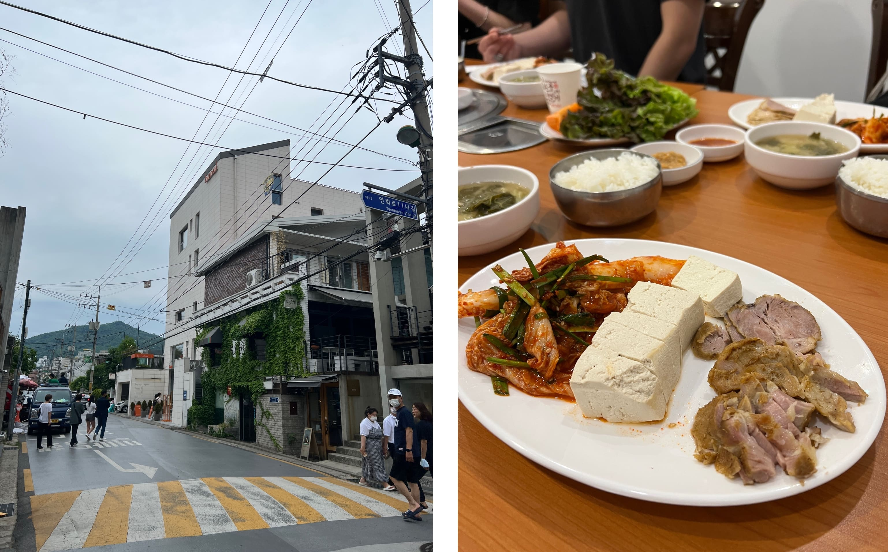

After spending three days in pure consumerism, our fourth morning was spent touching grass. Literally. We walked along the length of Gyeongui Line Forest Park (resisting the urge to walk into some of the Hongdae shops) and once we reached the Sacheon bridge, found another park (Gung-dong Neighborhood Park) and hiked around for a bit. Personally I'm more of a city person (if you couldn't tell already) but the change of pace was rather refreshing. The park was beautifully green, and after a while we found a nice pavilion to sit on and just absorb the nature and listen to the birds and crickets for a half hour.

    

For lunch we ate at Songgane Gamjatang in Hongdae, which is famous for its bossam. I remember not being a huge fan of bossam in the past, but this experience definitely changed my mind. It was also particularly invigorating after a long hike, and the food was cheap too (8000 KRW per person if I remember correctly, for a whole plate of meat plus soup and whatnot). 

    

PRO TIP: If you're ever in Hongdae, you HAVE to get GOMANGO. It's this little hole-in-the-wall counter cafe right a couple hundred meters straight outside of Hongik University Station Exit 3, next to a flower shop. They have fresh mango smoothies with large chunks of juicy mango and let me tell you, there's nothing I've ever had like it. GoMango is AMAZING. We returned to GoMango pretty much every single day after this, even though it was an hour away from our hotel by transit, but it's soooo worth it.

    

Hongdae was probably my favorite part of Seoul that I visited on this trip. It's what you would expect of a young people's district - bursting with cafes and shops, endless clothing stores with prices less than 10,000 won per piece, street food carts, and probably most importantly of all, the buskers. We saw dance teams and singers alike, expressing their talent for anyone who cared to watch or listen, which was... a lot of people. The crowds were all so heartwarmingly supportive, cheering the performers on during and after each performance. 

    

 

    

We ate dinner at Shin Mi Kyung Hongdae Dakgalbi (신미경 홍대닭갈비). (It was my first time eating dakgalbi, which was essentially stir-fried chicken on a hot plate, but it has unironically become one of my favorite Korean foods, although unfortunately it's pretty hard to find in the States, and definitely not as common as KBBQ.) The chicken was intensely flavorful and tender and juicy and spicy, and the cabbage worked well as a palate cleanser. *One thing to note about this restaurant is that they only have tables up to a party of 4, and since we had 5, we had to split into two groups.

    

The day ended with street food - 30cm ice cream and tornado potato. (I saw sotteok sotteok on one of the cart signs but ! surprise ! restrained myself.)

    

Although day 2 was my favorite day overall, this day was definitely a close second. The first half was slow, but I absolutely loved Hongdae - I could've sat there for hours just munching on street snacks and absorbing the vibes. ☆ 