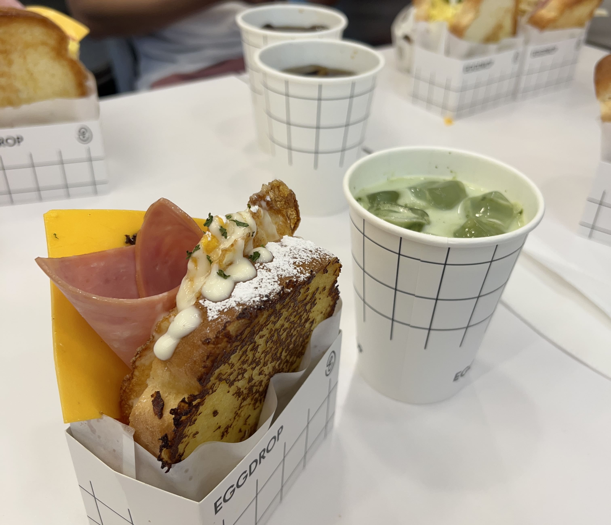
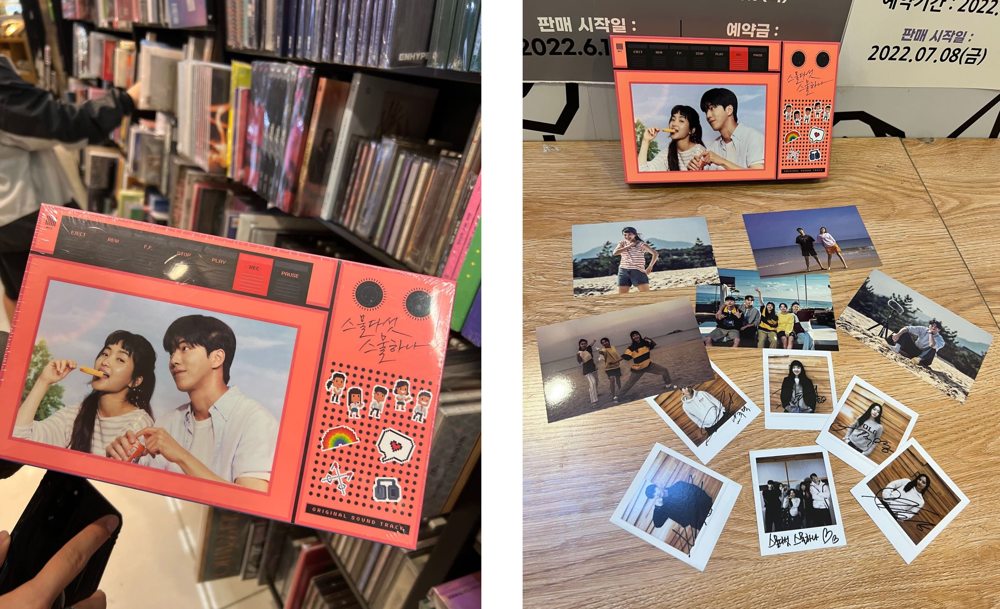
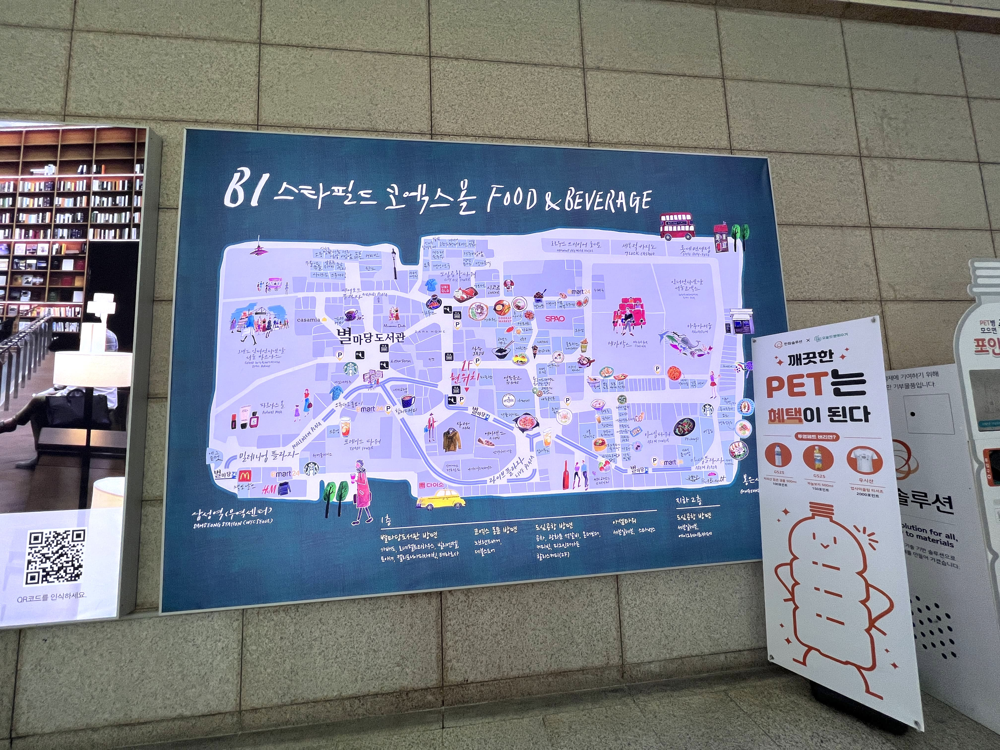
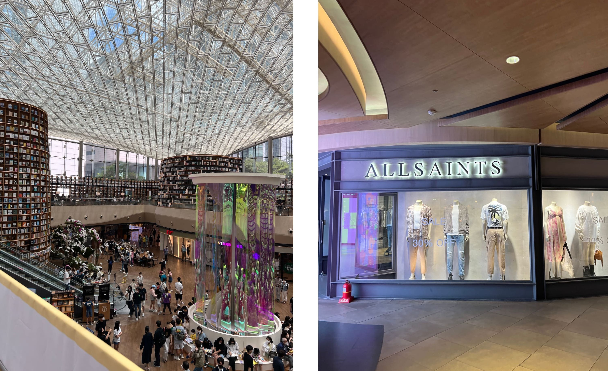
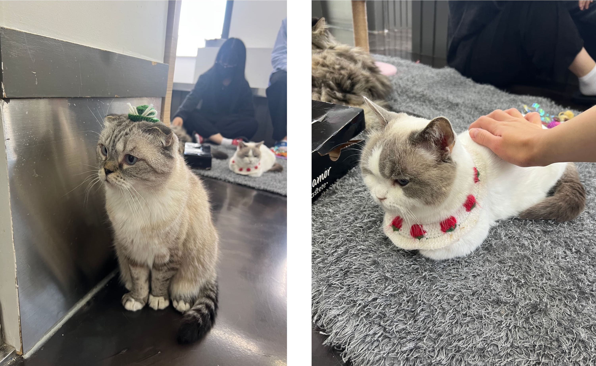
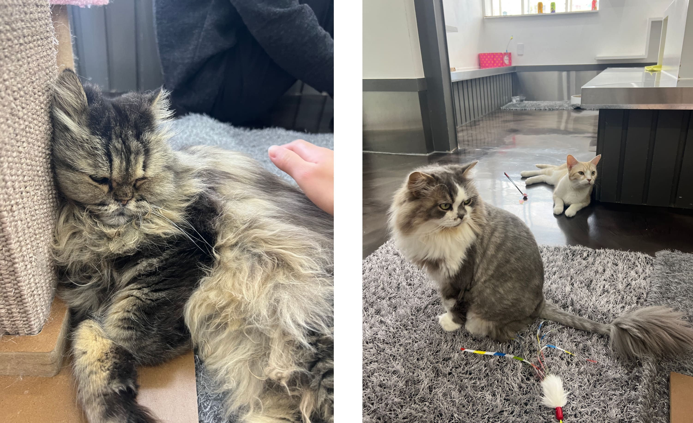
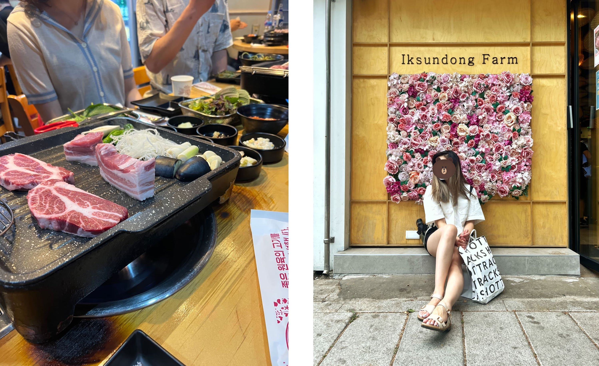
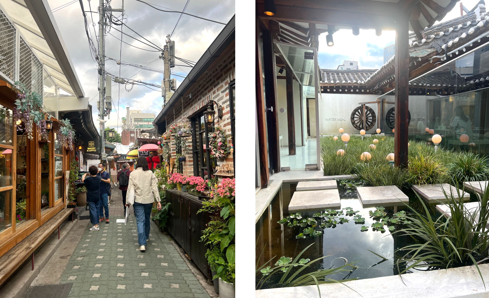
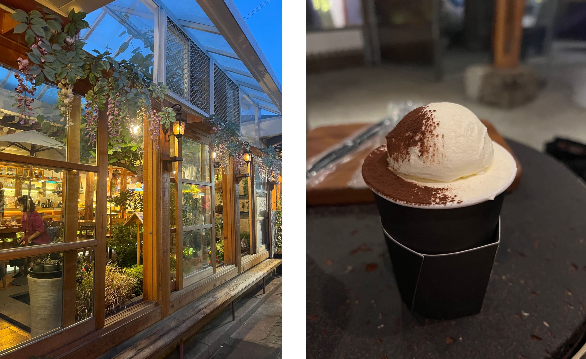

First of all I can't believe I haven't mentioned Egg Drop yet in this Seoul blog series - Egg Drop is a little breakfast place a 1-minute walk from OCloud Hotel, and it actually became a running joke in our group that we wanted to franchise it in the States. Imagine normal American egg sandwiches, and then imagine them Asian-ified, with soft buttered toast, with fluffy seasoned scrambled eggs - aka 10x better - that's Egg Drop. 

    

These last few days in Seoul moved a little slower than the first few. On this fifth morning, most of the others wanted to stay in, so the one remaining friend and I headed to Kyobo/HOTTRACKS again, looking for a specific K-pop album to bring back for our mutual friend back home. Mid-search, we came across a ... Twenty-Five Twenty-One OST album!? (If you haven't watched Twenty-Five Twenty-One, it is hands down the best k-drama I've ever seen. Even if you don't like typical k-dramas, I promise to you that Twenty-Five Twenty-One is extremely, extremely worth it.) So of course, we bought it.

    

Shortly afterwards we headed to Starfield COEX Mall, which I had somehow never heard of but later found out it was the biggest underground mall in all of Asia! There was a library stacked from floor to ceiling with books. The stores were endless, a mix of Western and Asian name brands spread across swaths and swaths of corridors. If you want to go for a big shopping day in Gangnam, COEX mall is the place to be. 

    

 

    

Before long we had exhausted our consumerism for the day and like a magnet we found ourselves in Hongdae (again), despite the hour-long transit (again). First stop - GoMango. Second stop - cat cafe. It was called Yeonnamdong Cat Cafe, on the third floor of a small building next to GoMango with a (slightly sus) side entrance. 

    

There were way more cats there than I had expected, and they weren't as shy as some of the cats I've seen at other cafes. This particular cafe had a flat entrance fee (9000 KRW) and gives you a free canned soda (which we did not claim due to aforementioned GoMango consumption).

    

In the evening, the others finally decided to join us. We ate at Iksundong Farm, a KBBQ restaurant in Ikseondong, right next to Insadong. The meat was probably one of the best quality ones I had in Korea, although it was more on the expensive side. They had a flower wall right outside which was perfect for an Instagram photo-op. 

    

Ikseondong as a whole was also just extremely aesthetically pleasing - lantern-lined paths and mini ponds and gardens and quaint cafes. Imagine Etsy, and then imagine that in neighborhood form - that's Ikseondong for you. 

    

We ended up going to a cafe after dinner, called Seoul Coffee (서울커피 익선본점). I got a hot Vienna Milk Tea, which ended up looking like a cup of coffee with a scoop of whipped cream on top. Extremely aesthetic also, just like the rest of Ikseondong. (Pictured below is also another random cafe that looked like a greenhouse?!)

    

And that was a wrap for our fifth day in Seoul. ☆ 

_tags: location/korea, egg drop, starfield coex mall, yeonnamdong cat cafe, iksundong farm, seoul coffee, korean food_

