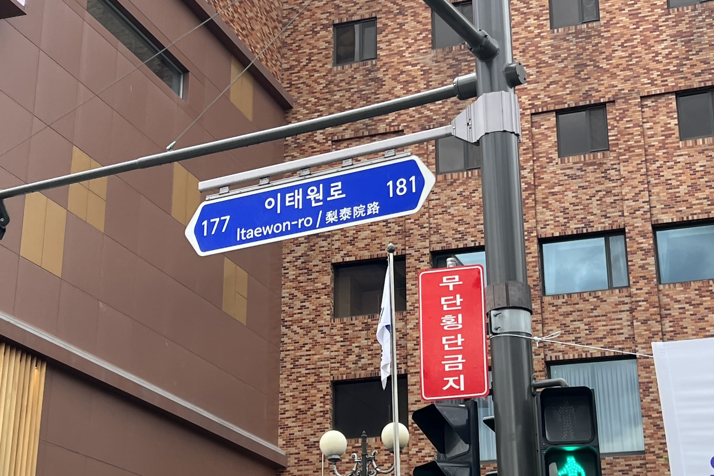
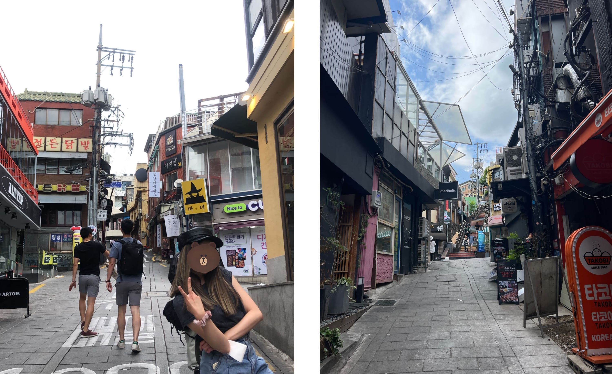
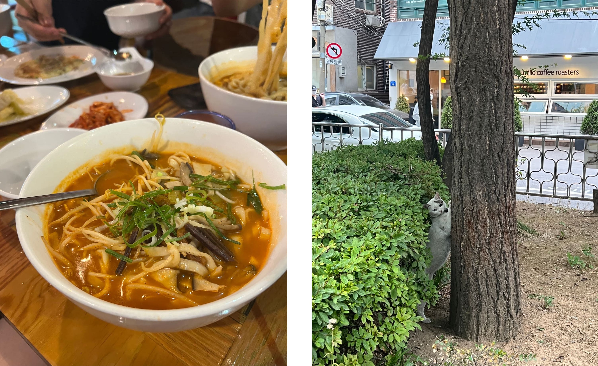
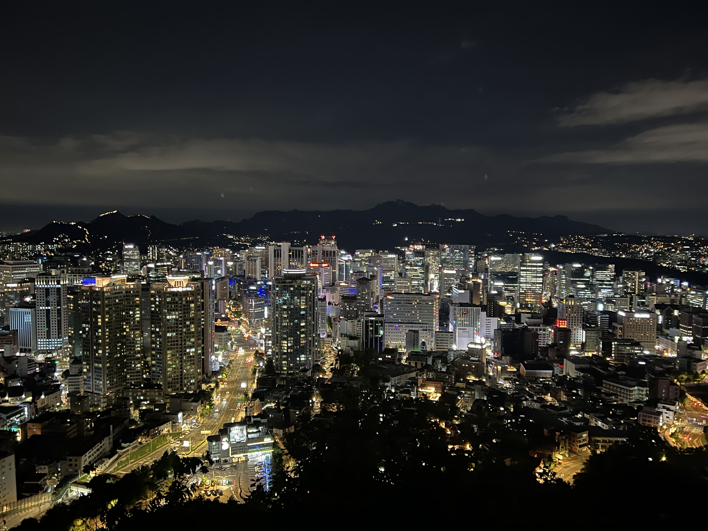
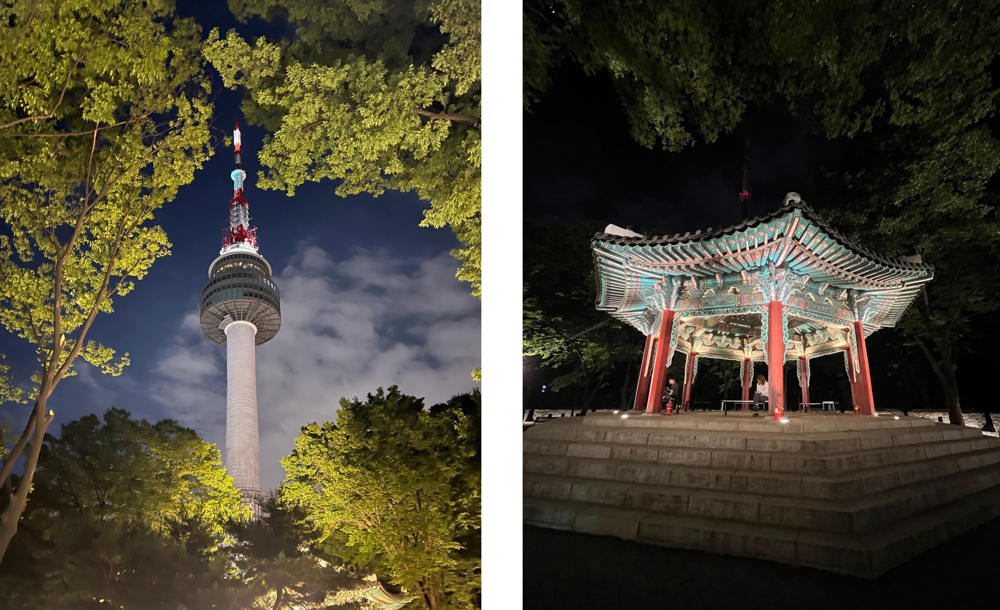

On this day we visited the famed Itaewon district. It definitely emanated a distinct vibe compared to the other parts of Seoul we'd been to - indie, edgy, and slightly antique-feeling. Multiple stores we passed by were blasting Gaho's Start Over on the speakers, the theme from Itaewon Class. 

    

But we quickly realized that we had made a dire mistake visiting it in the daytime... nothing much was happening. Luckily we still found a few interesting things to look at, such as a vintage leather shop (Moon Leather Collection/Mungajug) that my friend ended up buying a 230,000 KRW leather jacket at. The store owners were a friendly middle-aged man and his wife, and the man's English was surprisingly semi-fluent - he even struck up conversation with us as we shopped. (He asked one of us if we liked kimchi?!) After seeing me try on approximately 20 different leather caps, he gave me one (~20,000 KRW) for free (pictured below on my head) after our friend's massive purchase, which was a nice gesture. 

    

Since there was nothing much else to do in Itaewon during the day, we decided to go to (surprise) Hongdae to get (surprise) GoMango. It was becoming a religion at this point. Dinner was also in Hongdae, at a kalguksu place called Tom's Noodles (탐스칼국수). I got the spicy beef noodle soup, which was hot and flavorful. The portion sizes were quite large, and I probably was only able to finish 40% of mine before pushing it off to my friends. 

    

The Namsan Seoul Tower had been on our itinerary for a few days now, but every dinner always ran late and then we were too tired to go anywhere else, but with only one full day left in Seoul, we finally decided to bust our asses over there. After a long metro-then-bus ride, we were halfway up the hill to Namsan Tower. From here we were already able to see some of the city lights, and the beauty was exhilarating. But we pushed onwards, climbing seemingly endless stairs until we reached the tower. Inside, after we bought observation deck tickets, the tour guide brought us into an elevator that zoomed us upwards to the deck in a matter of seconds. Now we were at the second highest point in all of Seoul, we could look down and see the entire city laid out below us. They were playing melancholy (k-drama?) music in the background, and standing up there looking down on the world and how tiny everything seemed - it suddenly made me feel a little sad. Cliche, I know. Perhaps that was the intended effect, given the music choice. (But just look at that!)

    

Ten minutes before the observation deck closed, a voice stated over the PA system that they were closing soon. The melancholy k-drama music ended, and they started playing - get this - annoying carnival music. It totally ruined the vibe and tourists began piling back into the elevator to go back down. (Perhaps that was the intended effect.)

Outside, there was a little pavilion, and if you looked back you could see the observation deck through the trees. 

    

During the bus ride back, I could still feel the lasting effects of the melancholiness. I also realized that our trip was ending soon, and my heart was already missing Seoul. ☆ 
