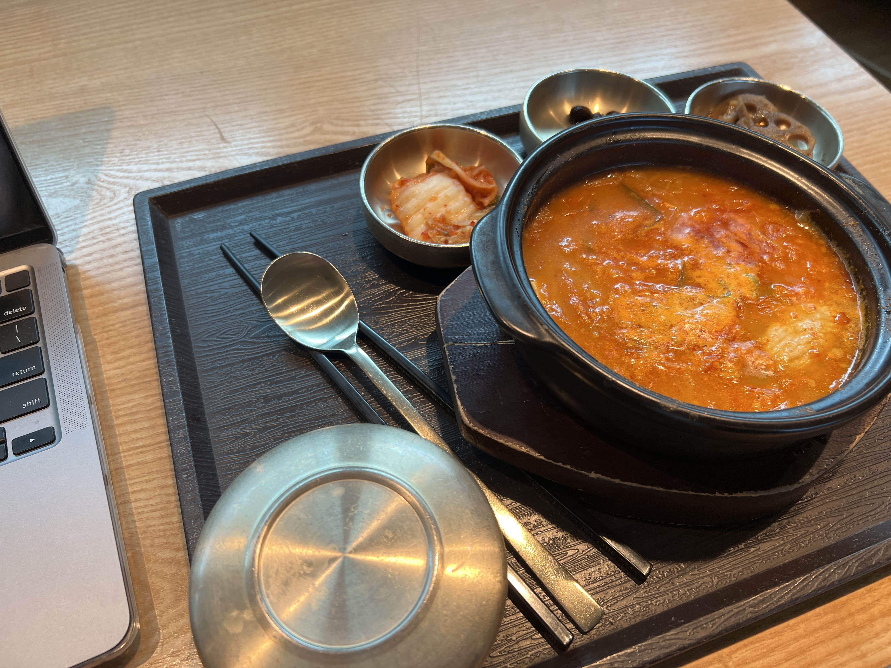

On our last full day in Seoul, we decided to check out Changdeokgung Palace, the other famous palace from the Joseon Dynasty. It was much less busy than Gyeongbukgung, but beautiful nonetheless, and much more green. 

    

We wanted to see the Secret Garden, which was only viewable to the public via tour. The tour guide was warm and funny, and she took us through numerous spots of the palace, explaining what purpose each building or field or pavilion served. 

    

 

    

After the tour, we decided to return to Ikseondong (not Hongdae! surprise!) to explore a little more than we did last time. We found an aesthetic cafe called Donut Jungsu that looked as if it was buried in the middle of a forest. The interior was rustic and made it feel like we were in a little tea house on top of a large mountain or the likes - certainly not in the middle of bustling Seoul!

    

When our food came (an assortment of drinks and donuts), the presentation was probably the prettiest thing I'd seen this whole trip. 

    

We ate dinner in Ikseondong as well, at a tteokkbokki place called Namdobunsik (남도분식). Up until then I didn't realize that I've never eaten "fresh" tteokkbokki - or rather, I've always had pre-cooked tteokkbokki (that most likely came from a pre-made frozen package). This place served tteokkbokki raw on the portable stoves, and we watched it cook in front of us, much like dakgalbi. The difference in taste was definitely noticeable, with this tteokkbokki being much chewier and had a more even consistency. The spice level was also higher than the most of the packaged ones I've eaten, and although I enjoyed it a lot, I probably downed at least three glasses of water in the span of an hour.

    

The rest of the evening was spent walking around Ikseondong. We played a shooting game with those paper targets, and the lady even gave us two adorable bear plushie keychains for free (we showed up in a group of two guys and two girls and I think she thought we were on a double date). We passed by a dessert cafe called France Ange Dessert with a bunch of unique macaron flavors such as "apple mango" and "fig" and "tiramisu." I chose a peach (experimental) and a matcha (safe option), and both were delicious.

    

  

    

Although it was late, since it was our final night in Seoul, we decided to go back to Hongdae, for - you guessed it - GoMango. Then we just sat there at the head of Gyeongui Line Forest Park, talking and absorbing the vibes of the city we had fell in love with in such a short time. The liveliness, the food, the modern and the traditional mixed in one, we were all going to miss it so much. 

The next morning, we had our final Egg Drop run. 

    

And then it was time for three of the others to go. (My flight was later.) I had lunch with the last remaining friend, who was staying in Korea for the rest of the summer for an internship. It was at a K-BBQ place in Gangnam called Carne Asado (까사생갈비), and I never knew raw beef chunks on a platter could be aesthetic, but hey, here we were. It was pretty high quality meat but I was so sad and anxious about leaving that I wasn't able to fully enjoy the meal. Nonetheless - would definitely recommend for a more upscale K-BBQ experience, and it was also near OCloud Hotel. 

    

Then, it was time for me to go. At the airport, I had my final meal in Korea from one of those food court stands that sold soondubu and meat. Unfortunately they were out of meat, so I just ordered a kimchi soondubu. Although it wasn't comparable to the food I had eaten on the trip, it was truly not bad for airport food.

    

It was dark outside when I finally boarded my flight back to the States. I slept the whole plane ride, and when I woke up halfway across the world, bright sunlight streaming through the plane window, I briefly wondered if I had simply dreamt it all. ☆ 

