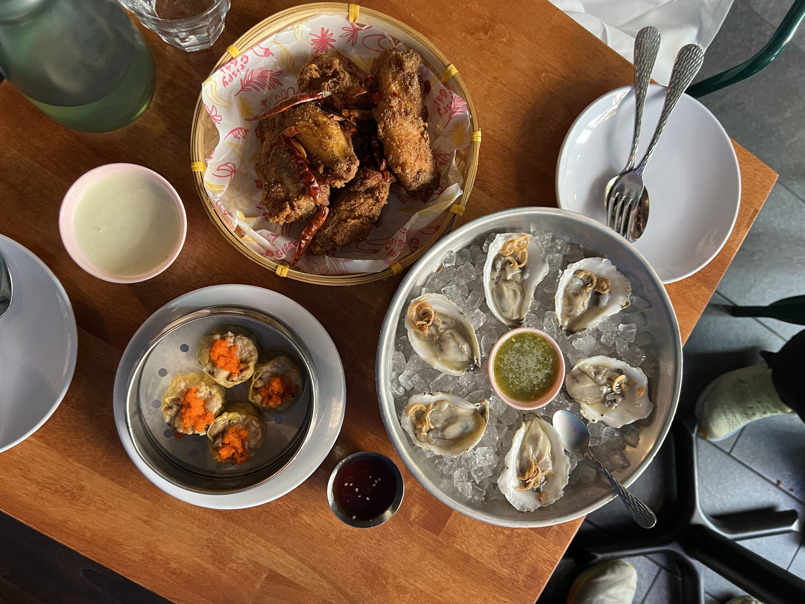
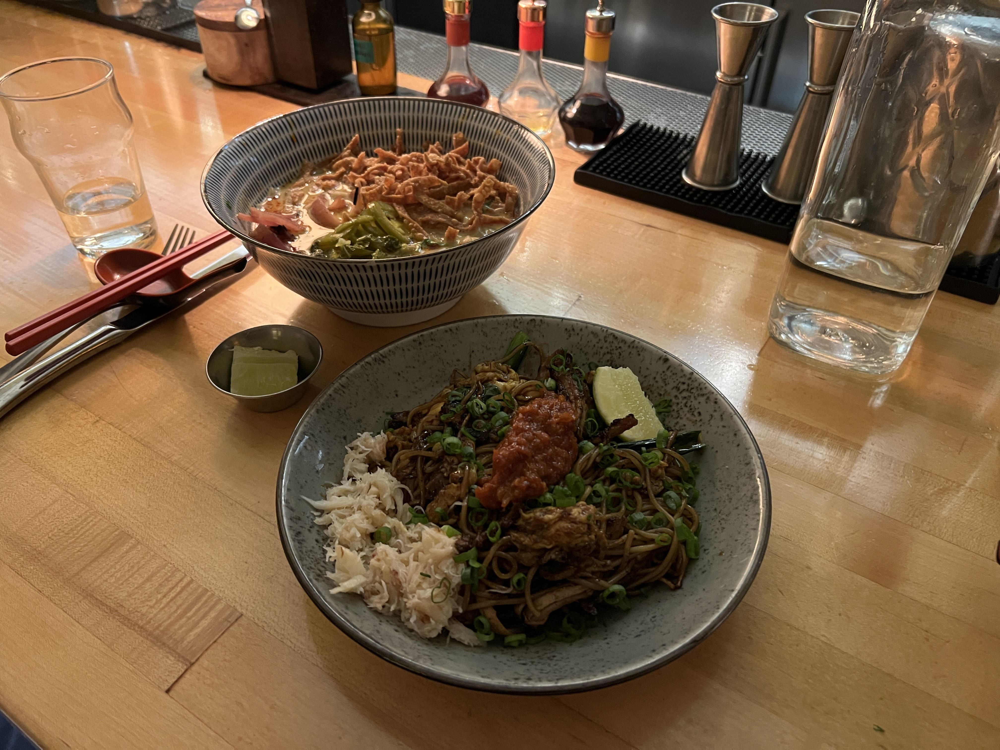
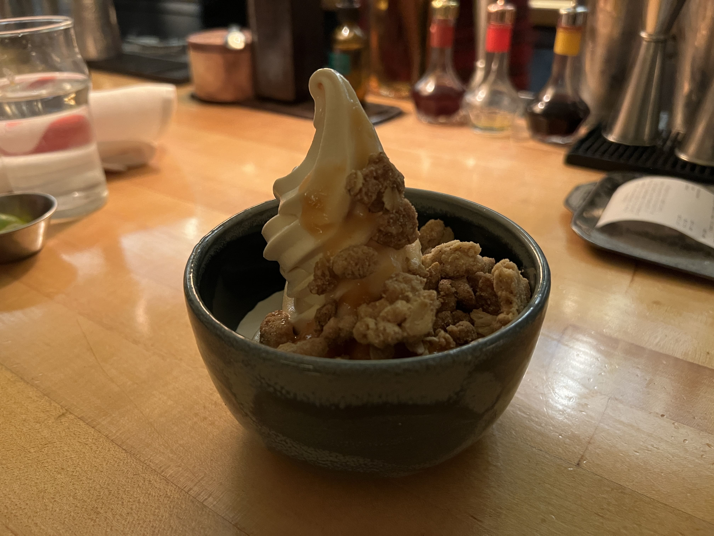
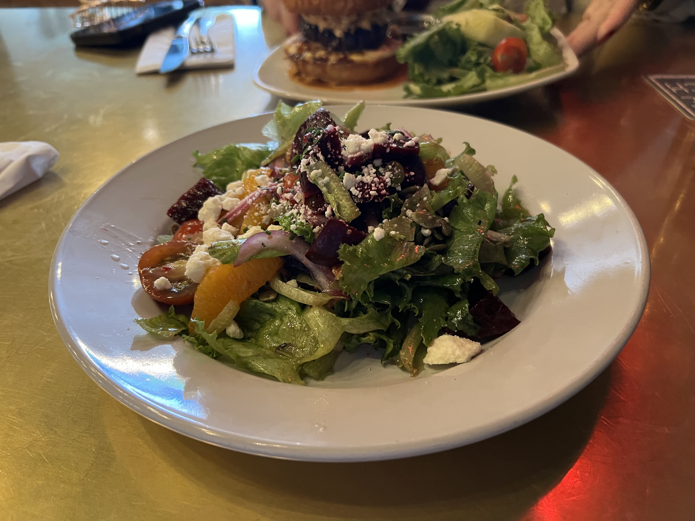
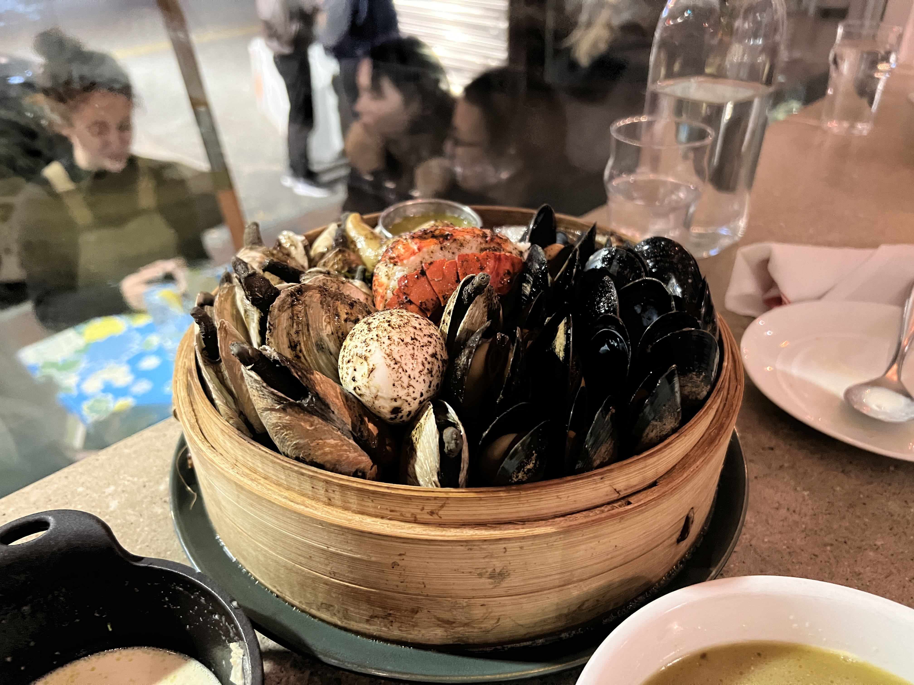
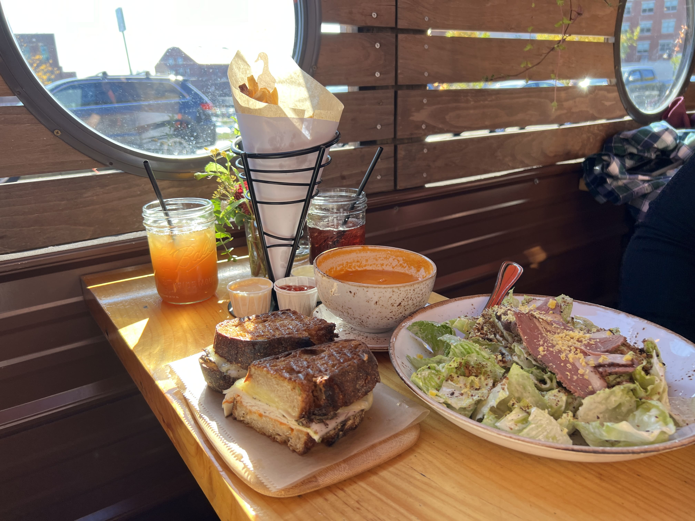
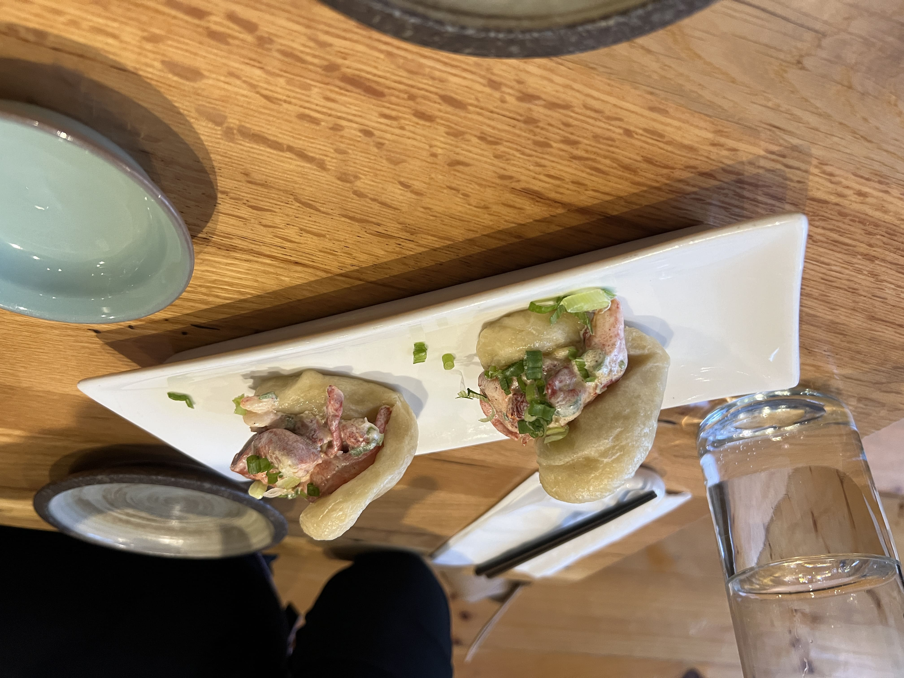
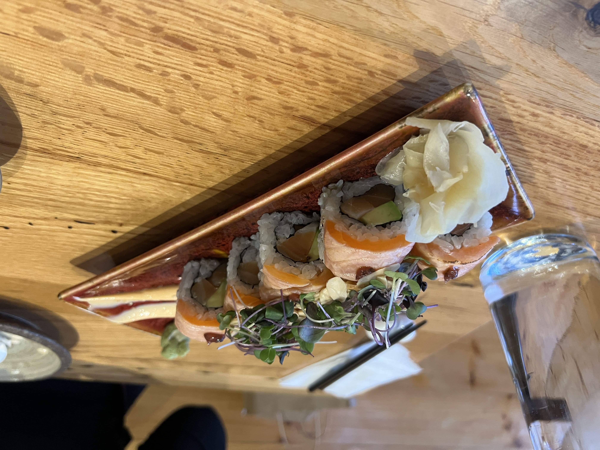
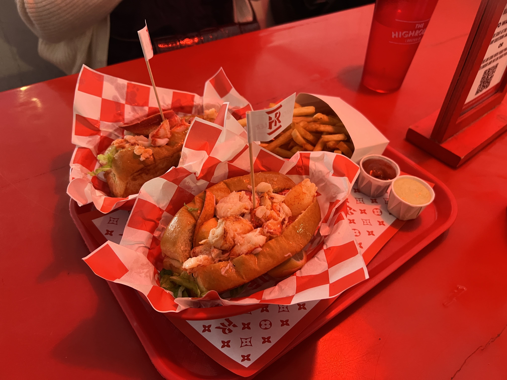

Last October, I visited Portland, Maine for the first time with my close friend. We found it rather similar to Boston in terms of appearance and vibes (lots of red brick sidewalks and brownstone), as well as in culinary inclinations (lots of seafood), although Portland is definitely smaller and old-town vibes. We were quite surprised to learn that Portland has actually become a foodie town in recent years, and at the end of our four-day excursion, there were definitely some restaurants that made lasting impressions.

Behold - the places we tried, and whether we would go again:

## 1. Crispy Gai

I was honestly skeptical of this restaurant because based on the menu, it seemed like it tried to do everything - Thai, Sichuan, Cantonese, and even American. And we all know that usually restaurants who try to do everything excel at nothing. Moreover, upon peeking inside it looked like the servers and clientele were mostly white, which usually isn't a good sign for an Asian (albeit fusion) restaurant. Nonetheless, my friend had said that her coworker recommended the place, so we gave it a try.

    

**Verdict: WOULD DEFINITELY GO AGAIN! And we _did_ go again, on our last day, even after we already had lunch somewhere else, just to eat the oysters and chicken wings again.**

The oysters were so fresh and juicy, and best of all, during lunchtime they're only $1 each! Usually $1 oysters are pretty tiny but these were much bigger than what I've seen, and having the whole plate for $6 was such a steal (it's $18 at dinnertime).

The siu mai was not bad, but nothing too special, and would probably opt for something else next time.

The star of the show, however, was the Sichuan Wings. It far exceeded my expectations and was probably the best chicken wings I've ever had. The numbing spice was _really_ mala, and it was so 香 that I almost wanted to order another plate. They recommended us to get the wings with sauce (which cost extra) so we did, but they honestly didn't even need the sauce - they were already bursting with flavor on their own.

## 2. The Honey Paw

After our amazing experience with seemingly strange Asian fusion menus, we decided to try our luck at The Honey Paw, a noodles-focused restaurant with offerings like mazemen and mee goreng.

    

**Verdict: Would probably not go again for a full meal, but WOULD GET THE ICE CREAM FOR TAKEOUT.**

We got mussels for the appetizer, which came with grilled bread. This dish was pretty good (courtesy of the broth) and it helped curb our hunger after waiting quite a while for a seat.

For mains, I got the mee goreng, and my friend got the khao soi. Both of these dishes were too salty for us - I had trouble finishing my noodles even while drinking a lot of water, which is uncommon for me since I do like somewhat heavy foods.

After seeing the people next to us get dessert, we decided to get one too. They had two kinds of soft-serve: one with honeycomb and chocolate shell, and another kind with peach compote. I wanted the peach compote _and_ the honey, and the waiter allowed us to customize it!

    

This soft-serve was actually _so_ bomb. It was totally the best part of the meal, and almost made up for the fact that the mains were a bit disappointing.

We ended up coming here the next night just to get the soft-serve for takeout again. _That's_ how good it was.

## 3. State Lunch

This one isn't even in Portland - rather, it's in Augusta (the capital of Maine!), a one-hour drive from Portland. We went to see the beautiful autumn leaves along the Kennebec River Trail, and stopped at State Lunch before beginning on our long trek.

Augusta is not a bustling city like Portland is, so we didn't have high hopes for this restaurant, and simply wanted to fill our bellies before our hike.

    

**Verdict: Would probably not go again.**

The food here was what you'd expect in a typical American gastropub. Burgers, salads, sandwiches. Nothing particularly notable. Food was not bad, but not memorable either. If you're hungry and looking for something to eat in Augusta though, it's a reasonable choice.

## 4. Eventide Oyster Co.

This place has a TON of reviews on Google, so I was eager to try this place that claims to serve the best seafood in Maine.

We got the clam chowder and the clam bake.

    

**Verdict: Honestly, would probably not go again.**

Food here was quite expensive. The clam chowder, although very good, cost $16 for a small bowl. The clam bake (a sort of seafood boil except with mostly clams) cost $60. The bucket was pretty big, but a decent part of it was filled with potatoes, and the lobster tail was quite small. The mussels were okay, and the highlight of it was probably the steamer clams. It was my first time having steamers and the long neck freaked me out (my friend ended up de-necking them for me...) but they were really delicious and fresh. I could taste the ocean in them!

The steamer clams and the clam chowder redeemed the meal for me, but everything else was just alright. Given the price, I would probably not go again.

## 5. Duckfat

This restaurant always had a long line during dinnertime, so we decided to try it during lunch instead. We got the Belgian fries, tomato soup, the grilled cheese with turkey, and the duckfat caesar salad. For drinks, we got the arnold palmer and the wild cherry soda.

    

**Verdict: Would definitely go again.**

We sat outdoors here in a little wooden half-enclosure, and the vibes were immaculate here, with sun streaking in through a small window and illuminating our food. The food was also delicious - the beverages were refreshing, the fries were seasoned perfectly (with great dipping sauces), and my grilled cheese was grilled to perfection. My friend also enjoyed her salad very much.

In essence, nothing about the meal was particularly outstanding or novel, but the food was good, the seating area was aesthetic, and the service was friendly - totally a foodie spot, and for good reason. Also, the fries are definitely worth it.

## 6. Pai Men Miyake

Given Maine's seafood focus, it felt like a miss not to eat at a sushi restaurant, so we hit Pai Men Miyake on our last evening in the city.

We ordered the lobster buns and two sushi rolls.

    

 

    

**Verdict: Would not go again.**

The food was not bad, but my main gripe with this place was the service. I'm not one to complain about service usually - as long as they do the bare minimum, that's good enough for me. The lobster buns came first, and when I picked my bun up, a piece of lobster fell out onto the serving plate. _No problem,_ I thought, _I'll eat my bun first and then retrieve my fallen lobster piece after I'm done._ As I ate, I checked my phone for a minute, and when I looked up, the serving plate was _gone_. The waitress didn't even ask if we were done with it and just whisked it away with my piece of lobster still on it... I flagged her down and asked if the dish was already tossed, and mentioned that there had still been food on it. She looked at me blankly and said "Yes." No explanation, no apology, no offer of any extra services. I was quite furious - the lobster buns were not cheap, and if she had at least seemed sorry I would've been mollified, but there was zero acknowledgment of my distress.

The sushi came after, and it was fine, but I was still fuming after the lobster debacle. Even afterwards, as we finished the sushi, she still continued to whisk away our plates immediately without asking if we were done, as if my conversation with her didn't matter at all. I ended up leaving a 10% tip instead of my usual 18%, but I honestly should've gone with zero in hindsight. I considered leaving a bad review on Google but stopped myself, thinking that it's possible she just had a bad day. Instead, you can find my bad review on clarityeats.com instead (which has much less SEO traffic).

## 7. The Highroller Lobster Co.

A Maine trip wouldn't be complete without a lobster roll! For our last meal, we stopped by this popular casual diner-style restaurant known for its lobster rolls.

We ordered (you guessed it!) lobster rolls, as well as fries to share, with two sauces - the curried ketchup and the lobster ghee.

    

**Verdict: Would go again!**

I've had my fair share of lobster rolls during my college years in Boston, but this was still pretty good. They weren't stingy with the lobster pieces, and I'm willing to bet it was a little fresher than the Boston ones since it had less distance to travel (fun fact: even though Boston is known for lobster, most of their lobsters are sourced from Maine...).

The curried ketchup was a banger - I like curry and I like ketchup, so their little Asian fusion sauce exploration was a welcome addition to our fries.

After this meal, we went back to Crispy Gai for another round of $1 oysters and chicken wings to close out our trip...

_tags: portland, maine, seafood, foodie_
