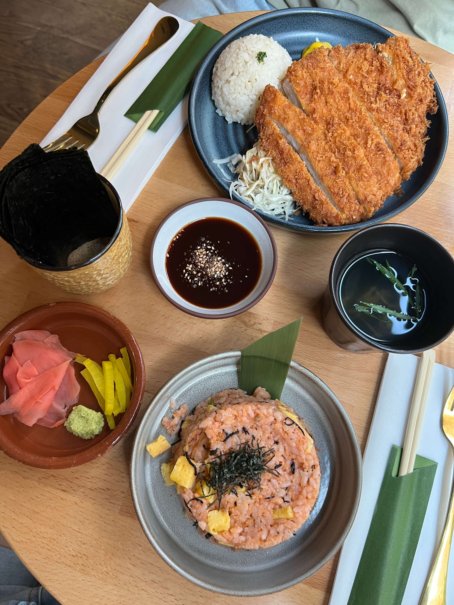

A cute little aesthetic restaurant hidden on a side alley of Chelsea, Maison Kintaro (no, not the clothing brand Maison Kitsune) is a must-visit for the dedicated Japanese foodie who is into not only the flashy omakase and Michelin ramen restaurants, but also the delicate, home-cooked Japanese meals that are less mainstream but equally, if not more, delicious.

The restaurant is quite small and fills up quickly, so make sure to go early since they don't take reservations. The menu is pretty compact, but there's still a decent variety of appetizers to add to your meal if you're hungry.

I ordered the nori + salmon gohan, a sort of seasoned mixed rice that I'm not able to find often in Japanese restaurants in the states, but is actually pretty popular in Japan. It's basically a bunch of ingredients (salmon, scallion, mentaiko, egg) mixed evenly with rice in a very pleasant ratio.

My friend got the tonkatsu set, one of Maison Kintaro's signature items.

    

Everything was fantastic, and ironically, our favorite part was actually the seaweed soup that came with the tonkatsu set. I couldn't place the exact flavor (some sort of dashi probably?) but it was super addicting and we definitely contemplated asking if we could get a refill.

Overall - highly recommend this hidden gem of Chelsea!

_tags: location/nyc, japanese cuisine, chelsea_
