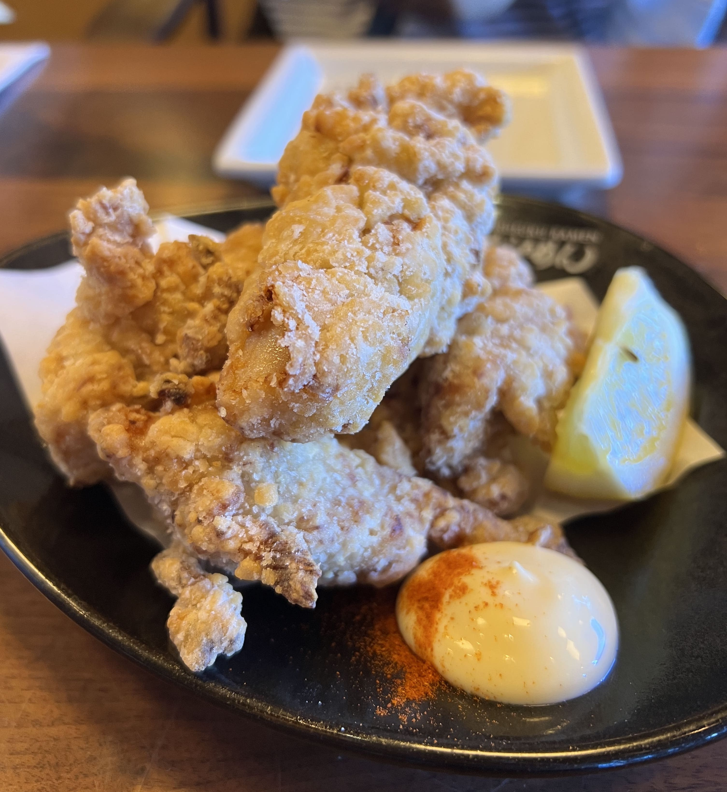

Marufuku Ramen is a Hakata-style ramen restaurant located on the second floor inside of the Japan Center of San Francisco's Japantown district. There's generally a decently long wait during peak hours, but they have an at-location Yelp waitlist that you can join to receive texts, and spend your waiting time shopping around the center (there's a large Kinokuniya Bookstore on the same floor).

I've gone a couple of times before, and the service is always nice and prompt. They are pretty stringent about not bringing outside food in though - I saw the waiter actually walk over to ask a table to put their donuts away (LOL?).

The ramen is pretty traditional - there aren't too many options besides the canonical Tonkotsu, although they do have a vegetarian option. You can also order any of the common appetizers you'd expect at a Japanese restaurant - gyoza, karrage, takoyaki, shishito, etc. This time, I ordered the chicken karaage. 

    

As for ramen, they allow you to customize the spice level of your ramen, so I chose a medium level of spice for my Hakata Tonkotsu. It had a nice kick to the broth, but did not cover the rich flavor of the pork bone. The noodles were thin and chewy, a signature of the Hakata-style, and it came with green onions, chashu, bean sprouts, wood ear mushroom, and a marinated soft-boiled egg.

    

The quality has always been consistent the times I've gone, and although the tonkotsu broth is flavorful, it isn't one of those overpoweringly heavy types which I tend to avoid (rip cholesterol...) THe chashu is marinated the right amount, and not too fatty. 

Conclusion: I would definitely recommend Marufuku if you're dropping by SF Japantown, but be prepared for a wait!

_tags: location/sfba, marufuku ramen, san francisco japantown_
