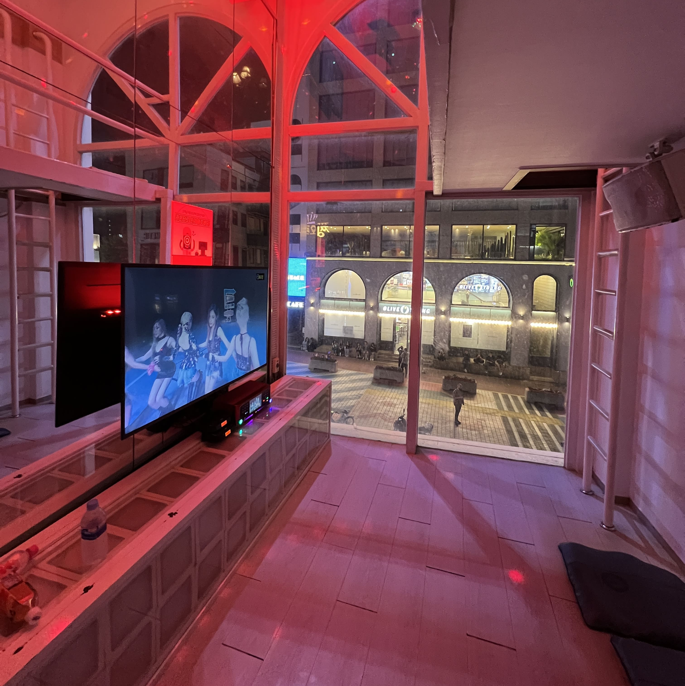

If you've been with this blog for a while, you may recall that I had a mindblowing first experience in Seoul during the summer of 2022 (when I started clarityeats, actually!) and have been longing to go back ever since.

The first time visiting a place almost always feels magical. You go to all the tourist-y destinations, take photos at places you've only seen on TV, eat everything you see and buy all the souvenirs you can stuff into your luggage without going over 50 lbs. The second time is always a bit more nuanced - at least for me. There's excitement and relief for finally being able to return, but the first-time magic is always a bit dulled. Where do I go this time if I've done all the things I wanted to do _last_ time? Visiting the same places that brought you so much wonder and joy beforehand doesn't hit the same anymore. In some ways, it feels a bit disappointing, like perhaps the expectations were set too high, or that I was trying to relive an experience that no longer existed for me anymore.

Nonetheless, Seoul is big. My eight days there in 2022 may have covered the big tourist-y destinations, but there are definitely way more places in Seoul I've never been to or even heard of. This time, my experiences were a mix of new and old. I arrived by myself instead of with a group, but I met up with friends along the way. I visited some new restaurants and reminisced at some old ones. I went to Lotte World for the first time, and saw places I've been before in a different light.

Here are the most memorable experiences of my second time in Seoul, in no particular order:

<h3>1. Post-dakgalbi heart-shaped fried rice</h3>

    

There was a line out the door for Premium Jangin Dakgalbi in Hongdae, but we didn't wait too long for a party of 3. One of my friends was practicing Korean, and the waiter thought that we were all foreigners from America and was skeptical as to whether we could actually handle the spiciness (lol). The food was definitely solid but somewhat overshadowed by the unexpected delight of the fried rice heart at the end. (The waiter even turned the plate to point the heart at me!!)

<h3>2. Seeing the Han River at night</h3>

    

I can't believe I didn't go to see the Han River the first time I came to Seoul, but when my Korean friend suggested we go see the lights this time, it was definitely a sight to behold. It wasn't even the lights themselves that were the highlight - it was the whole experience, the vibes of sitting on the steps next to the water next to others enjoying the view, slightly crowded but not in a stuffy city kind of way, with the wide expanse of water rippling and softly reflecting the light in front of you. I normally find large bodies of water intimidating, the vast endlessness conjuring a sense of helplessness. But here with the river, I could see the twinkling lights of the city on the far side, and the view gave me a sense of comfort and peace.

<h3>3. Noraebang with floor-to-ceiling windows in Hongdae</h3>

The place was called Su Noraebang, nestled in the streets of Hongdae. The brilliant window displays caught our eye - noraebang rooms usually feel dark and small and cramped, but this one had window-side rooms with ambient, holiday-like pulsing lights and spacious interiors.

    

This photo doesn't really do it justice, but we had a lovely view of the bustling streets while singing our hearts out inside. Definitely the most unique and comfortable karaoke experience I've ever had.

<h3>4. Solo throwback bossam lunch</h3>

This bossam might look a little familiar - that's right, I went here on my fourth day in Korea <a href="/koreaDay4">last time</a>. I managed to find Songgane Gamjatang again on my solo exploration day and had a quick lunch there. The bossam wraps were honestly even _better_ than I had remembered - the kimchi was so crunchy and flavorful and the meal had this home-y vibe that was particularly comforting when dining alone in a foreign country.

    

<h3>5. First time in Seongsu</h3>

Back in 2022, I thought Hongdae was where all the cool kids go to have fun, but in 2024, it seemed like the new cool spot was Seongsu, near the eastmost edge of the circular subway line 2.

We went (by a friend's recommendation) to PRTPRTSHOP, tucked away in a hidden alley a few minutes walk from Ttukseom station. It's on the second floor of a very run-down looking building, so much so that from the outside, I wasn't even sure if it was a real store. Nonetheless, the inside was spacious and well-decorated, with just the right amount of clothes that you could spend a couple hours perusing and trying stuff on, but not too much that you feel overwhelmed.

    

I got two items - a Gothic lettered gray oversized hoodie (not pictured) from a new discounted collection, and this landscape patterned jacket that looks like a painting. Both of them were reasonably priced for a semi-upscale streetwear clothing store - the hoodie was around $70 USD, and the jacket was around $200 USD. I'm not a fancy clothing kind of person so it was still a bit expensive for me, but after seeing some of the price points at other shops in the Seongsu area (which is known for designer wear), I felt pretty satisfied at the value here.

<h3>6. Reliving Itaewon Class</h3>

Although I did visit Itaewon my first time in Seoul, I hadn't watched Itaewon Class yet at the time (a tragedy, I know). I finally watched it at the end of 2022, and have been curious about the pochas in Itaewon ever since. My first checkpoint was obviously Danbam, or at least the building where Danbam was filmed, a restaurant called Undukjib.

 

    

It looked pretty similar to the drama, although with a bunch more random advertisements (and people). It's been a few years so the hype has definitely died down, but there were still a few tourists around (like me) taking photos of the exterior.

My friend and I ended up eating at a different pocha called Itaewon Soju Jip which had second floor seating (open air!) overlooking the streets. I _really_ liked the vibes here, and the food was really good too, but the menu was all in Korean and the wait staff's English was minimal at best, so we relied heavily on the Google Translate camera feature for this experience.

 

    

<h3>7. Queen of Tears mall</h3>

In the same vein of famous K-drama filming locations, I made a pit stop at The Hyundai Seoul, the mall that Hong Hae-in owned in Queen of Tears. It's quite an aesthetic shopping center, _very_ large, with lots of people and stores. Unfortunately there wasn't much that I wanted to browse or buy there, so we left pretty quickly (but not before a few photo ops).

 

    

<h3>8. Bukchon Hanok Village during golden hour</h3>

This was on my go-to list back in 2022, but I didn't get to visit then, so I made sure to go this time. It was quite crowded and involved lots of walking, but once golden hour hit, oh my - the views were absolutely stunning.

 

    

This is my favorite photo that I took on this entire trip. I was walking back down the hill on the edge of the village, and a family was walking ahead of me. The setting sun was casting a warm glow on the path, and in that moment it felt like I was watching the ending credits of a heartwarming movie. I snapped a photo and to this day, it's still the wallpaper on my lock screen. (Credits to the random family - if you ever see this, please leave a comment!)

We also passed by Gyeongbukgung on the way back to the station:

 

    

<h3>9. Chives, Pork, and Baby Octopus???</h3>

Hands down the best meal I had in Korea this year. We were originally planning to go somewhere else but the wait was too long, so we ended up at this place called Chive Pig in Yeonnamdong, which served chives with samgyeopsal and jjukkumi (spicy baby octopus). I'm generally a fan of samgyeopsal but I also don't like super greasy things, so after eating a few pieces I usually start feeling a little gross. However, the freshness of the chives and the kimchi cut the greasy feeling by a _lot_, and I could not stop eating.

 

    

This place was also second-floor open air seating, which I always think contributes to the best vibes. (It probably also helps with the air quality given that it's a bbq restaurant). Anyways - would _totally_ eat here again.

So yea - these were the highlights of my trip! Probably not as extensive as the 5-blog-post-series I did last time in 2022, but it definitely had its merits. It was also more comforting the second time in a foreign country - at least I wasn't flailing around trying to figure out how to get a T-money card and get on the subway to Seoul Station from ICN at 5 am in the morning.

_tags: location/korea, travel destinations, tourist spots_
