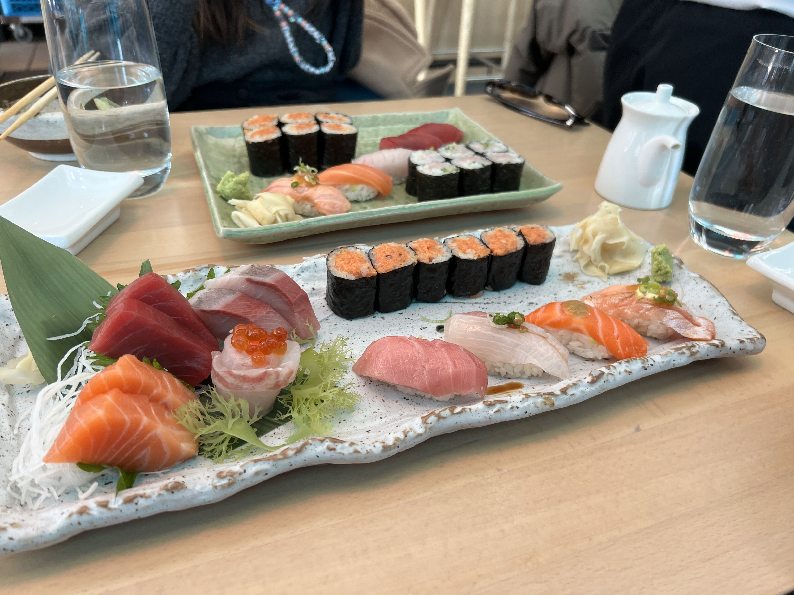

I've been to Momoya (the NYC SoHo location) two times, and both times, the food has been pretty great. For the lunch menu, they provide a surprisingly large amount of high-quality fish for a very reasonable price.

    

Both times I've gone, I ordered the sushi and sashimi combo, which comes with miso soup, 4 nigiri, 4 types of sashimi (2pc each), and one maki roll. All this for $34 is rather high-value, especially considering NYC prices, and the fish is always very fresh.

I will caveat - _do_ make a reservation in advance, and ask the host to be sat _downstairs_ if you can!

The first time I went on a cold winter day around noon with my friend, the experience was immaculate - we got seated downstairs automatically after checking in with our reservation.

The second time I went in the summer with my partner, and the downstairs area was already pretty full even at opening time. For context, their downstairs area has these giant glass walls that let in a lot of sunlight, and it almost feels like you're sitting on a sunny patio, with the added bonus of realistically being shielded from the harsh outside weather. The host immediately led us upstairs, which upon being seated upstairs, I noticed the stark difference in vibe - the upstairs area was much darker and gloomier, to the point where it almost felt like a different restaurant. Considering there were still open tables downstairs and we had made a reservation in advance, I asked the host if we could be seated downstairs, and she responded that downstairs was full. (Question mark?!)

The plus side was that our server upstairs was very friendly. He heard us lamenting about not being sat downstairs, and said that we should definitely ask the host, as there were clearly still tables available. My partner went again to ask the host, and this time, she relented and re-seated us downstairs. We were both a little annoyed at this point, but benefit of the doubt, I'm guessing maybe the host had other considerations (perhaps it's customary to leave a few downstairs spots open to attract passersby?). Nonetheless, the food was still great, and the suboptimal initial service was quickly replaced by satisfaction from the meal (and the downstairs vibes).

I would still go again, but would definitely be more persistent in asking to be sat in the coveted downstairs spot next time, and perhaps arrive even a little earlier than the reservation time to have a better chance.

_tags: location/nyc, japanese food, sushi_
