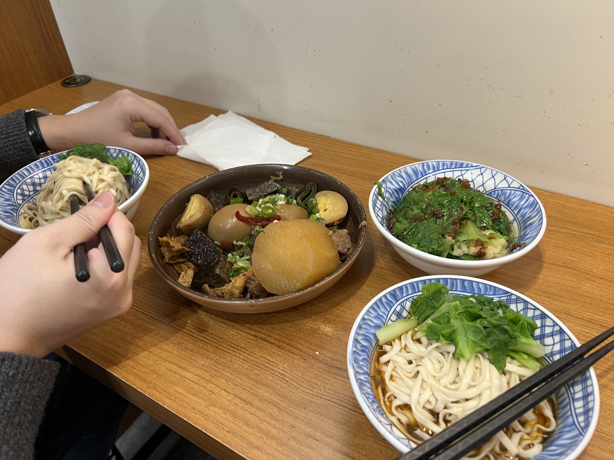
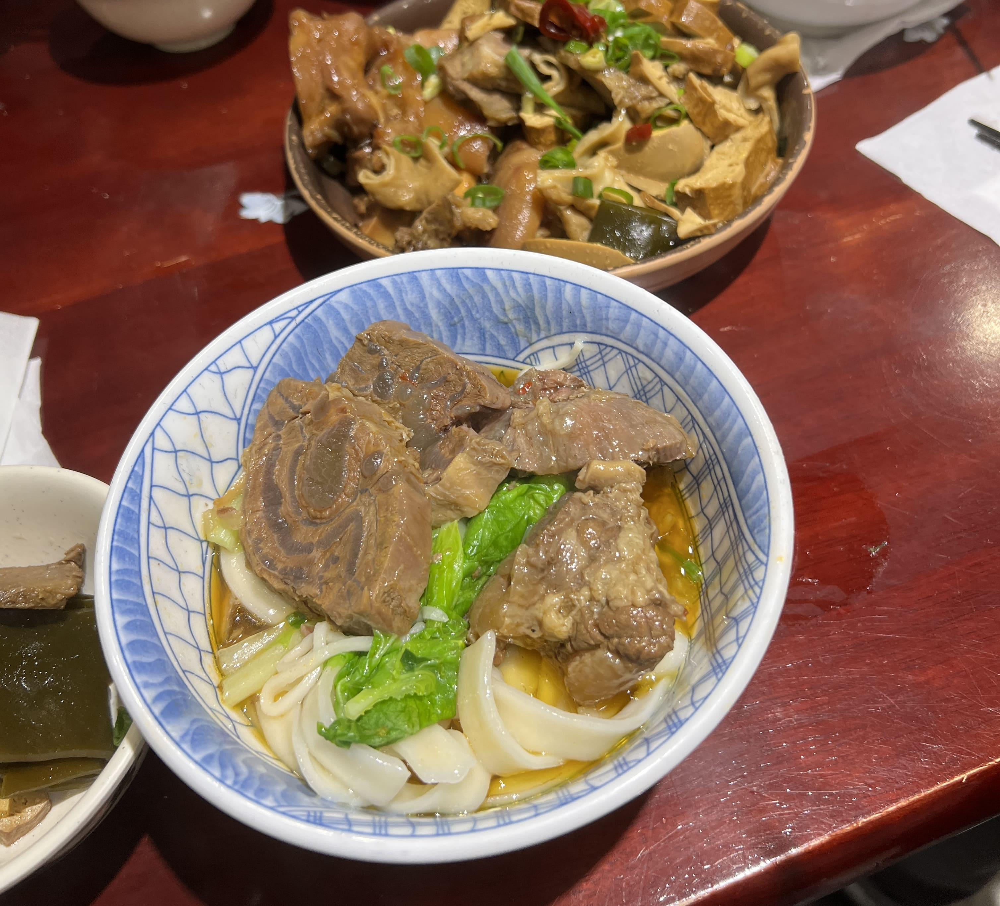
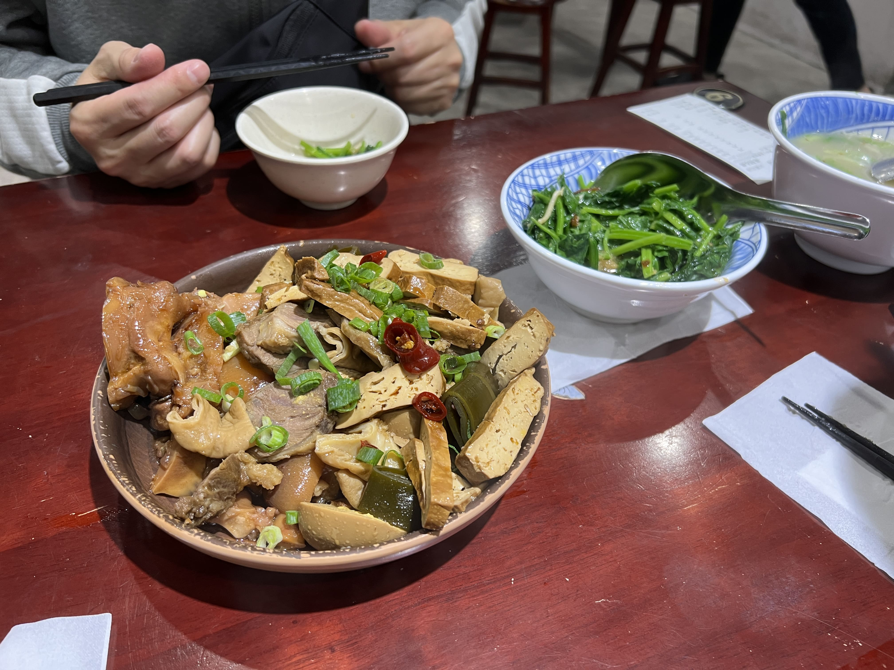

Taiwan travel diary is back! First one on the docket - 東引快刀手 (Dōngyǐn Kuàidāoshǒu), a super-casual noodle place in Neihu District, Taipei. It may look unassuming from the outside, but I assure you there's a reason this place is never empty, even on weekdays. Delivery couriers on mopeds pass in and out every few minutes to pick up local orders, and patrons cluster at the front of the restaurant to submit their order sheets and pre-pay. The vibes are very traditional hole-in-the-wall, so don't expect some top-of-the-line service - you're expected to retrieve your own utensils and whatnot from the back. Nonetheless, the staff is friendly, and might even speak to you in Hokkien if you're up for it.

This review is specifically for the Neihu location, but there are multiple!

    

The first time I visited, I got the 招牌麵 (Signature Noodle) with 寬麵 (thick noodles, you can choose thin as well), which is basically their hand-cut noodles soaked in beef-sesame oil. We also got a side of veggies and a plate of 滷味 (braised food).

The noodle texture was great, but the flavor profile was actually a bit light for me. However, the 滷味 was actually amazing - the aromatics had fully permeated the eggs and tofu skin and everything else, and it was absolutely delicious.

The next time I visited, I got the 牛肉麵 (beef noodle soup), and wow, this was definitely the perfect choice. Noodles were still great, and the soup was perfectly seasoned: not too greasy, not too light. Probably the best bowl of beef noodle soup I've had in recent years.

    

We also got the braised plate again, this time with way more items. The seaweed knots and dried tofu as well as the pork trotters were great as expected.

    

Next time I return to Taiwan, I will definitely visit this place again. There's _so_ many options for noodles, soup and dry, thick and thin. Also very cheap - less than $5 USD for a bowl of beef noodle soup (with lots of beef!), so if you're looking for a quick, inexpensive casual bite in Neihu, definitely stop by this one!

_tags: location/taiwan, traditional, noodles, neihu district_
