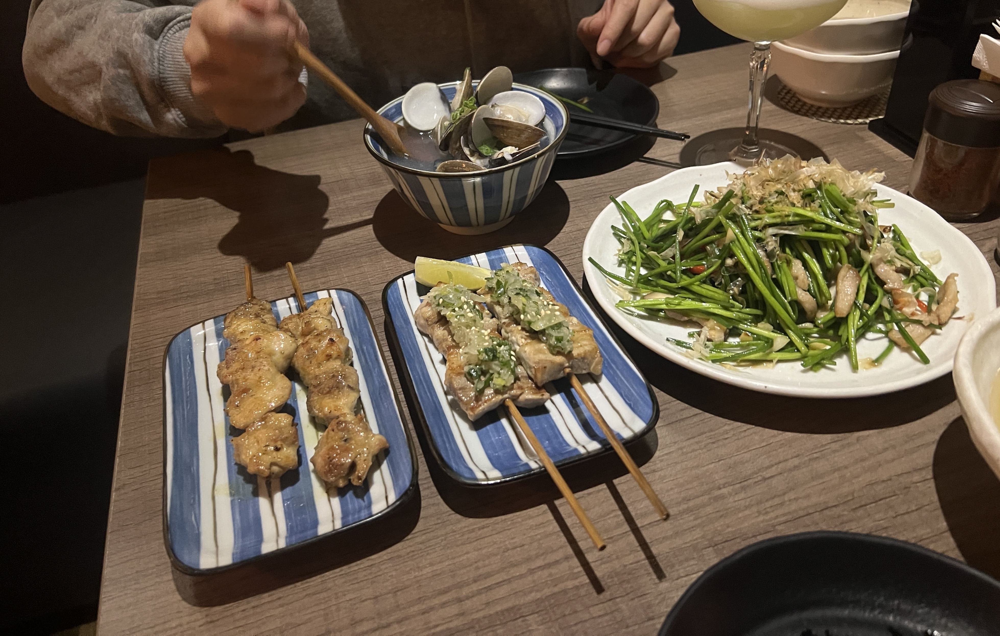

Always on the search for the best izakayas, I came across 新串 New Trend towards the end of my stay in Taiwan this year. Located in the busy Zhongxiao Dunhua area, it's a somewhat upscale, modern izakaya place that has a variety of creative house cocktails and lovely ambiance inside.

Their menu is extensive, with numerous chicken, beef, pork, and vegetable skewers as well as shared seafood dishes, fried and stir-fried and stewed dishes, and more. (No seafood skewers, unluckily.)

We ordered a mix of shared dishes and skewers. First to land on the table was the shuilian (水蓮菜) aka "white water snowflake," a local Taiwanese vegetable that is, believe me, the best vegetable ever. You know how stir-fried cabbage is such a popular vegetable dish because it's so easily able to absorb all the flavoring that you put in it? Well shuilian is the same except better, because its crunchy texture paired with a flavorless base (no hint of bitterness) makes for the perfect stir-fried vegetable.

New Trend's shuilian stir-fry was no exception, and it was a huge heaping portion as well. The vegetables were crunchy and refreshing and the seasoning was aromatic and 100% on point.

    

Next, I received my cocktail - I got the 香川縣烏龍茶酒 which roughly translates to Kagawa Prefecture Oolong Tea Cocktail. I have no clue if this cocktail is actually from Kagawa Prefecture, but it was dangerously delicious - I couldn't taste the alcohol at all, and it was refreshing and sweet with a strong tea flavor, topped with a thin wafer.

    

Now, for what we've all been waiting for: the skewers. We ordered the chicken thighs with teriyaki sauce and the pork belly with green onions.

    

Next was another shared dish: the creamy udon with chicken and cod roe. This pasta was great, and the portion was also very large. It had just the right amount of cream and seasoning - not too heavy, which I personally appreciated.

    

Last but not least, we got the beef skirt steak with salt. This was one of the most expensive items on the menu (420 TWD ~= $13 USD), so we had pretty high expectations for it. One bite in and I could already tell it was melt-in-your-mouth, tender steak slices that only needed a little sprinkle of salt to bring out the natural flavor. Definitely recommend this dish.

    

Overall, love love _loved_ this place! Convenient location and the perfect vibe for a date spot or a girls night. It is on the pricey side, so be prepared to drop around 800-900 TWD per person including drinks.

_tags: location/taiwan, izakaya, late night, upscale_
