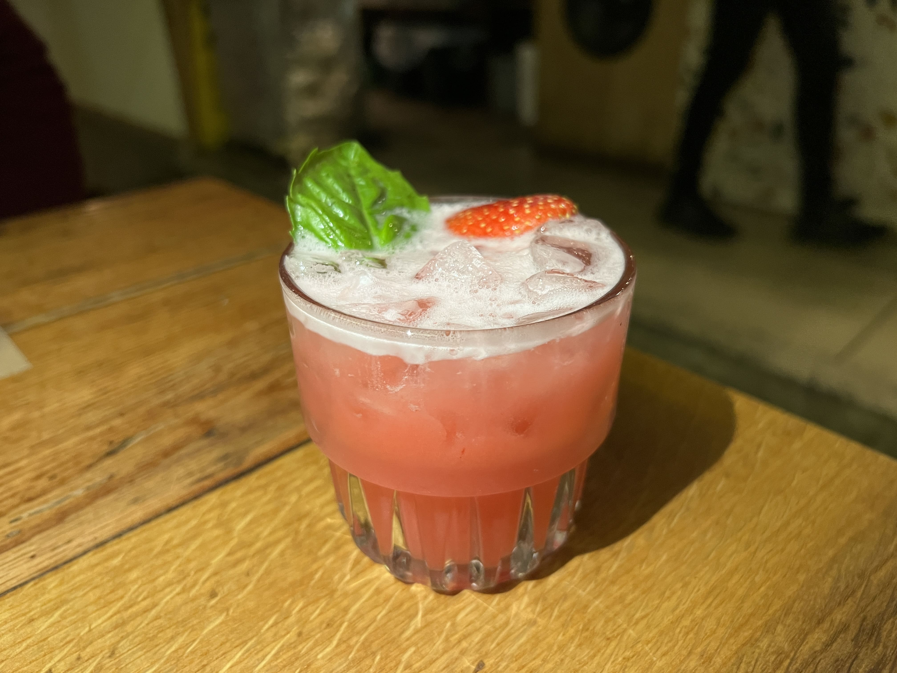
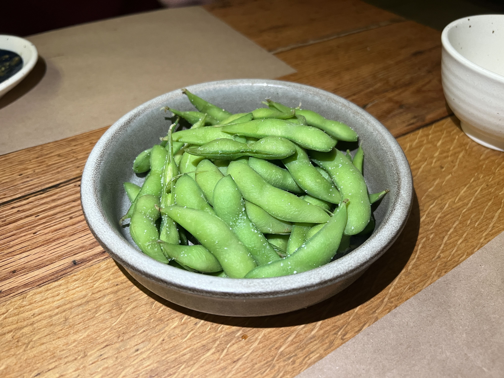
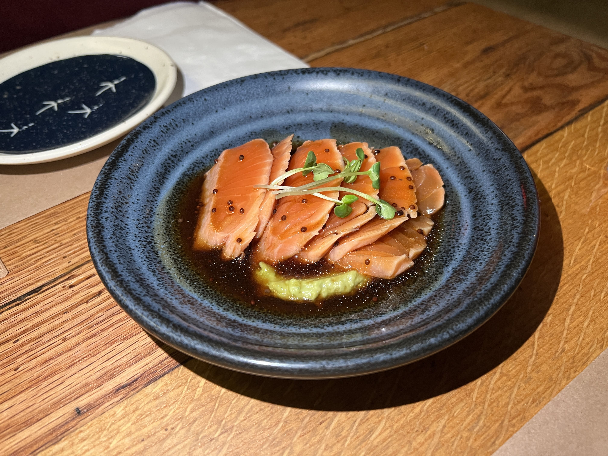
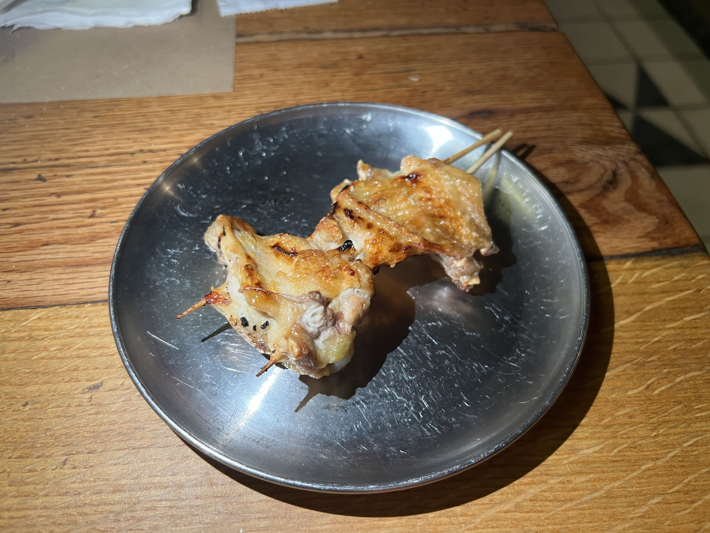
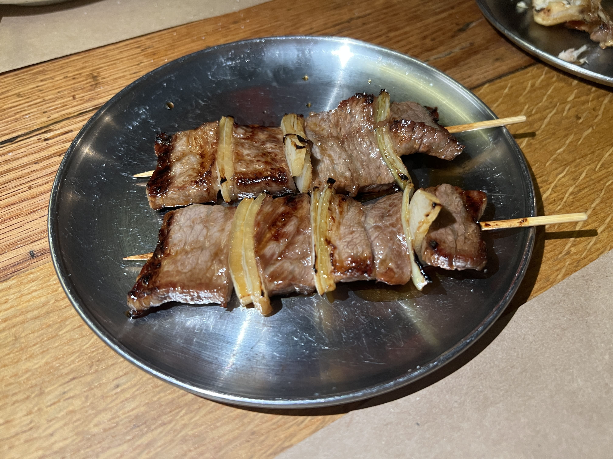
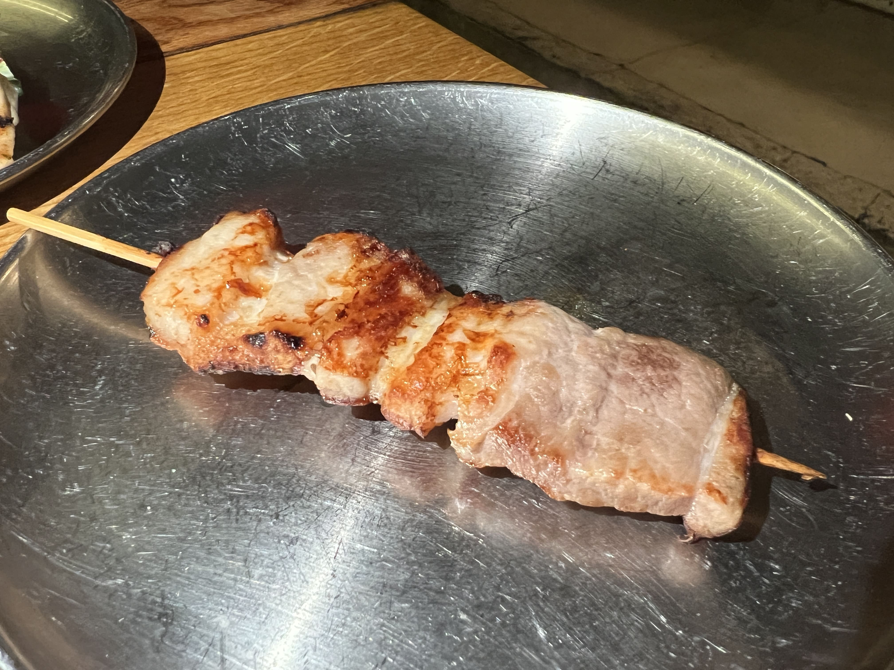
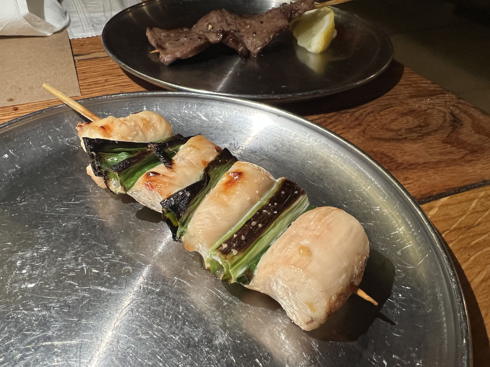
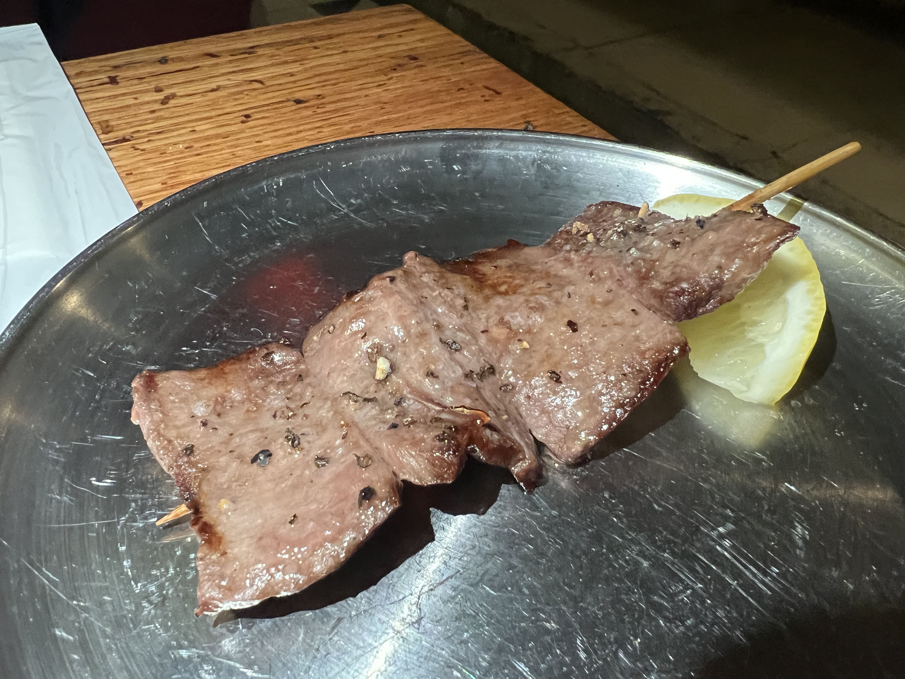
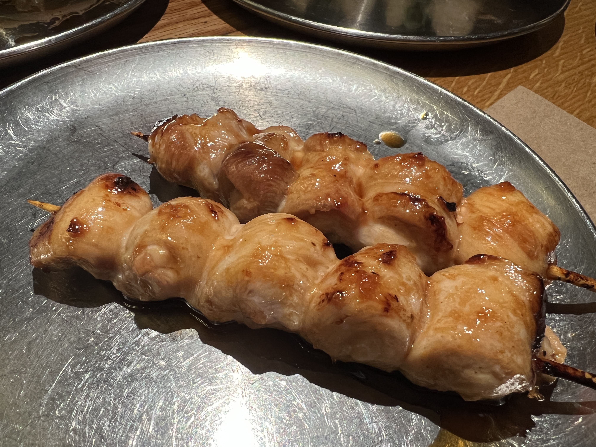

This yakitori restaurant was on my list for a while, partially because I thought the name was absolutely hilarious, partially because I later learned that it was a sister restaurant of <a href="https://clarityeats.com/hernameishan/">Her Name is Han</a>! Upon approaching the text-embellished glass entrance of the restaurant, I finally realized that NONONO stood for "Nowhere. Not anywhere. Now, here.", a quirky, creative touch that I enjoyed.

The menu and vibes were similar to Her Name is Han - minimalist, with an emphasis on artistic presentation. Both also have a penchant for very fruity, interesting-looking drinks - I couldn't resist ordering one of the cocktails called _Basil_, which ended up being VERY suited to my taste (namely, didn't taste like alcohol at all).

    

For appetizers, we ordered the edamame and the salmon tataki. The edamame was, well, edamame.

    

The salmon tataki was lovely: each bite melted in my mouth, and the pairing of a soybean-based sauce and smashed avocado added the right amount of sweet and salty to the fish.

    

For the yakitori, we ended up ordering an assortment.

First to arrive was the wings:

    

These were reported to me by my friend as underwhelming and "difficult to eat." Although I did not personally try it, visually I can see why that was the case.

Next to arrive was the short rib with onion. These were actually some of the best yakitori I've ever had. Tender, marinated through and through, and complemented by the sharp flavor of the onion pieces, this was my favorite part of the meal.

    

The pork with shio followed. I think I assumed it to be semi-fatty pork belly but it ended up being pretty lean meat, which was alright but a little tougher than I expected, and it was also more lightly seasoned, which I guess I should've known from the "with shio" part.

    

Chicken breast with scallion - not mine, but reported to me as "slightly dry but alright."

    

Beef tongue - I ordered this out of curiosity since I've had beef tongue at KBBQ places and always thought it was a little weird, but wanted to see if I would like it better in Japanese yakitori context. It was still a little weird to me, but I didn't hate it.

    

Last to arrive was the chicken thigh skewers. Although visually slightly underwhelming, they were actually wonderful! Easily my second favorite yakitori order of the day. The meat was soft and caramelized, and tore away easily from the stick (very not-difficult to eat).

    

Overall opinion of NONONO - a little hit-or-miss, some of the stuff was mindblowingly good (basil cocktail, salmon tataki, short rib and chicken thigh yakitori) while some others were slightly meh. I'd definitely go again for my favorite items and maybe explore a little more of the rest of the yakitori and other dishes (the menu is really, really long), although I think the yakitori might be better suited for people with more adventurous tastes than I (the heart and liver skewers look pretty elite if you're into that). Conclusion - still recommend!

_tags: location/nyc, yakitori, nonono, japanese cuisine_
