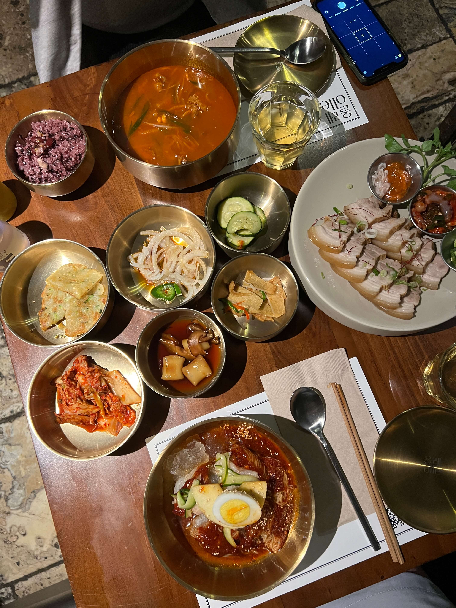
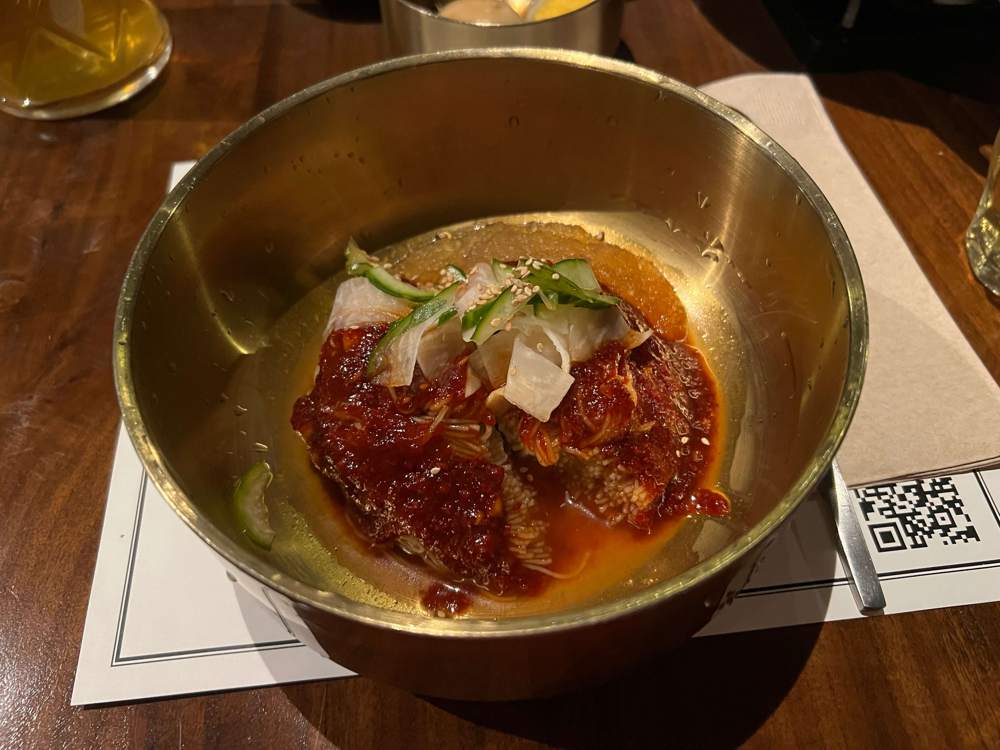
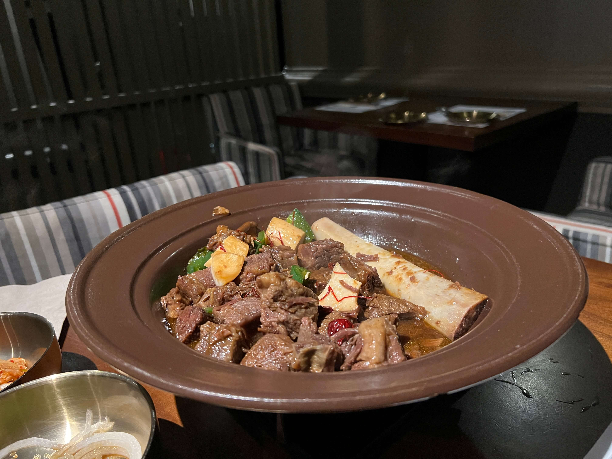
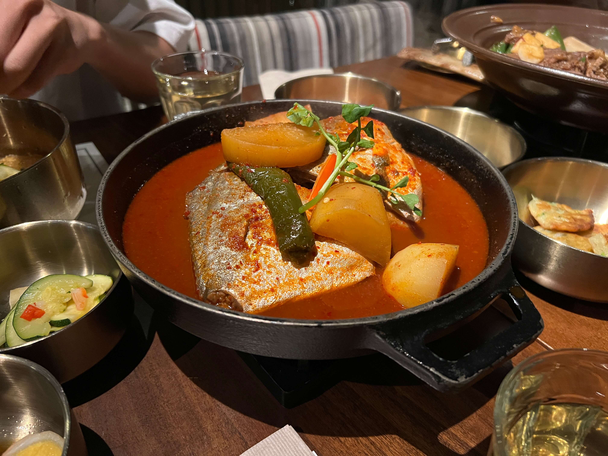

Continuing the NYC series! olle is a Korean restaurant a couple blocks from the main Koreatown street, slightly hidden in a side alley unless you explicitly search for it on Google Maps. That doesn't stop it from filling up super fast though, and for good reason. I've been here twice already, and had good experiences both times.

They have a broader selection than a lot of Korean restaurants in the city, and they seem to do everything well, from naengmyeon to galbijjim to gukbap.

_First time_:

The first time I ordered naengmyeon at a random place in Boston, I didn't like it much at all. I decided to take a leap of faith and get bibim naengmyeon here at olle, mostly because it was way too hot outside for anything else. To my surprise, this stuff was _amazing_. It was refreshing, spicy but not too spicy, flavorful but not too salty.

My friend got the gukbap, which I stole a little of - also amazing, a hearty, rich soup base. We also got the bossam to share - to be honest this one I wasn't a super big fan of, since the meat was a little tough. Nothing beats <a href="/chodanggol">Cho Dang Gol</a> bossam, I guess.

The banchan spread was impressive - eomuk bokkeum and pajeon and this little rice cake thing that I absolutely _loved_ but couldn't figure out what it was called - my Korean-American friend didn't know either, so I guess it'll remain a mystery.

    

_Second time_:

I still ordered the bibim naengmyeon. It's just too good. I got the small version though - since my friends and I got the large galbijjim to share, and you can add on two small portions of naengmyeon for a lower price.

    

The galbijjim - probably the best I've ever had, truly. The beef wasn't tough at all, and I could drink that seasoned broth forever. They also separate it from the bone for you, which was a plus.

    

My friend ordered the byeonguh jorim, a spicy braised pomfret. The fish was... very large. This dish was also very, very good. The marinade had fully permeated the fish, resulting in a very flavorful, tender flesh that I couldn't get enough of.

    

Overall - highly recommend! olle has been inducted into my list of must-try recommendations of NYC.It _is_ more upscale, but not much more than other Korean restaurants in the area.

The only downside this time was that they didn't have the rice cakes in the banchan. I guess that means that I have to go again!

_tags: location/nyc, korean cuisine, traditional food, koreatown_
