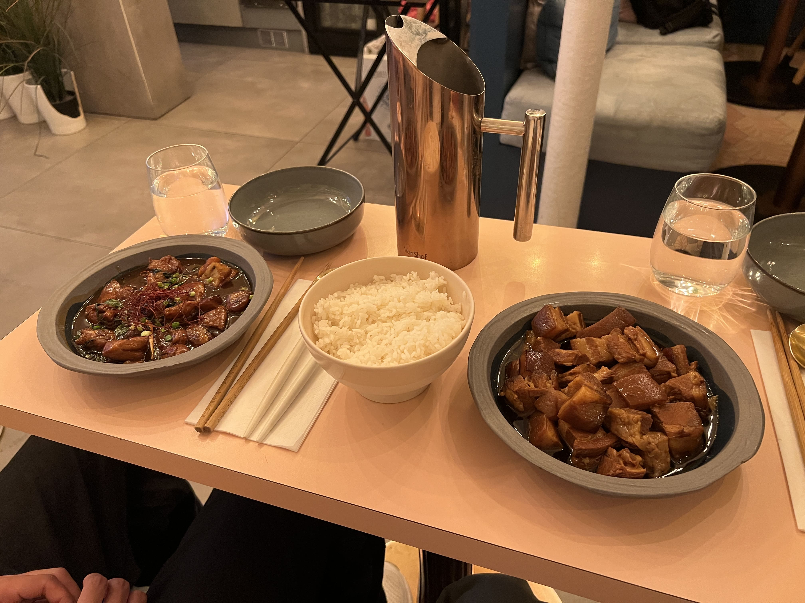

Have I ever mentioned that I love French onion soup? Well, I do, and where better to have soupe à l’oignon than Paris itself?

We landed at Charles de Gaulle airport late at night from Barcelona, since our flight had been delayed. Hauling our tired selves (and luggage) to our Airbnb in the Bastille, we called it a night immediately, dreaming of all the good food we'd have the next day.

Morning came, but we awoke a bit too late. Pulling up to Aux 2 Anges at 10 AM, a local bakery in the Bastille, a lot of the pastries were already gone or slightly soggy. My caneles were not the same as I remembered from the year before, although I enjoyed the cheesy bread. A lesson to wake up earlier next time...

    

Starting the day at the Catacombs of Paris, we walked through dreary tunnels of skulls and bones, reading the history panels on the walls. It was an informative (albeit chilling) experience that left us slightly dazed as we walked aimlessly through the streets of the 6th arondissement, half-looking for a place to eat, but not extremely hungry either. Near the Luxembourg gardens we happened upon a public fair, with activities and food stalls. We grabbed some doughy cheese balls and grilled cheese (in a cup?!) and continued with our day at the Musee d'Orsay. It was a lovely (and very large) museum, and by closing time, we were truly hungry.

We had booked a table at Les Antiquaires, a famous Parisian bistro that isn't particularly hard to book in advance (we booked the day before), but that doesn't mean you _shouldn't_ reserve - if you try to walk-in, you'll most likely have to wait. The restaurant was very full by the time we got there with groups of hopeful customers waiting outside in the rain, so we were grateful we had the foresight to reserve.

    

To start, we ordered the escargot and the fine de claire (that's me!) oysters. I used to be pretty freaked out by stuff like snails (and even raw oysters) but in recent years I've trained myself to be a little more open to trying new things. I even forced myself to try escargot at Balthazar in NYC a few weeks prior to this trip (to rip off the bandaid), and I actually ended up enjoying them quite a bit, so this time I was prepared. The "real" French version at Les Antiquaires was less sauce-doused than Balthazar's (which made the snail texture much more apparent), but I liked them nonetheless. The oysters were full and juicy and left me wanting more.

    

For the mains, I got onion soup and my partner got the duck breast. Both were fantastic, and I especially liked the cheese potatoes on the side of the duck. In fact, those were probably my favorite part of the meal.

    

 

    

  

•••

The next morning started similarly to the previous - we woke up late, and busted our asses out to the first arondissement for Kodawari Ramen. I had been raving about this place to my partner for a while and was excited to finally show him my favorite ramen place in the world. We got there a few minutes before opening, and thank goodness we did because the line outside grew rapidly after that (and it was raining).

    

Since I got the chintan last time, I ordered the paitan this time, and encouraged my partner to get the chintan. Both were still as good as I remembered, but it was funny because I decided I still liked the chintan more, and my partner ended up liking the paitan more, so we swapped halfway through.

Since Paris was the last leg of our trip, we were both pretty tired, and didn't plan much for the itinerary. We visited the Olympic merch store, perused through the Champs-Elysees, got macarons at Laduree, stopped for a boba break at a place called Le The (would recommend!), and picked up some pastries at Stohrer.

Eventually, it was 7 PM and we decided to try a little taste of home - Taiwanese food. Chez Ajia had pretty good reviews on Google so we decided on that, hoping for some comfort amidst a tiring, rainy day.

    

Honestly, I was really looking forward to ordering the stir-fried clams, but they were SOLD OUT?! So we settled on three-cup chicken and braised pork. The dishes were not bad, but a little sauce-heavy, and perhaps more of our own fault, but the two of them looked (and tasted) rather similarly (they probably used the same braising sauce) so the meal felt a little anticlimactic. The vibes inside were nice and I'd be open to trying other dishes (if not sold out) next time, but I wouldn't be dying to go back.

•••

On our final day, we ate breakfast (basically lunch, given how late it was) at Tranche Marais. Their croissants were quite good!

The rest of the day was spent at Sacre-Couer and its vicinity. We stopped for a mid-afternoon snack at Creperie Broceliande. They had a lot of options, and I got the cheese and mushroom, which was pretty good.

    

Finally - dinnertime. We had made a reservation at Le Comptoir de la Gastronomie, a pretty popular foie gras place in Paris. We got onion soup - yes, again - to share, and I ended up choosing the foie gras ravioli, while my partner got the duck leg.

    

Onion soup was good, but nothing too crazy. However, the main courses were the real deal - the ravioli was so tender and soft I couldn't believe they didn't break upon fork impact, and the foie gras (my first time having it) wrapped inside was so delicate and delicious. My partner's duck leg was not bad, but the POTATOES were awesome. My favorite part of the meal (again) were the cheese potatoes (maybe I have something for cheese potatoes?!) and my partner loved the foie gras ravioli the most.

    

We also ordered dessert - sorbet and creme brulee, but those were less remarkable, and I'd probably pass on dessert on a second visit.

•••

This was my second time in Paris, and although the weather was drearier, the food was definitely way better (with pre-planning and reservations). I formed a deeper appreciation for French cuisine on this trip, especially the cheese potatoes...

_tags: france, travel, bakeries, restaurants_
