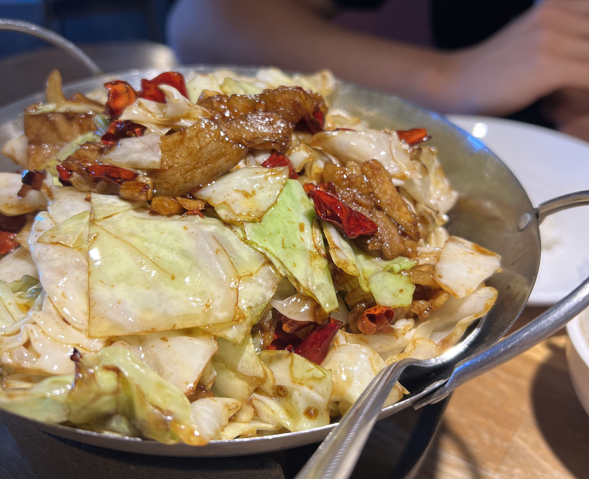
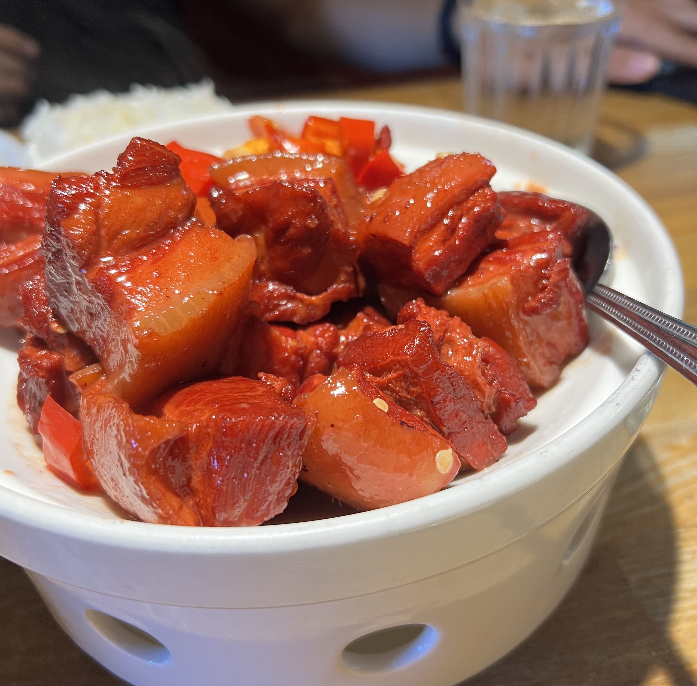
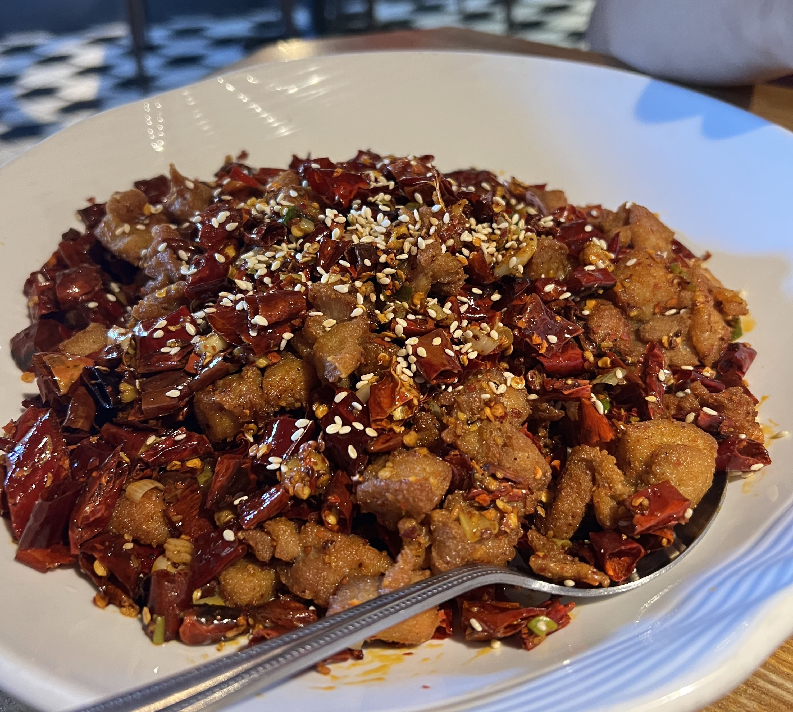

There are actually multiple Ping's Bistro locations in the Bay, but this review is specifically for Ping's Bistro Fremont. I'm super excited to finally review this place because it's been my family's go-to restaurant for Chinese takeout for years now.

Ping's Bistro is a Chinese restaurant specializing in Hunan cuisine, but they also serve a variety of Sichuan dishes as well (read: lots of spicy food!). Their portion sizes are large, and the prices are not cheap, but pretty reasonable for Bay Area fare these days. 

My favorite dish to order is the Shredded Cabbages with Sliced Pork. And now you must be thinking... a vegetable dish? My _favorite_? At a Chinese restaurant? But hear me out - the crispness of the cabbages, seasoned perfectly with a spicy kick, paired with the flavor and texture of the thin marinated pork slices - it's to die for. My only quip with this dish is that it's a little greasy (don't look at the bottom of the pot after you finish)...

    

I also often get the Chairman Mao's Braised Pork, a Hunan specialty. Ping's Bistro does it well - hearty chunks of pork belly, each with alternating layers of lean and fatty meat, cooked to tenderness and seasoned with chili peppers.

    

Last but not least, the Chongqing Style Spicy Chicken, a famous Sichuan dish also commonly known as _làzijī_. The chicken pieces are breaded and fried quite intensely, and the flavor bursts into your mouth with every bite. This one is admittedly not my favorite to order at Ping's since they seem to go heavy on the Sichuan peppercorns (a matter of personal taste, some people do love this) and also throw in quite a lot of peppers (the plate ends up looking more like peppers with a side of chicken), but nonetheless it is still an enjoyable dish, and done well for what it is. 

    

Overall, Ping's Bistro is a must-visit if you like spicy Chinese food! If you're curious but hesitant about your spice-tolerating abilities, I'd suggest you try it anyway, and ask the waiter if they can make certain dishes non-spicy or mild spicy. There's no guarantee they'll honor the request perfectly, but it's worth a shot, right? ☆ 

_tags: location/sfba, ping's bistro fremont, hunan cuisine_