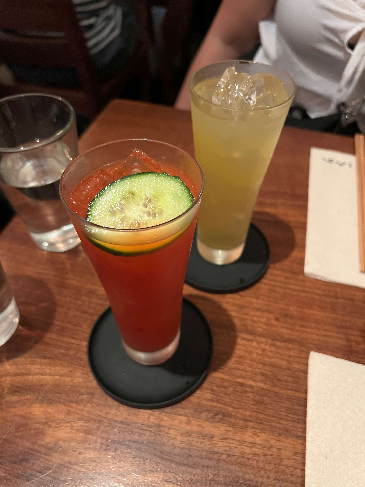

If you're on the hunt for the best cold udon in the city, Raku is probably a strong contender for first place. (They have numerous hot udon options too, so there's something for everyone!) There are two locations in Manhttan - SoHo and East Village. Don't get confused with the other restaurant with a similar name in Midtown East and UWS - they're not the same!

Raku isn't your traditional Japanese udon place - they definitely have the traditional options, _kitsune_, _wakame_, _zaru_, _nabeyaki_, and so on, but they also have slightly _edgier_ options if you're down to branch out - an _a5 wagyu_ udon, a very-non-classic _niku_ udon with honeycomb tripe and beef tendon, a _mapo tofu_ udon (?!) and more. My personal favorite is the _ja ja_ udon (previously called _mad tiger_), a cold dashi broth udon with spicy miso ground pork, cucumber and tomato slices, and a chilled poached egg to mix in. A refreshing meal for a hot summer day!

    

It looks a little like a noodle salad, doesn't it?

This time, my friend and I also got the two cocktails and an assorted tempura to share. The tempura was typical. The cocktails were pretty unexpected - I liked the _quarantini_ more than the _bloody mari_ personally. Definitely not your typical fruit cocktails, but worth a try!

    

Raku is probably one of the most popular udon restaurants in Manhattan, and for good reason. Definitely check it out!

_tags: location/nyc, japanese cuisine, udon noodles_
