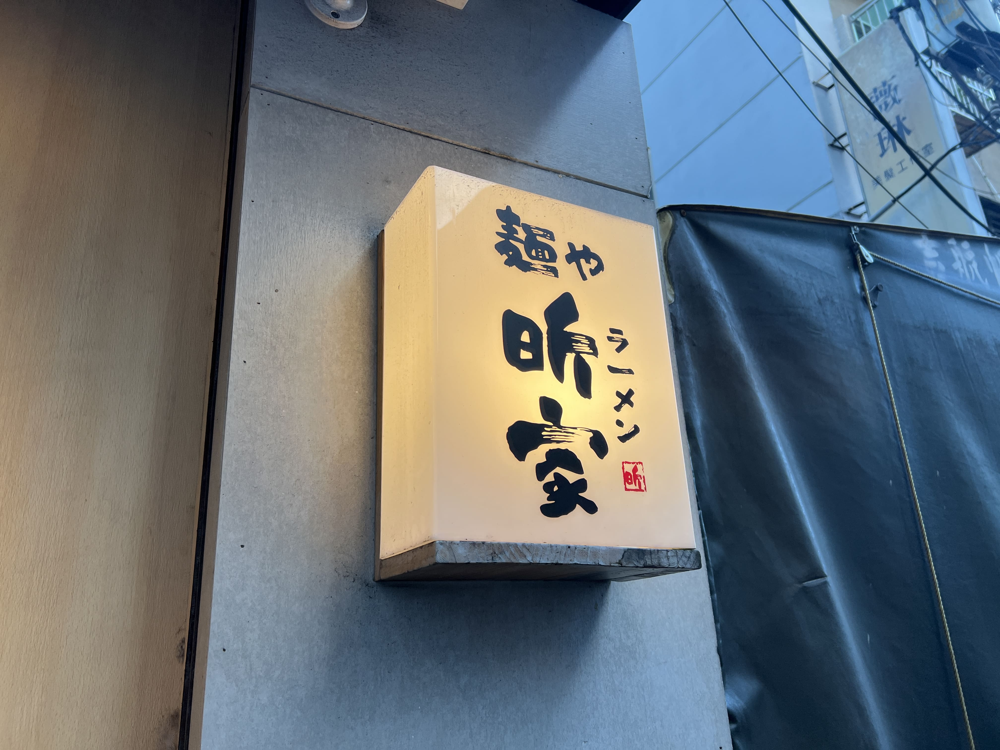

Hello Taiwan! I'll be here for a while so obligatory food diary begins here. Recently I got to try Ramen Shinga (麵屋昕家), a little ways from Donghu MRT Station in the Neihu District. It opened at 5pm but by 5:10-ish there was already a line out the door. 

    

If you've ever been to or seen pictures of Ichiran Ramen, it's sort of similar logistically in the sense that the seats are all side-by-side with dividers in between, so even if you go in a group you eat "individually." Since the restaurant is quite small and the line is sizeable, they encourage you to eat quickly - this is definitely not a chill and chat type of place, so if you're trying to catch up with a friend you haven't seen in a while, this is probably not the place to go (although... perhaps you could catch up during the wait in line). We were seated in about half an hour.

    

Inside, you order at a machine near the door, pay upfront, and then hand the chefs your receipt at your seat. There's only a few choices, so that's when you know a ramen place is good. They specialize in chicken broth instead of tonkotsu - but don't be fooled, it's _not_ the thin, watery kind of chicken broth you're probably thinking of. The broth was rich and foamy, noticeably less fatty than tonkotsu but still thick and flavorful nonetheless.

    

The noodles are thick and chewy, and there are two kinds of meat included - pork chashu and the lesser-seen chicken version. There's also red onions (which was surprising to me) along with the more typical green onions, and a deliciously marinated egg (if you opted for the marinated egg option). 

    

I'd definitely recommend Ramen Shinga for a fulfilling, unique bowl of noodles. You should definitely prepare for a wait, but once you're seated, the noodles are served rather quickly! ☆

_tags: location/taiwan, ramen, neihu district, taipei, japanese food_