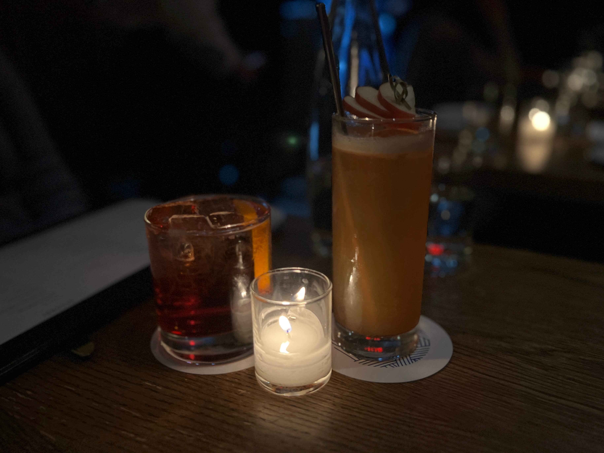

After spending multiple nights trying to get a reservation for this place, I finally snatched one for an early Friday evening... a whole month in advance. After trying it, I'll have to say the hype is well-deserved, although it's definitely not somewhere I'd be trying to dine every week (my wallet will thank me for it).

    

We started out with cocktails. ~Keep in mind that I'm writing this retrospectively half a year after the fact, so I could not tell you what the name of the cocktails were, but they were good. Trust me.~ I found my receipt - my friend got the _mela_ and I got the _negroni sbagliato_.

    

Honestly Italian restaurants are always so stressful for me because I never know how to read anything on the menu. For the appetizers we landed on this _gnocco fritto_, aka fried puffy bread with a faint cheese flavor and prosciutto laid on top, aka a glorified charcuterie board. It was fine, but I think the dough took up too much space in my stomach - in hindsight would've probably preferred to order another pasta in its place.

    

My friend, being an avid vegetable fan (couldn't be me), ordered the blood orange & fennel salad. I had very low expectations for this - nothing against the chefs, but I do _not_ like orange, and I do _not_ like fennel. So imagine my surprise when I took a bite of this ridiculous salad and found myself taking second, third, and fourth bites. It didn't have the bitter aftertaste of fennel that I remembered, and the orange provided just the right amount of juicy tanginess to the flavor profile. I can wholeheartedly say that if I go again, I will definitely order this salad again (although it does seem like only a seasonal item).

    

And now for the main pastas - we ordered three. First was the _spaghettoni e vongole_, a squid ink pasta with manila clams. I had highest hopes for this, since clam pastas are generally my favorite. The squid ink flavor was stronger than I expected, the ocean saltiness being simultaneously flavorful and a bit overwhelming. I think if the pasta would have been 30% lower in sodium content, I would have enjoyed it much more.

    

Next was the _reginelle ai funghi di fossa_, a mushroom pasta with a generous snowfall of cheese flakes scattered across the top. I really liked this one - the herb butter and cheese added depth of flavor without being too heavy, and the soft, chewy reginelle pasta was complemented well by the strong aroma of the black trumpet mushrooms.

    

Finally, last but not least, we got the famed _uovo raviolo di nino bergese_, a singular raviolo filled with egg yolk and ricotta cheese and topped with decadent truffle shavings. Definitely lots of rich (and cholesterol-threatening) ingredients coming together in unexpected harmony. The burst of flavor was no joke, and I went away from this dish hoping they had served two ravioli instead of just one.

    

Out of all three pastas, I think I would rank them 2 > 3 > 1, but each dish was definitely a work of art with a unique flavor profile of its own.

For dessert, we got gelato.

    

Conclusion - definitely recommend, but remember to book your reservations a month in advance, and be prepared to spend a decent chunk of money for somewhat small portions!

_tags: location/nyc, northern italian cuisine, pasta, michelin_
