This was my second time in Spain, but my first time in Seville and Madrid! I really enjoyed my time there, especially in Seville - it felt surprisingly small-town-esque despite the influx of tourists, and the shifted mealtimes (and the siesta) definitely took a bit of getting used to for us. The Seville sunshine was no-joke - my family and I went at the end of December and it felt solidly autumn. I was hesitant about Madrid since I feel like many people have told me Madrid doesn't have good food, but I honestly thought the places we went to were really great.

Without further ado, here are our food experiences, ranked from worst to best:

### 12. Mamarracha Tapas, Seville

Caveat - this review is mostly on the service rather than the food. The food itself was quite decent, but the experience overall left such a sour taste in my mouth from the service attitude that I seriously thought about it for _days_ afterwards about how bad it was.

From the start, the server was a little impatient with us. It was a busy day, sure, but when I tried to start ordering food, he waved dismissively, telling us that drink orders come first. Not a huge deal, but not a particularly pleasant first interaction either. We tried to order a salmon dish, and he said "no salmon," so we switched to other items. (This becomes relevant later on.)

The real kicker was when he placed a plate of artichokes on our table. "We didn't order this," I said. Instead of checking with the kitchen or the order platform, he immediately insisted that I DID order it, and said that he specifically remembers me pointing to the menu item earlier. I was stunned at this point because (1) I was 100% sure I did not order nor point to the artichokes (2) statistically speaking, is it more likely that a customer forgot what they ordered 10 minutes ago, or the waiter who has to be in charge of 10-20 tables? Regardless, I re-emphasized that I did not order it, and the waiter angrily argued back again, saying I did. Eventually he relented and indignantly took the dish away. A few minutes later, I could've sworn I saw him return to the dining area with the exact same artichokes to bring to another table... and suddenly became _way_ more apologetic and friendly to us.

It didn't really matter because at this point I was so frustrated to the point of indigestion. Even more irritating was the fact that he earlier said "no salmon," and yet we saw the table seated next to us who ordered _after_ us receiving plates of salmon. But I wasn't in the mood for asking for more dishes at this point - I just wanted to leave.

Overall it was just a really bad experience to be gaslit by the server and then not even receive a proper apology afterwards, and frankly, I felt embarrassed bringing my family there for NYE. Benefit of the doubt maybe he was just having a bad day, but I personally would never go there again.

### 11. El Jardín de Arzábal (Museo Reina Sofia), Madrid

Mid-browsing the Museo Reina Sofia, we were all hungry and looking for a place to eat lunch. Luckily, they had a couple restaurants inside the museum, the El Jardín de Arzábal being one of them.

The food selection for lunch was not extensive - there honestly weren't that many things I wanted to eat. The prices were a bit high as well, but somewhat expected being inside a major tourist destination.

The pork on sweet potato (Torreznos con revolconas) was actually quite good, whereas the artichokes (not pictured) were a bit flavorless.

    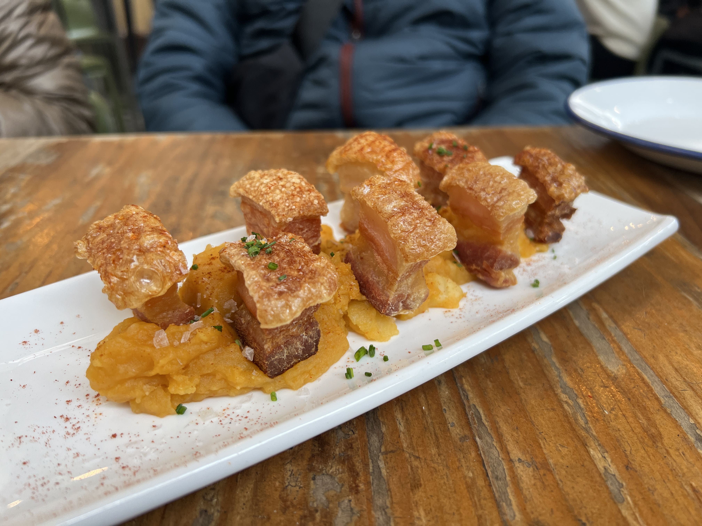

I would probably be okay with eating here again if I was visiting the museum again and hungry, but definitely not memorable by any means.

### 10. Cafe Piola, Seville

This random-ish cafe ended up being our stakeout in the late afternoon while we were waiting for our Duo Tapas reservation at 8 PM. Being pretty maladjusted to the long siesta and late dining hours, it felt like refuge when we found this open cafe at the edge of the Plaza Alameda de Hercules. We grabbed some drinks and a carrot cake and muffin to munch on - they bake their own carrot cake and it was quite good!

    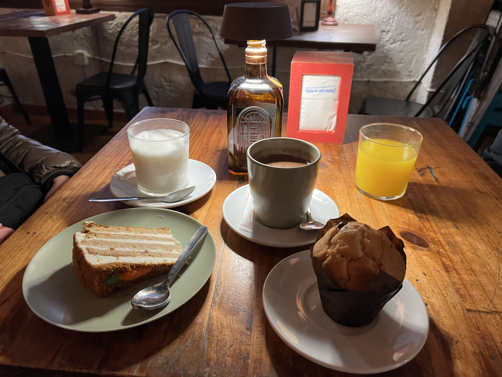

### 9. La Malvaloca, Seville

Another byproduct of wanting to eat lunch at American lunchtime and realizing not much was open, we stumbled upon La Malvaloca near the Setas and decided to get seated.

In dire need of vegetables, we ordered the salad, which was refreshing and punchy.

    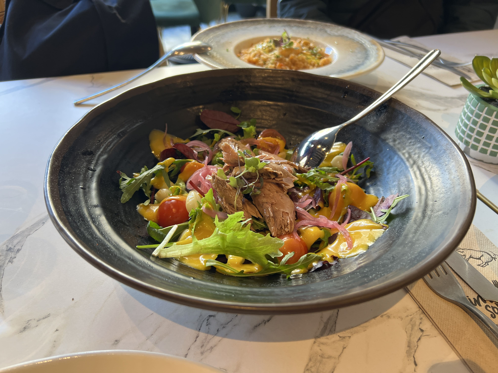

The shrimp was decent as well, although a bit overshadowed by the garlic shrimp at a seafood restaurant in Portugal the day before. I liked the croquettes, and the rice was pretty delicious.

    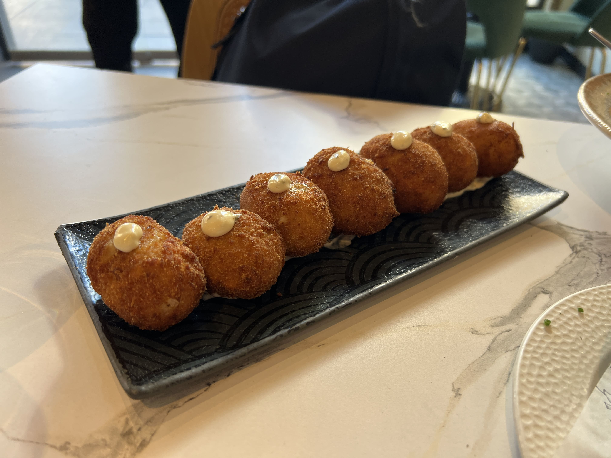

 

    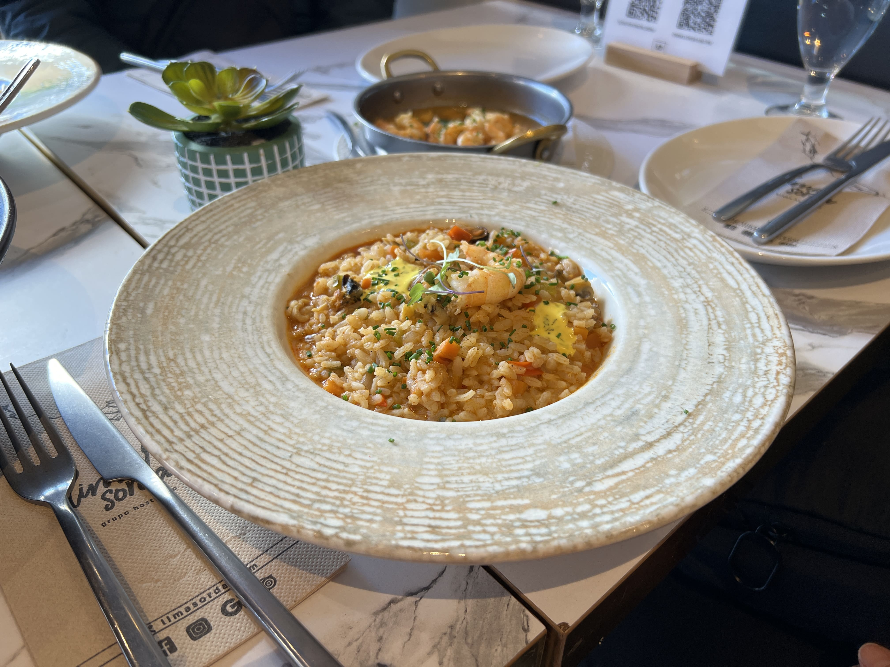

### 8. Duo Tapas, Seville

This was the only place in Spain that I made a reservation way in advance for - I saw recommendations on Reddit, and the reviews on Google were also very promising. I think because I was so hyped up for it, it ended up falling slightly short of the high expectations, but the food was still yummy by most standards, and priced very reasonably. The service felt a little minimal, which was not a big deal, but a bit surprising given the raving reviews about service online.

    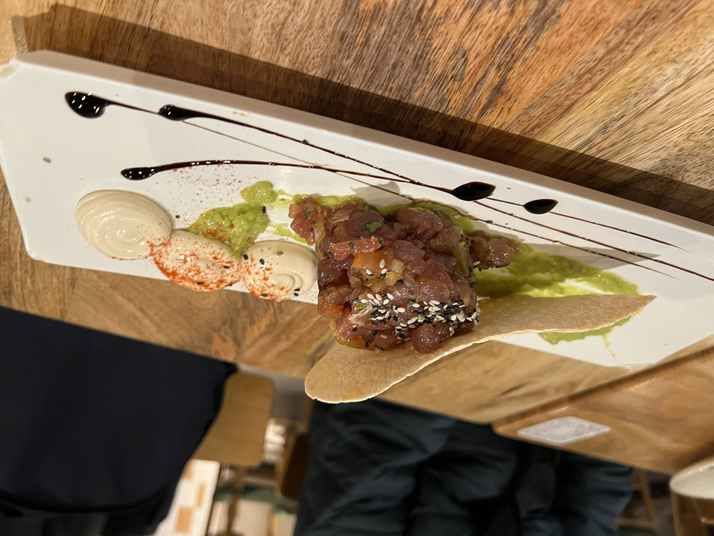

I couldn't stop myself from ordering tuna tartare everywhere I went in Spain, and it was a good choice here because the marinade was absolutely delicious - the juicy tuna paired with the crunchy wonton chips was absolutely heavenly.

    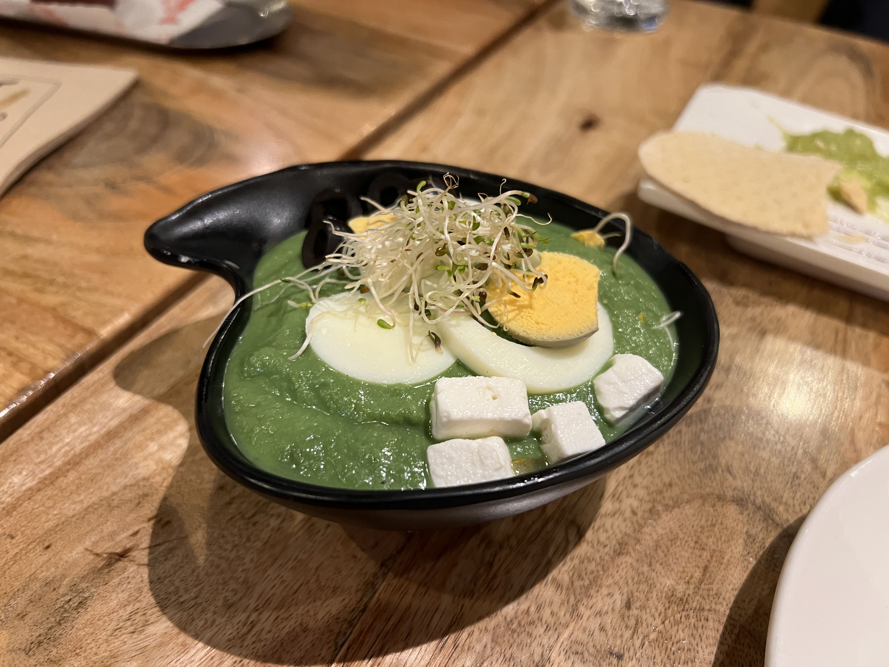

Next was the green salmorejo, one of their most discussed dishes. It was definitely interesting, but I had never had "original" salmorejo before so I didn't really know what the difference was in the green version. I liked it for a few bites but it was a little overwhelming after a while.

The octopus came, and I thought it was fine, not too memorable in a particularly good or bad way. The seafood felt fresh though.

    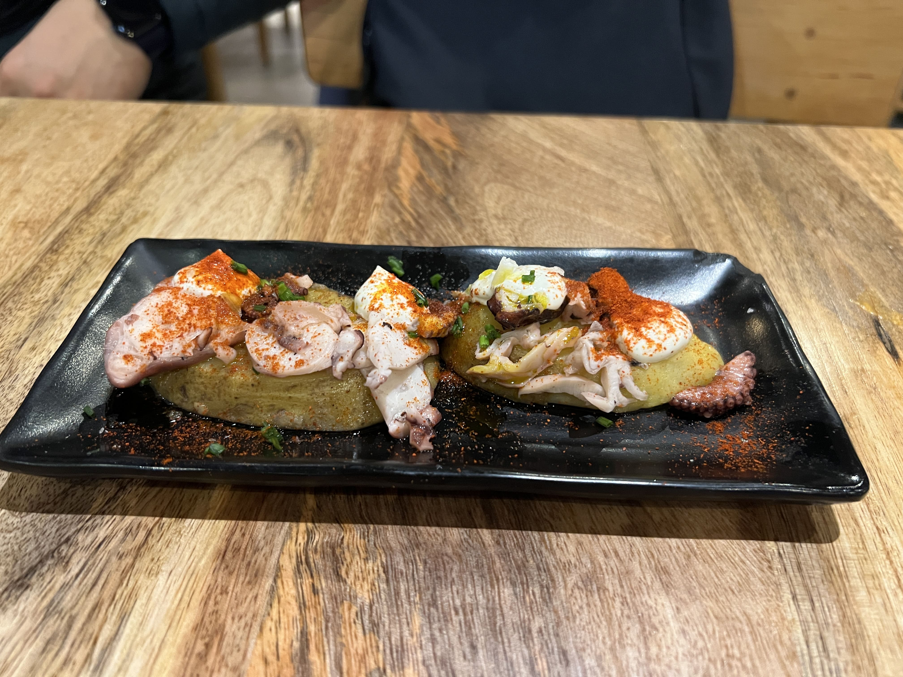

The fried eggplant was unexpectedly one of my favorites from the night. I actually didn't realize what it was until I bit into it, but somehow the sauce and the crispy eggplant worked super well together. Felt a little like tempura.

    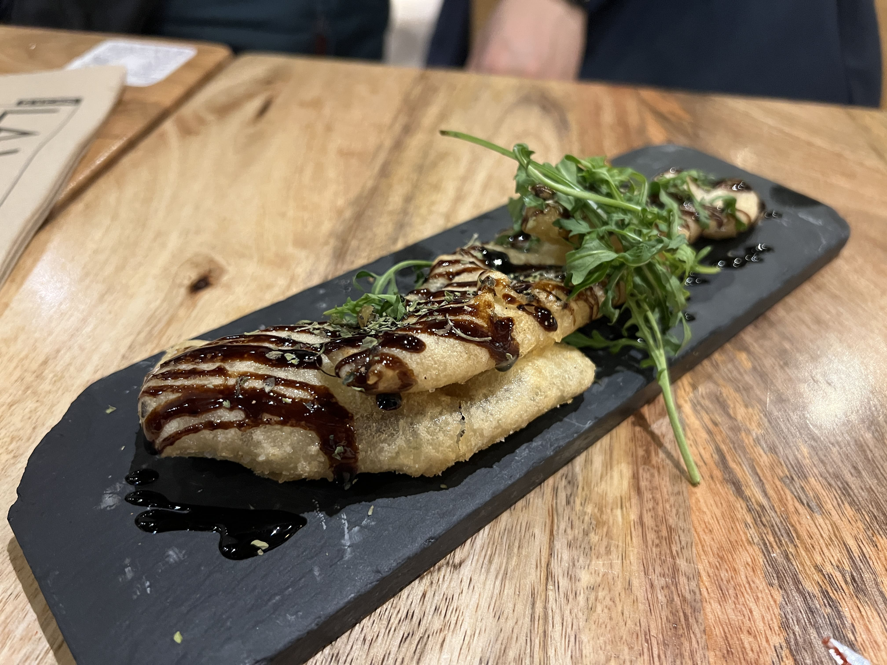

Crab cakes were next - nothing too memorable. As the final dish, I was really looking forward to the Presa Iberica (Iberico pork shoulder), but I think it honestly just tasted like normal pork, perhaps even a bit tough.

    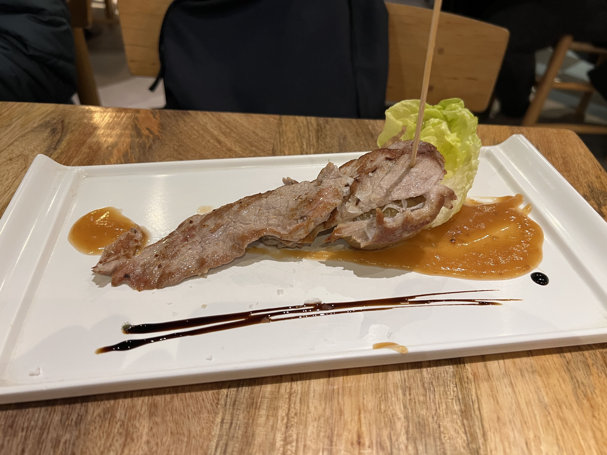

The bill ended up being only about 44 euros, which felt kind of crazy given how much stuff we ordered. I would be down to try this place again with some different dishes (plus the tuna tartare, obviously).

### 7. Doña Encarna, Seville

This place has a crazy line out the door in the late afternoons and dinnertimes - it seems to be a favorite among elderly locals. We decided to go for breakfast on our last day in Seville, and it was pretty solid - nothing crazy, but they have quite a few breakfast options, stuff is cheap, and it feels very home-cooking, warm vibes.

    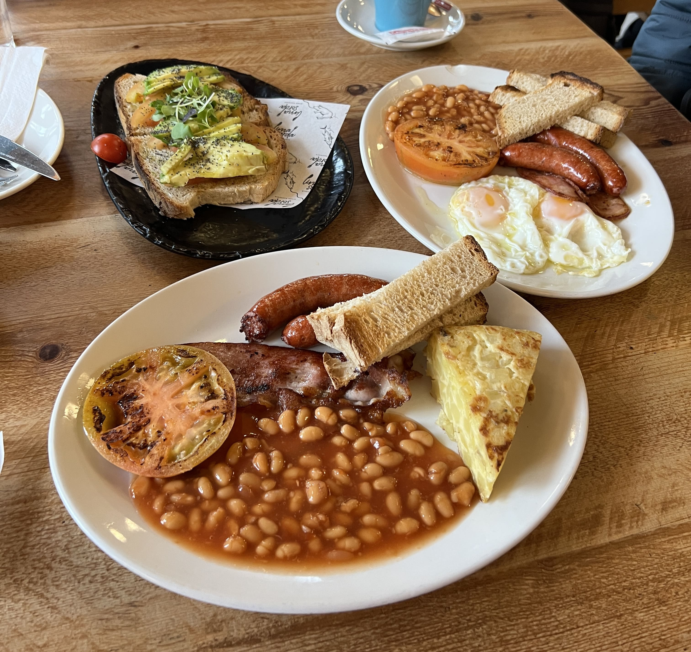

Also, the beans were surprisingly delicious despite me normally disliking beans!

### 6. Granier San Bernardo, Madrid

I do love my little Spanish bakeries, and Granier was a convenient, delicious option near our hotel in Gran Via. We came here basically every day in the morning to grab a quick bite before heading to some museum.

    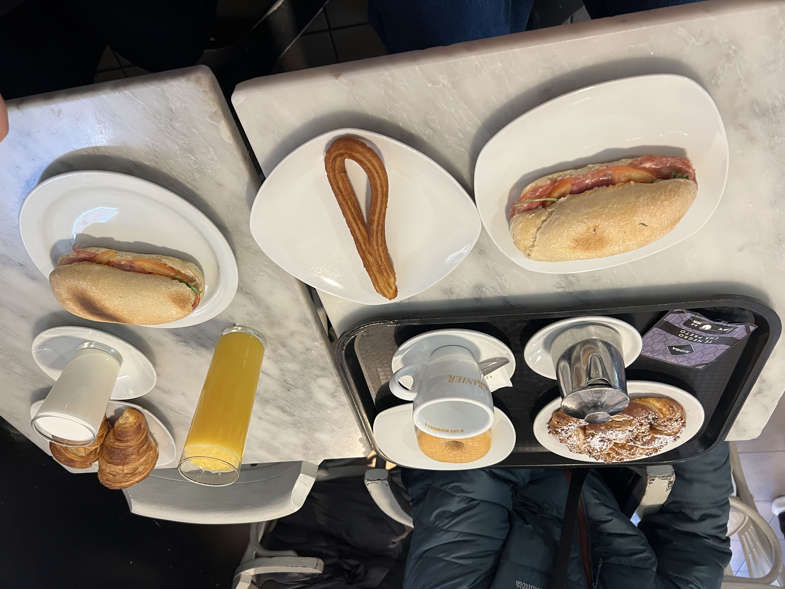

Communication was a bit difficult since some of the cashiers don't speak any English, but we were able to get the point across by pointing and gesturing. Also some of their sandwiches are really good!

### 5. Beata Pasta

I'm getting to the point in this post where I have to really think about how to rank these last five - they're honestly all really good and each place excels at different things.

Beata Pasta was a YOLO decision for our last meal in Madrid - I'd heard people say that Italian food is surprisingly good in Madrid, and I had also happened to see a huge line outside of this place a couple nights before.

I ran in around 6:15 PM and inquired if they had space for 3 - they said that they happened to have seats at the bar. (They were also the last open seats at the bar, so my timing was very lucky.)

I ordered a SOS Sangria (their modernized, fizzy version of a sangria), and together, my family ordered the Omega <3 salad, the Carbonara tartufada, the Candy Me, and Call Me Mama.

Everything was _really_ delicious. I liked my own carbonara the most initially, but it was definitely a bit heavy for a while and I was glad to try some of the Candy Me which was a bit more refreshing. The spaghetti noodles were also the most al dente noodles I've ever had - probably authentic, but my jaw got a little tired (LOL).

    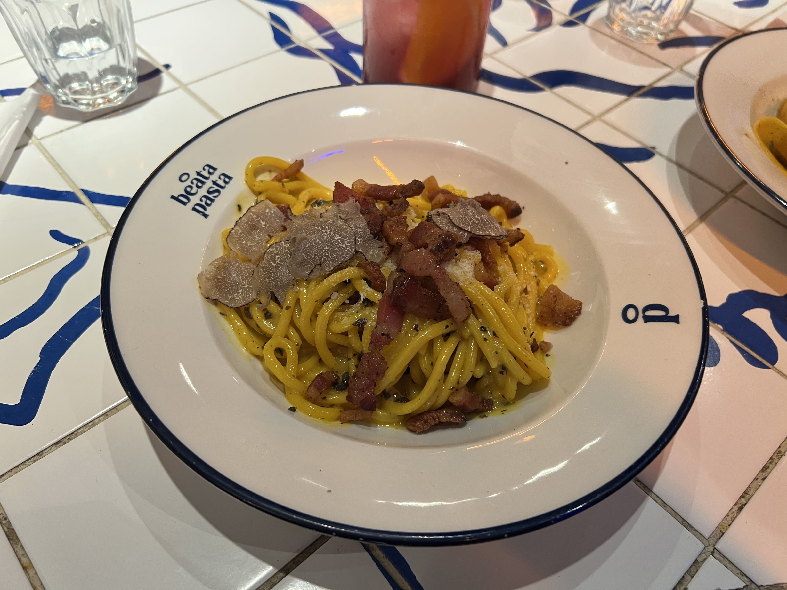

The Candy Me definitely wins the prize on presentation, and the burrata wrapped inside each "candy" pasta was bouncy and juicy. It was fun seeing the chef make the candy pasta in the front of the restaurant through the window when we left.

    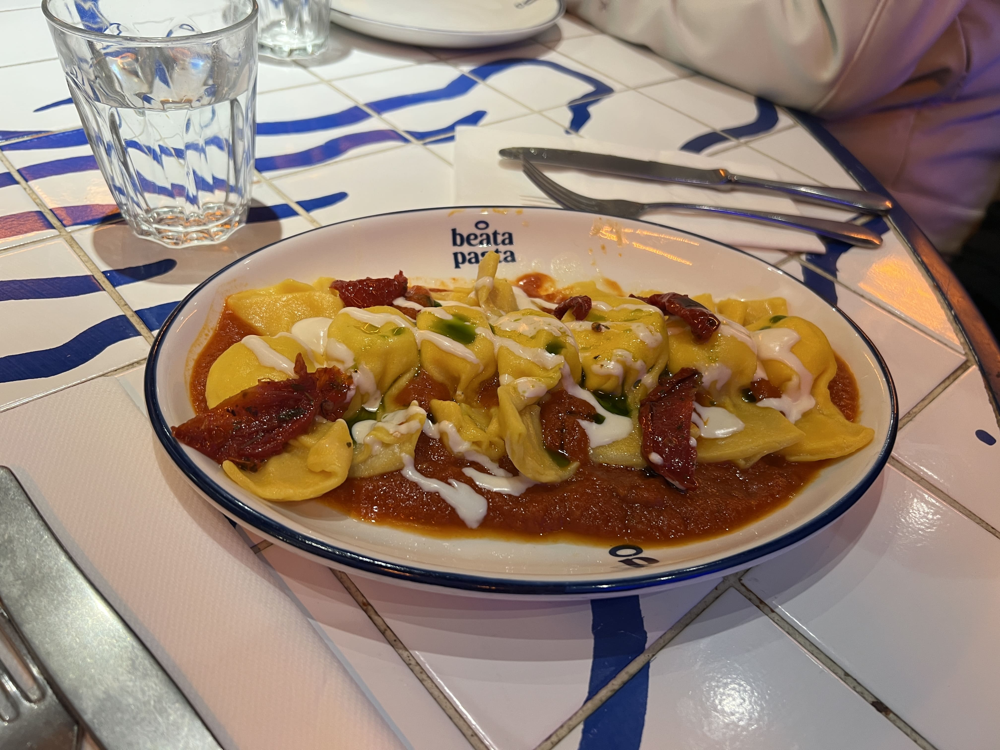

The Call Me Mama was a papardelle with beef ragu napoletano. The deep, complex flavor of this one contrasted heavily with the lightness of Candy Me and the intense earthiness of the truffle-forward carbonara. If I went again, I would probably order this one!

Overall a great pasta experience, and they also had a futuristic space-themed bathroom which was cool.

### 4. Bar Sal Gorda, Seville

The most creative restaurant we went to in Spain! We started waiting outside the restaurant 10 minutes before opening, and thank god we did because a small line started forming soon enough, and it seemed they only had a couple tables for walk-ins.

First was the sea bass ceviche. It was not what I expected for a ceviche dish - a bunch of fish pieces suspended in a cold, light fluffy foam with a tangy kick, yet it was strangely addicting, and I ended up eating the whole thing. I could expect this dish to be polarizing, but I personally enjoyed it.

    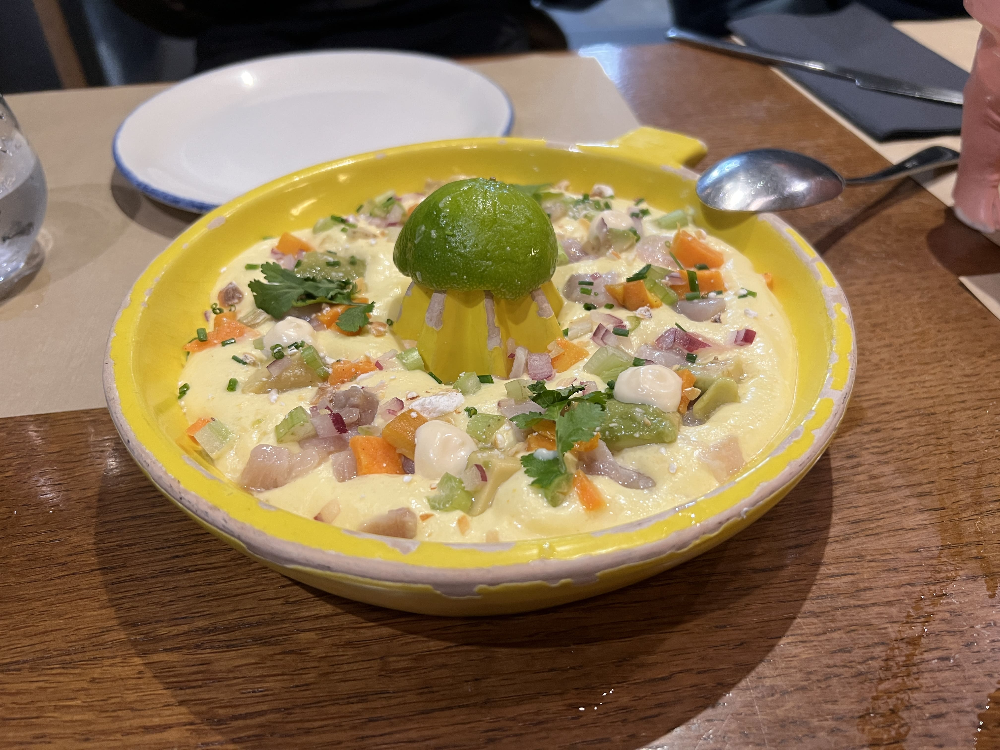

Next up were the croquettes. Presentation was hilarious here, and taste was good - they were creamy and thick and ham-forward.

    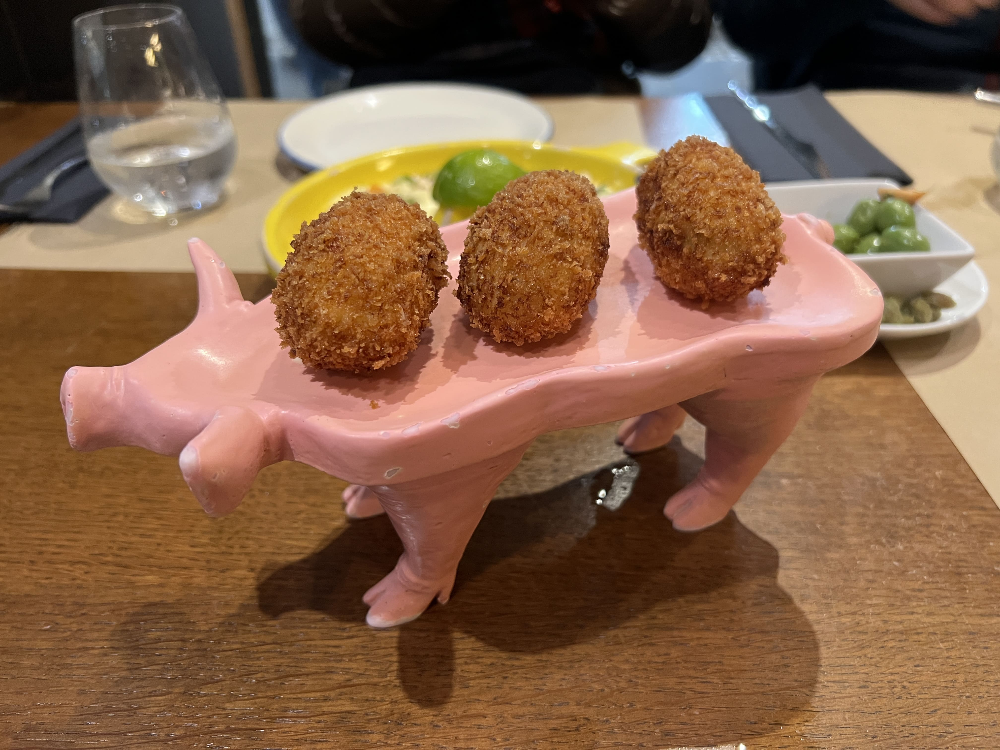

Pulled pork donut came next. The presentation again was great; it really looked like a donut, and it even came in a dunkin donuts-looking box. The outer layer was crispy, pairing well with the softer pork texture inside. Also very shareable if you cut into pieces!

    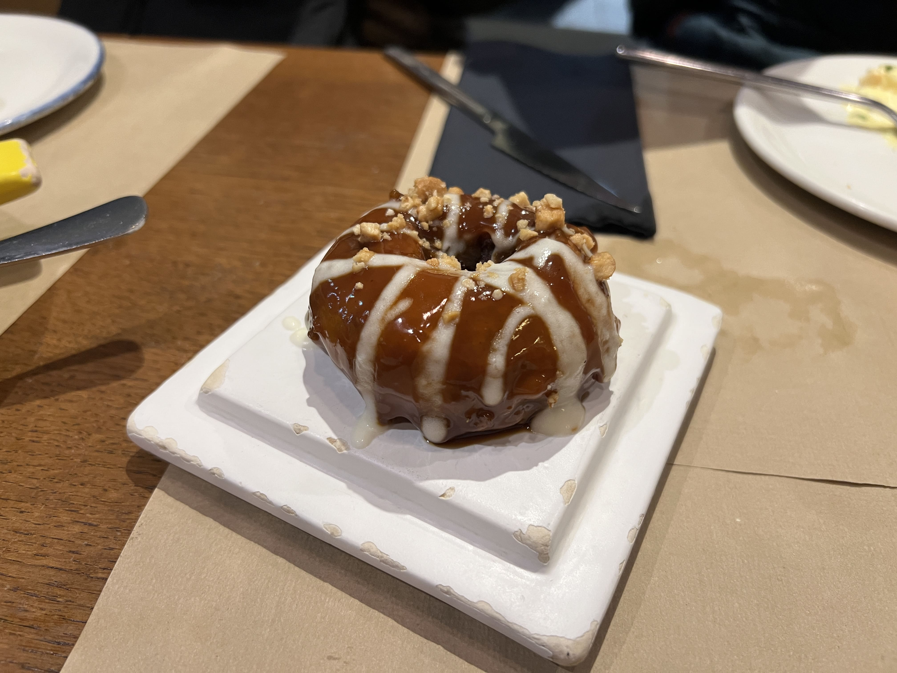

The oxtail came in three pieces, which was perfect for us. The meat was fall-off-the-bone tender and the marinade was just the right amount of savory balance. Probably one of the best oxtail I've ever had.

    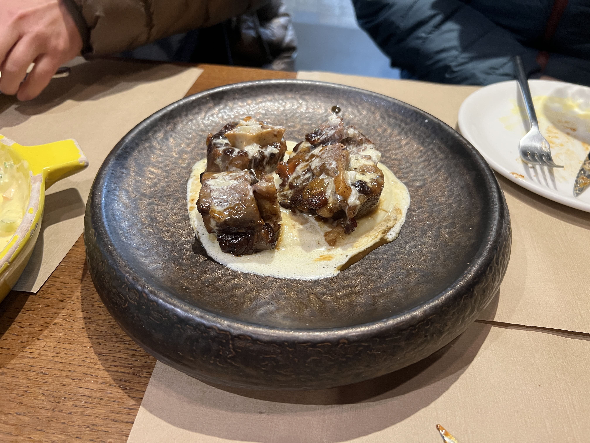

Last but not least, the fake risotto. This dish felt like an illusion, in a good way. The rice grains were bouncy and soft (not typical risotto grains) and the sauce looked bland since it was pale but was actually extremely umami. The first bite I had, my eyes popped open and I was actually like WOW! The flavors were truly mesmerizing and the dish greatly exceeded expectations.

    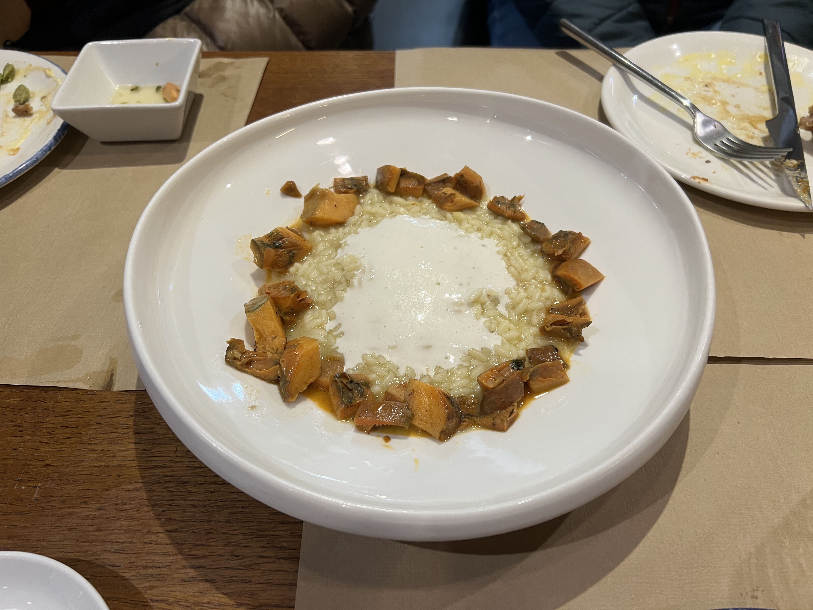

Extremely fun dining experience and delicious tapas - make a reservation or go early! Also, the olives that come as an appetizer are insanely good - I ate the whole bowl.

### 3. El Pasaje Tapas, Seville

This one was a hard one to rank because they had both the best and the worst dish of my trip, but I decided to index more heavily on the "best" part.

To start, the Torta Inés Rosales, one of their tapas, won an award, and after trying it, it's easy to see why. It was sweet, tangy, and had a kick. The different complex flavors swirled around in my mouth in surprising harmony, and paired with the crunch of the torta, it was truly a lovely dish.

    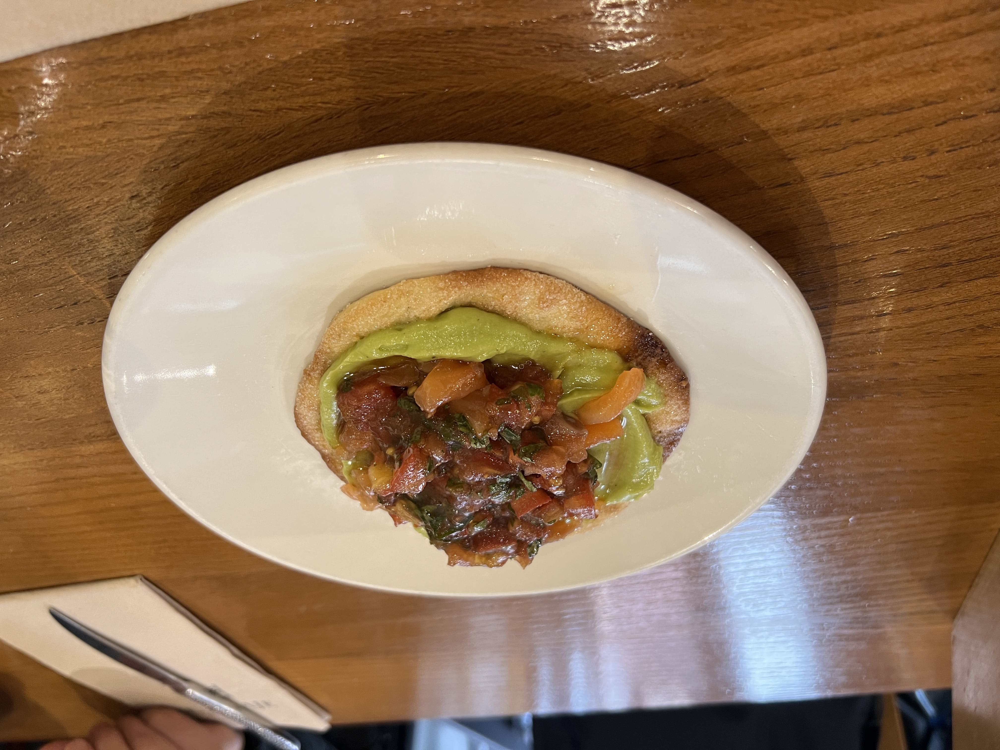

Next was the artichoke. I usually don't like artichokes, but the sauce they paired with it made it quite yummy. Hard to share though since there's only one piece.

    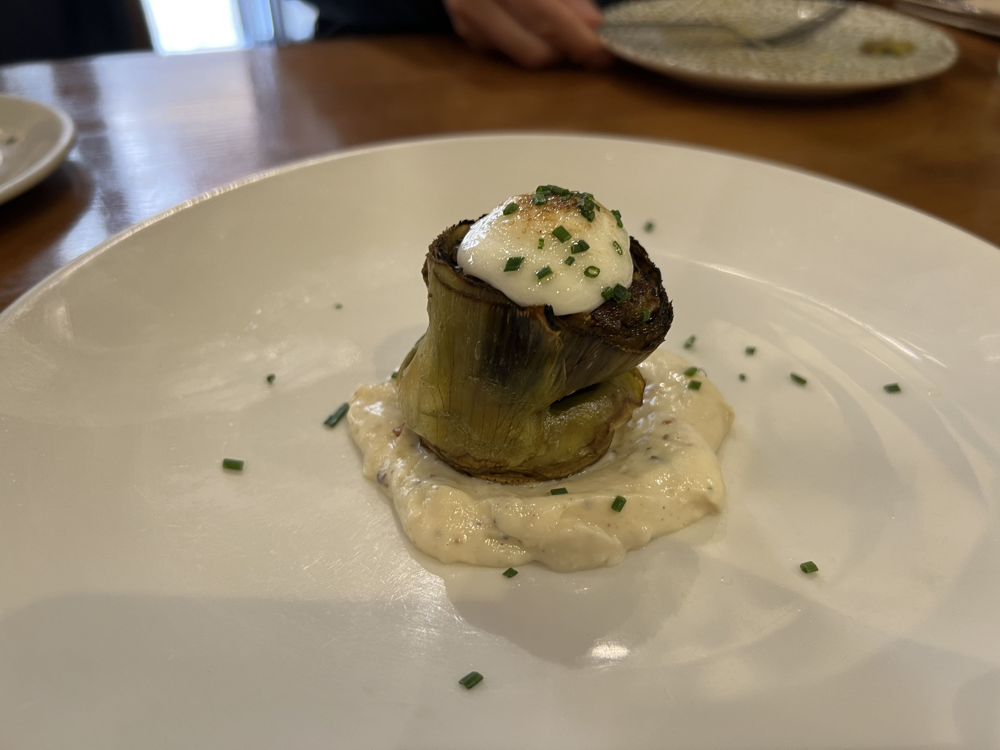

Third was the Pacific scallop, and let me tell you, this was the best scallop I've ever had in my life. I don't know what exactly it was, but the seafood was so fresh and umami, the sauce and seasoning brought out the ocean flavor even more, and if I was on my deathbed tomorrow I would ask for this scallop. It was so good that originally I ordered only one for myself, and later convinced my parents to order two more.

    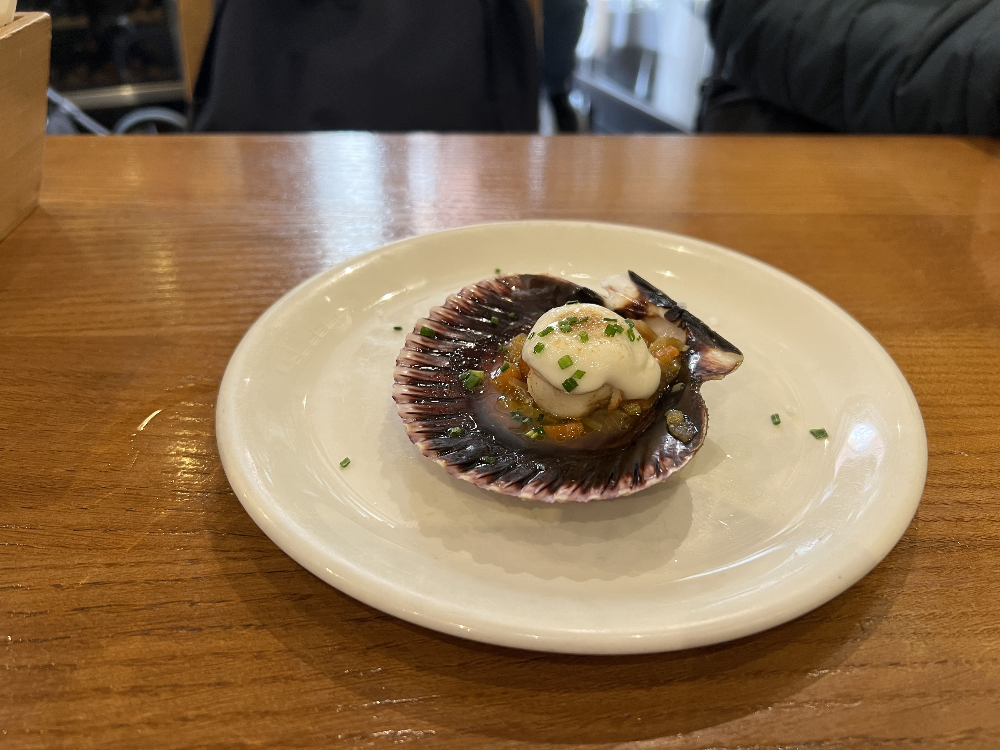

The cuttlefish was our first "main" dish, and it was delicious was well but not as mindblowing as the tapas that came before. I liked the combo of the sweet potato and the squid ink sauce.

    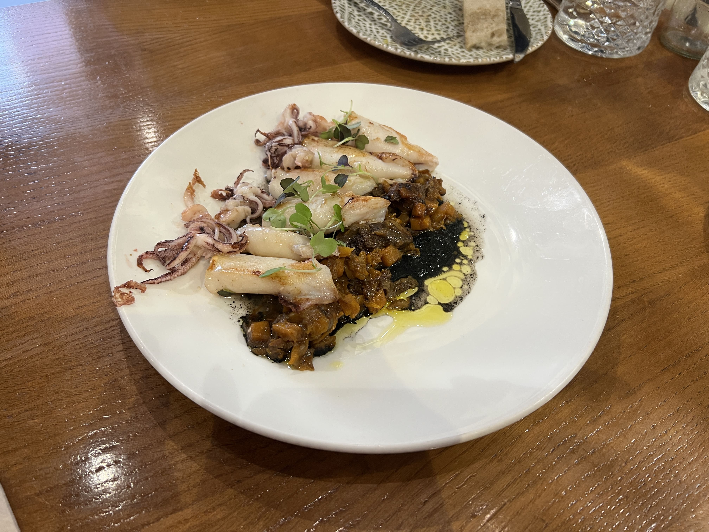

Finally was the paella. I know, I know - elementary tourist mistake - don't order paella at a restaurant specializing in tapas. But we weren't sure if we had a chance to fit in paella given our short trip, and given the restaurant had such raving reviews, we figured, well, it can't be _that_ bad, can it?

Unfortunately, it really was that bad. It was salty beyond comprehension, and the three of us had trouble finishing it despite the plate not being that big. The rice also felt undercooked - I understand that paella isn't supposed to be soft, but this kinda felt like a "we are trying to cook paella in 20 minutes while taking some shortcuts" kinda vibe here.

    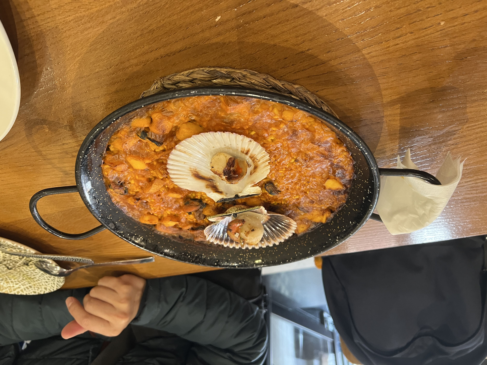

Anyways - wholeheartedly recommend the tapas, but _not_ the paella. And definitely the Pacific scallop - that thing is life-changing.

### 2. Arroceria Marina Ventura, Madrid

Second attempt at getting paella - this time at a real paella restaurant. I was a bit nervous coming here since reviews were a bit mixed, but I heard that since paella is difficult to make, there can be considerable variation from pan to pan, so I just closed my eyes and prayed for the best.

    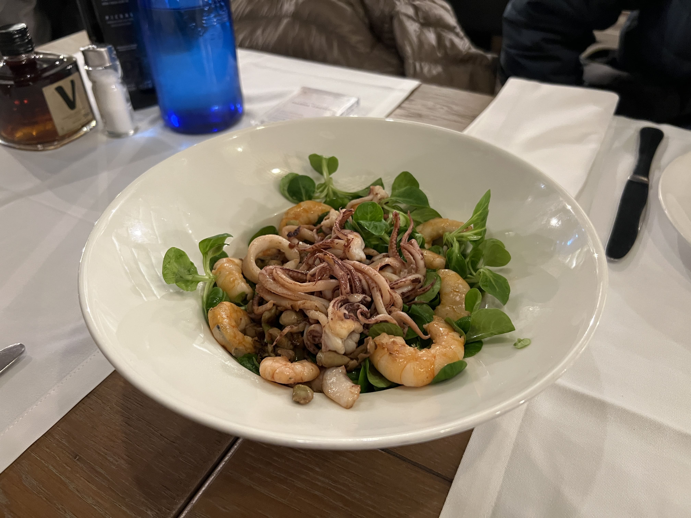

We got the squid salad as a starter, and it was a nice dish to fill the time (and our stomachs) as we waited ~40 minutes for the paella to come out.

    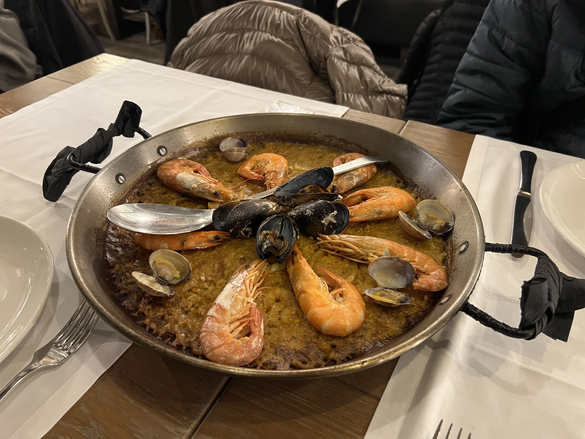

As I took the first bite, a smile crossed my face. After the experience at El Pasaje I was worried that paella might actually be just salty and hard and I was in the unpopular minority that disliked the most internationally well-known dish of Spain. Now, I knew that well-made paella was a warm, flavorful, home-y dish that just took a little longer to be made. The bottom had a little crunchy soccarrat, which reminded me of the crust at the bottom of HK-style clay pot rice. Obviously this was no authentic Valencian paella with rabbit, but I'll save that for a trip to Valencia next time.

### 1. Be Banh Mi - Es Vietnam, Madrid

You might think it's strange that my favorite dining experience in Spain is a Vietnamese place, but the pho at Be Banh Mi is truly the best pho I've ever had in my life. We walked in here with a family friend on New Year's Day after realizing barely anything was open, and the vibes and food were so good I was literally blown away.

I ordered the pho cha chan (grilled pork pho) with wide noodles and they accidentally gave me thin noodles and I didn't even care because the broth was just phenomenal. Their other dishes were fire as well.

    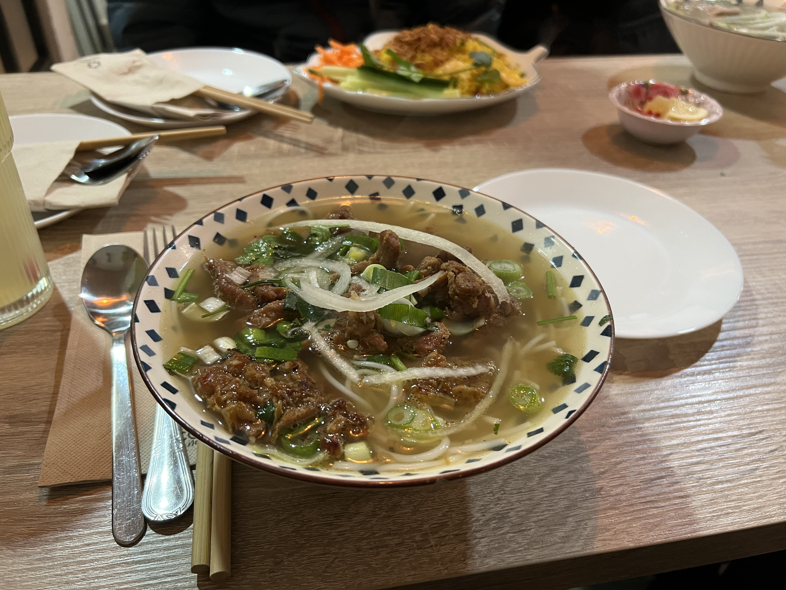

We just sat there and chatted for hours, and the atmosphere was warm and bright. If you're craving Asian food in Madrid (or it's a public holiday and nothing is open), I recommend this place 10 times over.

---

Overall thoughts: although neither Seville nor Madrid are particularly famous for their food, I think Madrid food is still somewhat impressive by being a large city with more diversity and tourism. Nonetheless, both places were lovely to visit. Food aside, in Seville I wholeheartedly recommend checking out the beautiful Royal Alcázar and the lively Plaza de España - they're not overrated at all. As for Madrid, the Reina Sofia was fantastic (I liked it more than the Prado), get some fresh-squeezed orange juice at Carrefour, and definitely check out Be Banh Mi.

_tags: location/europe, travel food blog, food recommendations_
