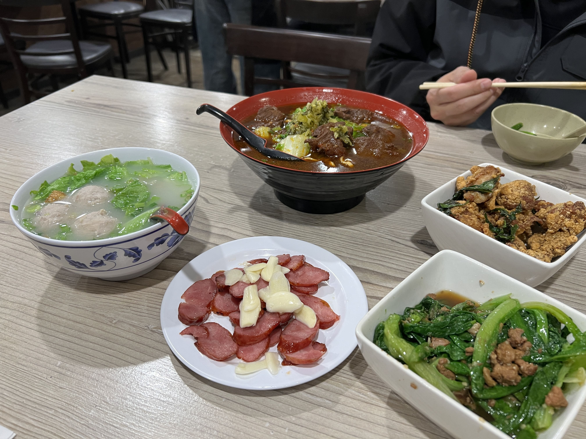
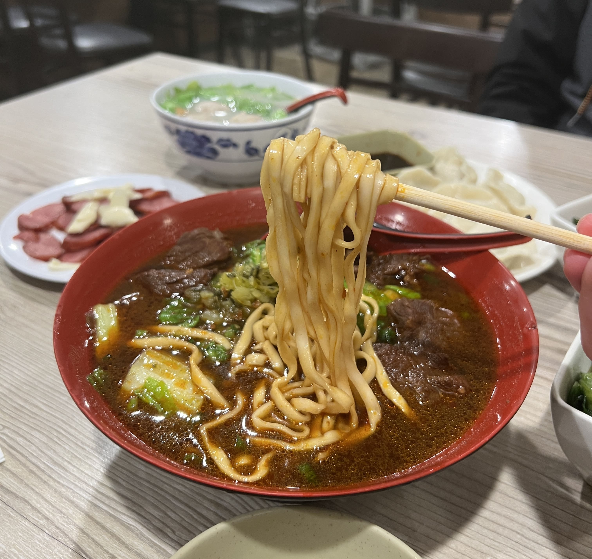

This is going to be a short blog post, but I wanted to take a moment to shout-out Sinbala in Arcadia, California as probably the most authentic Taiwanese street food experience I've ever had in the States. Since I was young, every time my family has passed by the Los Angeles area, we've always made a pit stop at Sinbala. More people know Din Tai Fung, but Sinbala holds a special place in my heart, evoking memories of childhood summers in the night markets of Taiwan.

Last December, we did a family trip to SoCal, spending one night in Arcadia. My parents asked me what I wanted to eat, and the only thing I could think of was Sinbala.

    

We ordered all the classics - stir-fried sausage (what the restaurant is especially known for), popcorn chicken, gong wan soup, and beef noodles. Everything was as good as I had remembered.

    

This place has been around for at least two decades, and there's good reason for that. If you're in the area, definitely give it a try!

_tags: taiwanese food, southern california, arcadia, cheap eats_
