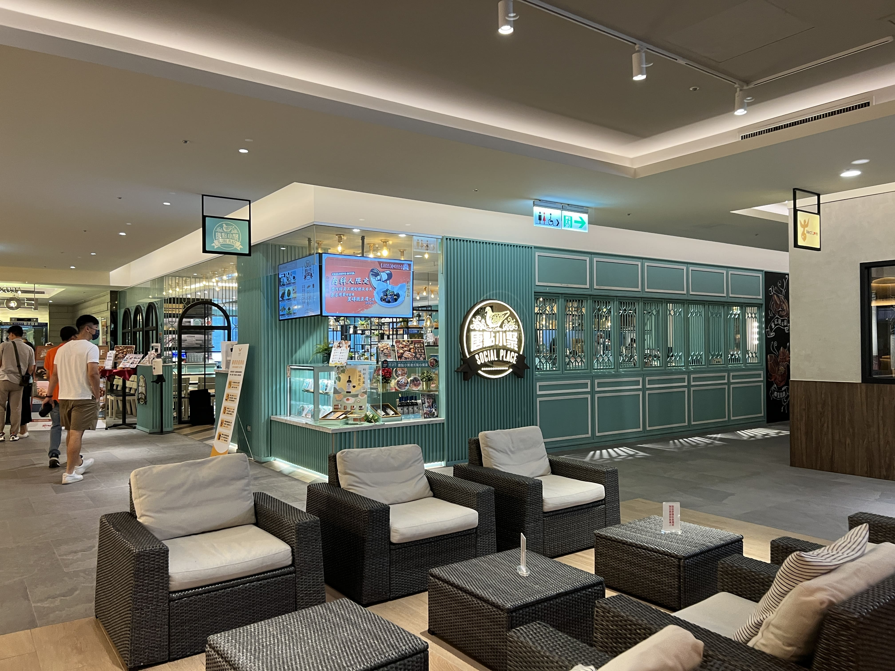
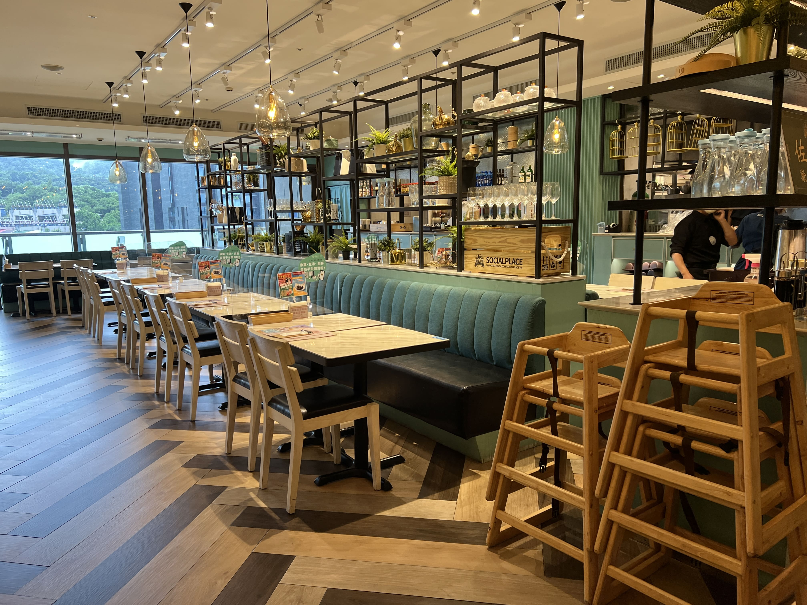
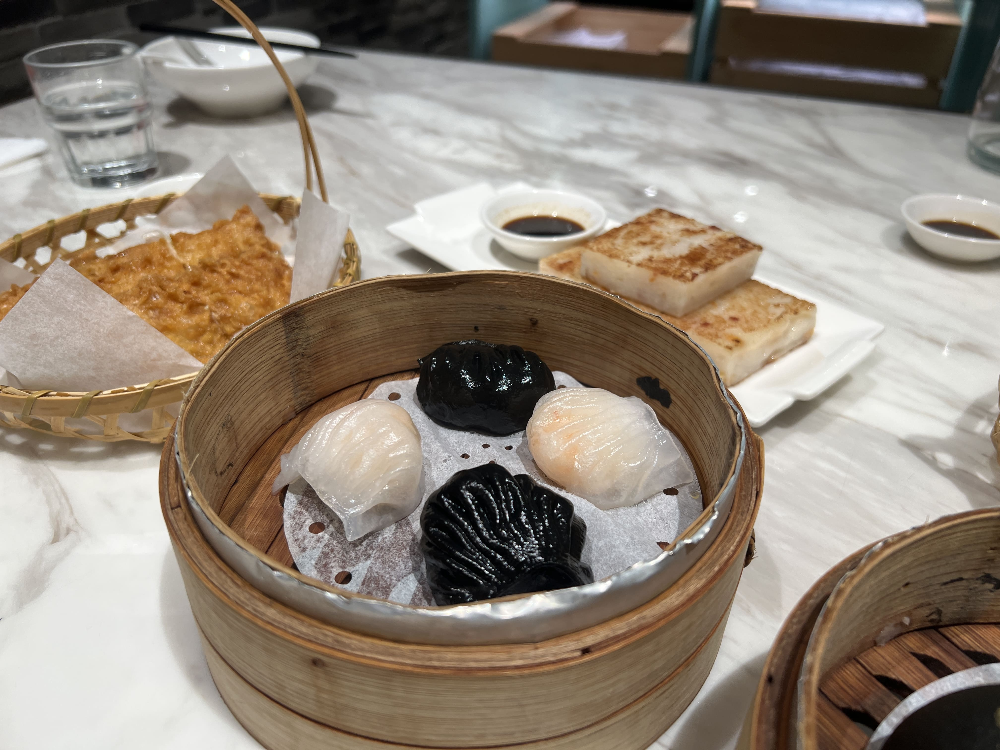
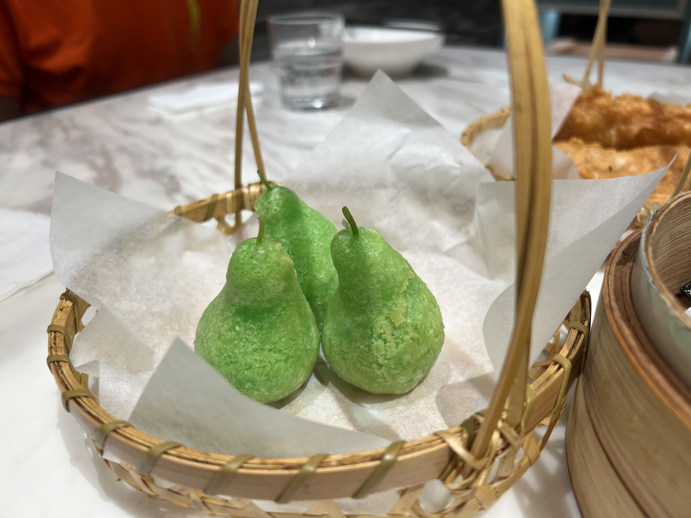
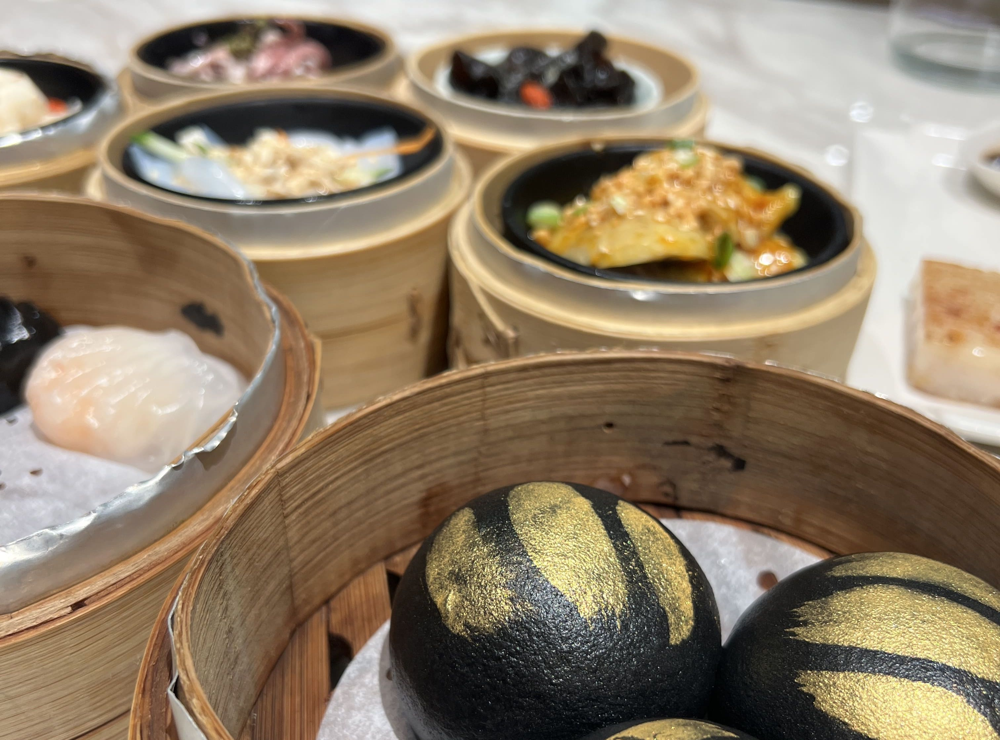
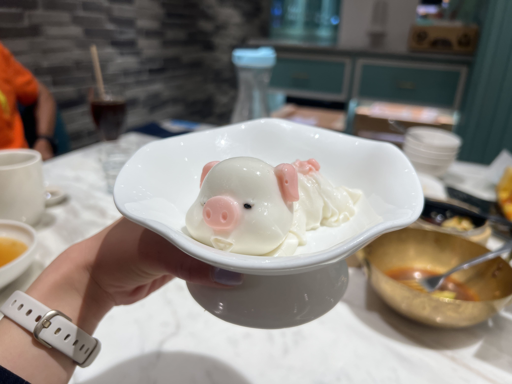

SocialPlace was actually on my radar even before I went to Taiwan - I was browsing social media and saw the pudding pig and knew I had to go. 

So I did.

There's actually two locations for SocialPlace, one in Taipei and one in Hsinchu, and this review is specifically for the Taipei Miramar store.

It's located on the fifth floor with all the other restaurants inside the shopping center, and the exterior looks a bit more like a fancy coffee shop than a traditional Cantonese restaurant.  

    

The interior didn't disappoint, either. With all the hanging lights and plants, I almost thought I was in a dessert cafe.

    

They had pretty much all of the items you would see at a typical dimsum restaurant (crystal dumplings, radish cake, scallion pancake, egg tarts, etc.) with some aesthetically creative twists. They also have regular (non-dimsum) dishes, if you're feeling those.

Crystal shrimp dumplings, original and truffle-flavored (total yin yang vibes):

    

Crab meat dumplings, but PEAR SHAPED (literally the cutest):

    

More dimsum plates with beautiful charcoal-colored custard buns in the foreground:

    

(We ordered a lot more, not pictured.) The food was not only pretty, but delicious as well. Despite the extra effort they put into presentation, interestingly enough, it wasn't much more expensive than other dimsum places I've been to in Taiwan - each plate probably averaged around 120-150 NTD. 

And last but not least, the famed coconut pudding pig. It was almost too cute to eat. We started eating from the back of it until it was just the head, and then it was gone :(

    

I wouldn't say I'm a dimsum expert, but SocialPlace probably takes one of the top prizes in most aesthetic dimsum in Taipei for me. A must-visit for sure (if not for anything else, at least for the coconut pudding pig). 

_tags: location/taiwan, socialplace, miramar, taipei, dimsum, food_